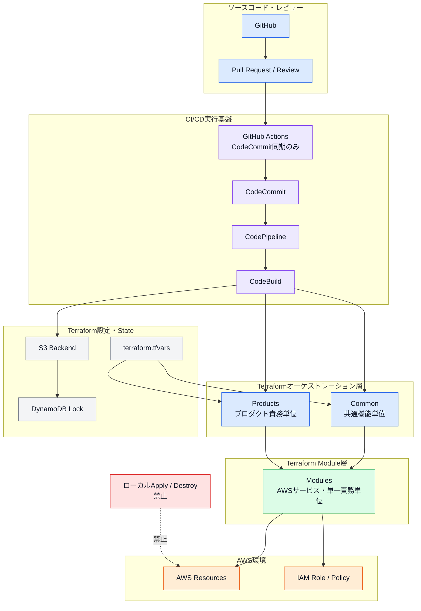
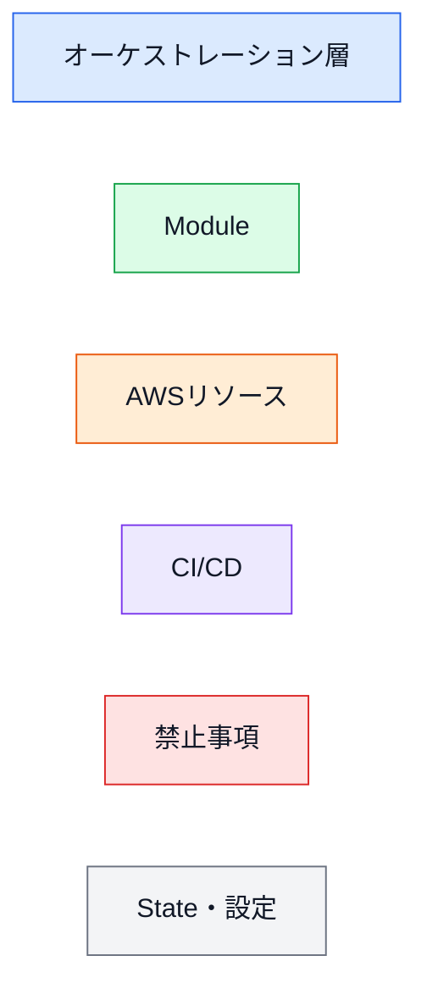

# 第1章 設計思想

## 1.1 本章の目的

本章では、**Terraform Framework Standard v1.0**の目的、適用範囲、管理対象および設計上の基本原則を定義する。

本標準は、単なるTerraformのコーディング規約ではない。

AWSインフラの以下の領域を一貫したルールで管理するための共通フレームワークとして位置付ける。

* インフラ設計
* ディレクトリ構成
* Terraform Module
* Terraform State
* CI/CD
* IAMおよびセキュリティ
* コードレビュー
* 運用および障害対応

本章で定義する設計思想は、第2章以降のすべての設計判断に適用する。

---

## 1.2 正式名称

本標準の正式名称は以下とする。

```text
Terraform Framework Standard v1.0
```

サブタイトルは以下とする。

```text
A Standard Framework for Building, Operating and Scaling AWS Infrastructure
```

本標準は、AWSインフラを構築・運用・拡張するための標準フレームワークである。

---

## 1.3 適用範囲

本標準は、今後作成するすべてのAWSプロダクトに適用する。

勤怠アプリなどの特定プロダクト専用のルールではなく、複数のプロダクトで共通利用することを前提とする。

### 対象クラウド

```text
AWSのみ
```

Azure、Google Cloudなどのマルチクラウド環境は、本標準の対象外とする。

### 対象環境

```text
dev
prd
```

標準環境は開発環境と本番環境の2つとする。

追加の環境が必要になった場合は、本標準と同じ設計原則を適用し、必要に応じてADRを作成する。

### 想定規模

| 項目       | 想定                |
| -------- | ----------------- |
| プロダクト数   | 最大20プロダクト程度       |
| 開発者数     | 1名を基本とする          |
| 将来の体制    | 開発者が増加しても運用可能な構成  |
| AWSアカウント | dev・prdなど環境ごとに分離  |
| インフラ管理   | Terraformによるコード管理 |

---

## 1.4 本標準の目的

本標準では、Infrastructure as Codeを中心として、以下を実現する。

### 1.4.1 インフラのコード化

AWSコンソール上の設定だけに依存せず、AWSリソースの構成をTerraformコードとして管理する。

これにより、以下を可能にする。

* インフラ変更履歴の確認
* Pull Requestによるレビュー
* 同一構成の再現
* 設定ミスの削減
* 障害発生時の構成確認
* 新規環境および新規プロダクトへの横展開

### 1.4.2 保守性の向上

Terraformコードの責務を明確に分離し、変更対象と影響範囲を把握しやすい構成とする。

変更時に、関連のないAWSリソースまで確認・適用する構成は避ける。

### 1.4.3 拡張性の確保

プロダクトやAWSサービスが追加された場合でも、既存構成を大幅に変更せずに追加できる構成とする。

最大20プロダクト程度まで、同一のディレクトリ構成・Module・CI/CDルールを適用できることを目標とする。

### 1.4.4 自動化の推進

Terraformの正式な検証および適用は、AWS CodePipelineおよびCodeBuildを中心に自動化する。

将来的なPythonによるファイル生成やテンプレート展開も考慮し、規則性のある構成とする。

### 1.4.5 セキュリティの強化

Terraform実行権限、Stateアクセス権限、IAM RoleおよびPolicyを最小権限で管理する。

Terraformコードや設定ファイルへ機密情報を直接記述しない。

---

## 1.5 設計上の優先順位

設計判断で複数の選択肢がある場合は、以下の優先順位を使用する。

1. 保守性
2. 拡張性
3. 自動化
4. 標準化
5. セキュリティ
6. 可読性
7. 実装の簡潔さ

単純にコード量が少ない構成ではなく、長期的に安全かつ継続して運用できる構成を優先する。

---

## 1.6 Terraform管理対象

Terraformによる管理対象は、原則としてAWSリソース全般とする。

### 1.6.1 AWSリソース

管理対象の例を以下に示す。

* VPC
* Subnet
* Route Table
* Internet Gateway
* NAT Gateway
* VPC Endpoint
* Security Group
* Application Load Balancer
* Target Group
* Listener
* ECS
* ECR
* Lambda
* RDS
* DynamoDB
* ElastiCache
* S3
* CloudWatch Logs
* CloudWatch Alarm
* SNS
* EventBridge
* Route 53
* ACM
* KMS
* CodeCommit
* CodeBuild
* CodePipeline

実際に使用するAWSサービスのみを作成し、未使用サービスのディレクトリやModuleを形式的に作成する必要はない。

### 1.6.2 IAM

以下のIAMリソースはTerraform管理対象とする。

* IAM User
* IAM Group
* IAM Role
* IAM Policy
* IAM Policy Attachment
* Permission Boundary
* Resource Policy

IAM UserおよびIAM Groupは必要な場合のみ作成する。

Terraform実行Roleや責務単位の実行PolicyもTerraformで管理する。

### 1.6.3 CI/CD関連

以下をコードとして管理する。

* CodeCommit
* CodeBuild
* CodePipeline
* Buildspec
* CI/CD補助スクリプト
* GitHub ActionsのWorkflowファイル

GitHub Actionsは、GitHubからCodeCommitへソースコードを同期するために使用する。

GitHub ActionsからTerraformのPlanまたはApplyは実行しない。

---

## 1.7 Terraform管理対象外

以下は本標準におけるTerraform管理対象外とする。

### 1.7.1 AWS Organizations

AWS Organizationsは、AWSアカウント全体の組織管理基盤であるため、本標準の管理対象外とする。

### 1.7.2 IAM Identity Center

IAM Identity Centerは、AWSアカウントへの認証およびアクセス管理基盤であるため、本標準の管理対象外とする。

IAM Identity CenterとIAM Role・IAM Policyは異なる。

IAM Identity Centerを管理対象外としても、各AWSアカウント内のIAM RoleおよびIAM PolicyはTerraformで管理する。

### 1.7.3 機密値

以下の値自体はTerraform管理対象外とする。

* Secrets Managerに保存するSecret値
* Parameter StoreのSecureString値
* Password
* API Key
* Access Token
* Access Key
* 秘密鍵

Terraformでは、機密値を格納するリソースや参照設定を管理する。

機密値そのものは、安全な別手順で登録する。

### 1.7.4 初期データおよび運用データ

以下は原則としてTerraformで管理しない。

* データベースの初期データ
* アプリケーションの業務データ
* 運用中に頻繁に変更される値
* Terraformのライフサイクルと一致しない設定値

Terraformで管理しない項目は、設計書または運用手順書に管理方法を記載する。

---

## 1.8 基本設計原則

### 1.8.1 Infrastructure as Code

AWSリソースの構成は、原則としてTerraformコードで定義する。

Terraformコードから環境を再現できる状態を維持する。

手動で作成する例外リソースについては、作成内容と設定値を設計書で管理する。

### 1.8.2 Immutable Infrastructure

Terraform管理下のAWSリソースは、Terraform以外から恒常的に変更しない。

AWSコンソールからの直接変更は、緊急時に限定する。

緊急変更を実施した場合は、速やかにTerraformコードへ反映し、実環境とコードの差異を解消する。

### 1.8.3 Policy as Code

以下のポリシーはコードとして管理する。

* IAM Policy
* AssumeRole Policy
* S3 Bucket Policy
* KMS Key Policy
* SNS Topic Policy
* ECR Repository Policy
* その他のResource Policy

ポリシー変更はPull RequestおよびCI/CDによる検証を経て適用する。

### 1.8.4 Everything as Code

可能な範囲で、インフラ以外の構成もコード管理する。

対象例は以下とする。

* CodePipeline
* CodeBuild
* CodeCommit
* Buildspec
* GitHub Actions
* 設計書
* ADR
* 運用手順
* テンプレート

ただし、IAM Identity Center、AWS Organizations、Secret値など、明示的に対象外としたものは除く。

### 1.8.5 Review First

Terraformコードを直接`develop`または`main`へ反映してはならない。

変更はPull Requestを作成し、レビューおよびCI/CDによる検証を経てマージする。

### 1.8.6 DRY原則

同一のAWSリソース定義を複数箇所へ重複して記述しない。

再利用可能な定義はModuleとして共通化する。

ただし、過剰な共通化によってModuleが複雑になる場合は、KISS原則を優先する。

### 1.8.7 KISS原則

設計および実装を必要以上に複雑にしない。

以下を避ける。

* 深すぎるModule階層
* 過剰な抽象化
* 複雑なLocals
* 不要なDynamic Block
* 不要なState依存
* 実際に使用しない将来機能の先行実装

### 1.8.8 最小権限

Terraform実行Roleには、対象責務に必要な権限のみを付与する。

AdministratorAccessは使用しない。

責務単位のRoleとPermission Boundaryを使用し、権限昇格および誤操作の影響を制限する。

### 1.8.9 標準化

すべてのプロダクトで、以下を統一する。

* ディレクトリ構成
* Module構成
* State分割
* 命名規則
* 必須タグ
* CI/CD
* レビュー手順
* 例外運用
* ドキュメント構成

---

## 1.9 エンタープライズ品質

本標準では、個人開発向けの最小構成ではなく、長期運用および開発者の増加に対応できるエンタープライズ品質を前提とする。

エンタープライズ品質とは、単にAWSリソースを多く作成することではない。

以下を満たす状態を指す。

* 変更履歴を追跡できる
* 変更内容をレビューできる
* 実行者と承認者を制御できる
* 権限を責務単位で分離できる
* Stateの影響範囲を限定できる
* 障害時の対応方法が定義されている
* 設計判断がADRとして記録されている
* 新しい開発者が標準を確認して作業できる

---

## 1.10 コンソール変更方針

AWSコンソールからの変更は、緊急時のみ許可する。

通常変更は、以下のフローで実施する。

```text
Terraformコード変更
        ↓
Pull Request
        ↓
レビュー
        ↓
CI/CD検証
        ↓
承認
        ↓
Terraform Apply
```

緊急時にAWSコンソールから変更した場合は、以下を実施する。

1. 変更理由を記録する。
2. 実施者および実施日時を記録する。
3. 変更内容をTerraformコードへ反映する。
4. `terraform plan`で差分を確認する。
5. CI/CDから正式な状態を再確認する。

---

## 1.11 全体構成図



---

## 1.12 図表デザインルール

本標準のMermaid図では、以下の色分けを使用する。

| 色    | 用途                                      |
| ---- | --------------------------------------- |
| 青    | Products、Common、GitHubなどのオーケストレーション・管理層 |
| 緑    | Terraform Module                        |
| オレンジ | AWSリソース                                 |
| 紫    | CI/CDおよび実行基盤                            |
| 赤    | 禁止事項、例外、エラー                             |
| 灰色   | State、Backend、設定ファイル、補足情報               |

すべての章で同じ`classDef`名と配色を使用する。



---

## 1.13 バージョン管理

本標準は、Semantic Versioningの考え方に基づき管理する。

| 種別    | 例        | 適用する変更                |
| ----- | -------- | --------------------- |
| Patch | `v1.0.1` | 誤字修正、説明追加など運用に影響しない変更 |
| Minor | `v1.1.0` | ルール追加、章追加など後方互換性のある変更 |
| Major | `v2.0.0` | 構造や運用方法を大きく変更する変更     |

### Patch

以下の変更に使用する。

* 誤字脱字の修正
* 表現の改善
* 補足説明の追加
* 運用に影響しない図表修正

### Minor

以下の変更に使用する。

* 新しいAWSサービスの標準追加
* 新しいルールの追加
* 新しい章または付録の追加
* 既存構成と互換性のある改善

### Major

以下の変更に使用する。

* ディレクトリ構成の変更
* State分割方針の変更
* CI/CD構成の変更
* 命名規則の互換性を失う変更
* 運用フローの大幅な変更
* 設計思想の変更

変更履歴はREADMEまたはChange Logへ記録する。

---

## 1.14 本標準の設計原則

本章の設計原則を以下にまとめる。

* 本標準はすべてのAWSプロダクトへ共通適用する。
* AWSのみを対象とする。
* 最大20プロダクト程度まで拡張可能な構成とする。
* 保守性、拡張性、自動化を最優先する。
* AWSリソースは原則としてTerraformで管理する。
* IAM RoleおよびIAM PolicyはTerraform管理対象とする。
* IAM Identity CenterおよびAWS Organizationsは管理対象外とする。
* 緊急時を除き、AWSコンソールから直接変更しない。
* TerraformコードからAWS環境を再現可能な状態を維持する。
* DRY、KISS、最小権限、標準化を採用する。
* Immutable Infrastructure、Policy as Code、Everything as Code、Review Firstを採用する。
* 正式なApplyはCI/CD経由で実施する。
* 本標準の図表は統一されたデザインルールを使用する。
