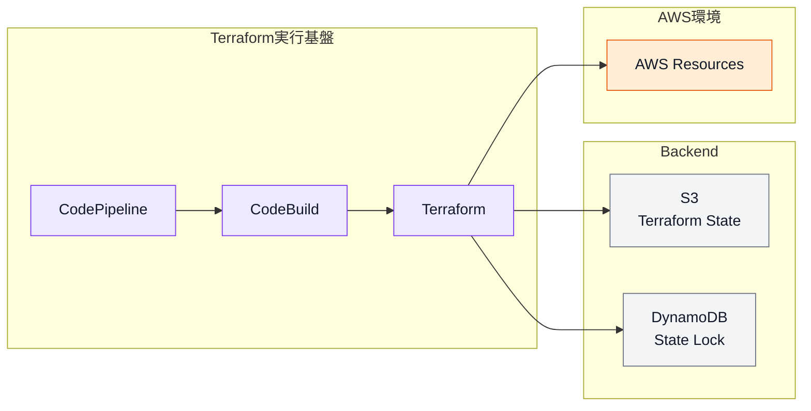
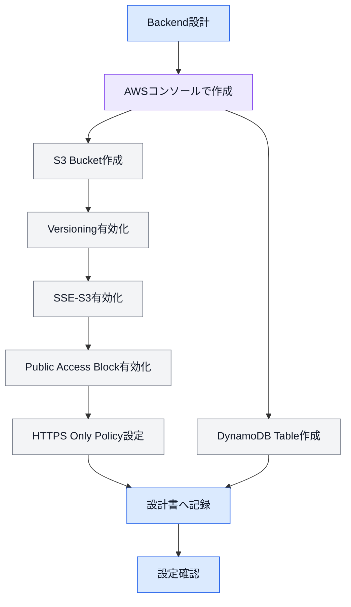
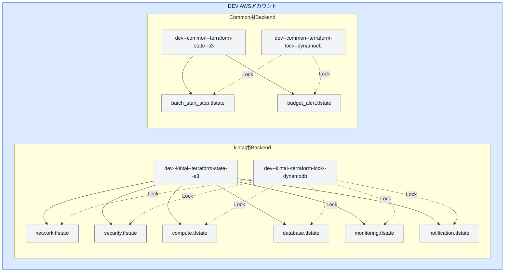
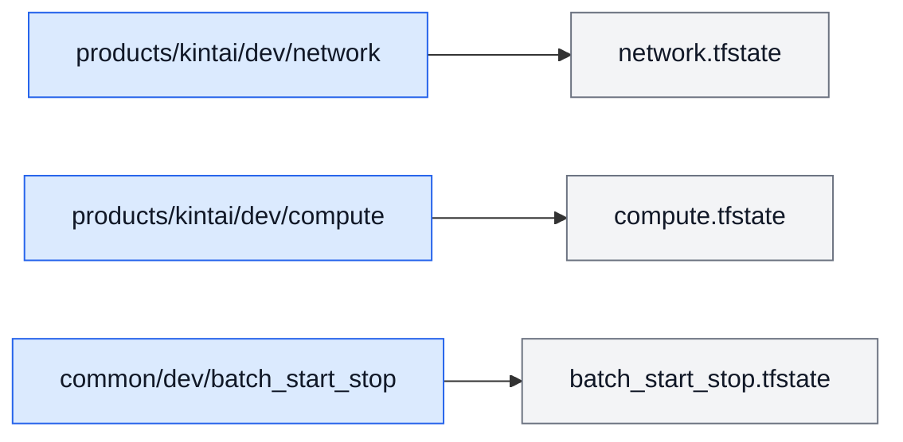
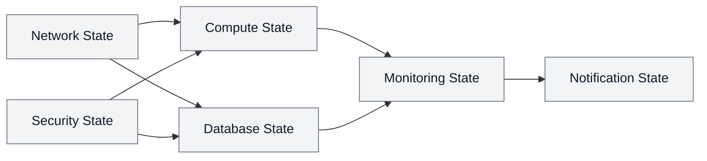
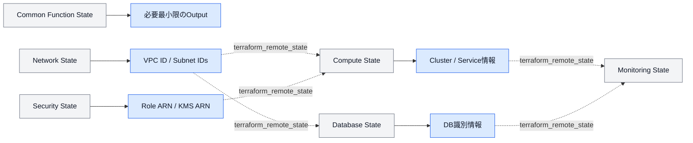
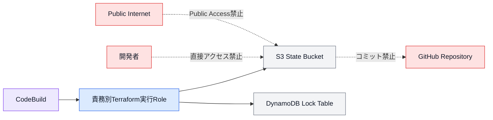
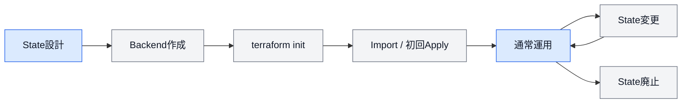
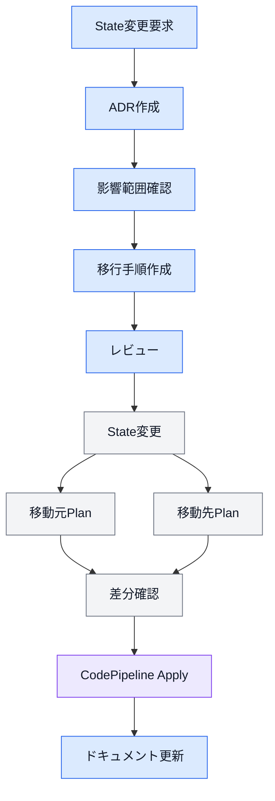

# 第3章 State・Backend設計

## 3.1 本章の目的

本章では、Terraform Framework Standard v1.0で採用するTerraform StateおよびBackendの設計・管理・運用ルールを定義する。

Terraform Stateは、Terraformコードと実際のAWSリソースを対応付ける重要な管理情報である。

Stateの設計や運用を誤ると、以下の問題が発生する可能性がある。

* 意図しないAWSリソースの削除
* 同一リソースの重複作成
* Terraform管理対象の消失
* 複数実行によるState競合
* State破損
* 関係のないリソースへの変更波及
* 機密情報の漏えい
* 責務ごとの権限分離ができない状態

本標準では、Stateを環境・プロダクト・責務または共通機能単位で分離し、変更範囲と障害影響範囲を限定する。

---

## 3.2 State設計の基本方針

本標準では、以下の方針を採用する。

* Terraform StateはS3 Backendで管理する。
* State LockにはDynamoDBを使用する。
* Backendは環境およびプロジェクトごとに分離する。
* Productsでは責務単位でStateを分割する。
* Commonでは共通機能単位でStateを分割する。
* State間の依存関係は必要最小限とする。
* 依存関係は可能な限り並列構造とする。
* State変更時はADRを作成する。
* Stateへアクセスできる権限を最小限に制限する。
* Backend用リソースはTerraform管理対象外とする。
* Backend用リソースの設定内容は設計書で管理する。

---

## 3.3 Backend構成

Terraform Backendには、以下のAWSサービスを使用する。

| AWSサービス         | 用途                      |
| --------------- | ----------------------- |
| Amazon S3       | Terraform Stateファイルの保存  |
| Amazon DynamoDB | 同一Stateに対する同時実行の防止      |
| AWS IAM         | BackendおよびStateへのアクセス制御 |

Backendは、Terraformを実行するAWSアカウント内に作成する。

dev環境のStateはdevアカウント、prd環境のStateはprdアカウントで管理する。



---

## 3.4 Backendの分離単位

Backendは、環境およびプロジェクト単位で作成する。

### Products

Productsでは、プロダクトと環境の組み合わせごとにBackendを作成する。

例：

```text
dev--kintai--terraform-state--s3
dev--kintai--terraform-lock--dynamodb

prd--kintai--terraform-state--s3
prd--kintai--terraform-lock--dynamodb
```

同じプロダクト内の`network`、`security`、`compute`などは、同じS3 BucketおよびDynamoDB Tableを使用する。

StateファイルはS3 Object Keyで分離する。

### Common

Commonでは、プロジェクト名として`common`を使用する。

例：

```text
dev--common--terraform-state--s3
dev--common--terraform-lock--dynamodb

prd--common--terraform-state--s3
prd--common--terraform-lock--dynamodb
```

Common内の`batch_start_stop`、`budget_alert`などは、同じ環境のCommon用Backendを使用し、S3 Object Keyで分離する。

---

## 3.5 Backend命名規則

### S3 Bucket

Backend用S3 Bucketは、以下の形式とする。

```text
<environment>--<project>--terraform-state--s3
```

例：

```text
dev--kintai--terraform-state--s3
prd--kintai--terraform-state--s3
dev--common--terraform-state--s3
```

### DynamoDB Table

State Lock用DynamoDB Tableは、以下の形式とする。

```text
<environment>--<project>--terraform-lock--dynamodb
```

例：

```text
dev--kintai--terraform-lock--dynamodb
prd--kintai--terraform-lock--dynamodb
dev--common--terraform-lock--dynamodb
```

S3 Bucket名が既に他のAWSアカウントで使用されている場合は、命名規則を維持しながら一意な識別子の追加を検討する。

識別子を追加した場合は、設計書へ実際のBucket名を記録する。

---

## 3.6 Backend仕様

Backend用S3 BucketおよびDynamoDB Tableは、以下の設定を標準とする。

| 項目                     | 標準設定            |
| ---------------------- | --------------- |
| State保存先               | Amazon S3       |
| State Lock             | DynamoDB        |
| S3 Versioning          | 有効              |
| S3暗号化                  | SSE-S3          |
| S3 Public Access Block | すべて有効           |
| HTTPアクセス               | 禁止              |
| HTTPSアクセス              | 必須              |
| Bucket ACL             | Private         |
| Stateアクセス権限            | 最小権限            |
| Backend作成方法            | AWSコンソールによる手動作成 |
| Backend管理              | 設計書へ設定内容を記録     |

S3 Versioningを有効にすることで、Stateファイルが上書きまたは誤って削除された場合でも、以前のバージョンを確認できる状態を維持する。

Versioning自体ではなく、保存される各バージョンのデータ容量に対してS3ストレージ料金が発生する。

---

## 3.7 Backend作成

Backend用のS3 BucketおよびDynamoDB Tableは、Terraformでは作成しない。

Backendが存在しない状態では、Backend自身を使用するTerraformを初期化できないため、本標準ではAWSコンソールから手動で作成する。

作成後は、設計書へ以下を記録する。

* AWSアカウントID
* AWSリージョン
* 環境
* プロジェクト名
* S3 Bucket名
* DynamoDB Table名
* S3 Versioning設定
* S3暗号化設定
* Public Access Block設定
* Bucket Policy
* 作成者
* 作成日
* 確認者
* 備考

Backendの設定変更は、通常のAWSリソース変更とは分けて管理する。

---

## 3.8 Backend作成フロー



---

## 3.9 backend.hclの配置

`backend.hcl`は、Productsの各責務ディレクトリおよびCommonの各機能ディレクトリに配置する。

### Products

```text
products/
└── kintai/
    └── dev/
        └── compute/
            ├── backend.hcl
            ├── provider.tf
            ├── versions.tf
            ├── variables.tf
            ├── outputs.tf
            ├── locals.tf
            ├── main.tf
            └── README.md
```

### Common

```text
common/
└── dev/
    └── batch_start_stop/
        ├── backend.hcl
        ├── provider.tf
        ├── versions.tf
        ├── variables.tf
        ├── outputs.tf
        ├── locals.tf
        ├── main.tf
        └── README.md
```

各Root Moduleは、それぞれ専用の`backend.hcl`を持つ。

---

## 3.10 Backendブロック

Terraformコード側では、Backendの種類のみを定義する。

```hcl
terraform {
  backend "s3" {}
}
```

Bucket名、Object Key、リージョンおよびDynamoDB Table名などの具体値は、`backend.hcl`へ記載する。

```hcl
bucket         = "dev--kintai--terraform-state--s3"
key            = "products/kintai/dev/compute/compute.tfstate"
region         = "ap-northeast-1"
dynamodb_table = "dev--kintai--terraform-lock--dynamodb"
encrypt        = true
```

Terraform初期化時は、以下のように`backend.hcl`を指定する。

```bash
terraform init -backend-config=backend.hcl
```

Backend設定値を`main.tf`または`provider.tf`へ直接記載しない。

---

## 3.11 Stateファイル命名規則

Stateファイルは、管理単位の責務名または機能名を使用する。

### Products

```text
network.tfstate
security.tfstate
compute.tfstate
database.tfstate
monitoring.tfstate
notification.tfstate
dns.tfstate
```

### Common

```text
batch_start_stop.tfstate
backup.tfstate
budget_alert.tfstate
log_export.tfstate
```

`terraform.tfstate`という固定名にはせず、Stateの役割が分かる名称を使用する。

---

## 3.12 S3 Object Key

S3 Object Keyは、Terraformリポジトリのディレクトリ構成と一致させる。

### Products

```text
products/<project>/<environment>/<responsibility>/<responsibility>.tfstate
```

例：

```text
products/kintai/dev/network/network.tfstate
products/kintai/dev/compute/compute.tfstate
products/kintai/prd/database/database.tfstate
```

### Common

```text
common/<environment>/<function>/<function>.tfstate
```

例：

```text
common/dev/batch_start_stop/batch_start_stop.tfstate
common/dev/budget_alert/budget_alert.tfstate
common/prd/backup/backup.tfstate
```

ディレクトリ構成とObject Keyを一致させることで、Stateの管理対象を容易に判断できる状態とする。

---

## 3.13 BackendおよびState構成図



prd環境でも同じ構成を採用し、prdアカウント内にprd用Backendを作成する。

---

## 3.14 State分割方針

Stateは、Terraformのディレクトリ構成に合わせて分割する。

### Products

Productsでは、責務単位でStateを分割する。

```text
network
security
compute
database
monitoring
notification
dns
```

### Common

Commonでは、共通機能単位でStateを分割する。

```text
batch_start_stop
backup
budget_alert
log_export
```

Stateを分割することで、以下を実現する。

* Apply対象の限定
* 権限の分離
* 障害影響範囲の限定
* State Lockの競合削減
* Terraform Planの確認範囲縮小
* リソースのライフサイクル分離
* 特権作業と通常作業の分離

---

## 3.15 State分割判断基準

新しいStateを作成するかどうかは、以下の基準で判断する。

| 判断基準    | 内容                      |
| ------- | ----------------------- |
| 責務      | 既存Stateと責務が異なる          |
| 変更頻度    | 既存Stateと変更頻度が大きく異なる     |
| 権限      | Terraform実行Roleを分離したい   |
| ライフサイクル | 作成・変更・削除のタイミングが異なる      |
| 障害影響    | 障害時の影響範囲を分離したい          |
| 適用単位    | 独立してPlan・Applyしたい       |
| 依存関係    | 既存Stateへ追加すると依存関係が複雑になる |
| 規模      | State内のリソース数が過剰に増加する    |

以下の場合は、新しいStateを作成せず、既存Stateへの追加を検討する。

* 同じ責務に属する
* 常に同時に作成・変更される
* 同じTerraform実行Roleを使用する
* ライフサイクルが一致する
* 分割するとRemote State依存が過剰になる

Stateを細かく分けること自体を目的にしてはならない。

---

## 3.16 StateとRoot Moduleの関係

原則として、1つのTerraform Root Moduleディレクトリが1つのStateに対応する。



1つのRoot Moduleから複数のStateを管理する構成は採用しない。

1つのStateを複数のRoot Moduleから更新する構成も採用しない。

---

## 3.17 State依存方針

State間の依存は、可能な限り並列構造とする。

以下のような過剰な直列依存は避ける。

```text
network
  ↓
security
  ↓
compute
  ↓
database
  ↓
monitoring
  ↓
notification
```

推奨する依存関係の例を以下に示す。



実際の依存関係が存在しないState同士を、形式的な順序だけで接続しない。

循環参照は禁止する。

---

## 3.18 terraform_remote_state

他のStateで作成した値を参照する場合は、`terraform_remote_state`を使用する。

例として、Compute StateからNetwork Stateの値を参照する。

```hcl
data "terraform_remote_state" "network" {
  backend = "s3"

  config = {
    bucket         = "dev--kintai--terraform-state--s3"
    key            = "products/kintai/dev/network/network.tfstate"
    region         = "ap-northeast-1"
    dynamodb_table = "dev--kintai--terraform-lock--dynamodb"
    encrypt        = true
  }
}
```

参照例：

```hcl
module "ecs_service_frontend" {
  source = "../../../../../modules/ecs/service"

  subnet_ids = data.terraform_remote_state.network.outputs.private_subnet_ids
}
```

`terraform_remote_state`は、必要なStateのみ参照する。

すべてのStateを一律に参照する構成は採用しない。

---

## 3.19 Output設計

Remote Stateで参照するOutputは、必要最小限とする。

良い例：

```hcl
output "vpc_id" {
  description = "VPC ID used by product resources."
  value       = module.vpc_main.vpc_id
}

output "private_subnet_ids" {
  description = "Private subnet IDs used by compute resources."
  value       = module.subnet_private.subnet_ids
}
```

避ける例：

```hcl
output "all_resources" {
  value = {
    vpc             = module.vpc_main
    subnet          = module.subnet_private
    route_table     = module.route_table_private
    security_groups = module.security_groups
  }
}
```

Outputが増えるほど、State間の依存関係が強くなる。

Outputを追加する際は、他のStateから本当に参照する必要があるかを確認する。

---

## 3.20 Remote State依存図



---

## 3.21 State Lock

同一Stateに対して複数のTerraform処理が同時に実行されないように、DynamoDBによるState Lockを使用する。

State Lockは、以下の処理で使用する。

* `terraform plan`
* `terraform apply`
* State変更コマンド
* Import
* State移行

同一Stateに対する処理が実行中の場合、別の処理はLockが解除されるまで開始しない。

State Lockを意図的に回避する操作は、原則禁止する。

---

## 3.22 Lock解除

Terraform処理の異常終了などによりLockが残った場合は、以下を確認する。

1. 実行中のCodePipelineが存在しないこと
2. 実行中のCodeBuildが存在しないこと
3. 他の開発者がTerraformを実行していないこと
4. 対象Stateが変更中ではないこと
5. Lock IDが対象Stateのものであること

Lock解除が必要な場合は、実施理由、実施者、実施日時および対象Stateを記録する。

無条件にLockを削除してはならない。

---

## 3.23 Stateアクセス制御

Terraform Stateには、以下の情報が含まれる可能性がある。

* AWSリソースID
* ARN
* IAM情報
* ネットワーク情報
* データベース接続情報
* Secret参照情報
* Sensitive指定された値
* リソース属性

そのため、Stateへのアクセス権限を最小限に制限する。

### 標準ルール

* Backend用S3 Bucketを公開しない。
* Public Access Blockをすべて有効にする。
* HTTPアクセスを禁止する。
* S3 Objectの読み取り権限を制限する。
* S3 Objectの書き込み権限をTerraform実行環境へ限定する。
* DynamoDB Tableへの操作権限をTerraform実行環境へ限定する。
* StateをAWSコンソールから日常的に閲覧しない。
* Stateファイルをローカルへダウンロードしない。
* StateファイルをGitへコミットしない。
* Stateファイルをメールやチャットで共有しない。

---

## 3.24 Stateアクセス構成図



---

## 3.25 Stateライフサイクル

Stateは、以下のライフサイクルで管理する。



---

## 3.26 新規State追加

新しいStateを追加する場合は、以下の手順で実施する。

1. State分割判断基準を確認する。
2. 管理する責務または機能を定義する。
3. 既存Stateとの依存関係を確認する。
4. S3 Object Keyを決定する。
5. `backend.hcl`を作成する。
6. 必要なOutputおよびRemote State参照を定義する。
7. READMEへ依存関係とApply順序を記載する。
8. `terraform init`を実施する。
9. `terraform validate`を実施する。
10. `terraform plan`を実施する。
11. Pull Requestでレビューする。
12. CodePipeline経由でApplyする。

State追加のみを理由に、新しいS3 BucketやDynamoDB Tableを作成しない。

同じプロジェクトおよび環境の既存Backendを使用する。

---

## 3.27 State分割

既存Stateを複数のStateへ分割する場合は、通常のコード変更よりも影響が大きいため、ADRを必須とする。

手順の概要を以下に示す。

1. ADRを作成する。
2. 分割対象リソースを特定する。
3. 移動先のRoot ModuleとBackendを作成する。
4. State間の依存関係を整理する。
5. `terraform state mv`などの移行方法を決定する。
6. Pull Requestでレビューする。
7. State変更を実施する。
8. 移動元と移動先の両方でPlanする。
9. 意図しない作成・削除がないことを確認する。
10. CodePipelineから正式なApplyを実行する。
11. README、構成図およびADRを更新する。

S3 Versioningが有効であるため、個別の手動バックアップ作業は標準手順に含めない。

ただし、作業前のState Version ID、実施日時および対象Stateを記録する。

---

## 3.28 State統合

複数のStateを1つへ統合する場合も、ADRを必須とする。

State統合を検討する例を以下に示す。

* 分割した責務が常に同時変更される
* Remote State依存が過剰になった
* 分割による運用コストがメリットを上回った
* 同じ実行Roleとライフサイクルを使用している
* State数が過剰に増えた

統合後は、移動元Stateにリソースが残っていないことを確認する。

---

## 3.29 terraform import

手動で作成された既存AWSリソースをTerraform管理へ移行する場合は、`terraform import`を使用する。

Import時は以下を確認する。

* Import対象リソース
* Import先のState
* Terraform Resource Address
* AWS Resource ID
* 既存設定とTerraformコードの差異
* Import後のPlan結果

Import後に意図しない変更が表示された場合は、即座にApplyせず、Terraformコードを実環境に合わせて調整する。

---

## 3.30 terraform state mv

State内またはState間でリソースアドレスを移動する場合は、`terraform state mv`を使用する。

利用例：

* Resource名の変更
* Module構成の変更
* State分割
* State統合
* Module移行

実行前後でPlanを確認し、リソースの再作成が発生しないことを確認する。

---

## 3.31 terraform state rm

Terraform管理からリソースを外す場合は、`terraform state rm`を使用できる。

ただし、Stateから削除してもAWSリソース自体は削除されない。

使用する場合は、以下を明確にする。

* Terraform管理から外す理由
* AWSリソースを残す理由
* 今後の管理方法
* 責任者
* 運用手順
* ADRの要否

一時的な問題回避のために`terraform state rm`を使用してはならない。

---

## 3.32 State廃止

Products、Common機能または責務を廃止する場合は、対応するStateも廃止する。

State廃止前に以下を確認する。

* 管理対象リソースが存在しないこと
* 他Stateから参照されていないこと
* Remote State依存が削除されていること
* CodePipelineが停止または削除されていること
* READMEおよび構成図が更新されていること
* ADRまたは廃止記録が作成されていること

Stateファイルを直ちにS3から削除せず、Versioningおよび運用ルールに従って保管する。

---

## 3.33 State変更ルール

以下の操作をState変更として扱う。

* State追加
* State分割
* State統合
* State削除
* State移行
* Resource Address変更
* Module Address変更
* `terraform import`
* `terraform state mv`
* `terraform state rm`
* Backend変更
* S3 Object Key変更

State変更では、以下を必須とする。

* ADR
* 変更理由
* 影響範囲
* 実施手順
* ロールバック方法
* 実施者
* 実施日時
* 対象環境
* 対象State
* 変更前Plan
* 変更後Plan
* レビュー
* ドキュメント更新

---

## 3.34 State変更フロー



---

## 3.35 Drift管理

AWSコンソールやAWS CLIからTerraform管理リソースが変更されると、Terraformコードと実環境の差異が発生する。

これをDriftとして扱う。

Driftは`terraform plan`で検出する。

Driftを検出した場合は、以下のいずれかを判断する。

1. 手動変更を取り消し、Terraformコードの状態へ戻す。
2. 手動変更が正しい場合は、Terraformコードへ反映する。
3. Terraform管理対象外へ変更する場合は、ADRおよびState変更手順を実施する。

Driftを長期間放置してはならない。

---

## 3.36 Backend変更

以下の変更はBackend変更として扱う。

* S3 Bucket変更
* DynamoDB Table変更
* AWSリージョン変更
* AWSアカウント変更
* S3 Object Key変更
* SSE-S3からSSE-KMSへの変更
* BackendアクセスRole変更

Backend変更はState移行を伴う可能性があるため、ADRを必須とする。

`terraform init -migrate-state`などを使用する場合は、実行前後のState配置を確認する。

---

## 3.37 将来のSSE-KMS対応

現行標準では、Backend暗号化にSSE-S3を採用する。

将来、以下の要件が発生した場合はSSE-KMSへの移行を検討する。

* KMS Keyによるアクセス制御が必要
* 暗号化キーの監査要件がある
* Key Rotation要件がある
* セキュリティ規程でSSE-KMSが必須となった
* StateアクセスをKey Policyでも制限したい

SSE-KMSへ変更する場合は、MinorまたはMajor更新として本標準へ反映する。

---

## 3.38 禁止事項

StateおよびBackend運用では、以下を禁止する。

### ローカルStateの正式利用

```text
terraform.tfstate
terraform.tfstate.backup
```

ローカルStateを正式なStateとして利用してはならない。

### StateファイルのGit管理

```gitignore
*.tfstate
*.tfstate.*
```

StateファイルをGitへコミットしてはならない。

### Stateの直接編集

Stateファイルをテキストエディタで直接編集してはならない。

### Stateの無断移動

ADR、レビューおよび手順書なしでStateを移動してはならない。

### State Lockの強制回避

他のTerraform処理が実行中の状態でLockを強制解除してはならない。

### 過剰なRemote State参照

必要のないStateを一律に参照してはならない。

### 循環参照

```text
compute
  ↓
monitoring
  ↓
compute
```

State間の循環参照は禁止する。

### State BucketへのPublic Access

Backend用S3 Bucketを公開してはならない。

### Stateファイルの外部共有

Stateファイルをメール、チャット、ファイル共有サービスなどで送信してはならない。

---

## 3.39 State・Backend確認チェックリスト

### Backend作成時

* [ ] S3 Bucket名が命名規則に従っている
* [ ] DynamoDB Table名が命名規則に従っている
* [ ] S3 Versioningが有効
* [ ] SSE-S3が有効
* [ ] Public Access Blockがすべて有効
* [ ] HTTPアクセスが禁止されている
* [ ] DynamoDB Lockが使用可能
* [ ] 設計書へ設定内容を記録した
* [ ] 作成者および作成日を記録した

### State追加時

* [ ] State分割判断基準を満たしている
* [ ] State名が責務または機能を表している
* [ ] Object Keyがディレクトリ構成と一致している
* [ ] `backend.hcl`を作成した
* [ ] 必要なRemote State依存を定義した
* [ ] Outputが必要最小限
* [ ] READMEを更新した
* [ ] Planを確認した

### State変更時

* [ ] ADRを作成した
* [ ] 影響範囲を確認した
* [ ] 実施手順を作成した
* [ ] レビューを完了した
* [ ] 対象Stateを確認した
* [ ] 変更後Planを確認した
* [ ] 意図しない作成・削除がない
* [ ] ドキュメントを更新した

---

## 3.40 設計原則

本章の設計原則を以下にまとめる。

* BackendにはS3およびDynamoDBを使用する。
* Backendは環境およびプロジェクト単位で分離する。
* dev環境のBackendはdevアカウントで管理する。
* prd環境のBackendはprdアカウントで管理する。
* Commonはプロジェクト名として`common`を使用する。
* S3 Versioningを有効にする。
* Backend暗号化にはSSE-S3を使用する。
* Public Access Blockをすべて有効にする。
* Backend用リソースはAWSコンソールから手動作成する。
* Backendの設定内容は設計書で管理する。
* Productsでは責務単位でStateを分割する。
* Commonでは共通機能単位でStateを分割する。
* State名は責務名または機能名を使用する。
* S3 Object Keyはディレクトリ構成と一致させる。
* 1つのRoot Moduleを1つのStateに対応させる。
* State依存は必要最小限の並列構造とする。
* Remote Stateで公開するOutputは必要最小限とする。
* State変更時はADRを必須とする。
* Stateファイルを直接編集しない。
* StateファイルをGitへコミットしない。
* State間の循環参照を禁止する。
* DynamoDB Lockを強制的に回避しない。
* Stateアクセス権限を最小限に制限する。
