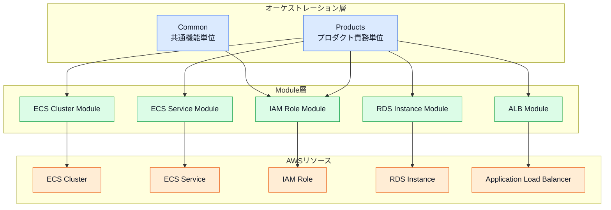
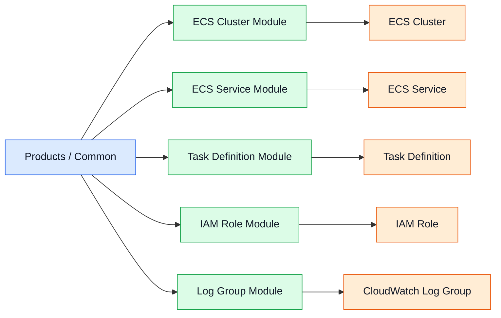
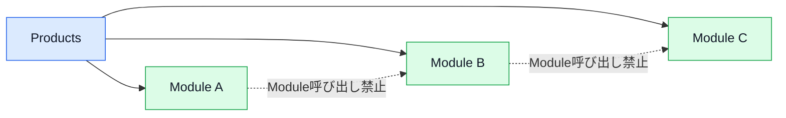
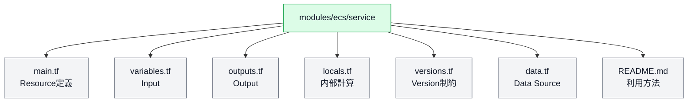
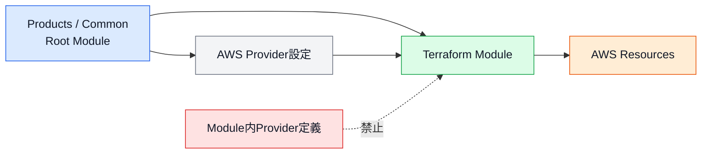
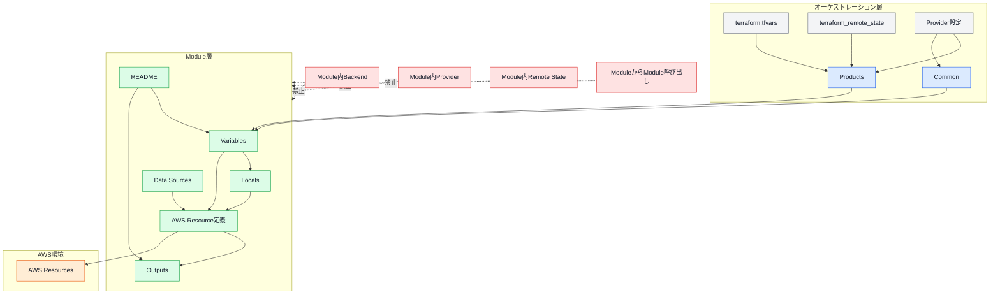

# 第4章 Module設計

## 4.1 本章の目的

本章では、Terraform Framework Standard v1.0で採用するTerraform Moduleの設計、実装、利用および変更ルールを定義する。

Terraform Moduleは、AWSリソースの定義を再利用可能な単位として共通化するために使用する。

Moduleの設計が適切でない場合、以下の問題が発生する可能性がある。

* Moduleの責務が不明確になる
* Input変数が過剰に増加する
* Module間の依存関係が複雑になる
* 環境固有値がModule内へ混入する
* 変更時の影響範囲が把握できなくなる
* 複数プロダクトで再利用できなくなる
* Moduleを変更するたびに既存プロダクトへ影響する
* Moduleの内部実装を利用側が意識する必要が生じる

本標準では、ModuleをAWSサービスおよび単一責務単位で分割し、CommonおよびProductsから組み合わせて利用する。

---

## 4.2 Module設計の基本方針

本標準では、以下の方針を採用する。

* ModuleはAWSサービス単位で分類する。
* 1つのModuleは1つの責務のみを持つ。
* Moduleの階層は最大2階層とする。
* Moduleから別のModuleを呼び出さない。
* AWSリソースの`resource`ブロックはModule内に配置する。
* CommonおよびProductsはModuleを組み合わせる。
* Module内へ環境固有値を保持しない。
* Module内へプロダクト固有値を保持しない。
* ModuleのInputは必要最小限とする。
* ModuleのOutputは必要最小限とする。
* Module内でProviderを固定しない。
* Module内でBackendを定義しない。
* Module内でRemote Stateを参照しない。
* Moduleは単体で利用方法を理解できる状態とする。
* すべてのModuleにREADMEを作成する。

---

## 4.3 Moduleの位置付け

本標準では、Terraformコードを以下の3層に分離する。

| 層           | 配置先                   | 主な役割                       |
| ----------- | --------------------- | -------------------------- |
| オーケストレーション層 | `common/`、`products/` | Moduleを組み合わせて機能やプロダクトを構築する |
| Module層     | `modules/`            | AWSリソースを再利用可能な単位で定義する      |
| AWSリソース層    | AWS環境                 | Moduleによって作成される実リソース       |

CommonおよびProductsは「何を構築するか」を管理する。

Moduleは「AWSリソースをどのように作成するか」を管理する。

---

## 4.4 Module利用構成図



---

## 4.5 Moduleのディレクトリ構成

Moduleは、以下の形式で配置する。

```text
modules/<aws_service>/<responsibility>/
```

例：

```text
modules/
├── alb/
│   ├── listener/
│   ├── load_balancer/
│   └── target_group/
│
├── ecs/
│   ├── cluster/
│   ├── service/
│   └── task_definition/
│
├── iam/
│   ├── policy/
│   └── role/
│
├── rds/
│   ├── instance/
│   ├── parameter_group/
│   └── subnet_group/
│
└── vpc/
    ├── route_table/
    ├── security_group/
    ├── subnet/
    └── vpc/
```

最上位はAWSサービス名とする。

2階層目は、作成するAWSリソースまたは責務名とする。

---

## 4.6 Moduleの階層

Moduleの階層は最大2階層とする。

標準構成：

```text
modules/<aws_service>/<responsibility>/
```

許可する例：

```text
modules/ecs/service/
modules/iam/role/
modules/vpc/subnet/
modules/cloudwatch/alarm/
```

禁止する例：

```text
modules/ecs/service/blue_green/
modules/vpc/subnet/private/
modules/iam/role/codebuild/terraform/
```

Module階層を深くすると、以下の問題が発生する。

* Moduleの配置基準が曖昧になる
* 類似Moduleが重複しやすくなる
* Source Pathが長くなる
* 責務の境界が把握しにくくなる
* 自動生成や検索が複雑になる

追加機能が必要な場合は、以下を検討する。

1. 既存ModuleのInputで切り替える。
2. 別の単一責務Moduleを作成する。
3. CommonまたはProductsで複数Moduleを組み合わせる。
4. プロダクト固有要件の場合は専用Moduleを検討する。

---

## 4.7 単一責務

1つのModuleは、1つのAWSリソースまたは1つの明確な責務のみを管理する。

良い例：

| Module                        | 管理対象                |
| ----------------------------- | ------------------- |
| `modules/ecs/cluster`         | ECS Cluster         |
| `modules/ecs/service`         | ECS Service         |
| `modules/ecs/task_definition` | ECS Task Definition |
| `modules/iam/role`            | IAM Role            |
| `modules/iam/policy`          | IAM Policy          |
| `modules/alb/target_group`    | Target Group        |
| `modules/cloudwatch/alarm`    | CloudWatch Alarm    |

避ける例：

```text
modules/ecs/application/
```

上記Moduleで以下を一括作成してはならない。

* ECS Cluster
* ECS Service
* Task Definition
* IAM Role
* CloudWatch Log Group
* ALB
* Target Group
* Security Group

これらは、それぞれ対応するModuleへ分割し、ProductsまたはCommonで組み合わせる。

---

## 4.8 単一責務構成図



---

## 4.9 Module間の依存

Moduleから別のModuleを呼び出してはならない。

禁止例：

```hcl
module "ecs_service" {
  source = "../service"
}

module "iam_role" {
  source = "../../iam/role"
}
```

Module同士の組み合わせは、CommonまたはProductsが担当する。

良い例：

```hcl
module "iam_role_ecs_task" {
  source = "../../../../../modules/iam/role"

  role_name = var.ecs_task_role_name
}

module "ecs_task_definition_application" {
  source = "../../../../../modules/ecs/task_definition"

  task_role_arn = module.iam_role_ecs_task.role_arn
}
```

この構成により、Module同士を疎結合に保つ。

---

## 4.10 Module依存禁止図



---

## 4.11 Module標準ファイル構成

各Moduleは、以下のファイル構成を標準とする。

```text
modules/
└── ecs/
    └── service/
        ├── main.tf
        ├── variables.tf
        ├── outputs.tf
        ├── locals.tf
        ├── versions.tf
        └── README.md
```

必要な場合のみ、以下を追加する。

```text
data.tf
```

Module内に以下は配置しない。

```text
backend.hcl
provider.tf
terraform.tfvars
remote_state.tf
```

---

## 4.12 Moduleファイルの役割

| ファイル           | 役割                           |
| -------------- | ---------------------------- |
| `main.tf`      | AWS Resource定義               |
| `variables.tf` | ModuleのInput定義               |
| `outputs.tf`   | Module利用側へ公開する値              |
| `locals.tf`    | Module内部の共通名称や計算値            |
| `versions.tf`  | TerraformおよびProviderのバージョン制約 |
| `data.tf`      | Module内で必要なData Source       |
| `README.md`    | Module概要、Input、Output、利用例    |

不要なファイルは作成しない。

空の`locals.tf`や`data.tf`を形式的に作成する必要はない。

---

## 4.13 Module内部構成図



---

## 4.14 main.tf

`main.tf`には、対象Moduleが管理するAWS Resourceを定義する。

例：

```hcl
resource "aws_ecs_cluster" "this" {
  name = var.cluster_name

  setting {
    name  = "containerInsights"
    value = var.container_insights_enabled ? "enabled" : "disabled"
  }

  tags = var.tags
}
```

Resource名は、原則として`this`を使用する。

1つのModule内で同じ種類のResourceを複数作成する場合は、用途を表す名称を使用する。

例：

```hcl
resource "aws_lb_listener" "http" {
}

resource "aws_lb_listener" "https" {
}
```

---

## 4.15 Resource名

Module内で単一のResourceを管理する場合、Terraform Resource名は`this`を標準とする。

例：

```hcl
resource "aws_ecs_cluster" "this" {
}
```

```hcl
resource "aws_iam_role" "this" {
}
```

```hcl
resource "aws_security_group" "this" {
}
```

これにより、ModuleのOutputを統一しやすくする。

例：

```hcl
output "id" {
  value = aws_security_group.this.id
}
```

同一種類のResourceを複数作成する必要がある場合は、役割が分かる名前を使用する。

---

## 4.16 Variablesの基本方針

Moduleへ渡す値は、`variables.tf`で定義する。

すべてのVariableで、以下を原則として設定する。

* `description`
* `type`
* 適切な`default`
* 必要に応じた`validation`
* 機密値の場合は`sensitive = true`
* `nullable`の扱い

例：

```hcl
variable "cluster_name" {
  description = "Name of the ECS cluster."
  type        = string
  nullable    = false

  validation {
    condition     = length(var.cluster_name) > 0
    error_message = "cluster_name must not be empty."
  }
}
```

---

## 4.17 Variableの型

Variableでは、可能な限り具体的な型を使用する。

良い例：

```hcl
variable "subnet_ids" {
  description = "Subnet IDs used by the ECS service."
  type        = list(string)
}
```

```hcl
variable "tags" {
  description = "Tags applied to the resource."
  type        = map(string)
  default     = {}
}
```

```hcl
variable "ingress_rules" {
  description = "Ingress rules applied to the security group."

  type = map(object({
    description = string
    from_port   = number
    to_port     = number
    protocol    = string
    cidr_blocks = list(string)
  }))

  default = {}
}
```

避ける例：

```hcl
variable "settings" {
  type = any
}
```

`any`は型安全性を損なうため、原則として使用しない。

---

## 4.18 VariableのDefault

Defaultは、AWSサービスとして一般的かつ安全な値に限定して設定する。

Defaultを設定してよい例：

```hcl
variable "enable_execute_command" {
  description = "Whether to enable ECS Exec."
  type        = bool
  default     = false
}
```

```hcl
variable "tags" {
  description = "Tags applied to the resource."
  type        = map(string)
  default     = {}
}
```

Defaultを設定しない例：

```hcl
variable "service_name" {
  description = "Name of the ECS service."
  type        = string
}
```

```hcl
variable "cluster_arn" {
  description = "ARN of the ECS cluster."
  type        = string
}
```

環境、プロダクト、AWSアカウント、リージョンなどに依存する値へDefaultを設定しない。

---

## 4.19 Variable Validation

入力値に明確な制約がある場合は、`validation`を使用する。

例：

```hcl
variable "environment" {
  description = "Deployment environment."
  type        = string

  validation {
    condition = contains(
      ["dev", "prd"],
      var.environment
    )

    error_message = "environment must be dev or prd."
  }
}
```

例：

```hcl
variable "cpu" {
  description = "CPU units assigned to the ECS task."
  type        = number

  validation {
    condition     = var.cpu > 0
    error_message = "cpu must be greater than zero."
  }
}
```

複雑すぎるValidationは避ける。

AWS Providerが検証する値を、すべてTerraform側で再実装する必要はない。

---

## 4.20 Sensitive Variable

機密情報を扱うVariableには、`sensitive = true`を設定する。

```hcl
variable "database_password" {
  description = "Password used by the database."
  type        = string
  sensitive   = true
}
```

ただし、Secret値そのものをTerraform Variableとして渡す構成は、可能な限り避ける。

推奨する方法は、Secrets ManagerまたはParameter StoreのARNや名前をModuleへ渡し、実行時にアプリケーション側で参照する構成である。

---

## 4.21 Variable設計の禁止事項

以下のVariable設計は禁止または非推奨とする。

### すべてを1つのObjectへまとめる

```hcl
variable "config" {
  type = any
}
```

### 環境ごとの値をModule内で分岐する

```hcl
locals {
  cpu = var.environment == "prd" ? 1024 : 256
}
```

環境差分は呼び出し側で設定する。

### 意味の異なる値を1つのVariableで扱う

```hcl
variable "resource_value" {
  type = string
}
```

### Optional項目の過剰利用

利用しない可能性が高い設定まで、すべてVariable化してはならない。

---

## 4.22 for_each

同じ種類のAWSリソースを複数作成する場合は、原則として`for_each`を使用する。

例：

```hcl
variable "security_groups" {
  description = "Security groups to create."

  type = map(object({
    name        = string
    description = string
    vpc_id      = string
    tags        = map(string)
  }))
}
```

```hcl
resource "aws_security_group" "this" {
  for_each = var.security_groups

  name        = each.value.name
  description = each.value.description
  vpc_id      = each.value.vpc_id
  tags        = each.value.tags
}
```

`for_each`のKeyは、リソースを一意に識別できる固定値とする。

例：

```hcl
security_groups = {
  alb = {
    name        = "dev--kintai--alb--sg"
    description = "Security group for ALB."
    vpc_id      = "vpc-xxxxxxxx"
    tags        = {}
  }

  ecs = {
    name        = "dev--kintai--ecs--sg"
    description = "Security group for ECS."
    vpc_id      = "vpc-xxxxxxxx"
    tags        = {}
  }
}
```

---

## 4.23 count

`count`は、Resourceを作成するかどうかの単純な切り替えでのみ使用する。

例：

```hcl
resource "aws_cloudwatch_log_group" "this" {
  count = var.create_log_group ? 1 : 0

  name = var.log_group_name
}
```

複数Resourceの作成には`for_each`を優先する。

Resourceの順序が変わることでAddressが変更される可能性があるため、リストを使用した`count`は避ける。

---

## 4.24 for_eachとcountの選択

| 条件             | 推奨                |
| -------------- | ----------------- |
| 名前付きの複数リソース    | `for_each`        |
| MapまたはSetを使用する | `for_each`        |
| Resource作成の有無  | `count`           |
| 順序変更の可能性がある    | `for_each`        |
| 固定数の単純な繰り返し    | 必要性を確認した上で`count` |

---

## 4.25 Dynamic Block

Dynamic Blockは、同じ種類のネストブロックを可変数作成する場合に使用できる。

例：

```hcl
dynamic "setting" {
  for_each = var.cluster_settings

  content {
    name  = setting.value.name
    value = setting.value.value
  }
}
```

Dynamic Blockを使用する場合は、以下を確認する。

* 通常のBlockでは実現できないこと
* 可読性が大きく低下しないこと
* Inputの型が明確であること
* READMEに利用方法が記載されていること

複雑なDynamic Blockを多用して、任意のAWS Resourceを作成できる汎用Moduleにしてはならない。

---

## 4.26 Locals

`locals.tf`では、Module内部でのみ使用する値を定義する。

利用例：

* Resource名の組み立て
* Input値の整形
* 共通タグの追加
* 単純な条件分岐
* 重複表現の削減

例：

```hcl
locals {
  resource_name = "${var.environment}--${var.project_name}--${var.resource_name}"

  tags = merge(
    var.tags,
    {
      ManagedBy = "Terraform"
    }
  )
}
```

Localsへ複雑な業務ロジックを記述してはならない。

---

## 4.27 Localsの禁止事項

避ける例：

```hcl
locals {
  service_config = {
    for service_name, service in var.services :
    service_name => merge(
      service,
      {
        task_definition = {
          for container_name, container in service.task_definition.containers :
          container_name => merge(
            container,
            {
              environment = concat(
                container.environment,
                var.environment == "prd"
                ? local.production_environment
                : local.development_environment
              )
            }
          )
        }
      }
    )
  }
}
```

Localsが複雑になる場合は、以下を検討する。

1. Input構造を見直す。
2. Moduleの責務を分割する。
3. 呼び出し側で値を構成する。
4. Pythonなどの生成処理を利用する。

---

## 4.28 Outputs

Moduleから公開する値は、利用側で必要な値に限定する。

良い例：

```hcl
output "cluster_id" {
  description = "ID of the ECS cluster."
  value       = aws_ecs_cluster.this.id
}
```

```hcl
output "cluster_arn" {
  description = "ARN of the ECS cluster."
  value       = aws_ecs_cluster.this.arn
}
```

```hcl
output "security_group_ids" {
  description = "IDs of the created security groups."

  value = {
    for key, security_group in aws_security_group.this :
    key => security_group.id
  }
}
```

Outputには必ず`description`を設定する。

---

## 4.29 Outputの最小化

以下のように、Resource全体をOutputしてはならない。

避ける例：

```hcl
output "resource" {
  value = aws_ecs_cluster.this
}
```

Resource全体をOutputすると、Module内部の実装へ利用側が依存しやすくなる。

必要な属性のみを明示的に公開する。

良い例：

```hcl
output "id" {
  description = "ID of the resource."
  value       = aws_ecs_cluster.this.id
}

output "arn" {
  description = "ARN of the resource."
  value       = aws_ecs_cluster.this.arn
}
```

---

## 4.30 Output名

Output名は、取得できる値が明確に分かる名称とする。

良い例：

```text
cluster_id
cluster_arn
service_name
service_arn
security_group_id
private_subnet_ids
```

避ける例：

```text
result
value
output
resource
data
```

複数Resourceを`for_each`で作成する場合は、Map形式のOutputを使用する。

---

## 4.31 Sensitive Output

機密値または機密情報を含む可能性があるOutputには、`sensitive = true`を設定する。

```hcl
output "database_connection_string" {
  description = "Database connection string."
  value       = local.database_connection_string
  sensitive   = true
}
```

ただし、機密値をOutputする設計自体を可能な限り避ける。

OutputはTerraform Stateへ保存されるため、`sensitive = true`を指定してもState内の値自体は暗号化されない。

---

## 4.32 Data Source

Module内のData Sourceは必要最小限とする。

利用を許可する例：

* `aws_iam_policy_document`
* `aws_partition`
* `aws_caller_identity`
* `aws_region`

例：

```hcl
data "aws_iam_policy_document" "assume_role" {
  statement {
    effect = "Allow"

    principals {
      type        = "Service"
      identifiers = var.trusted_service_identifiers
    }

    actions = [
      "sts:AssumeRole"
    ]
  }
}
```

---

## 4.33 Data Sourceの制限

Module内で、名称検索によって既存リソースを取得する構成は原則として避ける。

避ける例：

```hcl
data "aws_vpc" "selected" {
  tags = {
    Name = var.vpc_name
  }
}
```

推奨例：

```hcl
variable "vpc_id" {
  description = "ID of the VPC."
  type        = string
}
```

VPC IDなどの依存値は、呼び出し側から明示的に渡す。

この方式により、Moduleの依存関係が明確になる。

---

## 4.34 terraform_remote_state

Module内で`terraform_remote_state`を使用してはならない。

禁止例：

```hcl
data "terraform_remote_state" "network" {
  backend = "s3"

  config = {
    bucket = "example"
    key    = "network.tfstate"
    region = "ap-northeast-1"
  }
}
```

Remote Stateの参照は、CommonまたはProductsのRoot Moduleで実施する。

参照した値をModuleのVariableへ渡す。

---

## 4.35 Provider

Module内でProvider Configurationを定義してはならない。

禁止例：

```hcl
provider "aws" {
  region = "ap-northeast-1"
}
```

Providerは、CommonまたはProductsのRoot Moduleで設定する。

Moduleは、呼び出し側からProvider設定を受け取る。

複数リージョンや複数AWSアカウントを扱う場合は、Provider Aliasを呼び出し側で設定する。

---

## 4.36 Provider構成図



---

## 4.37 versions.tf

各Moduleには、必要なTerraformおよびProviderのバージョン制約を定義する。

例：

```hcl
terraform {
  required_version = ">= 1.8.0"

  required_providers {
    aws = {
      source  = "hashicorp/aws"
      version = ">= 5.0"
    }
  }
}
```

Moduleでは、特定のPatch Versionへ過度に固定しない。

Root Module側の`versions.tf`およびLock Fileで、実際に使用するProvider Versionを管理する。

---

## 4.38 Backend禁止

Module内へBackend設定を記述してはならない。

禁止例：

```hcl
terraform {
  backend "s3" {
    bucket = "example"
  }
}
```

Backendは、CommonまたはProductsのRoot Module単位で定義する。

ModuleはStateの保存先を意識しない設計とする。

---

## 4.39 Tags

Moduleが作成するタグ対応Resourceには、`tags`Variableを用意する。

```hcl
variable "tags" {
  description = "Tags applied to the resource."
  type        = map(string)
  default     = {}
}
```

Resourceへそのまま設定する。

```hcl
resource "aws_ecs_cluster" "this" {
  name = var.cluster_name
  tags = var.tags
}
```

必須タグは、原則としてCommonまたはProductsのLocalsで作成してModuleへ渡す。

Module内で環境名やプロジェクト名を推測して必須タグを生成しない。

---

## 4.40 Tagの責務

| 層               | 責務                        |
| --------------- | ------------------------- |
| Products・Common | 必須タグとプロダクト固有タグを定義する       |
| Module          | 受け取ったタグをAWS Resourceへ設定する |
| AWS Resource    | タグを保持する                   |

例：

```hcl
locals {
  common_tags = {
    Environment   = var.environment
    Project       = var.project_name
    ManagedBy     = "Terraform"
    TerraformPath = "products/kintai/dev/compute"
  }
}
```

```hcl
module "ecs_cluster_application" {
  source = "../../../../../modules/ecs/cluster"

  cluster_name = var.cluster_name
  tags         = local.common_tags
}
```

---

## 4.41 IAM Policy

IAM Policy Documentは、可能な限り`aws_iam_policy_document`を使用して作成する。

例：

```hcl
data "aws_iam_policy_document" "this" {
  statement {
    sid    = "AllowReadObjects"
    effect = "Allow"

    actions = [
      "s3:GetObject"
    ]

    resources = var.resource_arns
  }
}
```

JSON文字列を直接ハードコードする方法は避ける。

避ける例：

```hcl
policy = <<POLICY
{
  "Version": "2012-10-17",
  "Statement": []
}
POLICY
```

外部JSONファイルを使用する場合は、READMEへ利用理由を記載する。

---

## 4.42 IAM RoleとPolicyの分離

IAM RoleとIAM Policyは、原則として別Moduleで管理する。

```text
modules/iam/role/
modules/iam/policy/
```

Role Moduleでは以下を管理する。

* IAM Role
* AssumeRole Policy
* Permission Boundaryの設定
* Role Tag

Policy Moduleでは以下を管理する。

* IAM Managed Policy
* IAM Policy Document
* Policy Tag

Attachmentは、専用Moduleまたは責務に適したModuleで管理する。

Role、Policy、Attachmentを1つの巨大なModuleへまとめない。

---

## 4.43 Lifecycle

`lifecycle`ブロックは、明確な理由がある場合のみ使用する。

利用例：

```hcl
lifecycle {
  create_before_destroy = true
}
```

```hcl
lifecycle {
  prevent_destroy = true
}
```

`ignore_changes`は、Terraform管理外の変更が必要な属性に限定する。

例：

```hcl
lifecycle {
  ignore_changes = [
    desired_count
  ]
}
```

`ignore_changes`を使用する場合は、READMEへ以下を記載する。

* 対象属性
* 使用理由
* Terraform以外の変更元
* 削除条件

---

## 4.44 ignore_changesの制限

以下のような広範囲な指定は禁止する。

```hcl
lifecycle {
  ignore_changes = all
}
```

また、差分を隠す目的で`ignore_changes`を追加してはならない。

Driftの原因を確認した上で、Terraform以外の管理主体が存在する場合のみ使用する。

---

## 4.45 depends_on

Terraformが依存関係を自動判定できる場合は、`depends_on`を使用しない。

良い例：

```hcl
resource "aws_ecs_service" "this" {
  cluster         = var.cluster_arn
  task_definition = var.task_definition_arn
}
```

Terraformは、参照関係から依存関係を判断する。

明示的な参照が存在しないが、作成順序を制御する必要がある場合のみ`depends_on`を使用する。

使用理由はコメントまたはREADMEへ記載する。

---

## 4.46 Precondition・Postcondition

Resourceの前提条件または作成後条件を明確に検証する必要がある場合は、`precondition`または`postcondition`を使用できる。

例：

```hcl
resource "aws_ecs_service" "this" {
  name = var.service_name

  lifecycle {
    precondition {
      condition     = var.desired_count >= 0
      error_message = "desired_count must be zero or greater."
    }
  }
}
```

通常のVariable Validationで確認できる内容は、Variable側で検証する。

---

## 4.47 ハードコード禁止

Module内へ以下を直接記述してはならない。

* AWSアカウントID
* 環境名
* プロダクト名
* VPC ID
* Subnet ID
* Security Group ID
* IAM Role ARN
* Resource ARN
* AWSリージョン
* Password
* API Key
* Access Key
* Secret値
* プロダクト固有のResource名

禁止例：

```hcl
subnet_ids = [
  "subnet-0123456789abcdef0"
]
```

```hcl
role_arn = "arn:aws:iam::123456789012:role/example"
```

これらは、呼び出し側からVariableとして渡す。

---

## 4.48 環境分岐禁止

Module内で環境ごとのResource仕様を直接切り替えてはならない。

避ける例：

```hcl
cpu = var.environment == "prd" ? 1024 : 256
```

推奨例：

```hcl
variable "cpu" {
  description = "CPU units assigned to the task."
  type        = number
}
```

呼び出し側：

```hcl
module "task_definition" {
  source = "../../../../../modules/ecs/task_definition"

  cpu = var.ecs_cpu
}
```

環境差分は`terraform.tfvars`またはProducts・Common側で管理する。

---

## 4.49 Module呼び出し名

Module Block名は、以下の形式を標準とする。

```text
<aws_service>_<responsibility>_<purpose>
```

例：

```hcl
module "ecs_cluster_application" {
}
```

```hcl
module "iam_role_ecs_task" {
}
```

```hcl
module "security_group_alb" {
}
```

```hcl
module "cloudwatch_alarm_ecs_cpu" {
}
```

単に`main`、`module`、`resource`などの名称は使用しない。

---

## 4.50 Module Source

共通Moduleは、リポジトリ内の相対Pathで参照する。

例：

```hcl
module "ecs_cluster_application" {
  source = "../../../../../modules/ecs/cluster"
}
```

Module Source Pathは、呼び出し元のRoot Moduleから指定する。

外部Registry Moduleは、原則として使用しない。

利用する場合は、以下を確認する。

* 公式または信頼できる提供元である
* Versionを固定している
* ソースコードを確認している
* ライセンスを確認している
* セキュリティ上の問題がない
* 自作Moduleと比較して利用価値がある
* ADRに採用理由を記録している

---

## 4.51 プロダクト専用Module

特定のプロダクトだけで使用する特殊な実装は、プロダクト専用Moduleとして配置できる。

```text
products/
└── kintai/
    ├── modules/
    │   └── specialized_processing/
    ├── dev/
    └── prd/
```

プロダクト専用Moduleを作成する条件は以下とする。

* 共通Moduleでは責務を適切に表現できない
* 他プロダクトで再利用する可能性が低い
* 共通Moduleへ追加するとInputが過剰に増える
* プロダクト固有の業務要件を含む
* READMEに専用Moduleである理由が記載されている

複数プロダクトで使用されるようになった場合は、`modules/`配下へ移動する。

---

## 4.52 README

すべてのModuleにREADMEを作成する。

READMEには、最低限以下を記載する。

* Module名
* 概要
* 管理対象
* 作成するAWS Resource
* 利用条件
* Input
* Output
* 利用例
* 制約事項
* Lifecycle設定
* `ignore_changes`の有無
* 必要なIAM権限
* 変更時の注意事項

---

## 4.53 README構成例

````md
# ECS Service Module

## 概要

ECS Serviceを作成するModule。

## 作成リソース

- aws_ecs_service

## Inputs

| Name | Type | Required | Description |
|---|---|---|---|
| service_name | string | Yes | ECS Service name |
| cluster_arn | string | Yes | ECS Cluster ARN |
| desired_count | number | No | Desired task count |

## Outputs

| Name | Description |
|---|---|
| service_name | ECS Service name |
| service_arn | ECS Service ARN |

## 利用例

```hcl
module "ecs_service_application" {
  source = "../../../../../modules/ecs/service"

  service_name = "dev--kintai--application--ecs-service"
  cluster_arn  = module.ecs_cluster_application.cluster_arn
}
````

## 制約事項

* ECS Clusterは作成しない。
* Task Definitionは作成しない。
* IAM Roleは作成しない。

````

---

## 4.54 Module変更

Moduleを変更した場合は、そのModuleを利用しているすべてのCommonおよびProductsへの影響を確認する。

変更例：

- Variableの追加
- Variable型の変更
- Default値の変更
- Outputの追加
- Outputの削除
- Resource属性の変更
- Resource名の変更
- Lifecycle設定の変更
- Provider Versionの変更

Module変更後は、利用先すべてでPlanを確認する。

---

## 4.55 Module変更フロー

```mermaid
flowchart TB

    CHANGE["Module変更"]
    SEARCH["利用先検索"]
    VALIDATE["fmt / validate"]
    PLAN_DEV["dev利用先Plan"]
    PLAN_PRD["prd利用先Plan"]
    REVIEW["Pull Request Review"]
    MERGE["Merge"]
    APPLY["CodePipeline Apply"]
    DOCUMENT["README更新"]

    CHANGE --> SEARCH
    SEARCH --> VALIDATE
    VALIDATE --> PLAN_DEV
    VALIDATE --> PLAN_PRD
    PLAN_DEV --> REVIEW
    PLAN_PRD --> REVIEW
    REVIEW --> MERGE
    MERGE --> APPLY
    APPLY --> DOCUMENT

    classDef orchestration fill:#dbeafe,stroke:#2563eb,color:#111827
    classDef module fill:#dcfce7,stroke:#16a34a,color:#111827
    classDef aws fill:#ffedd5,stroke:#ea580c,color:#111827
    classDef cicd fill:#ede9fe,stroke:#7c3aed,color:#111827
    classDef prohibited fill:#fee2e2,stroke:#dc2626,color:#111827
    classDef config fill:#f3f4f6,stroke:#6b7280,color:#111827

    class CHANGE,SEARCH,REVIEW,DOCUMENT orchestration
    class VALIDATE,PLAN_DEV,PLAN_PRD config
    class MERGE,APPLY cicd
````

---

## 4.56 後方互換性

既存Moduleを変更する場合は、可能な限り後方互換性を維持する。

後方互換性を維持できる例：

* Optional Variableの追加
* Outputの追加
* Resource Tagの追加
* 安全なDefault値の追加
* READMEの改善

後方互換性を失う例：

* 必須Variableの追加
* Variable名の変更
* Variable型の変更
* Output名の変更
* Outputの削除
* Resource Addressの変更
* Resourceの分割
* Resourceの統合

後方互換性を失う変更では、利用先の修正とState移行の要否を確認する。

---

## 4.57 Resource Address変更

Resource名またはModule構成を変更すると、Terraform Resource Addressが変更される可能性がある。

例：

変更前：

```hcl
resource "aws_ecs_cluster" "main" {
}
```

変更後：

```hcl
resource "aws_ecs_cluster" "this" {
}
```

この場合、Terraformが既存リソースの削除と再作成を計画する可能性がある。

必要に応じて`moved`ブロックを使用する。

```hcl
moved {
  from = aws_ecs_cluster.main
  to   = aws_ecs_cluster.this
}
```

State間移行を伴う場合は、第3章のState変更ルールに従う。

---

## 4.58 moved Block

同一State内でResource Addressを変更する場合は、`moved`ブロックの使用を優先する。

利用例：

```hcl
moved {
  from = aws_security_group.application
  to   = aws_security_group.this
}
```

`moved`ブロックは、移行対象のすべての環境で適用が完了するまで削除しない。

削除時期は、READMEまたはPull Requestへ記録する。

---

## 4.59 Moduleの廃止

Moduleを廃止する場合は、以下を確認する。

* 利用中のCommonが存在しない
* 利用中のProductsが存在しない
* devおよびprdの両方で利用されていない
* State内に対応Resourceが残っていない
* 代替Moduleへの移行が完了している
* READMEに廃止理由が記録されている
* ADRの要否を確認している

利用中のModuleを先に削除してはならない。

---

## 4.60 Moduleの複製

既存Moduleをコピーして、類似Moduleを新規作成する場合は、以下を確認する。

* 既存ModuleへOptionalな機能として追加できないか
* 既存Moduleの責務を損なわないか
* Inputが過剰にならないか
* 利用目的が明確に異なるか
* コピー後に不要なResourceやVariableが残っていないか

名称だけが異なる類似Moduleを複数作成してはならない。

---

## 4.61 Module品質チェック

Moduleを新規作成または変更する場合は、以下を実施する。

```bash
terraform fmt -check -recursive
terraform init -backend=false
terraform validate
```

Module単体ではBackendを持たないため、`terraform init -backend=false`を使用できる。

実際のPlanは、Moduleを利用するCommonまたはProductsのRoot Moduleから実施する。

---

## 4.62 セキュリティチェック

Moduleに対して、以下の確認を実施する。

* TrivyによるTerraform設定チェック
* 過剰なIAM権限がないこと
* Public Access設定がないこと
* 暗号化設定が適切であること
* Logging設定が必要に応じて有効であること
* Secret値がハードコードされていないこと
* Security Groupが過剰に公開されていないこと
* Lifecycle設定で差分を隠していないこと

---

## 4.63 Moduleレビュー観点

Moduleレビューでは、以下を確認する。

### 責務

* [ ] Moduleの責務が1つに限定されている
* [ ] AWSサービス・責務単位で配置されている
* [ ] 別Moduleを呼び出していない

### Variables

* [ ] `description`が設定されている
* [ ] 具体的な型が設定されている
* [ ] `any`を使用していない
* [ ] 必要なValidationが設定されている
* [ ] 環境固有値を保持していない
* [ ] Default値が適切である

### Outputs

* [ ] 必要最小限である
* [ ] `description`が設定されている
* [ ] Resource全体を公開していない
* [ ] 機密情報を公開していない

### Resource

* [ ] Resource名が規則に従っている
* [ ] ハードコードがない
* [ ] Tagsを受け取れる
* [ ] Lifecycle設定に理由がある
* [ ] `depends_on`が必要最小限である

### ドキュメント

* [ ] READMEが存在する
* [ ] InputとOutputが記載されている
* [ ] 利用例が記載されている
* [ ] 制約事項が記載されている

---

## 4.64 禁止事項

Module設計では、以下を禁止する。

### ModuleからModuleを呼び出す

```hcl
module "child" {
  source = "../child"
}
```

### Module内でBackendを定義する

```hcl
terraform {
  backend "s3" {}
}
```

### Module内でProviderを設定する

```hcl
provider "aws" {
  region = "ap-northeast-1"
}
```

### Module内でRemote Stateを参照する

```hcl
data "terraform_remote_state" "network" {
}
```

### Module内で環境分岐する

```hcl
cpu = var.environment == "prd" ? 1024 : 256
```

### AWS Resource IDをハードコードする

```hcl
vpc_id = "vpc-0123456789abcdef0"
```

### Secret値をハードコードする

```hcl
password = "Password123!"
```

### Resource全体をOutputする

```hcl
output "resource" {
  value = aws_ecs_service.this
}
```

### すべてを設定可能な汎用Moduleにする

大量のOptional VariableとDynamic Blockを使用し、任意のAWS Resource構成を作成できるModuleは採用しない。

### State操作をModule内で行う

ModuleはStateの保存先やState間依存を意識しない設計とする。

---

## 4.65 Module設計チェックリスト

### 新規Module作成時

* [ ] 既存Moduleで実現できないことを確認した
* [ ] AWSサービス・責務単位で配置した
* [ ] 階層が2階層以内である
* [ ] 単一責務である
* [ ] Moduleから別Moduleを呼んでいない
* [ ] 標準ファイル構成に従っている
* [ ] READMEを作成した
* [ ] Inputが必要最小限である
* [ ] Outputが必要最小限である
* [ ] 環境固有値がない
* [ ] プロダクト固有値がない
* [ ] ハードコードがない
* [ ] Tagsを設定できる
* [ ] Providerを定義していない
* [ ] Backendを定義していない
* [ ] Remote Stateを参照していない

### Module変更時

* [ ] 利用先をすべて確認した
* [ ] dev利用先でPlanを確認した
* [ ] prd利用先でPlanを確認した
* [ ] 後方互換性を確認した
* [ ] Resource Address変更を確認した
* [ ] State移行の要否を確認した
* [ ] READMEを更新した
* [ ] 意図しない削除・再作成がない
* [ ] IAM権限の拡大がない
* [ ] Trivyの結果を確認した

---

## 4.66 全体設計図



---

## 4.67 設計原則

本章の設計原則を以下にまとめる。

* ModuleはAWSサービスおよび単一責務単位で作成する。
* Moduleの階層は最大2階層とする。
* Moduleから別のModuleを呼び出さない。
* Moduleの組み合わせはCommonおよびProductsで行う。
* AWS Resourceの定義はModule内に配置する。
* Module内へBackendを定義しない。
* Module内へProviderを定義しない。
* Module内でRemote Stateを参照しない。
* Module内へ環境固有値を保持しない。
* Module内へプロダクト固有値を保持しない。
* Resource ID、ARN、Secret値をハードコードしない。
* Variableには具体的な型とDescriptionを設定する。
* Outputは必要最小限とする。
* Resource全体をOutputしない。
* 複数Resourceの作成には`for_each`を優先する。
* `count`は主に作成有無の切り替えに使用する。
* Dynamic Blockを過剰に使用しない。
* Localsへ複雑なロジックを実装しない。
* Data Sourceによる既存Resource検索を必要最小限とする。
* 必須タグは呼び出し側で生成し、Moduleへ渡す。
* IAM Policyは`aws_iam_policy_document`を優先する。
* Lifecycleおよび`ignore_changes`には明確な理由を必要とする。
* Module変更時はすべての利用先でPlanを確認する。
* Resource Address変更時は`moved`ブロックまたはState移行を検討する。
* すべてのModuleにREADMEを作成する。
