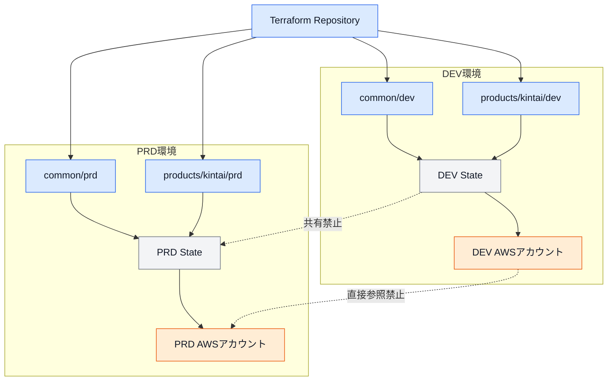
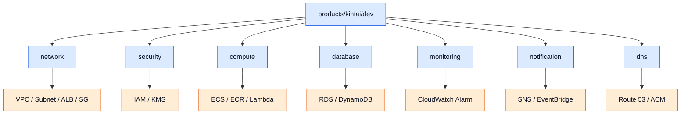
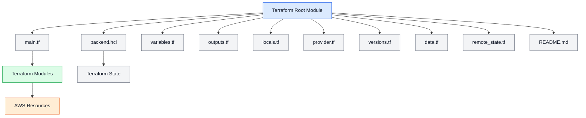
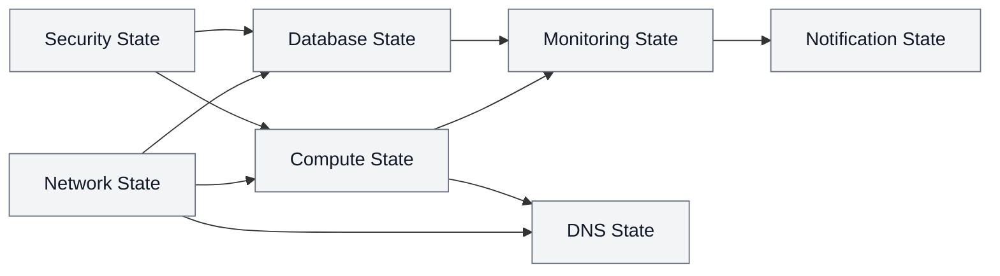
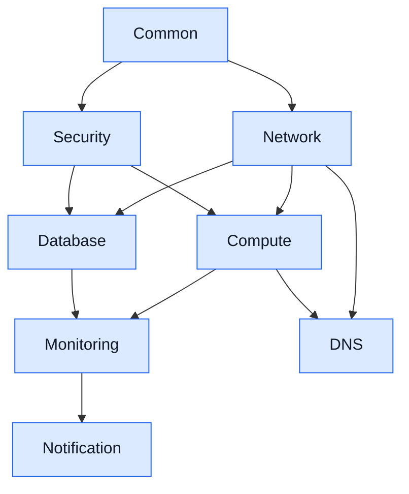
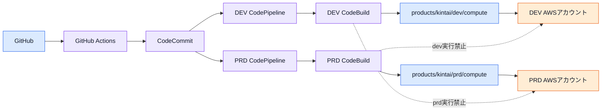
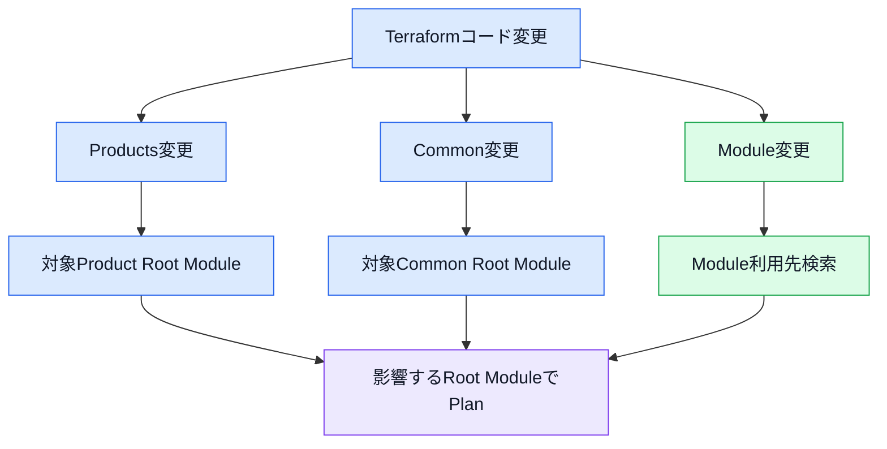
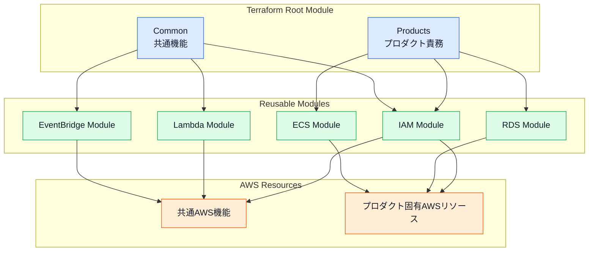

# 第5章 環境・責務設計

## 5.1 本章の目的

本章では、Terraform Framework Standard v1.0で採用する環境分離、CommonとProductsの責務、Terraform Root Moduleの構成および実行単位を定義する。

本標準では、Terraformコードを単にAWSサービスごとに配置するのではなく、以下の単位で分離する。

* 環境
* プロダクト
* 共通機能
* インフラ責務
* Terraform State
* CI/CD実行単位
* Terraform実行Role

環境と責務の境界が不明確な場合、以下の問題が発生する可能性がある。

* dev環境の変更がprd環境へ影響する
* 複数の責務が同じStateへ混在する
* Terraform Planの影響範囲が把握できない
* Apply順序が複雑になる
* 不要なState依存が発生する
* CommonとProductsで同じリソースを重複管理する
* プロダクト削除時に共通リソースまで削除される
* Terraform実行権限を適切に分離できない

本標準では、環境・プロダクト・責務を明確に分離し、変更および障害の影響範囲を限定する。

---

## 5.2 基本方針

本章では、以下の方針を採用する。

* 標準環境は`dev`および`prd`とする。
* devとprdはディレクトリ、AWSアカウント、StateおよびCI/CDを分離する。
* Commonは複数プロダクトで利用する共通機能を管理する。
* Productsは各プロダクト固有のインフラを管理する。
* Commonは機能単位で分割する。
* Productsは責務単位で分割する。
* CommonおよびProductsはTerraform Root Moduleとする。
* 1つのRoot Moduleは1つのStateに対応させる。
* Root ModuleではModuleを組み合わせる。
* Root ModuleへAWS Resourceを直接定義しない。
* 環境差分は呼び出し側で管理する。
* `terraform.tfvars`は環境ディレクトリ直下に配置する。
* State間の依存は必要最小限とする。
* 正式なApplyはCodePipelineおよびCodeBuildから実行する。
* ローカルApplyおよびDestroyは禁止する。

---

## 5.3 環境構成

標準環境は以下の2つとする。

| 環境    | 用途           | AWSアカウント |
| ----- | ------------ | -------- |
| `dev` | 開発、動作確認、結合確認 | DEVアカウント |
| `prd` | 本番サービスの提供    | PRDアカウント |

環境は物理的なディレクトリとして分離する。

```text
common/
├── dev/
└── prd/

products/
└── <project>/
    ├── dev/
    └── prd/
```

`dev`と`prd`で同じRoot ModuleやStateを共有してはならない。

---

## 5.4 環境分離構成図



---

## 5.5 環境追加

`stg`、`qa`、`sandbox`などの環境は、標準構成には含めない。

追加環境が必要になった場合は、以下を確認する。

* 追加環境の目的
* 利用者
* AWSアカウントの有無
* Stateの保存先
* CI/CD構成
* Terraform実行Role
* コスト
* データ管理方法
* dev環境では代替できない理由
* 廃止条件

環境を追加する場合は、既存の`dev`および`prd`と同じ構造を適用する。

```text
products/
└── kintai/
    ├── dev/
    ├── stg/
    └── prd/
```

環境追加によって標準構成が変更される場合は、ADRを作成する。

---

## 5.6 Commonの責務

Commonでは、複数プロダクトまたは環境全体で利用する共通機能を管理する。

Commonへ配置する例を以下に示す。

* ECSやRDSの起動・停止バッチ
* 予算通知
* 共通バックアップ
* 共通ログ出力
* 共通監査
* アカウント単位の通知
* 共通EventBridge Schedule
* 複数プロダクトで利用する運用自動化

Commonでは、AWSサービス単位ではなく機能単位でディレクトリを作成する。

```text
common/
└── dev/
    ├── batch_start_stop/
    ├── backup/
    ├── budget_alert/
    └── log_export/
```

---

## 5.7 Commonへ配置する判断基準

以下のいずれかに該当する場合は、Commonへの配置を検討する。

| 判断基準    | 内容                    |
| ------- | --------------------- |
| 利用範囲    | 複数プロダクトで利用する          |
| 管理範囲    | AWSアカウントまたは環境全体へ適用する  |
| ライフサイクル | 個別プロダクトと独立している        |
| 運用責務    | 共通運用機能として管理する         |
| 削除影響    | 1つのプロダクト削除時に残す必要がある   |
| 権限      | プロダクトとは異なる実行Roleを使用する |
| State   | プロダクトStateから分離する必要がある |

以下はCommonへ配置しない。

* 特定プロダクトだけが使用するECS Service
* 特定プロダクト専用のRDS
* 特定プロダクト専用のALB
* 特定プロダクト専用のSecurity Group
* 特定プロダクトだけに必要なCloudWatch Alarm
* プロダクト固有のDNS設定

---

## 5.8 Productsの責務

Productsでは、各プロダクト固有のインフラを管理する。

```text
products/
└── kintai/
    ├── dev/
    └── prd/
```

各環境配下では、インフラ責務単位でRoot Moduleを分割する。

```text
products/
└── kintai/
    └── dev/
        ├── terraform.tfvars
        ├── network/
        ├── security/
        ├── compute/
        ├── database/
        ├── monitoring/
        ├── notification/
        └── dns/
```

使用しない責務ディレクトリは作成しない。

---

## 5.9 標準責務

Productsの標準責務を以下に示す。

| 責務             | 主な管理対象                                                                                                    |
| -------------- | --------------------------------------------------------------------------------------------------------- |
| `network`      | VPC、Subnet、Route Table、Internet Gateway、NAT Gateway、VPC Endpoint、ALB、Listener、Target Group、Security Group |
| `security`     | IAM Role、IAM Policy、Permission Boundary、KMS、Resource Policy                                               |
| `compute`      | ECS Cluster、ECS Service、Task Definition、ECR、Lambda、CloudWatch Log Group                                   |
| `database`     | RDS、DynamoDB、ElastiCache、DB Subnet Group、Parameter Group                                                  |
| `monitoring`   | CloudWatch Alarm、Dashboard、監視設定                                                                           |
| `notification` | SNS、EventBridge、通知連携                                                                                      |
| `dns`          | Route 53、ACM、DNS Record                                                                                   |

上記は標準的な分類であり、すべてのプロダクトに全責務を作成する必要はない。

WAFは標準構成には含めない。

利用要件が発生した場合は、`security`または専用責務への配置を別途判断する。

---

## 5.10 責務の配置判断

AWSリソースの配置先は、サービス名だけではなく、そのリソースが果たす責務によって判断する。

### CloudWatch Log Group

CloudWatch Log Groupは、利用元リソースに近い責務で管理する。

例：

* ECS用Log Group：`compute`
* Lambda用Log Group：`compute`
* 共通監査用Log Group：Commonの対象機能

### CloudWatch Alarm

CloudWatch Alarmは`monitoring`で管理する。

監視対象となるECS、RDSなどの情報はRemote Stateから取得する。

### SNS

通知先や通知経路を管理するSNS Topicは`notification`で管理する。

特定機能の内部でのみ利用し、他の責務から参照されないSNS Topicは、対象機能内での管理を検討できる。

### Security Group

Security Groupは`network`で管理する。

IAM RoleやKMSなど、権限・暗号化に関するリソースは`security`で管理する。

---

## 5.11 責務構成図



---

## 5.12 Root Module

Commonの各機能ディレクトリおよびProductsの各責務ディレクトリは、独立したTerraform Root Moduleとする。

例：

```text
common/dev/batch_start_stop/
products/kintai/dev/network/
products/kintai/dev/compute/
products/kintai/prd/database/
```

Root Moduleは、Terraformコマンドを実行する単位である。

各Root Moduleは独立した以下の要素を持つ。

* Backend
* State
* Provider
* Variables
* Locals
* Module呼び出し
* Outputs
* README
* CI/CD実行単位
* Terraform実行Role

---

## 5.13 Root Module標準構成

Root Moduleは、以下のファイル構成を標準とする。

```text
compute/
├── backend.hcl
├── main.tf
├── variables.tf
├── outputs.tf
├── locals.tf
├── provider.tf
├── versions.tf
├── README.md
├── data.tf
└── remote_state.tf
```

`data.tf`および`remote_state.tf`は、必要な場合のみ作成する。

空ファイルを形式的に作成する必要はない。

---

## 5.14 Root Moduleファイルの役割

| ファイル              | 役割                             |
| ----------------- | ------------------------------ |
| `backend.hcl`     | S3 BackendおよびDynamoDB Lockの設定値 |
| `main.tf`         | Terraform Moduleの呼び出し          |
| `variables.tf`    | Root ModuleのInput定義            |
| `outputs.tf`      | 他Stateへ公開する値                   |
| `locals.tf`       | 共通タグ、名称、単純な計算値                 |
| `provider.tf`     | AWS Provider設定                 |
| `versions.tf`     | TerraformおよびProviderのバージョン制約   |
| `README.md`       | 責務、依存関係、実行方法、注意事項              |
| `data.tf`         | AWS Data Source                |
| `remote_state.tf` | 他Stateの参照定義                    |

---

## 5.15 Root Module構成図



---

## 5.16 main.tf

Root Moduleの`main.tf`には、Module呼び出しのみを記述する。

例：

```hcl
module "ecs_cluster_application" {
  source = "../../../../../modules/ecs/cluster"

  cluster_name              = var.ecs_cluster_name
  container_insights_enabled = var.container_insights_enabled
  tags                      = local.common_tags
}

module "ecs_task_definition_application" {
  source = "../../../../../modules/ecs/task_definition"

  family             = var.task_definition_family
  cpu                = var.task_cpu
  memory             = var.task_memory
  task_role_arn      = data.terraform_remote_state.security.outputs.ecs_task_role_arn
  execution_role_arn = data.terraform_remote_state.security.outputs.ecs_execution_role_arn
  tags               = local.common_tags
}

module "ecs_service_application" {
  source = "../../../../../modules/ecs/service"

  service_name        = var.ecs_service_name
  cluster_arn         = module.ecs_cluster_application.cluster_arn
  task_definition_arn = module.ecs_task_definition_application.task_definition_arn
  subnet_ids          = data.terraform_remote_state.network.outputs.private_subnet_ids
  security_group_ids  = [
    data.terraform_remote_state.network.outputs.ecs_security_group_id
  ]
  tags = local.common_tags
}
```

Root Moduleの`main.tf`へAWS Resourceを直接記述してはならない。

---

## 5.17 Root ModuleとModuleの責務

| 項目           | Root Module | Module    |
| ------------ | ----------- | --------- |
| 環境差分         | 管理する        | 管理しない     |
| プロダクト差分      | 管理する        | 管理しない     |
| Provider     | 定義する        | 定義しない     |
| Backend      | 定義する        | 定義しない     |
| Remote State | 参照する        | 参照しない     |
| 必須タグ         | 作成する        | 受け取って設定する |
| AWS Resource | 直接定義しない     | 定義する      |
| Module組み合わせ  | 実施する        | 実施しない     |
| State        | 保持する        | 意識しない     |

---

## 5.18 terraform.tfvarsの配置

`terraform.tfvars`は、各環境ディレクトリ直下に1つ配置する。

### Products

```text
products/
└── kintai/
    └── dev/
        ├── terraform.tfvars
        ├── network/
        ├── security/
        ├── compute/
        └── database/
```

### Common

```text
common/
└── dev/
    ├── terraform.tfvars
    ├── batch_start_stop/
    ├── backup/
    └── budget_alert/
```

同じ環境内のRoot Moduleで共通する値を、環境直下の`terraform.tfvars`で管理する。

---

## 5.19 terraform.tfvarsの読み込み

Terraformは、親ディレクトリに存在する`terraform.tfvars`を自動で読み込まない。

各Root ModuleからTerraformを実行する際は、`-var-file`で明示的に指定する。

Productsの例：

```bash
cd products/kintai/dev/compute

terraform plan \
  -var-file=../terraform.tfvars
```

Commonの例：

```bash
cd common/dev/batch_start_stop

terraform plan \
  -var-file=../terraform.tfvars
```

CI/CDでも同じPathを明示的に指定する。

---

## 5.20 terraform.tfvarsの役割

`terraform.tfvars`には、環境およびプロダクト固有の設定値を記載する。

例：

```hcl
environment  = "dev"
project_name = "kintai"
aws_region   = "ap-northeast-1"

ecs_cluster_name = "dev--kintai--application--ecs-cluster"
ecs_service_name = "dev--kintai--application--ecs-service"

task_cpu    = 256
task_memory = 512
```

以下は記載しない。

* Terraform Resource
* Module Block
* Provider Block
* Backend設定
* IAM Policy本文
* Password
* Access Key
* API Key
* Secret Token
* 秘密鍵

---

## 5.21 terraform.tfvarsのGit管理

実際の`terraform.tfvars`は`.gitignore`で除外する。

```gitignore
**/terraform.tfvars
**/*.auto.tfvars
```

Git管理する設定例として、以下を作成できる。

```text
terraform.tfvars.example
```

例：

```hcl
environment  = "dev"
project_name = "example"
aws_region   = "ap-northeast-1"

task_cpu    = 256
task_memory = 512
```

`terraform.tfvars.example`には、機密値や実際のAWS Resource IDを記載しない。

---

## 5.22 環境差分

devとprdの差分は、Root Module側のVariableまたは`terraform.tfvars`で管理する。

例：

### dev

```hcl
task_cpu          = 256
task_memory       = 512
desired_count     = 1
enable_autoscaling = false
```

### prd

```hcl
task_cpu          = 1024
task_memory       = 2048
desired_count     = 2
enable_autoscaling = true
```

Module内で環境名を判定し、設定値を変更してはならない。

禁止例：

```hcl
cpu = var.environment == "prd" ? 1024 : 256
```

---

## 5.23 Locals

Root Moduleの`locals.tf`では、以下を管理する。

* 共通タグ
* Resource名の共通Prefix
* 単純な文字列結合
* Root Module内で共通利用する値
* Remote State Outputの単純な整形

例：

```hcl
locals {
  resource_prefix = "${var.environment}--${var.project_name}"

  common_tags = {
    Environment   = var.environment
    Project       = var.project_name
    ManagedBy     = "Terraform"
    TerraformPath = "products/kintai/dev/compute"
  }
}
```

---

## 5.24 親ディレクトリの値

Terraformは、親ディレクトリのTerraformファイルを自動で読み込まない。

以下の`locals.tf`は、`compute`から直接参照できない。

```text
products/
└── kintai/
    └── dev/
        ├── locals.tf
        └── compute/
            └── main.tf
```

各Root Moduleは独立して評価される。

共通値は、以下のいずれかで渡す。

* `terraform.tfvars`
* CI/CD環境変数
* Remote State
* Terraform Variable
* Parameter StoreやSecrets Managerの参照情報

---

## 5.25 Provider

ProviderはRoot Moduleで設定する。

例：

```hcl
provider "aws" {
  region = var.aws_region

  default_tags {
    tags = local.common_tags
  }
}
```

Terraform実行Roleを使用する場合は、ProviderまたはCodeBuild側でRoleを設定する。

例：

```hcl
provider "aws" {
  region = var.aws_region

  assume_role {
    role_arn = var.terraform_execution_role_arn
  }

  default_tags {
    tags = local.common_tags
  }
}
```

実行Roleの詳細は、IAM・セキュリティ設計で定義する。

---

## 5.26 Provider Alias

複数リージョンまたは複数AWSアカウントを操作する必要がある場合は、Provider Aliasを使用できる。

例：

```hcl
provider "aws" {
  region = "ap-northeast-1"
}

provider "aws" {
  alias  = "us_east_1"
  region = "us-east-1"
}
```

Moduleへの受け渡し例：

```hcl
module "acm_certificate_cloudfront" {
  source = "../../../../../modules/acm/certificate"

  providers = {
    aws = aws.us_east_1
  }
}
```

Provider Aliasを使用する場合は、READMEへ用途と対象リージョンを記載する。

---

## 5.27 Remote State

他の責務で作成された値は、Root Moduleの`remote_state.tf`で参照する。

例：

```hcl
data "terraform_remote_state" "network" {
  backend = "s3"

  config = {
    bucket         = "dev--kintai--terraform-state--s3"
    key            = "products/kintai/dev/network/network.tfstate"
    region         = "ap-northeast-1"
    dynamodb_table = "dev--kintai--terraform-lock--dynamodb"
    encrypt        = true
  }
}
```

参照した値はModuleへVariableとして渡す。

```hcl
module "ecs_service_application" {
  source = "../../../../../modules/ecs/service"

  subnet_ids = data.terraform_remote_state.network.outputs.private_subnet_ids
}
```

Module内でRemote Stateを参照してはならない。

---

## 5.28 State依存関係

State間の依存関係は、実際に必要な参照のみに限定する。

標準的な依存例を以下に示す。



実際に依存しない責務を、形式上のApply順序だけで接続してはならない。

---

## 5.29 Apply順序

Terraform Applyは、State依存関係に従って実行する。

標準的な実行順序の例を以下に示す。

```text
Common
  ↓
Network
  ↓
Security
  ↓
Compute / Database
  ↓
Monitoring
  ↓
Notification
  ↓
DNS
```

ただし、すべてのStateを完全に直列実行する必要はない。

依存関係がない場合は、並列実行できる。

例：

```text
Network
  ├── Compute
  └── Database
```

ComputeとDatabaseが互いに依存しない場合は、Network完了後に並列で実行できる。

---

## 5.30 Applyフロー構成図



Commonの機能がProductsから参照されない場合は、Productsより先に必ずApplyする必要はない。

実際の依存関係をREADMEおよびCI/CDへ反映する。

---

## 5.31 Destroy順序

Destroyが必要な場合は、原則としてApplyの逆順で実施する。

例：

```text
DNS
  ↓
Notification
  ↓
Monitoring
  ↓
Compute / Database
  ↓
Security
  ↓
Network
  ↓
Common
```

ただし、本標準では通常運用での`terraform destroy`を禁止する。

Destroyが必要な場合は、以下を必須とする。

* 対象環境の確認
* 対象Stateの確認
* 依存Stateの確認
* 承認
* Plan結果の保存
* バックアップ要否の確認
* 実施記録
* 事後確認

詳細は運用・例外管理の章で定義する。

---

## 5.32 CI/CD実行単位

TerraformのCI/CDは、Root Module単位で実行する。

例：

```text
products/kintai/dev/network
products/kintai/dev/compute
products/kintai/prd/database
common/dev/batch_start_stop
```

各実行単位は、以下を持つ。

* 対象ディレクトリ
* Backend設定
* State
* `terraform.tfvars`
* Terraform実行Role
* CodeBuild Project
* Plan結果
* Apply承認
* 実行ログ

---

## 5.33 CI/CD構成図



GitHub ActionsはCodeCommitへの同期のみを担当する。

TerraformのPlanおよびApplyはCodeBuildで実行する。

---

## 5.34 ブランチと環境

標準ブランチと環境の対応を以下とする。

| ブランチ      | 対象環境 | 主な用途     |
| --------- | ---- | -------- |
| `develop` | dev  | 開発環境への変更 |
| `main`    | prd  | 本番環境への変更 |

dev環境の変更は`develop`へ反映する。

prd環境の変更は`main`へ反映する。

ブランチ名だけで実行環境を決定せず、対象ディレクトリ、AWSアカウント、実行RoleおよびBackendも検証する。

---

## 5.35 ローカル実行

ローカル環境では、以下を許可する。

```bash
terraform fmt
terraform init
terraform validate
terraform plan
```

ローカルPlan時も、正式なBackendおよび対象環境を確認する。

以下は禁止する。

```bash
terraform apply
terraform destroy
```

このルールは`dev`および`prd`の両方へ適用する。

dev環境であっても、正式なAWSリソース変更はCI/CD経由で実施する。

---

## 5.36 Root Moduleの実行方法

Productsの例：

```bash
cd products/kintai/dev/compute

terraform init \
  -backend-config=backend.hcl

terraform fmt -check

terraform validate

terraform plan \
  -var-file=../terraform.tfvars
```

Commonの例：

```bash
cd common/dev/batch_start_stop

terraform init \
  -backend-config=backend.hcl

terraform fmt -check

terraform validate

terraform plan \
  -var-file=../terraform.tfvars
```

Applyはローカルで実行しない。

---

## 5.37 実行対象の特定

CI/CDでは、変更されたファイルからPlan対象のRoot Moduleを特定する。

### Products変更

例：

```text
products/kintai/dev/compute/main.tf
```

対象：

```text
products/kintai/dev/compute
```

### Common変更

例：

```text
common/dev/batch_start_stop/main.tf
```

対象：

```text
common/dev/batch_start_stop
```

### Module変更

例：

```text
modules/ecs/service/main.tf
```

対象：

```text
modules/ecs/serviceを利用するすべてのRoot Module
```

Module変更時は、利用先を検索し、影響するすべてのRoot ModuleでPlanを実行する。

---

## 5.38 変更検知構成図



---

## 5.39 Root Module README

各Root ModuleにはREADMEを作成する。

最低限、以下を記載する。

* Root Module名
* 管理責務
* 対象環境
* 対象AWSアカウント
* 作成する主要リソース
* 利用するModule
* 参照するRemote State
* 公開するOutput
* Backend
* State名
* Apply前提条件
* Apply順序
* Destroy順序
* Terraform実行Role
* 注意事項
* 例外事項

---

## 5.40 README構成例

```md
# Compute Root Module

## 概要

勤怠プロダクトのDEV環境で使用するComputeリソースを管理する。

## 対象

- Environment: dev
- Project: kintai
- Responsibility: compute

## 管理リソース

- ECS Cluster
- ECS Task Definition
- ECS Service
- ECR Repository
- CloudWatch Log Group

## 利用Module

- modules/ecs/cluster
- modules/ecs/task_definition
- modules/ecs/service
- modules/ecr/repository
- modules/cloudwatch/log_group

## 参照State

- network
- security

## State

- Bucket: dev--kintai--terraform-state--s3
- Key: products/kintai/dev/compute/compute.tfstate

## Apply前提条件

- Network StateのApplyが完了していること
- Security StateのApplyが完了していること
```

---

## 5.41 新規プロダクト追加

新しいプロダクトを追加する場合は、以下の手順で実施する。

1. プロダクト名を決定する。
2. devおよびprdのディレクトリを作成する。
3. `terraform.tfvars.example`を作成する。
4. 必要な責務を決定する。
5. 必要なRoot Moduleのみ作成する。
6. Backendを作成する。
7. Terraform実行Roleを作成する。
8. State依存関係を定義する。
9. CI/CDを作成する。
10. READMEを作成する。
11. dev環境でPlanする。
12. dev環境を構築する。
13. prd環境でPlanする。
14. prd環境を構築する。

将来的には、`scripts`および`templates`を使用して標準構成を自動生成する。

---

## 5.42 新規責務追加

既存プロダクトへ新しい責務を追加する場合は、以下を確認する。

* 既存責務へ追加できないか
* 独立したStateが必要か
* Terraform実行Roleを分離する必要があるか
* ライフサイクルが異なるか
* Remote State依存が増えすぎないか
* CI/CD実行単位として独立させる必要があるか
* 責務名が管理対象を適切に表しているか

新規責務追加により標準責務が変更される場合は、ADRを作成する。

---

## 5.43 Common機能追加

新しいCommon機能を追加する場合は、以下の手順で実施する。

1. Commonへ配置する判断基準を確認する。
2. 機能名を決定する。
3. 対象環境を決定する。
4. 必要なModuleを選定する。
5. Root Moduleを作成する。
6. Backend Keyを決定する。
7. State依存関係を確認する。
8. Terraform実行Roleを作成する。
9. CI/CDを作成する。
10. READMEを作成する。
11. PlanおよびApplyを実施する。

Commonへ配置すること自体を目的とせず、プロダクトから独立した共通機能であることを確認する。

---

## 5.44 プロダクト廃止

プロダクトを廃止する場合は、以下を確認する。

* DNSの停止
* 外部通信の停止
* 通知の停止
* Monitoringの停止
* Computeの停止
* Databaseデータの保管
* Securityリソースの削除
* Networkリソースの削除
* Stateの廃止
* CI/CDの停止
* CodeCommitの扱い
* Backendの保管
* READMEおよびADRの更新

Commonは、個別プロダクト廃止時に原則として削除しない。

他プロダクトから利用されていないことを確認した上で、Common機能の廃止を別途判断する。

---

## 5.45 責務間の循環参照

State間の循環参照は禁止する。

禁止例：

```text
compute
  ↓
monitoring
  ↓
notification
  ↓
compute
```

循環参照が発生する場合は、以下を検討する。

* Outputの参照方向を見直す
* 責務の配置先を見直す
* 共通値をParameter Storeなどへ移す
* 参照を片方向にする
* Stateの分割または統合を見直す
* 通知や監視設定の管理責務を見直す

---

## 5.46 共通化の範囲

複数プロダクトで同じ設定を使用する場合でも、すべてをCommonへ移動する必要はない。

以下を区別する。

### Moduleとして共通化するもの

AWSリソースの作成方法が共通である場合。

例：

* ECS Service
* Security Group
* RDS Instance
* CloudWatch Alarm

### Common機能として共通化するもの

作成されたリソース自体を複数プロダクトで共有する場合。

例：

* 共通起動停止バッチ
* 共通予算通知
* 共通ログ転送

同じModuleを利用していても、各プロダクトで別々のAWSリソースを作成する場合はProductsで管理する。

---

## 5.47 CommonとModuleの違い

| 項目           | Common         | Module                |
| ------------ | -------------- | --------------------- |
| 管理対象         | 実際に作成する共通AWS機能 | AWS Resourceの再利用可能な定義 |
| State        | 持つ             | 持たない                  |
| Backend      | 持つ             | 持たない                  |
| Provider     | 持つ             | 持たない                  |
| Apply        | 実行する           | 単体では実行しない             |
| 環境           | dev・prdに分離     | 環境を意識しない              |
| AWS Resource | Module経由で作成する  | Resourceを定義する         |
| 利用単位         | 複数プロダクト・環境全体   | Common・Productsから呼び出す |

Commonは共有Moduleの保存場所ではない。

共有Moduleは`modules`へ配置する。

---

## 5.48 Common・Products・Module関係図



---

## 5.49 禁止事項

環境・責務設計では、以下を禁止する。

### devとprdのState共有

```text
dev / prd
   ↓
同一State
```

### devとprdのBackend共有

異なる環境で同じS3 Object Keyを使用してはならない。

### CommonとProductsの重複管理

同じAWSリソースをCommonとProductsの両方から管理してはならない。

### Root ModuleへのResource直書き

```hcl
resource "aws_ecs_service" "example" {
}
```

### Module内で環境分岐

```hcl
desired_count = var.environment == "prd" ? 2 : 1
```

### 親ディレクトリのLocalsへ依存

Terraform Root Module外の`locals.tf`を直接参照できる前提で設計してはならない。

### State間の循環参照

Root Module同士を相互参照させてはならない。

### 不要な責務分割

State数を増やすこと自体を目的として、細かく分割してはならない。

### Commonへのプロダクト固有リソース配置

特定プロダクトだけで利用するAWSリソースをCommonへ配置してはならない。

### Productsへの共有機能配置

複数プロダクトで同じ実リソースを共有する機能を、特定プロダクト配下へ配置してはならない。

### ローカルApply

dev環境を含め、ローカルからApplyしてはならない。

### 未使用ディレクトリの作成

使用しない責務ディレクトリを形式的に作成してはならない。

---

## 5.50 環境・責務設計チェックリスト

### 環境設計

* [ ] devとprdがディレクトリで分離されている
* [ ] devとprdがAWSアカウントで分離されている
* [ ] devとprdでStateを共有していない
* [ ] devとprdでTerraform実行Roleを分離している
* [ ] devとprdでCI/CDを分離している
* [ ] 追加環境の必要性が明確である

### Common

* [ ] 複数プロダクトまたは環境全体で利用する機能である
* [ ] 機能単位の名前になっている
* [ ] AWSサービス名だけのディレクトリではない
* [ ] プロダクト固有リソースを含んでいない
* [ ] 独立したStateを持っている
* [ ] READMEを作成している

### Products

* [ ] プロダクトごとにディレクトリが分離されている
* [ ] devとprdが分離されている
* [ ] 責務単位でRoot Moduleが分割されている
* [ ] 使用しない責務ディレクトリを作成していない
* [ ] Resourceを直接定義していない
* [ ] Moduleを組み合わせて構築している

### Root Module

* [ ] 1つのRoot Moduleが1つのStateに対応している
* [ ] Backendを持っている
* [ ] Providerを持っている
* [ ] `terraform.tfvars`を明示的に読み込んでいる
* [ ] Remote State参照が必要最小限である
* [ ] Outputが必要最小限である
* [ ] READMEを作成している
* [ ] Terraform実行Roleが定義されている
* [ ] CI/CD実行単位と一致している

### 依存関係

* [ ] State間に循環参照がない
* [ ] 不要な直列依存がない
* [ ] 並列実行可能なStateを確認している
* [ ] Apply順序をREADMEへ記載している
* [ ] Destroy順序を確認している

---

## 5.51 全体構成図

```mermaid
flowchart TB

    subgraph REPOSITORY["Terraform Repository"]
        subgraph COMMON_ROOT["Common Root Modules"]
            COMMON_DEV["common/dev"]
            COMMON_PRD["common/prd"]

            COMMON_DEV_FUNCTION["batch_start_stop"]
            COMMON_PRD_FUNCTION["batch_start_stop"]

            COMMON_DEV --> COMMON_DEV_FUNCTION
            COMMON_PRD --> COMMON_PRD_FUNCTION
        end

        subgraph PRODUCT_ROOT["Product Root Modules"]
            PRODUCT["products/kintai"]

            DEV["dev"]
            PRD["prd"]

            DEV_TFVARS["terraform.tfvars"]
            DEV_NETWORK["network"]
            DEV_SECURITY["security"]
            DEV_COMPUTE["compute"]
            DEV_DATABASE["database"]
            DEV_MONITOR["monitoring"]
            DEV_NOTIFY["notification"]

            PRD_TFVARS["terraform.tfvars"]
            PRD_NETWORK["network"]
            PRD_SECURITY["security"]
            PRD_COMPUTE["compute"]
            PRD_DATABASE["database"]
            PRD_MONITOR["monitoring"]
            PRD_NOTIFY["notification"]

            PRODUCT --> DEV
            PRODUCT --> PRD

            DEV --> DEV_TFVARS
            DEV --> DEV_NETWORK
            DEV --> DEV_SECURITY
            DEV --> DEV_COMPUTE
            DEV --> DEV_DATABASE
            DEV --> DEV_MONITOR
            DEV --> DEV_NOTIFY

            PRD --> PRD_TFVARS
            PRD --> PRD_NETWORK
            PRD --> PRD_SECURITY
            PRD --> PRD_COMPUTE
            PRD --> PRD_DATABASE
            PRD --> PRD_MONITOR
            PRD --> PRD_NOTIFY
        end

        subgraph MODULE_LAYER["Terraform Modules"]
            NETWORK_MODULE["Network Modules"]
            IAM_MODULE["IAM Modules"]
            ECS_MODULE["ECS Modules"]
            DB_MODULE["Database Modules"]
            MONITOR_MODULE["Monitoring Modules"]
            NOTIFY_MODULE["Notification Modules"]
        end
    end

    subgraph CICD["CI/CD"]
        CODEPIPELINE["CodePipeline"]
        CODEBUILD["CodeBuild"]
    end

    subgraph STATE["State・Backend"]
        DEV_STATE["DEV State"]
        PRD_STATE["PRD State"]
    end

    subgraph AWS["AWS環境"]
        DEV_AWS["DEV AWSアカウント"]
        PRD_AWS["PRD AWSアカウント"]
    end

    COMMON_DEV_FUNCTION --> NOTIFY_MODULE
    COMMON_PRD_FUNCTION --> NOTIFY_MODULE

    DEV_NETWORK --> NETWORK_MODULE
    DEV_SECURITY --> IAM_MODULE
    DEV_COMPUTE --> ECS_MODULE
    DEV_DATABASE --> DB_MODULE
    DEV_MONITOR --> MONITOR_MODULE
    DEV_NOTIFY --> NOTIFY_MODULE

    PRD_NETWORK --> NETWORK_MODULE
    PRD_SECURITY --> IAM_MODULE
    PRD_COMPUTE --> ECS_MODULE
    PRD_DATABASE --> DB_MODULE
    PRD_MONITOR --> MONITOR_MODULE
    PRD_NOTIFY --> NOTIFY_MODULE

    CODEPIPELINE --> CODEBUILD

    CODEBUILD --> COMMON_DEV_FUNCTION
    CODEBUILD --> COMMON_PRD_FUNCTION
    CODEBUILD --> DEV_NETWORK
    CODEBUILD --> DEV_SECURITY
    CODEBUILD --> DEV_COMPUTE
    CODEBUILD --> DEV_DATABASE
    CODEBUILD --> DEV_MONITOR
    CODEBUILD --> DEV_NOTIFY
    CODEBUILD --> PRD_NETWORK
    CODEBUILD --> PRD_SECURITY
    CODEBUILD --> PRD_COMPUTE
    CODEBUILD --> PRD_DATABASE
    CODEBUILD --> PRD_MONITOR
    CODEBUILD --> PRD_NOTIFY

    DEV_NETWORK --> DEV_STATE
    DEV_SECURITY --> DEV_STATE
    DEV_COMPUTE --> DEV_STATE
    DEV_DATABASE --> DEV_STATE
    DEV_MONITOR --> DEV_STATE
    DEV_NOTIFY --> DEV_STATE

    PRD_NETWORK --> PRD_STATE
    PRD_SECURITY --> PRD_STATE
    PRD_COMPUTE --> PRD_STATE
    PRD_DATABASE --> PRD_STATE
    PRD_MONITOR --> PRD_STATE
    PRD_NOTIFY --> PRD_STATE

    DEV_STATE --> DEV_AWS
    PRD_STATE --> PRD_AWS

    classDef orchestration fill:#dbeafe,stroke:#2563eb,color:#111827
    classDef module fill:#dcfce7,stroke:#16a34a,color:#111827
    classDef aws fill:#ffedd5,stroke:#ea580c,color:#111827
    classDef cicd fill:#ede9fe,stroke:#7c3aed,color:#111827
    classDef prohibited fill:#fee2e2,stroke:#dc2626,color:#111827
    classDef config fill:#f3f4f6,stroke:#6b7280,color:#111827

    class COMMON_DEV,COMMON_PRD,COMMON_DEV_FUNCTION,COMMON_PRD_FUNCTION,PRODUCT,DEV,PRD,DEV_NETWORK,DEV_SECURITY,DEV_COMPUTE,DEV_DATABASE,DEV_MONITOR,DEV_NOTIFY,PRD_NETWORK,PRD_SECURITY,PRD_COMPUTE,PRD_DATABASE,PRD_MONITOR,PRD_NOTIFY orchestration
    class NETWORK_MODULE,IAM_MODULE,ECS_MODULE,DB_MODULE,MONITOR_MODULE,NOTIFY_MODULE module
    class CODEPIPELINE,CODEBUILD cicd
    class DEV_TFVARS,PRD_TFVARS,DEV_STATE,PRD_STATE config
    class DEV_AWS,PRD_AWS aws
```



---

## 5.52 設計原則

本章の設計原則を以下にまとめる。

* 標準環境は`dev`および`prd`とする。
* devとprdはディレクトリ、AWSアカウント、State、CI/CDおよび実行Roleを分離する。
* Commonは複数プロダクトまたは環境全体で利用する共通機能を管理する。
* CommonはAWSサービス単位ではなく機能単位で分割する。
* Productsは各プロダクト固有のAWSインフラを管理する。
* Productsはプロダクト・環境・責務単位で分割する。
* 使用しない責務ディレクトリは作成しない。
* CommonおよびProductsの各ディレクトリはTerraform Root Moduleとする。
* 1つのRoot Moduleを1つのStateに対応させる。
* Root ModuleはModuleを組み合わせるオーケストレーション層とする。
* AWS ResourceはModule内で定義する。
* Root ModuleではProvider、Backend、Remote Stateおよび環境差分を管理する。
* `terraform.tfvars`は環境ディレクトリ直下に1つ配置する。
* 各Root Moduleから`-var-file`を明示して読み込む。
* 環境差分はModuleではなくRoot Module側で管理する。
* State依存は実際に必要な参照のみに限定する。
* State間の循環参照を禁止する。
* Apply順序はState依存関係に従う。
* 依存関係がないRoot Moduleは並列実行を検討する。
* TerraformのCI/CDはRoot Module単位で実行する。
* GitHub ActionsはCodeCommitへの同期のみを担当する。
* 正式なPlanおよびApplyはCodeBuildで実行する。
* ローカルApplyおよびDestroyは禁止する。
* Root ModuleごとにREADMEを作成する。
