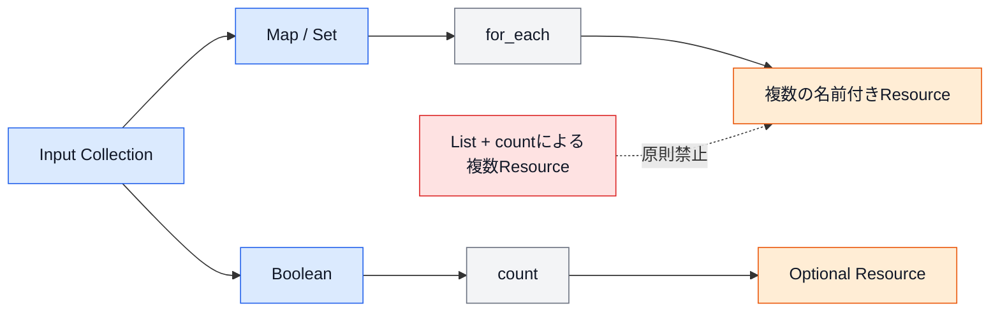
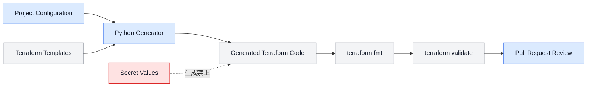
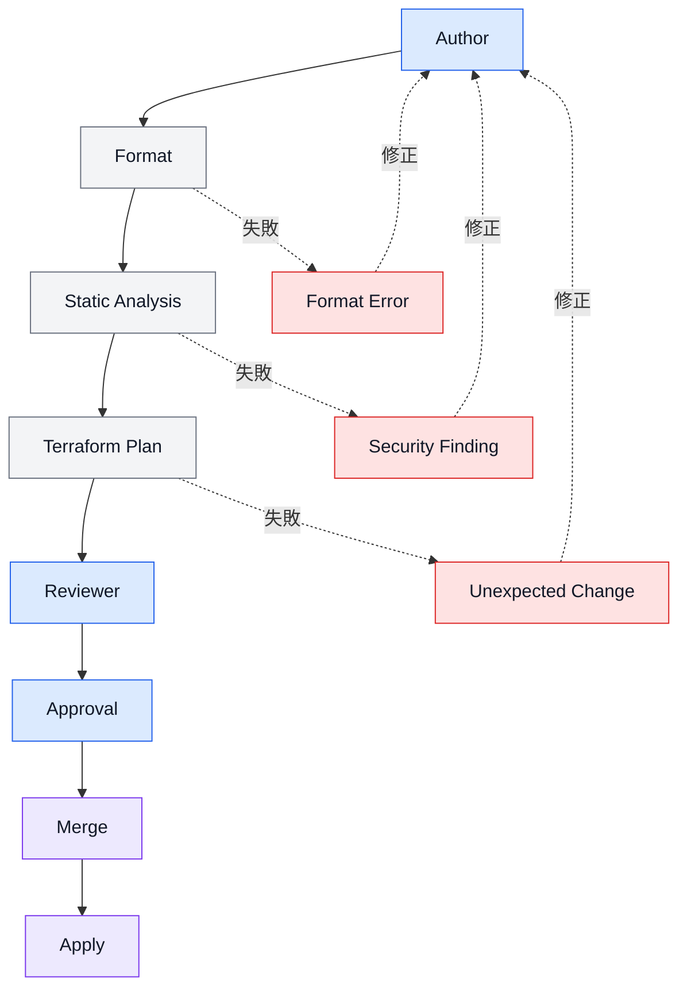
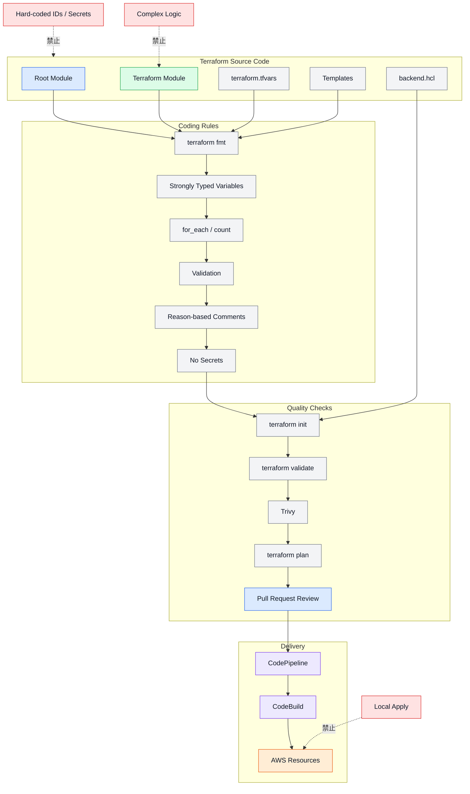

# 第6章 コーディング標準

## 6.1 本章の目的

本章では、Terraform Framework Standard v1.0で採用するTerraformコードの記述ルール、ファイル構成、命名、変数、繰り返し処理、条件分岐、コメントおよび品質確認方法を定義する。

コーディングルールを統一する目的は、以下のとおりである。

* Terraformコードの可読性を維持する
* 開発者ごとの記述差を抑える
* コードレビューの判断基準を統一する
* 誤設定や意図しない変更を防止する
* ModuleおよびRoot Moduleの保守性を高める
* CI/CDによる自動検証を実装しやすくする
* Pythonなどによるコード生成を実装しやすくする
* 新しい開発者が短期間で構成を理解できるようにする

本章のルールは、以下のTerraformコードへ適用する。

* `modules/`
* `common/`
* `products/`
* Terraform関連テンプレート
* Terraformを生成するスクリプト
* CI/CD内で利用するTerraform設定

---

## 6.2 基本方針

Terraformコードは、以下の原則に従って記述する。

* Terraform公式のHCL記法に従う。
* `terraform fmt`による整形結果を正とする。
* 1つのファイルへ過剰にコードを集中させない。
* ファイル名とTerraform識別子は`snake_case`を使用する。
* 意味が分かる名称を使用する。
* ハードコードを避ける。
* 変数には具体的な型を指定する。
* InputとOutputは必要最小限とする。
* 複雑な条件分岐や過剰な抽象化を避ける。
* 繰り返し作成には原則として`for_each`を使用する。
* コメントではコードから読み取れない理由を説明する。
* 機密情報をTerraformコードへ記述しない。
* 実行前に`fmt`、`validate`、静的解析およびPlanを実施する。
* 意図しない削除や再作成を含むPlanをApplyしない。

---

## 6.3 コーディング標準の適用範囲

本章では、以下を対象とする。

| 対象         | 内容                                          |
| ---------- | ------------------------------------------- |
| HCL        | Terraform Resource、Module、Variable、Outputなど |
| Backend設定  | `backend.hcl`                               |
| Variable設定 | `terraform.tfvars`、サンプルファイル                 |
| Provider設定 | `provider.tf`                               |
| Version設定  | `versions.tf`                               |
| CI/CD      | Terraform検証コマンド、Buildspec                   |
| テンプレート     | Root ModuleやModuleの生成用テンプレート                |
| ドキュメント     | コード例、README内のTerraformコード                   |

Terraformコードを自動生成する場合も、生成結果は本章のルールに従わなければならない。

---

## 6.4 ファイル形式

Terraformファイルは、以下の形式を標準とする。

| 項目        | 標準           |
| --------- | ------------ |
| 文字コード     | UTF-8        |
| 改行コード     | LF           |
| インデント     | スペース2文字      |
| ファイル拡張子   | `.tf`        |
| 変数ファイル    | `.tfvars`    |
| Backend設定 | `.hcl`       |
| ファイル名     | `snake_case` |
| 行末の空白     | 禁止           |
| 最終行の改行    | 必須           |
| タブ文字      | 禁止           |

Windows環境で編集する場合も、GitへコミットするファイルはLFへ統一する。

---

## 6.5 terraform fmt

すべてのTerraformコードは、`terraform fmt`によって整形する。

ローカルで変更した場合は、コミット前に以下を実行する。

```bash
terraform fmt -recursive
```

CI/CDでは、ファイルを自動修正せず、整形済みであることを確認する。

```bash
terraform fmt -check -recursive
```

`terraform fmt -check`が失敗した場合は、Pull Requestをマージしない。

手動で空白やインデントを調整し、`terraform fmt`の出力と異なる独自形式を採用してはならない。

---

## 6.6 コード品質確認フロー

```mermaid
flowchart LR

    CHANGE["Terraformコード変更"]
    FMT["terraform fmt"]
    INIT["terraform init"]
    VALIDATE["terraform validate"]
    TRIVY["Trivy"]
    PLAN["terraform plan"]
    REVIEW["Pull Request Review"]
    APPLY["CodePipeline Apply"]

    CHANGE --> FMT
    FMT --> INIT
    INIT --> VALIDATE
    VALIDATE --> TRIVY
    TRIVY --> PLAN
    PLAN --> REVIEW
    REVIEW --> APPLY

    classDef orchestration fill:#dbeafe,stroke:#2563eb,color:#111827
    classDef module fill:#dcfce7,stroke:#16a34a,color:#111827
    classDef aws fill:#ffedd5,stroke:#ea580c,color:#111827
    classDef cicd fill:#ede9fe,stroke:#7c3aed,color:#111827
    classDef prohibited fill:#fee2e2,stroke:#dc2626,color:#111827
    classDef config fill:#f3f4f6,stroke:#6b7280,color:#111827

    class CHANGE,REVIEW orchestration
    class FMT,INIT,VALIDATE,TRIVY,PLAN config
    class APPLY cicd
```



---

## 6.7 標準ファイル分割

### Root Module

Root Moduleでは、以下のファイル構成を標準とする。

```text
<root_module>/
├── backend.hcl
├── main.tf
├── variables.tf
├── outputs.tf
├── locals.tf
├── provider.tf
├── versions.tf
├── README.md
├── data.tf
└── remote_state.tf
```

`data.tf`および`remote_state.tf`は必要な場合のみ作成する。

### Module

Moduleでは、以下のファイル構成を標準とする。

```text
<module>/
├── main.tf
├── variables.tf
├── outputs.tf
├── locals.tf
├── versions.tf
├── README.md
└── data.tf
```

空のファイルを形式的に作成する必要はない。

---

## 6.8 ファイルごとの責務

| ファイル              | Root Module          | Module               |
| ----------------- | -------------------- | -------------------- |
| `main.tf`         | Module呼び出し           | AWS Resource定義       |
| `variables.tf`    | 環境・責務のInput          | ModuleのInput         |
| `outputs.tf`      | 他Stateへ公開する値         | 呼び出し側へ公開する値          |
| `locals.tf`       | タグ、名称、単純な計算          | Module内部の単純な計算       |
| `provider.tf`     | Provider設定           | 配置禁止                 |
| `versions.tf`     | Terraform・Provider制約 | Terraform・Provider制約 |
| `data.tf`         | AWS Data Source      | 必要最小限のData Source    |
| `remote_state.tf` | Remote State参照       | 配置禁止                 |
| `backend.hcl`     | Backend設定値           | 配置禁止                 |
| `README.md`       | 実行方法、依存関係            | 利用方法、Input、Output    |

異なる責務のコードを、同じファイルへ混在させない。

---

## 6.9 ファイル分割の判断

1つのファイルが過剰に大きくなった場合は、責務に基づいて分割する。

例として、Root Moduleの`main.tf`でModule呼び出しが多くなった場合は、以下の分割を許可する。

```text
compute/
├── main.tf
├── ecs_cluster.tf
├── ecs_service.tf
├── task_definition.tf
├── ecr.tf
└── log_group.tf
```

ただし、以下の点に注意する。

* 分割後も同じRoot ModuleおよびStateとして扱われる。
* ファイル名はAWSサービスまたは責務を表す。
* 細かすぎるファイル分割は避ける。
* 1つのResourceごとに必ず1ファイルとする必要はない。
* 関連するResourceまたはModule呼び出しは同じファイルにまとめる。

---

## 6.10 Terraform Blockの記述順序

Terraformファイル内では、以下の順序を標準とする。

### Resource Block

1. `for_each`または`count`
2. Resource名や主要識別子
3. 必須属性
4. Optional属性
5. ネストブロック
6. Tags
7. Lifecycle
8. Depends On

例：

```hcl
resource "aws_ecs_service" "this" {
  for_each = var.services

  name            = each.value.name
  cluster         = each.value.cluster_arn
  task_definition = each.value.task_definition_arn
  desired_count   = each.value.desired_count
  launch_type     = each.value.launch_type

  network_configuration {
    subnets          = each.value.subnet_ids
    security_groups  = each.value.security_group_ids
    assign_public_ip = each.value.assign_public_ip
  }

  tags = each.value.tags

  lifecycle {
    ignore_changes = [
      desired_count
    ]
  }

  depends_on = [
    aws_lb_listener.this
  ]
}
```

`depends_on`は必要な場合のみ記述する。

---

## 6.11 Module Blockの記述順序

Module Blockでは、以下の順序を標準とする。

1. `source`
2. `for_each`または`count`
3. 識別情報
4. 必須Input
5. Optional Input
6. Tags
7. Providers
8. Depends On

例：

```hcl
module "ecs_service_application" {
  source = "../../../../../modules/ecs/service"

  service_name        = var.ecs_service_name
  cluster_arn         = module.ecs_cluster_application.cluster_arn
  task_definition_arn = module.ecs_task_definition_application.task_definition_arn

  desired_count      = var.ecs_desired_count
  subnet_ids         = data.terraform_remote_state.network.outputs.private_subnet_ids
  security_group_ids = [
    data.terraform_remote_state.network.outputs.ecs_security_group_id
  ]

  tags = local.common_tags
}
```

Module BlockのInputは、Terraformの整形結果に従って等号を揃える。

---

## 6.12 Variable Blockの記述順序

Variable Blockは、以下の順序で記述する。

1. `description`
2. `type`
3. `default`
4. `nullable`
5. `sensitive`
6. `validation`

例：

```hcl
variable "environment" {
  description = "Deployment environment."
  type        = string
  nullable    = false

  validation {
    condition     = contains(["dev", "prd"], var.environment)
    error_message = "environment must be dev or prd."
  }
}
```

Defaultがある場合：

```hcl
variable "enable_container_insights" {
  description = "Whether to enable ECS Container Insights."
  type        = bool
  default     = true
  nullable    = false
}
```

---

## 6.13 Output Blockの記述順序

Output Blockは、以下の順序で記述する。

1. `description`
2. `value`
3. `sensitive`
4. `depends_on`

例：

```hcl
output "cluster_arn" {
  description = "ARN of the ECS cluster."
  value       = aws_ecs_cluster.this.arn
}
```

Sensitiveな値：

```hcl
output "connection_information" {
  description = "Sensitive database connection information."
  value       = local.connection_information
  sensitive   = true
}
```

機密情報のOutput自体は、可能な限り避ける。

---

## 6.14 識別子の命名規則

Terraform識別子には`snake_case`を使用する。

対象は以下のとおりである。

* Resource名
* Module Block名
* Variable名
* Output名
* Local名
* Data Source名
* Provider Alias
* `for_each`のKey

良い例：

```hcl
resource "aws_ecs_cluster" "application" {
}
```

```hcl
module "ecs_service_application" {
}
```

```hcl
variable "private_subnet_ids" {
}
```

避ける例：

```hcl
resource "aws_ecs_cluster" "ApplicationCluster" {
}
```

```hcl
module "ecs-service-application" {
}
```

---

## 6.15 Resource名

Module内で単一Resourceを作成する場合は、Resource名として`this`を使用する。

```hcl
resource "aws_ecs_cluster" "this" {
}
```

複数の同一Resourceを個別に定義する場合は、用途が分かる名称を使用する。

```hcl
resource "aws_lb_listener" "http" {
}

resource "aws_lb_listener" "https" {
}
```

Root ModuleでResourceを直接定義しないため、Root ModuleではResource名のルールは原則として適用されない。

---

## 6.16 Module Block名

Module Block名は、以下の形式を標準とする。

```text
<aws_service>_<responsibility>_<purpose>
```

例：

```hcl
module "ecs_cluster_application" {
}
```

```hcl
module "iam_role_ecs_task_execution" {
}
```

```hcl
module "cloudwatch_alarm_ecs_cpu_high" {
}
```

用途が重複しない場合は、末尾のPurposeを省略できる。

```hcl
module "rds_subnet_group" {
}
```

以下の名称は避ける。

```text
main
resource
module
default
example
test
```

---

## 6.17 Data Source名

Data Source名は、取得対象または用途を表す名称とする。

良い例：

```hcl
data "aws_caller_identity" "current" {
}
```

```hcl
data "aws_region" "current" {
}
```

```hcl
data "terraform_remote_state" "network" {
}
```

避ける例：

```hcl
data "aws_vpc" "data" {
}
```

```hcl
data "terraform_remote_state" "state" {
}
```

---

## 6.18 Variable名

Variable名は、値の意味と単位が分かる名称とする。

良い例：

```text
task_cpu
task_memory
retention_in_days
desired_count
private_subnet_ids
security_group_ids
```

避ける例：

```text
value
setting
config
data
number
flag
```

Boolean Variableは、以下の接頭辞を使用する。

```text
enable_
create_
use_
allow_
is_
```

例：

```text
enable_container_insights
create_log_group
use_fargate_spot
allow_public_access
```

---

## 6.19 Output名

Output名は、値の内容が明確になる名称とする。

良い例：

```text
vpc_id
private_subnet_ids
cluster_arn
service_name
security_group_id
topic_arn
```

避ける例：

```text
result
output
value
resource
info
```

複数の値を返す場合は、複数形を使用する。

```text
subnet_ids
security_group_ids
repository_urls
```

---

## 6.20 Local名

Local名は、用途または生成結果を表す名称とする。

良い例：

```hcl
locals {
  resource_prefix = "${var.environment}--${var.project_name}"

  common_tags = {
    Environment = var.environment
    Project     = var.project_name
  }
}
```

避ける例：

```hcl
locals {
  value = "example"
  data  = {}
  tmp   = []
}
```

一時変数のような曖昧な名前を使用しない。

---

## 6.21 VariableのDescription

すべてのVariableに`description`を設定する。

Descriptionでは、以下を明確にする。

* 何を設定する値か
* どのResourceで利用するか
* 単位
* 指定可能な値
* OptionalかRequiredか
* 注意事項

良い例：

```hcl
variable "retention_in_days" {
  description = "Number of days to retain CloudWatch Logs."
  type        = number
}
```

避ける例：

```hcl
variable "retention_in_days" {
  description = "Retention."
  type        = number
}
```

---

## 6.22 Variableの型

Variableには、可能な限り具体的な型を指定する。

### String

```hcl
variable "service_name" {
  description = "Name of the ECS service."
  type        = string
}
```

### Number

```hcl
variable "desired_count" {
  description = "Desired number of ECS tasks."
  type        = number
}
```

### Boolean

```hcl
variable "enable_execute_command" {
  description = "Whether to enable ECS Exec."
  type        = bool
}
```

### List

```hcl
variable "subnet_ids" {
  description = "Subnet IDs used by the ECS service."
  type        = list(string)
}
```

### Set

順序および重複が不要な値には`set`を使用する。

```hcl
variable "availability_zones" {
  description = "Availability zones used by the subnets."
  type        = set(string)
}
```

### Map

```hcl
variable "tags" {
  description = "Tags applied to the resources."
  type        = map(string)
  default     = {}
}
```

### Object

```hcl
variable "health_check" {
  description = "Health check configuration."

  type = object({
    enabled             = bool
    path                = string
    healthy_threshold   = number
    unhealthy_threshold = number
    interval            = number
    timeout             = number
  })
}
```

---

## 6.23 any型の禁止

`any`は型安全性と可読性を損なうため、原則として使用しない。

禁止例：

```hcl
variable "configuration" {
  description = "Resource configuration."
  type        = any
}
```

複数の構造を受け付ける必要がある場合でも、可能な限り`object`、`map`、`list`などで具体的に定義する。

`any`を使用する必要がある場合は、READMEへ以下を記載する。

* 使用理由
* 受け付けるデータ構造
* 具体例
* 将来の型定義予定

---

## 6.24 Optional属性

Object型で一部の属性を任意にする場合は、`optional`を使用できる。

```hcl
variable "services" {
  description = "ECS service configurations."

  type = map(object({
    name                = string
    cluster_arn         = string
    task_definition_arn = string
    desired_count       = optional(number, 1)
    enable_execute      = optional(bool, false)
  }))
}
```

Optional属性を過剰に増やし、何でも設定できる汎用Objectにしてはならない。

Optional属性が多くなる場合は、以下を検討する。

* Moduleの責務分割
* Variable構造の見直し
* 別Moduleの作成
* 呼び出し側の構成変更

---

## 6.25 nullable

必須値には、必要に応じて`nullable = false`を指定する。

```hcl
variable "project_name" {
  description = "Name of the project."
  type        = string
  nullable    = false
}
```

`null`を明示的な未設定値として使用するVariableでは、`nullable`を省略または`true`とする。

`null`と空文字列を同じ意味で使用しない。

---

## 6.26 Variable Validation

入力値に明確な制約がある場合は、Validationを設定する。

### 環境

```hcl
variable "environment" {
  description = "Deployment environment."
  type        = string
  nullable    = false

  validation {
    condition     = contains(["dev", "prd"], var.environment)
    error_message = "environment must be dev or prd."
  }
}
```

### 数値範囲

```hcl
variable "retention_in_days" {
  description = "Number of days to retain CloudWatch Logs."
  type        = number

  validation {
    condition     = var.retention_in_days >= 1
    error_message = "retention_in_days must be greater than or equal to 1."
  }
}
```

### 空文字列禁止

```hcl
variable "service_name" {
  description = "Name of the ECS service."
  type        = string
  nullable    = false

  validation {
    condition     = length(trimspace(var.service_name)) > 0
    error_message = "service_name must not be empty."
  }
}
```

---

## 6.27 Validationの方針

Validationは、以下の場合に使用する。

* 許可値が明確に限定される
* 空文字列を禁止する
* 数値範囲が明確である
* 値の形式を事前に検証できる
* 誤入力による影響が大きい

以下は避ける。

* AWS Providerの検証を完全に再実装する
* 複雑な正規表現
* 複数のVariableをまたぐ複雑な検証
* 可読性を著しく低下させる条件式

複数Variable間の条件は、Preconditionなどの利用を検討する。

---

## 6.28 Default値

Default値は、安全かつ一般的な値に限定する。

Defaultを設定してよい例：

```hcl
variable "tags" {
  description = "Tags applied to the resources."
  type        = map(string)
  default     = {}
}
```

```hcl
variable "enable_execute_command" {
  description = "Whether to enable ECS Exec."
  type        = bool
  default     = false
}
```

Defaultを設定しない例：

```hcl
variable "vpc_id" {
  description = "ID of the VPC."
  type        = string
}
```

```hcl
variable "cluster_name" {
  description = "Name of the ECS cluster."
  type        = string
}
```

環境やプロダクトによって変わる値へDefaultを設定してはならない。

---

## 6.29 Sensitive

機密値を扱うVariableおよびOutputには、`sensitive = true`を設定する。

```hcl
variable "password" {
  description = "Password used by the database."
  type        = string
  sensitive   = true
}
```

ただし、`sensitive = true`は表示を抑制する機能であり、Stateへの保存を防止するものではない。

そのため、Secret値そのものをTerraformへ渡す構成は可能な限り避ける。

推奨する値：

```text
secret_arn
parameter_name
secret_name
kms_key_arn
```

避ける値：

```text
password
api_key
access_token
private_key
```

---

## 6.30 Locals

Localsは、以下の用途に限定する。

* Resource名の生成
* 共通タグの生成
* 単純な文字列結合
* 単純なMapの結合
* 同一ファイル内で繰り返す式の共通化
* Remote State Outputの単純な整形

例：

```hcl
locals {
  resource_prefix = "${var.environment}--${var.project_name}"

  common_tags = merge(
    var.additional_tags,
    {
      Environment   = var.environment
      Project       = var.project_name
      ManagedBy     = "Terraform"
      TerraformPath = "products/kintai/dev/compute"
    }
  )
}
```

---

## 6.31 Localsの制限

Localsへ以下を実装してはならない。

* 複雑な業務ロジック
* 多段階の条件分岐
* 複数のネストしたFor式
* 環境ごとの大規模な設定Map
* Resource構成全体の生成
* Moduleの責務を隠す変換処理

避ける例：

```hcl
locals {
  transformed_services = {
    for service_name, service in var.services :
    service_name => merge(
      service,
      {
        containers = {
          for container_name, container in service.containers :
          container_name => merge(
            container,
            {
              environment = var.environment == "prd"
                ? concat(container.environment, local.prd_environment)
                : concat(container.environment, local.dev_environment)
            }
          )
        }
      }
    )
  }
}
```

Localsが複雑になった場合は、Input構造またはModuleの責務を見直す。

---

## 6.32 条件演算子

条件演算子は、単純な値の切り替えにのみ使用する。

許可例：

```hcl
assign_public_ip = var.use_public_subnet ? true : false
```

Boolean値をそのまま使用できる場合は、条件演算子を使用しない。

推奨：

```hcl
assign_public_ip = var.assign_public_ip
```

避ける例：

```hcl
configuration = var.environment == "prd"
  ? var.enable_feature
    ? local.prd_enabled_configuration
    : local.prd_disabled_configuration
  : var.enable_feature
    ? local.dev_enabled_configuration
    : local.dev_disabled_configuration
```

ネストした条件演算子は使用しない。

---

## 6.33 環境分岐

Module内で環境名による設定値の切り替えを行ってはならない。

禁止例：

```hcl
desired_count = var.environment == "prd" ? 2 : 1
```

環境差分は、Root Moduleまたは`terraform.tfvars`で管理する。

```hcl
desired_count = var.ecs_desired_count
```

dev：

```hcl
ecs_desired_count = 1
```

prd：

```hcl
ecs_desired_count = 2
```

---

## 6.34 for_each

複数の同種ResourceまたはModuleを作成する場合は、原則として`for_each`を使用する。

```hcl
variable "log_groups" {
  description = "CloudWatch Log Groups to create."

  type = map(object({
    name              = string
    retention_in_days = number
    kms_key_id        = optional(string)
    tags              = optional(map(string), {})
  }))
}
```

```hcl
resource "aws_cloudwatch_log_group" "this" {
  for_each = var.log_groups

  name              = each.value.name
  retention_in_days = each.value.retention_in_days
  kms_key_id        = each.value.kms_key_id
  tags              = each.value.tags
}
```

---

## 6.35 for_eachのKey

`for_each`のKeyには、Resourceを一意に識別する安定した値を使用する。

良い例：

```hcl
log_groups = {
  application = {
    name              = "/ecs/dev/kintai/application"
    retention_in_days = 30
  }

  batch = {
    name              = "/ecs/dev/kintai/batch"
    retention_in_days = 30
  }
}
```

避ける例：

```hcl
log_groups = {
  "0" = {
  }

  "1" = {
  }
}
```

Keyを変更するとTerraform Resource Addressが変わり、削除と再作成が計画される可能性がある。

---

## 6.36 count

`count`は、ResourceまたはModuleの作成有無を切り替える場合に使用する。

```hcl
resource "aws_cloudwatch_log_group" "this" {
  count = var.create_log_group ? 1 : 0

  name              = var.log_group_name
  retention_in_days = var.retention_in_days
}
```

リストの要素数を基準に複数Resourceを作成する場合は、原則として`for_each`を使用する。

避ける例：

```hcl
resource "aws_subnet" "this" {
  count = length(var.subnet_cidr_blocks)

  cidr_block = var.subnet_cidr_blocks[count.index]
}
```

リストの順序変更によりResource Addressが変わる可能性があるため、Mapによる`for_each`を優先する。

---

## 6.37 for_eachとcountの選択基準

| 条件                   | 使用方法        |
| -------------------- | ----------- |
| 複数の名前付きResource      | `for_each`  |
| Mapを利用する             | `for_each`  |
| Setを利用する             | `for_each`  |
| Resourceの作成有無        | `count`     |
| 順序変更の可能性がある          | `for_each`  |
| 固定Indexが必要           | 原則として設計を見直す |
| 単純なOptional Resource | `count`     |

---

## 6.38 繰り返し構成図



---

## 6.39 Dynamic Block

Dynamic Blockは、可変数のネストブロックを生成する場合に使用できる。

```hcl
dynamic "ingress" {
  for_each = var.ingress_rules

  content {
    description = ingress.value.description
    from_port   = ingress.value.from_port
    to_port     = ingress.value.to_port
    protocol    = ingress.value.protocol
    cidr_blocks = ingress.value.cidr_blocks
  }
}
```

Dynamic Blockを使用する場合は、以下を確認する。

* 通常のBlockでは対応できない
* Input型が明確である
* ネストが深くない
* READMEに設定例がある
* Moduleの責務を複雑にしない

---

## 6.40 Dynamic Blockの制限

以下の構成は避ける。

* Dynamic Block内でさらにDynamic Blockを使用する
* 条件演算子を多用する
* `lookup`や`try`を大量に使用する
* 任意のAWS Resource構成を再現できるようにする
* Provider SchemaをそのままVariableへ置き換える

ModuleがProvider Resourceの単なるラッパーになり、InputがProvider属性と同数になる場合は、Module化の必要性を見直す。

---

## 6.41 For式

For式は、List、Set、Mapの単純な変換に使用する。

例：

```hcl
locals {
  security_group_ids = [
    for security_group in var.security_groups :
    security_group.id
  ]
}
```

Map生成例：

```hcl
output "repository_urls" {
  description = "URLs of the ECR repositories."

  value = {
    for key, repository in aws_ecr_repository.this :
    key => repository.repository_url
  }
}
```

複数階層にネストしたFor式は避ける。

---

## 6.42 try関数

`try`は、Optionalな値や存在しない可能性がある属性を安全に取得する場合に使用できる。

```hcl
kms_key_id = try(each.value.kms_key_id, null)
```

ただし、`try`によって入力データの誤りを隠してはならない。

避ける例：

```hcl
name = try(
  var.configuration.resource.settings.name,
  var.configuration.name,
  var.name,
  "default"
)
```

複数のFallbackが必要な場合は、Variable設計を見直す。

---

## 6.43 can関数

`can`は、式を安全に評価できるか確認する場合に使用できる。

Validation例：

```hcl
variable "cidr_block" {
  description = "CIDR block assigned to the VPC."
  type        = string

  validation {
    condition     = can(cidrnetmask(var.cidr_block))
    error_message = "cidr_block must be a valid IPv4 CIDR block."
  }
}
```

`can`を利用して型の不整合を隠してはならない。

---

## 6.44 lookup関数

型付きObjectを利用できる場合は、`lookup`よりも直接属性を参照する。

推奨：

```hcl
desired_count = each.value.desired_count
```

避ける例：

```hcl
desired_count = lookup(each.value, "desired_count", 1)
```

Optional属性のDefaultを型定義で設定する。

```hcl
desired_count = optional(number, 1)
```

---

## 6.45 merge関数

MapやTagsを結合する場合は、`merge`を使用できる。

```hcl
locals {
  common_tags = merge(
    var.additional_tags,
    {
      Environment = var.environment
      Project     = var.project_name
      ManagedBy   = "Terraform"
    }
  )
}
```

後に指定したMapの値が優先される。

必須タグが上書きされないようにする場合は、結合順序に注意する。

推奨：

```hcl
locals {
  common_tags = merge(
    var.additional_tags,
    {
      Environment = var.environment
      Project     = var.project_name
      ManagedBy   = "Terraform"
    }
  )
}
```

この場合、必須タグが最終的に優先される。

---

## 6.46 concat関数

Listの結合には`concat`を使用できる。

```hcl
locals {
  subnet_ids = concat(
    var.private_subnet_ids,
    var.additional_subnet_ids
  )
}
```

単一要素を追加するだけの場合も、型が分かりやすい形を使用する。

複雑なList生成が必要な場合は、Input構造を見直す。

---

## 6.47 Data Source

Data Sourceは、以下の目的で使用する。

* AWSアカウント情報の取得
* AWSリージョン情報の取得
* IAM Policy Documentの生成
* Terraform Remote Stateの参照
* 明示的にTerraform管理外としたResourceの取得

例：

```hcl
data "aws_caller_identity" "current" {
}

data "aws_region" "current" {
}
```

---

## 6.48 Resource検索の制限

名称やTagから既存Resourceを検索するData Sourceは、原則として避ける。

避ける例：

```hcl
data "aws_vpc" "selected" {
  tags = {
    Name = var.vpc_name
  }
}
```

推奨：

```hcl
variable "vpc_id" {
  description = "ID of the VPC."
  type        = string
}
```

Resource IDやARNは、Remote State OutputまたはVariableから明示的に受け取る。

検索条件が複数Resourceへ一致する可能性がある構成は採用しない。

---

## 6.49 terraform_remote_state

Remote State参照は、Root Moduleの`remote_state.tf`へ記述する。

```hcl
data "terraform_remote_state" "network" {
  backend = "s3"

  config = {
    bucket         = "dev--kintai--terraform-state--s3"
    key            = "products/kintai/dev/network/network.tfstate"
    region         = "ap-northeast-1"
    dynamodb_table = "dev--kintai--terraform-lock--dynamodb"
    encrypt        = true
  }
}
```

Module内へRemote State参照を記述してはならない。

Backend値の重複を削減する方法は、CI/CDまたはテンプレート生成で対応する。

---

## 6.50 Outputs

Outputは、他のModuleまたはStateから参照する値に限定する。

良い例：

```hcl
output "vpc_id" {
  description = "ID of the VPC."
  value       = module.vpc_main.vpc_id
}
```

```hcl
output "private_subnet_ids" {
  description = "IDs of the private subnets."
  value       = module.subnet_private.subnet_ids
}
```

避ける例：

```hcl
output "all_resources" {
  value = {
    vpc         = module.vpc_main
    subnet      = module.subnet_private
    route_table = module.route_table_private
  }
}
```

---

## 6.51 Outputの追加判断

Outputを追加する前に、以下を確認する。

* 他のModuleまたはStateから必要か
* AWSコンソール確認のためだけではないか
* Resource全体を公開していないか
* 機密情報を含まないか
* State間の依存を不要に増やさないか
* 将来も安定して提供できる値か

OutputはAPIと同様に扱い、削除や名称変更による利用側への影響を確認する。

---

## 6.52 Comments

コメントでは、コードを見れば分かる内容ではなく、判断理由や制約を説明する。

良い例：

```hcl
# desired_count is managed by Application Auto Scaling after initial creation.
lifecycle {
  ignore_changes = [
    desired_count
  ]
}
```

避ける例：

```hcl
# Create ECS service.
resource "aws_ecs_service" "this" {
}
```

Resource名や属性をそのまま説明するコメントは不要である。

---

## 6.53 コメントの種類

### 1行コメント

原則として`#`を使用する。

```hcl
# This role is assumed only by CodeBuild.
```

`//`は使用できるが、本標準では`#`へ統一する。

### 複数行コメント

長い説明が必要な場合は、複数の`#`を使用する。

```hcl
# The desired count is controlled by Application Auto Scaling.
# Terraform manages only the initial value during service creation.
```

`/* */`は、コードの一時的な無効化に使われやすいため、原則として使用しない。

---

## 6.54 コメントアウトされたコード

不要なコードをコメントアウトした状態で残してはならない。

禁止例：

```hcl
# resource "aws_nat_gateway" "old" {
#   allocation_id = aws_eip.old.id
#   subnet_id     = aws_subnet.public.id
# }
```

履歴はGitで確認できるため、不要なコードは削除する。

将来利用する可能性だけを理由にコードを残さない。

---

## 6.55 TODOコメント

`TODO`を使用する場合は、対応内容と追跡先を明記する。

良い例：

```hcl
# TODO: Replace SSE-S3 with SSE-KMS after ADR-0012 is approved.
```

避ける例：

```hcl
# TODO: Fix later.
```

対応期限やIssueが存在する場合は、READMEまたはPull Requestにも記載する。

恒久的に残るTODOを作成しない。

---

## 6.56 Hard Coding

以下の値をTerraformコードへハードコードしてはならない。

* AWSアカウントID
* AWSリージョン
* 環境名
* プロダクト名
* VPC ID
* Subnet ID
* Security Group ID
* IAM Role ARN
* KMS Key ARN
* Resource ARN
* Password
* API Key
* Access Token
* Private Key
* Secret値
* 外部サービスの認証情報

禁止例：

```hcl
vpc_id = "vpc-0123456789abcdef0"
```

```hcl
role_arn = "arn:aws:iam::123456789012:role/example"
```

これらはVariable、Remote Stateまたは安全な参照元から取得する。

---

## 6.57 許可する固定値

以下のように、仕様として安定しており、環境差分がない値は固定値として記述できる。

```hcl
protocol = "tcp"
```

```hcl
effect = "Allow"
```

```hcl
actions = [
  "sts:AssumeRole"
]
```

固定値としてよいか判断する場合は、以下を確認する。

* 環境で変わらない
* プロダクトで変わらない
* AWS仕様として意味が固定されている
* Variable化しても利用側で変更させるべきでない
* セキュリティ上変更を許可すべきでない

すべてをVariable化することは、再利用性ではなく複雑性の増加につながる。

---

## 6.58 機密情報

機密情報は、以下へ記述してはならない。

* `.tf`ファイル
* `terraform.tfvars`
* `backend.hcl`
* README
* GitHub Actions Workflow
* Buildspec
* Shell Script
* Python Script
* Terraform Output
* Pull Request本文
* CI/CDログ

機密情報は、Secrets Manager、Parameter StoreまたはCI/CDのSecret管理機能を利用する。

---

## 6.59 IAM Policy

IAM Policyは、可能な限り`aws_iam_policy_document`で作成する。

```hcl
data "aws_iam_policy_document" "s3_read" {
  statement {
    sid    = "AllowReadObjects"
    effect = "Allow"

    actions = [
      "s3:GetObject"
    ]

    resources = [
      "${var.bucket_arn}/*"
    ]
  }
}
```

IAM ActionとResourceは、1行に大量に記述せず、複数行のListで記述する。

---

## 6.60 IAM Policyの記述順序

IAM Policy Statementでは、以下の順序を標準とする。

1. `sid`
2. `effect`
3. `actions`
4. `not_actions`
5. `resources`
6. `not_resources`
7. `principals`
8. `not_principals`
9. `condition`

例：

```hcl
data "aws_iam_policy_document" "this" {
  statement {
    sid    = "AllowReadParameters"
    effect = "Allow"

    actions = [
      "ssm:GetParameter",
      "ssm:GetParameters"
    ]

    resources = var.parameter_arns

    condition {
      test     = "StringEquals"
      variable = "aws:ResourceTag/Environment"
      values   = [var.environment]
    }
  }
}
```

---

## 6.61 Wildcardの制限

IAM ActionおよびResourceで、不要なWildcardを使用してはならない。

避ける例：

```hcl
actions = [
  "*"
]

resources = [
  "*"
]
```

AWSサービスの仕様上Resource制限ができないActionについては、理由をREADMEへ記載する。

Wildcardを使用する場合は、以下を確認する。

* AWS仕様上必要である
* Actionをさらに限定できない
* Conditionで制限できない
* 対象Roleの責務が限定されている
* Permission Boundaryで制御されている

---

## 6.62 Lifecycle

Lifecycle Blockは、明確な運用理由がある場合のみ使用する。

```hcl
lifecycle {
  create_before_destroy = true
}
```

```hcl
lifecycle {
  prevent_destroy = true
}
```

```hcl
lifecycle {
  ignore_changes = [
    desired_count
  ]
}
```

Lifecycleを使用する場合は、READMEまたはコードコメントへ理由を記載する。

---

## 6.63 prevent_destroy

削除による影響が大きいResourceでは、`prevent_destroy`を検討する。

例：

* RDS
* S3 Bucket
* KMS Key
* Route 53 Hosted Zone
* Terraform Backend関連Resource
* 重要なログ保存先

```hcl
lifecycle {
  prevent_destroy = true
}
```

ただし、`prevent_destroy`だけに依存せず、CI/CD側でもDestroyを禁止する。

---

## 6.64 ignore_changes

`ignore_changes`は、Terraform以外の管理主体が属性を変更する場合に限定する。

例：

```hcl
lifecycle {
  ignore_changes = [
    desired_count
  ]
}
```

利用例：

* Application Auto Scalingが変更するECS Desired Count
* 外部システムが更新する特定属性
* AWSサービスが自動設定する属性

以下は禁止する。

```hcl
lifecycle {
  ignore_changes = all
}
```

差分を消す目的で安易に追加してはならない。

---

## 6.65 depends_on

Terraformが参照関係から依存を判断できる場合は、`depends_on`を使用しない。

推奨：

```hcl
cluster = module.ecs_cluster_application.cluster_arn
```

この参照によって、Terraformが依存関係を自動判断する。

明示的な参照がない場合のみ、`depends_on`を使用する。

```hcl
depends_on = [
  module.alb_listener_https
]
```

使用理由をコメントまたはREADMEへ記載する。

---

## 6.66 depends_onの禁止例

Root Module全体や多数のModuleを一括で指定してはならない。

避ける例：

```hcl
depends_on = [
  module.network,
  module.security,
  module.database,
  module.monitoring,
  module.notification
]
```

過剰な`depends_on`はTerraformの並列処理を妨げ、不要な差分やApply時間の増加につながる。

---

## 6.67 Precondition

複数Variable間の関係やResource作成前の前提条件を検証する場合は、Preconditionを使用できる。

```hcl
resource "aws_ecs_service" "this" {
  name = var.service_name

  lifecycle {
    precondition {
      condition = (
        var.launch_type != "FARGATE" ||
        length(var.subnet_ids) > 0
      )

      error_message = "subnet_ids must be specified when launch_type is FARGATE."
    }
  }
}
```

単一Variableだけで検証できる場合は、Variable Validationを優先する。

---

## 6.68 Postcondition

Resource作成後の属性が期待条件を満たすことを検証する場合は、Postconditionを使用できる。

```hcl
resource "aws_s3_bucket" "this" {
  bucket = var.bucket_name

  lifecycle {
    postcondition {
      condition     = self.bucket != ""
      error_message = "The S3 bucket name must not be empty."
    }
  }
}
```

Providerが通常保証する内容を重複して検証する必要はない。

---

## 6.69 moved Block

同一State内でResource Addressを変更する場合は、`moved`ブロックを使用する。

```hcl
moved {
  from = aws_ecs_cluster.main
  to   = aws_ecs_cluster.this
}
```

Module Block名の変更例：

```hcl
moved {
  from = module.ecs_cluster
  to   = module.ecs_cluster_application
}
```

`moved`ブロックは、対象環境すべてで移行が完了するまで残す。

---

## 6.70 removed Block

Terraform管理からResourceを外す場合は、利用可能なTerraform Versionでは`removed`ブロックの利用を検討する。

```hcl
removed {
  from = aws_s3_bucket.legacy

  lifecycle {
    destroy = false
  }
}
```

Terraform管理から外す場合は、以下を明確にする。

* 管理から外す理由
* AWS Resourceを残す理由
* 今後の管理方法
* State変更手順
* ADR
* 実施者および承認者

一時的な差分回避のために使用してはならない。

---

## 6.71 Import Block

既存ResourceをTerraform管理へ移行する場合は、利用可能なTerraform VersionではImport Blockを使用できる。

```hcl
import {
  to = aws_s3_bucket.this
  id = "existing-bucket-name"
}
```

Import Blockを使用した場合は、Import完了後の保持または削除方針をPull Requestへ記録する。

Import後は必ずPlanを確認する。

---

## 6.72 Provider設定

Provider設定はRoot Moduleの`provider.tf`へ記述する。

```hcl
provider "aws" {
  region = var.aws_region

  default_tags {
    tags = local.common_tags
  }
}
```

Module内へProvider Blockを記述してはならない。

Provider Aliasは、複数リージョンまたは複数アカウントの操作が必要な場合に限り使用する。

---

## 6.73 Version制約

`versions.tf`では、TerraformおよびProviderのバージョン制約を定義する。

```hcl
terraform {
  required_version = ">= 1.8.0, < 2.0.0"

  required_providers {
    aws = {
      source  = "hashicorp/aws"
      version = ">= 5.0, < 7.0"
    }
  }
}
```

Version制約は、以下を満たすように設定する。

* 最低動作Versionを明確にする
* 意図しないMajor Version更新を防ぐ
* Root ModuleとModuleで矛盾しない
* ProviderのSourceを明示する
* CI/CDとローカルで同じTerraform Versionを使用する

---

## 6.74 Dependency Lock File

`.terraform.lock.hcl`はGit管理する。

Lock Fileにより、実際に利用するProvider VersionとChecksumを固定する。

以下はGit管理しない。

```text
.terraform/
```

以下はGit管理する。

```text
.terraform.lock.hcl
```

Provider更新時は、Lock Fileの差分をPull Requestで確認する。

---

## 6.75 Backend設定

Backend Blockでは、Backendの種類のみを定義する。

```hcl
terraform {
  backend "s3" {}
}
```

具体的な設定値は`backend.hcl`へ記述する。

```hcl
bucket         = "dev--kintai--terraform-state--s3"
key            = "products/kintai/dev/compute/compute.tfstate"
region         = "ap-northeast-1"
dynamodb_table = "dev--kintai--terraform-lock--dynamodb"
encrypt        = true
```

Backend設定をVariableで切り替えることはできない。

環境および責務ごとに`backend.hcl`を作成する。

---

## 6.76 Terraform.tfvars

`terraform.tfvars`では、以下の記述を標準とする。

* 1行につき1つの設定
* 関連する項目を空行でグループ化
* コメントで項目グループを説明
* 複雑な式を記述しない
* ModuleやResourceを記述しない
* Secret値を記述しない

例：

```hcl
# Common
environment  = "dev"
project_name = "kintai"
aws_region   = "ap-northeast-1"

# ECS
ecs_cluster_name  = "dev--kintai--application--ecs-cluster"
ecs_service_name  = "dev--kintai--application--ecs-service"
ecs_desired_count = 1

# Task Definition
task_cpu    = 256
task_memory = 512
```

---

## 6.77 Mapの記述

Mapは、Keyごとに構造を揃える。

```hcl
security_groups = {
  alb = {
    name        = "dev--kintai--alb--sg"
    description = "Security group for the ALB."
    vpc_id      = "vpc-xxxxxxxx"

    tags = {
      Component = "alb"
    }
  }

  ecs = {
    name        = "dev--kintai--ecs--sg"
    description = "Security group for ECS."
    vpc_id      = "vpc-xxxxxxxx"

    tags = {
      Component = "ecs"
    }
  }
}
```

Keyごとに属性順序を変えない。

---

## 6.78 Listの記述

要素が複数あるListは、1要素ずつ改行する。

推奨：

```hcl
actions = [
  "s3:GetObject",
  "s3:ListBucket"
]
```

短いListでも、将来増える可能性やレビューのしやすさを考慮して複数行を基本とする。

単一要素の場合は、1行で記述できる。

```hcl
resources = [var.bucket_arn]
```

---

## 6.79 長い式

1行が長くなる場合は、関数の引数や条件を複数行へ分割する。

```hcl
resource_name = join(
  "--",
  [
    var.environment,
    var.project_name,
    var.component,
    var.resource_type
  ]
)
```

複雑な式を1行へ詰め込まない。

---

## 6.80 Heredoc

長い文字列にはHeredocを使用できる。

```hcl
description = <<-EOT
  This resource is managed by Terraform.
  Manual modifications are not permitted.
EOT
```

IAM Policy JSONには、Heredocより`aws_iam_policy_document`を優先する。

Shell ScriptやUser DataをHeredocで記述する場合は、外部ファイル化も検討する。

---

## 6.81 templatefile

長いUser Data、設定ファイル、JSONまたはShell Scriptは、`templatefile`による外部ファイル化を検討する。

```hcl
user_data = templatefile(
  "${path.module}/templates/user_data.sh.tftpl",
  {
    environment  = var.environment
    project_name = var.project_name
  }
)
```

テンプレートファイルには`.tftpl`拡張子を使用する。

テンプレート内へSecret値を直接記述しない。

---

## 6.82 Path参照

Module内のファイル参照には`path.module`を使用する。

```hcl
policy = file("${path.module}/policies/example.json")
```

Root Moduleの作業ディレクトリに依存する相対Pathを使用しない。

避ける例：

```hcl
policy = file("./policies/example.json")
```

`path.root`はRoot Moduleを明示的に参照する必要がある場合に限り使用する。

---

## 6.83 null_resource

`null_resource`および`local-exec`は原則として使用しない。

避ける例：

```hcl
resource "null_resource" "example" {
  provisioner "local-exec" {
    command = "aws s3 cp file.txt s3://example/"
  }
}
```

代替として、以下を検討する。

* 対応するTerraform Resource
* CodeBuild
* Lambda
* Pythonスクリプト
* AWS CLIを利用する明示的な運用手順
* アプリケーションデプロイ処理

使用が避けられない場合は、ADRを作成する。

---

## 6.84 Provisioner

以下のProvisionerは原則として使用しない。

* `local-exec`
* `remote-exec`
* `file`

ProvisionerはTerraformの宣言的管理を損ない、再実行性やエラー処理が不安定になる可能性がある。

OS設定やアプリケーション設定は、以下で実施する。

* Container Image
* User Data
* Systems Manager
* CodeBuild
* Configuration Management Tool
* アプリケーションの初期化処理

---

## 6.85 time_sleep

Resource作成待ちを目的とした`time_sleep`は、原則として使用しない。

Terraform ProviderやAWS Resourceの依存関係で解決できないか確認する。

待機処理が必要な場合は、以下を明確にする。

* 待機が必要なAWS仕様
* 待機時間の根拠
* 再実行時の動作
* Timeout設定で代替できない理由
* 削除条件

---

## 6.86 Random Resource

Random ProviderのResourceは、名称の一意性確保など、明確な理由がある場合のみ使用する。

```hcl
resource "random_id" "bucket_suffix" {
  byte_length = 4
}
```

毎回変化する値や、構成を予測できなくする目的では使用しない。

命名規則を優先し、一意性が必要な場合のみSuffixを追加する。

---

## 6.87 Code Generation

PythonなどでTerraformコードを生成する場合は、以下を遵守する。

* 生成結果が`terraform fmt`に準拠する
* 同じInputから同じ結果を生成する
* 既存ファイルを無断で上書きしない
* 生成対象を明示する
* 実行前に差分を確認できる
* エラー時に中途半端なファイルを残さない
* テンプレートをGit管理する
* 生成後に`validate`を実行する
* Secret値を埋め込まない
* 手動編集箇所を明確にする

---

## 6.88 自動生成構成図



---

## 6.89 コード重複

同一または類似のResource定義が複数箇所に存在する場合は、Module化を検討する。

ただし、以下の場合は無理に共通化しない。

* 責務が異なる
* Inputの大部分が異なる
* 将来の変更方向が異なる
* 共通化によって大量の条件分岐が必要
* プロダクト固有要件を含む
* Moduleの理解が難しくなる

重複コードの削減より、明確な責務と可読性を優先する。

---

## 6.90 過剰な抽象化

以下のようなModuleは作成しない。

* AWS Providerの全属性をInput化したModule
* 数十個のBooleanで動作を切り替えるModule
* 多数のDynamic Blockを持つModule
* 任意のAWSサービスを作成できるModule
* すべての環境・プロダクト差分を内包するModule
* 1つの巨大なObjectだけを受け取るModule

Moduleは、AWS Resourceを安全かつ標準的に作成するための単純な部品とする。

---

## 6.91 Dead Code

以下は削除する。

* 未使用Variable
* 未使用Local
* 未使用Output
* 未使用Data Source
* 未使用Module
* コメントアウトされたResource
* 未使用テンプレート
* 不要なProvider Alias
* 廃止済みのMoved Block
* 完了済みのImport Block

未使用コードを将来利用する可能性だけで残さない。

---

## 6.92 terraform validate

Terraformコードの構文と内部整合性を確認するため、`terraform validate`を実行する。

Root Module：

```bash
terraform init \
  -backend-config=backend.hcl

terraform validate
```

Module：

```bash
terraform init \
  -backend=false

terraform validate
```

`validate`が失敗したコードはPull Requestへマージしない。

---

## 6.93 Trivy

Trivyを使用して、Terraformコードのセキュリティ設定を確認する。

確認対象例：

* Public Access
* 暗号化
* Logging
* Security Group
* IAM Policy
* S3 Bucket
* RDS
* ECS
* CloudWatch
* KMS

例：

```bash
trivy config .
```

検出結果は、以下に分類する。

* 修正する
* 誤検知として除外する
* リスクを受容する
* 別対応で制御する

除外する場合は、理由をコード、設定ファイルまたはADRへ記録する。

---

## 6.94 SonarQube

TerraformコードをSonarQubeの解析対象とする場合は、以下を確認する。

* 重複コード
* Maintainability
* Security Hotspot
* コード品質
* 複雑性
* 未使用コード
* Review対象

TrivyとSonarQubeは役割が異なる。

| ツール                | 主な目的                 |
| ------------------ | -------------------- |
| Trivy              | Terraform設定のセキュリティ検査 |
| SonarQube          | コード品質、重複、保守性の検査      |
| Terraform Validate | Terraform構文と内部整合性    |
| Terraform Plan     | 実環境との差分確認            |

---

## 6.95 Terraform Plan

Planでは、最低限以下を確認する。

* 作成されるResource
* 更新されるResource
* 削除されるResource
* 再作成されるResource
* IAM権限の変更
* Security Groupの変更
* Public Accessの変更
* 暗号化設定の変更
* State移動
* Outputの変更
* Sensitive情報の表示
* 対象AWSアカウント
* 対象環境
* 対象State

`No changes`であることだけを目的に、`ignore_changes`を追加してはならない。

---

## 6.96 Planの危険な変更

以下がPlanに含まれる場合は、Apply前に必ず理由を確認する。

```text
-/+
```

Resourceの削除後再作成を表す。

また、以下の変更は特に注意する。

* RDSのReplacement
* S3 Bucketの削除
* KMS Keyの削除
* IAM Roleの置換
* Security Groupの置換
* VPCやSubnetの変更
* Route Tableの変更
* ECS Serviceの再作成
* Backend変更
* State Key変更

意図しないReplacementがある場合は、Applyしない。

---

## 6.97 CI/CDチェック

CI/CDでは、以下を実行する。

```bash
terraform fmt -check -recursive
terraform init -backend-config=backend.hcl
terraform validate
trivy config .
terraform plan -var-file=../terraform.tfvars
```

必要に応じて、以下を追加する。

* SonarQube
* TFLint
* Checkov
* 独自命名規則チェック
* 必須タグチェック
* Destroy検出
* 対象アカウント確認
* 対象State確認

同じ目的のツールを過剰に追加しない。

---

## 6.98 Destroy検出

CI/CDでは、Planに削除が含まれているか確認する。

削除が検出された場合は、自動Applyしない。

確認対象：

```text
delete
destroy
replace
```

削除が必要な変更は、以下を必須とする。

* 削除理由
* 影響範囲
* データ保管
* ロールバック方法
* 承認
* 実施記録

通常のPull RequestにResource削除を混在させないことを推奨する。

---

## 6.99 コードレビュー

Terraformコードレビューでは、構文だけでなく設計意図とPlan結果を確認する。

主な確認観点は以下のとおりである。

* 配置先が適切である
* CommonとProductsの責務が正しい
* Moduleが単一責務である
* State分割が適切である
* InputとOutputが必要最小限である
* ハードコードがない
* 環境分岐がModule内にない
* IAM権限が最小限である
* Public Accessがない
* 暗号化が適切である
* 意図しない削除や再作成がない
* READMEが更新されている
* ADRが必要か確認されている

---

## 6.100 コーディングレビューフロー



---

## 6.101 禁止事項

コーディングでは、以下を禁止する。

### terraform fmtを通していないコード

整形されていないTerraformコードをコミットしてはならない。

### any型の常用

```hcl
variable "config" {
  type = any
}
```

### 曖昧な識別子

```text
data
value
result
config
tmp
test
```

### Module内の環境分岐

```hcl
memory = var.environment == "prd" ? 2048 : 512
```

### Resource IDのハードコード

```hcl
subnet_id = "subnet-0123456789abcdef0"
```

### 機密情報の記述

```hcl
password = "example-password"
```

### ネストした条件演算子

複数の条件演算子を組み合わせてはならない。

### countによる順序依存

Listと`count.index`を利用した複数Resource作成は避ける。

### 複雑なDynamic Block

複数階層のDynamic Blockを使用してはならない。

### コメントアウトされたコード

不要なコードをコメントアウトして残してはならない。

### ignore_changes = all

```hcl
lifecycle {
  ignore_changes = all
}
```

### 過剰なdepends_on

多数のResourceやModuleを一括で依存対象にしてはならない。

### Provisioner

`local-exec`、`remote-exec`および`file` Provisionerは原則禁止する。

### null_resource

AWS操作やスクリプト実行のために`null_resource`を使用してはならない。

### Module内Provider

Module内へProvider設定を記述してはならない。

### Module内Backend

Module内へBackend設定を記述してはならない。

### Module内Remote State

Module内で`terraform_remote_state`を参照してはならない。

### Resource全体のOutput

```hcl
output "resource" {
  value = aws_ecs_service.this
}
```

### ローカルApply

Terraformコードが正しくても、ローカルからApplyしてはならない。

---

## 6.102 コーディングチェックリスト

### ファイル

* [ ] 文字コードがUTF-8である
* [ ] 改行コードがLFである
* [ ] タブ文字を使用していない
* [ ] 最終行に改行がある
* [ ] ファイル名が`snake_case`である
* [ ] ファイルの責務が明確である
* [ ] 空ファイルを不要に作成していない

### Formatting

* [ ] `terraform fmt -recursive`を実行した
* [ ] `terraform fmt -check -recursive`が成功する
* [ ] 行末に不要な空白がない
* [ ] 長い式を適切に改行している

### Variables

* [ ] `description`がある
* [ ] 具体的な型が指定されている
* [ ] `any`を使用していない
* [ ] Default値が適切である
* [ ] 必要なValidationがある
* [ ] Sensitive値を適切に扱っている
* [ ] 環境固有値をModule内へ持ち込んでいない
* [ ] Boolean名が意味を表している

### Locals

* [ ] 名称やタグなど単純な処理に限定している
* [ ] 複雑な条件分岐がない
* [ ] ネストしたFor式がない
* [ ] 業務ロジックを記述していない

### Resource・Module

* [ ] 識別子が`snake_case`である
* [ ] Resource名またはModule名が用途を表している
* [ ] ハードコードがない
* [ ] Tagsが設定されている
* [ ] Lifecycleに理由がある
* [ ] `depends_on`が必要最小限である
* [ ] ProviderをModule内に定義していない
* [ ] BackendをModule内に定義していない

### 繰り返し処理

* [ ] 複数Resourceには`for_each`を優先している
* [ ] `for_each`のKeyが安定している
* [ ] `count`を作成有無の切り替えに限定している
* [ ] Dynamic Blockが必要最小限である
* [ ] Listと`count.index`へ依存していない

### Outputs

* [ ] 必要最小限である
* [ ] Descriptionがある
* [ ] Resource全体をOutputしていない
* [ ] 機密情報をOutputしていない
* [ ] 他Stateへの不要な依存を増やしていない

### セキュリティ

* [ ] Secret値が記載されていない
* [ ] IAM Wildcardが必要最小限である
* [ ] Public Accessがない
* [ ] 暗号化が設定されている
* [ ] Security Groupが過剰に公開されていない
* [ ] Trivyの結果を確認した

### 品質確認

* [ ] `terraform validate`が成功する
* [ ] Trivyが成功する
* [ ] Planを確認した
* [ ] 意図しない削除がない
* [ ] 意図しないReplacementがない
* [ ] 対象環境とAWSアカウントを確認した
* [ ] READMEを更新した
* [ ] 必要なADRを作成した

---

## 6.103 全体構成図



---

## 6.104 設計原則

本章の設計原則を以下にまとめる。

* TerraformコードはUTF-8、LF、スペース2文字で記述する。
* `terraform fmt`の整形結果を正とする。
* ファイル名とTerraform識別子は`snake_case`とする。
* ファイルごとの責務を明確に分離する。
* Root Moduleの`main.tf`にはModule呼び出しを記述する。
* Moduleの`main.tf`にはAWS Resourceを記述する。
* VariableにはDescriptionと具体的な型を設定する。
* `any`は原則として使用しない。
* Default値は安全で環境に依存しない値に限定する。
* 必要なVariableにはValidationを設定する。
* 機密値にはSensitiveを設定するが、機密値自体のTerraform利用を避ける。
* Localsは名称、タグ、単純な計算に限定する。
* Module内で環境名による条件分岐を行わない。
* 複数Resourceの作成には`for_each`を優先する。
* `for_each`のKeyには安定した識別子を使用する。
* `count`は主にResourceの作成有無を切り替えるために使用する。
* Dynamic BlockおよびFor式を過剰に使用しない。
* Data Sourceによる既存Resource検索を必要最小限とする。
* Remote StateはRoot Moduleで参照する。
* Outputは必要最小限とし、Resource全体を公開しない。
* コメントではコードから分からない理由を説明する。
* コメントアウトされた不要コードを残さない。
* AWS Resource ID、ARNおよびSecret値をハードコードしない。
* IAM Policyには`aws_iam_policy_document`を優先する。
* IAM Wildcardを必要最小限にする。
* Lifecycle、`ignore_changes`および`depends_on`には明確な理由を必要とする。
* Provisionerおよび`null_resource`は原則として使用しない。
* `.terraform.lock.hcl`をGit管理する。
* コード生成結果にも本章のルールを適用する。
* CI/CDで`fmt`、`validate`、TrivyおよびPlanを実行する。
* 意図しない削除やReplacementを含むPlanをApplyしない。
* 正式なApplyはCodePipelineおよびCodeBuildから実行する。
