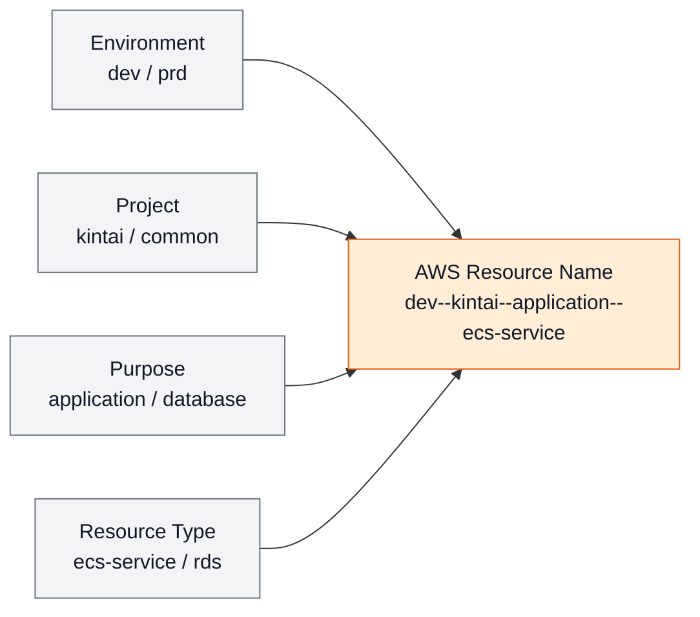
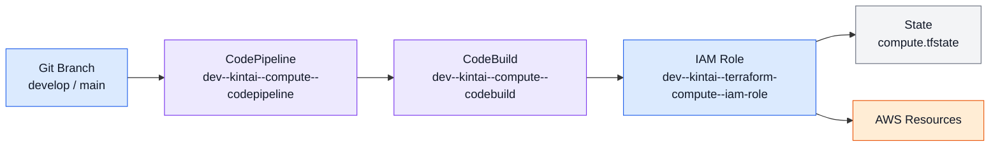
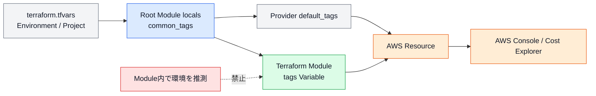
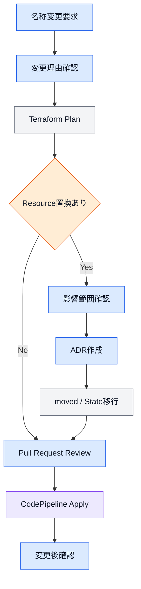
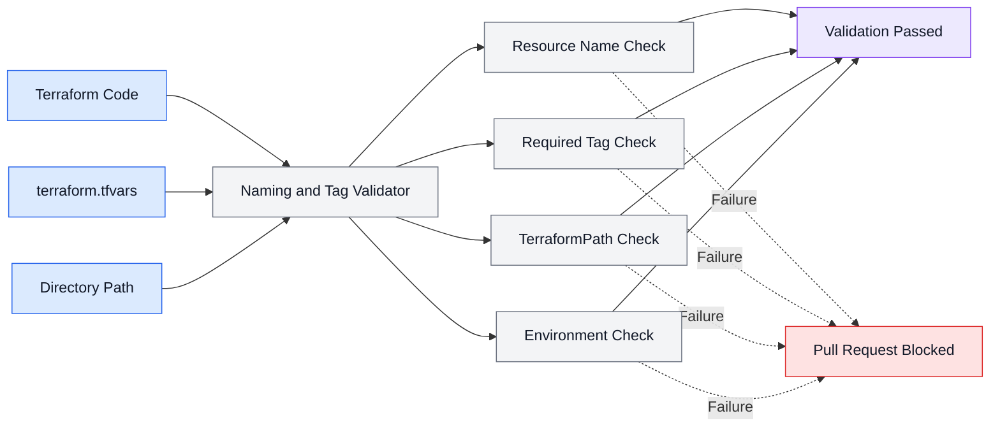
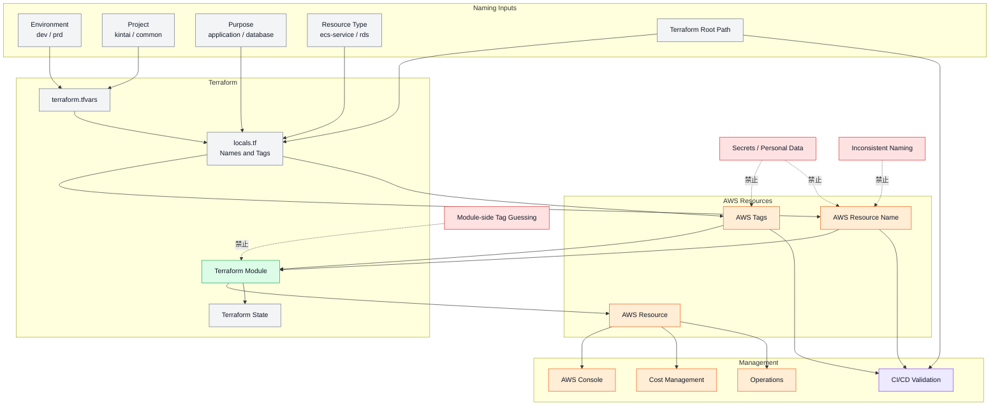

# 第7章 命名・タグ設計

## 7.1 本章の目的

本章では、Terraform Framework Standard v1.0で採用する以下の命名規則およびタグ設計を定義する。

* AWSリソース名
* Terraform識別子
* ディレクトリ名
* ファイル名
* Terraform State名
* S3 Object Key
* Backendリソース名
* CI/CDリソース名
* IAM RoleおよびIAM Policy名
* CloudWatch関連リソース名
* AWSタグ

命名規則とタグを統一する目的は、以下のとおりである。

* リソース名から環境・プロダクト・用途を判断できるようにする
* AWSコンソール上で対象リソースを検索しやすくする
* 誤った環境やプロダクトへの操作を防止する
* TerraformコードとAWSリソースの対応関係を明確にする
* コスト集計および運用管理を容易にする
* CI/CDやPythonによる自動生成を容易にする
* 複数プロダクト間で一貫性を維持する
* リソースの所有者と管理元を判断できるようにする

本章の規則は、Terraformで管理するすべてのAWSリソース、Root Module、Module、StateおよびCI/CDへ適用する。

---

## 7.2 基本方針

命名およびタグ設計では、以下の方針を採用する。

* AWSリソース名から環境、プロジェクト、用途およびリソース種別を判断できるようにする。
* AWSリソース名は原則として小文字を使用する。
* AWSリソース名の主要要素は`--`で区切る。
* 要素内の複合語は`-`で区切る。
* Terraform識別子には`snake_case`を使用する。
* ディレクトリ名およびファイル名には`snake_case`を使用する。
* タグKeyにはPascalCaseを使用する。
* 環境名は`dev`および`prd`へ統一する。
* プロジェクト名は短く、意味が明確な名称とする。
* AWSサービス固有の命名制約を優先する。
* 名前へ機密情報や個人情報を含めない。
* Resource ID、AWSアカウントIDおよびリージョンを無条件に名前へ含めない。
* Resource名の変更は、再作成やState変更の可能性を確認してから実施する。
* タグはRoot Moduleで生成し、Moduleへ渡す。
* Module内で環境名やプロジェクト名を推測しない。

---

## 7.3 命名対象と表記方法

命名対象ごとの表記方法を以下に示す。

| 対象                  | 表記方法         | 例                                             |
| ------------------- | ------------ | --------------------------------------------- |
| AWSリソース名            | 小文字・ハイフン     | `dev--kintai--application--ecs-cluster`       |
| Terraform Resource名 | `snake_case` | `application`                                 |
| Terraform Module名   | `snake_case` | `ecs_service_application`                     |
| Variable名           | `snake_case` | `private_subnet_ids`                          |
| Output名             | `snake_case` | `cluster_arn`                                 |
| Local名              | `snake_case` | `common_tags`                                 |
| ディレクトリ名             | `snake_case` | `batch_start_stop`                            |
| Terraformファイル名      | `snake_case` | `remote_state.tf`                             |
| Stateファイル名          | `snake_case` | `batch_start_stop.tfstate`                    |
| Tag Key             | PascalCase   | `Environment`                                 |
| Tag Value           | 値の種類に応じる     | `dev`、`kintai`                                |
| S3 Object Key       | `/`区切り       | `products/kintai/dev/compute/compute.tfstate` |
| Gitブランチ名            | 小文字          | `develop`、`main`                              |

---

## 7.4 AWSリソース名の基本形式

AWSリソース名は、原則として以下の形式とする。

```text
<environment>--<project>--<purpose>--<resource_type>
```

例：

```text
dev--kintai--application--ecs-cluster
dev--kintai--application--ecs-service
dev--kintai--database--rds
prd--kintai--notification--sns-topic
```

各要素の意味は以下のとおりである。

| 要素              | 内容                 | 例                        |
| --------------- | ------------------ | ------------------------ |
| `environment`   | 対象環境               | `dev`、`prd`              |
| `project`       | プロジェクトまたは共通区分      | `kintai`、`common`        |
| `purpose`       | リソースの用途・機能・コンポーネント | `application`、`database` |
| `resource_type` | AWSリソース種別          | `ecs-service`、`rds`      |

---

## 7.5 命名構造図



---

## 7.6 区切り文字

AWSリソース名では、以下の区切り文字を使用する。

### 主要要素

環境、プロジェクト、用途およびリソース種別の区切りには`--`を使用する。

```text
dev--kintai--application--ecs-service
```

### 要素内の複合語

1つの要素内に複数の単語が含まれる場合は、`-`を使用する。

```text
batch-start-stop
task-execution
private-subnet
```

例：

```text
dev--common--batch-start-stop--lambda
dev--kintai--task-execution--iam-role
```

### AWSサービス固有の例外

AWSサービスが連続したハイフンを許可しない場合は、主要要素の区切りを単一ハイフンへ変換する。

例：

```text
dev-kintai-database-rds
```

AWSサービス固有の制約は、本標準の一般的な区切り規則より優先する。

例外を使用する場合でも、要素の順序は変更しない。

---

## 7.7 環境名

環境名は以下へ統一する。

| 環境   | 識別子   |
| ---- | ----- |
| 開発環境 | `dev` |
| 本番環境 | `prd` |

以下の表記は使用しない。

```text
development
develop
production
prod
DEV
PRD
```

ディレクトリ名、AWSリソース名、タグ、StateおよびCI/CDで同じ環境識別子を使用する。

追加環境を作成する場合は、環境識別子を標準書へ追加する。

---

## 7.8 プロジェクト名

プロジェクト名は、以下の条件を満たす名称とする。

* 小文字を使用する
* プロダクトを識別できる
* 短く理解しやすい
* 将来も変更しにくい名称とする
* 組織名や一時的なチーム名へ依存しない
* スペースを使用しない
* 日本語を使用しない
* バージョン番号を含めない

例：

```text
kintai
portfolio
accounting
reservation
```

避ける例：

```text
new-project
test-project
kintai-v2
team-a-app
sample
```

プロジェクト名はディレクトリ、Backend、AWSリソース名およびタグで共通利用する。

---

## 7.9 Commonのプロジェクト名

Common配下で作成する共通機能では、プロジェクト名として`common`を使用する。

```text
dev--common--batch-start-stop--lambda
dev--common--budget-alert--sns-topic
prd--common--log-export--s3
```

特定プロダクト専用の機能へ`common`を使用してはならない。

Commonへ配置するかどうかは、第5章の判断基準に従う。

---

## 7.10 Purpose

Purposeは、リソースの用途またはコンポーネントを表す。

良い例：

```text
application
batch
database
monitoring
notification
frontend
backend
task-execution
batch-start-stop
budget-alert
```

避ける例：

```text
main
default
resource
service
test
new
temp
```

Purposeだけで、リソースが何に利用されているかを判断できる名称とする。

---

## 7.11 Resource Type

Resource Typeは、AWSリソースの種類を表す。

標準的なResource Typeを以下に示す。

| AWSリソース                   | Resource Type      |
| ------------------------- | ------------------ |
| VPC                       | `vpc`              |
| Subnet                    | `subnet`           |
| Route Table               | `route-table`      |
| Internet Gateway          | `igw`              |
| NAT Gateway               | `nat-gateway`      |
| VPC Endpoint              | `vpc-endpoint`     |
| Security Group            | `sg`               |
| Application Load Balancer | `alb`              |
| Target Group              | `target-group`     |
| Listener                  | `listener`         |
| ECS Cluster               | `ecs-cluster`      |
| ECS Service               | `ecs-service`      |
| Task Definition           | `task-definition`  |
| ECR Repository            | `ecr`              |
| Lambda Function           | `lambda`           |
| RDS                       | `rds`              |
| DynamoDB Table            | `dynamodb`         |
| ElastiCache               | `elasticache`      |
| S3 Bucket                 | `s3`               |
| IAM Role                  | `iam-role`         |
| IAM Policy                | `iam-policy`       |
| KMS Key Alias             | `kms`              |
| CloudWatch Log Group      | `log-group`        |
| CloudWatch Alarm          | `alarm`            |
| SNS Topic                 | `sns-topic`        |
| EventBridge Rule          | `eventbridge-rule` |
| CodeCommit Repository     | `codecommit`       |
| CodeBuild Project         | `codebuild`        |
| CodePipeline              | `codepipeline`     |

同じAWSリソースに複数の略称を使用しない。

---

## 7.12 略称

略称は、一般的かつ本標準で定義したものだけを使用する。

許可例：

```text
vpc
alb
rds
ecs
ecr
iam
kms
sns
sg
igw
```

避ける例：

```text
application-load-balancer
security-grp
identity-access-role
relational-database
```

独自略称を追加する場合は、略称一覧へ追加し、複数の意味を持たないことを確認する。

---

## 7.13 AWSリソース命名例

### Network

```text
dev--kintai--main--vpc
dev--kintai--public-a--subnet
dev--kintai--private-a--subnet
dev--kintai--public--route-table
dev--kintai--main--igw
dev--kintai--application--sg
dev--kintai--application--alb
dev--kintai--application--target-group
```

### Compute

```text
dev--kintai--application--ecs-cluster
dev--kintai--application--ecs-service
dev--kintai--application--task-definition
dev--kintai--application--ecr
dev--kintai--batch--lambda
```

### Database

```text
dev-kintai-database-rds
dev--kintai--session--dynamodb
dev--kintai--cache--elasticache
```

### Monitoring・Notification

```text
dev--kintai--ecs-cpu-high--alarm
dev--kintai--application-error--alarm
dev--kintai--operation--sns-topic
dev--kintai--batch-start--eventbridge-rule
```

### IAM

```text
dev--kintai--ecs-task--iam-role
dev--kintai--ecs-task-execution--iam-role
dev--kintai--terraform-compute--iam-role
dev--kintai--ecs-task--iam-policy
```

---

## 7.14 Availability Zoneを含む名称

Subnetなど、Availability Zoneごとに作成するリソースには、PurposeへAZ識別子を含める。

```text
public-a
public-c
private-a
private-c
database-a
database-c
```

例：

```text
dev--kintai--public-a--subnet
dev--kintai--private-c--subnet
dev--kintai--database-a--subnet
```

AZ名そのものを含める方法も使用できるが、プロジェクト内で表記を統一する。

```text
ap-northeast-1a
ap-northeast-1c
```

短縮表記と完全なAZ名を同一プロジェクト内で混在させない。

---

## 7.15 連番

同じ用途のリソースを複数作成する場合でも、可能な限り連番ではなく役割を名称へ含める。

推奨：

```text
public-a
public-c
private-a
private-c
```

避ける例：

```text
subnet-01
subnet-02
subnet-03
subnet-04
```

役割で区別できない場合のみ、ゼロ埋めした連番を使用する。

```text
worker-01
worker-02
```

連番の桁数は同一リソース群で統一する。

---

## 7.16 S3 Bucket名

S3 Bucket名は、基本命名規則を適用しつつ、グローバルで一意になるようにする。

基本形式：

```text
<environment>--<project>--<purpose>--s3
```

例：

```text
dev--kintai--application-data--s3
prd--kintai--log-archive--s3
```

同名が既に使用されている場合は、一意な識別子を末尾へ追加する。

```text
dev--kintai--application-data--s3--a1b2
```

一意性確保の識別子には、以下を使用できる。

* 短い固定識別子
* AWSアカウントIDの一部
* 組織内で定義した識別子

完全なAWSアカウントIDを無条件に含める必要はない。

---

## 7.17 Backend用S3 Bucket名

Terraform State保存用S3 Bucketは、第3章で定義した以下の形式を使用する。

```text
<environment>--<project>--terraform-state--s3
```

例：

```text
dev--kintai--terraform-state--s3
prd--kintai--terraform-state--s3
dev--common--terraform-state--s3
prd--common--terraform-state--s3
```

Backend用Bucketは、通常のAWSリソース名よりも第3章の命名規則を優先する。

---

## 7.18 DynamoDB Table名

通常のDynamoDB Tableは以下の形式とする。

```text
<environment>--<project>--<purpose>--dynamodb
```

例：

```text
dev--kintai--attendance--dynamodb
prd--kintai--session--dynamodb
```

Terraform State Lock用DynamoDB Tableは以下の形式とする。

```text
<environment>--<project>--terraform-lock--dynamodb
```

例：

```text
dev--kintai--terraform-lock--dynamodb
prd--common--terraform-lock--dynamodb
```

---

## 7.19 IAM Role名

IAM Role名は、以下の形式とする。

```text
<environment>--<project>--<purpose>--iam-role
```

例：

```text
dev--kintai--ecs-task--iam-role
dev--kintai--ecs-task-execution--iam-role
dev--kintai--codebuild-compute--iam-role
prd--kintai--terraform-database--iam-role
```

Terraform実行Roleは、対象責務をPurposeへ含める。

```text
dev--kintai--terraform-network--iam-role
dev--kintai--terraform-security--iam-role
dev--kintai--terraform-compute--iam-role
dev--kintai--terraform-database--iam-role
```

`ManagerRole`のような広範囲な共通Roleは標準構成として作成しない。

---

## 7.20 IAM Policy名

IAM Policy名は、以下の形式とする。

```text
<environment>--<project>--<purpose>--iam-policy
```

例：

```text
dev--kintai--ecs-task--iam-policy
dev--kintai--terraform-compute--iam-policy
prd--kintai--database-backup--iam-policy
```

RoleとPolicyでPurposeを対応させる。

```text
dev--kintai--ecs-task--iam-role
dev--kintai--ecs-task--iam-policy
```

Policy名に`full-access`、`admin`などの広範な権限を示す名称を安易に使用しない。

---

## 7.21 Permission Boundary名

Permission Boundaryは以下の形式とする。

```text
<environment>--<project>--<purpose>--permission-boundary
```

例：

```text
dev--kintai--terraform--permission-boundary
prd--kintai--terraform--permission-boundary
```

責務ごとに異なるBoundaryが必要な場合は、Purposeへ責務名を含める。

```text
prd--kintai--terraform-security--permission-boundary
```

---

## 7.22 ECS関連

### ECS Cluster

```text
<environment>--<project>--<purpose>--ecs-cluster
```

例：

```text
dev--kintai--application--ecs-cluster
```

### ECS Service

```text
<environment>--<project>--<purpose>--ecs-service
```

例：

```text
dev--kintai--frontend--ecs-service
dev--kintai--backend--ecs-service
```

### Task Definition

```text
<environment>--<project>--<purpose>--task-definition
```

例：

```text
dev--kintai--application--task-definition
```

### Container Name

Container名には環境名を含めず、Task Definition内の役割を表す名称とする。

```text
application
nginx
batch
migration
```

Task Definitionが環境ごとに分離されているため、Container名への環境名の追加は不要とする。

---

## 7.23 ECR Repository名

ECR Repository名は、以下の形式とする。

```text
<environment>/<project>/<purpose>
```

例：

```text
dev/kintai/application
prd/kintai/application
dev/kintai/batch
```

ECRで階層形式を使用しない場合は、AWSリソースの基本命名規則を使用する。

```text
dev--kintai--application--ecr
```

同一プロジェクト内で表記を統一する。

---

## 7.24 CloudWatch Log Group名

CloudWatch Log Groupは、AWSサービスと用途が判断できる形式とする。

ECSの例：

```text
/ecs/<environment>/<project>/<purpose>
```

例：

```text
/ecs/dev/kintai/application
/ecs/prd/kintai/batch
```

Lambdaの例：

```text
/aws/lambda/<function_name>
```

カスタムログの例：

```text
/<service>/<environment>/<project>/<purpose>
```

例：

```text
/application/dev/kintai/audit
```

Log Group名では、AWSサービスの一般的なPath形式を優先する。

---

## 7.25 CloudWatch Alarm名

CloudWatch Alarm名は、以下の形式とする。

```text
<environment>--<project>--<target>--<condition>--alarm
```

例：

```text
dev--kintai--ecs-service--cpu-high--alarm
prd--kintai--rds--free-storage-low--alarm
prd--kintai--alb--target-unhealthy--alarm
```

Alarm名には、以下を含める。

* 対象環境
* 対象プロジェクト
* 監視対象
* 検知条件
* Alarm種別

曖昧な名称を使用しない。

```text
high-cpu
error-alarm
alarm-01
```

---

## 7.26 SNS Topic名

SNS Topic名は、以下の形式とする。

```text
<environment>--<project>--<purpose>--sns-topic
```

例：

```text
dev--kintai--operation--sns-topic
prd--kintai--critical-alert--sns-topic
dev--common--budget-alert--sns-topic
```

Topic名は通知先ではなく、通知の目的を表す。

避ける例：

```text
email-topic
slack-topic
```

通知先が変更されても名称を変更する必要がないようにする。

---

## 7.27 EventBridge関連

EventBridge Ruleは以下の形式とする。

```text
<environment>--<project>--<purpose>--eventbridge-rule
```

例：

```text
dev--common--batch-start--eventbridge-rule
dev--common--batch-stop--eventbridge-rule
```

EventBridge Schedule Groupを使用する場合は、以下の形式とする。

```text
<environment>--<project>--<purpose>--schedule-group
```

Schedule名には、実行内容を含める。

```text
dev--common--ecs-start--schedule
dev--common--ecs-stop--schedule
```

---

## 7.28 Lambda Function名

Lambda Function名は、以下の形式とする。

```text
<environment>--<project>--<purpose>--lambda
```

例：

```text
dev--common--batch-start-stop--lambda
prd--kintai--report-export--lambda
```

Lambda Function名に、実装言語やRuntimeを含めない。

避ける例：

```text
dev--kintai--python-report--lambda
```

Runtimeが変更されても、機能名は維持する。

---

## 7.29 CodeCommit Repository名

CodeCommit Repository名は、プロジェクト名とリポジトリ種別が分かる名称とする。

例：

```text
kintai-infra
kintai-application
terraform-framework
```

環境ごとにRepositoryを分離せず、ブランチとディレクトリで環境を分離する。

```text
develop
main
```

Repository名へ`dev`または`prd`を含めるのは、環境ごとに完全分離する明確な要件がある場合のみとする。

---

## 7.30 CodeBuild Project名

CodeBuild Project名は、以下の形式とする。

```text
<environment>--<project>--<responsibility>--codebuild
```

例：

```text
dev--kintai--network--codebuild
dev--kintai--compute--codebuild
prd--kintai--database--codebuild
```

PlanとApplyを別Projectへ分ける場合は、処理種別を含める。

```text
dev--kintai--compute-plan--codebuild
dev--kintai--compute-apply--codebuild
```

---

## 7.31 CodePipeline名

CodePipeline名は、以下の形式とする。

```text
<environment>--<project>--<responsibility>--codepipeline
```

例：

```text
dev--kintai--network--codepipeline
dev--kintai--compute--codepipeline
prd--kintai--database--codepipeline
```

複数責務を1つのPipelineで処理する場合は、対象範囲が分かるPurposeを使用する。

```text
dev--kintai--product-infrastructure--codepipeline
```

ただし、責務単位の実行境界が不明確になる構成は避ける。

---

## 7.32 CI/CD命名構成図



---

## 7.33 Terraform State名

Productsでは、責務名をStateファイル名へ使用する。

```text
network.tfstate
security.tfstate
compute.tfstate
database.tfstate
monitoring.tfstate
notification.tfstate
dns.tfstate
```

Commonでは、機能名をStateファイル名へ使用する。

```text
batch_start_stop.tfstate
budget_alert.tfstate
backup.tfstate
log_export.tfstate
```

State名には環境名やプロジェクト名を重複して含めない。

環境とプロジェクトはS3 Bucket名およびObject Keyで判別する。

---

## 7.34 S3 Object Key

StateのS3 Object Keyは、Terraformディレクトリ構成と一致させる。

Products：

```text
products/<project>/<environment>/<responsibility>/<responsibility>.tfstate
```

例：

```text
products/kintai/dev/compute/compute.tfstate
products/kintai/prd/database/database.tfstate
```

Common：

```text
common/<environment>/<function>/<function>.tfstate
```

例：

```text
common/dev/batch_start_stop/batch_start_stop.tfstate
common/prd/budget_alert/budget_alert.tfstate
```

---

## 7.35 Terraform識別子

Terraform識別子には`snake_case`を使用する。

対象：

* Resource名
* Data Source名
* Module Block名
* Variable名
* Output名
* Local名
* Provider Alias
* `for_each` Key

例：

```hcl
resource "aws_ecs_cluster" "this" {
}
```

```hcl
module "ecs_service_application" {
}
```

```hcl
variable "private_subnet_ids" {
}
```

```hcl
output "cluster_arn" {
}
```

---

## 7.36 Terraform Resource名

Module内で単一Resourceを作成する場合は、`this`を使用する。

```hcl
resource "aws_ecs_cluster" "this" {
}
```

同一種類のResourceを複数作成する場合は、用途名を使用する。

```hcl
resource "aws_lb_listener" "http" {
}

resource "aws_lb_listener" "https" {
}
```

`main`、`default`および`resource`などの曖昧な名称を使用しない。

---

## 7.37 Terraform Module Block名

Module Block名は以下の形式を標準とする。

```text
<aws_service>_<responsibility>_<purpose>
```

例：

```hcl
module "ecs_cluster_application" {
}
```

```hcl
module "iam_role_ecs_task_execution" {
}
```

```hcl
module "cloudwatch_alarm_ecs_cpu_high" {
}
```

Purposeが不要な場合は省略できる。

```hcl
module "rds_subnet_group" {
}
```

---

## 7.38 Variable名

Variable名は、値の用途と内容が判断できる名称とする。

良い例：

```text
ecs_cluster_name
private_subnet_ids
retention_in_days
enable_container_insights
terraform_execution_role_arn
```

避ける例：

```text
name
value
setting
config
data
flag
```

Boolean値には以下の接頭辞を使用する。

```text
enable_
create_
allow_
use_
is_
```

---

## 7.39 Output名

Output名は、公開する値の内容を表す。

良い例：

```text
vpc_id
private_subnet_ids
ecs_cluster_arn
ecs_service_name
database_endpoint
```

避ける例：

```text
result
value
output
resource
information
```

複数の値を返す場合は複数形を使用する。

```text
subnet_ids
security_group_ids
repository_urls
```

---

## 7.40 ディレクトリ名

ディレクトリ名には`snake_case`を使用する。

例：

```text
batch_start_stop/
task_definition/
security_group/
parameter_group/
```

以下は使用しない。

```text
batch-start-stop/
TaskDefinition/
securityGroup/
```

AWSサービス名は、一般的な小文字表記を使用する。

```text
ecs/
iam/
rds/
cloudwatch/
eventbridge/
```

---

## 7.41 Terraformファイル名

Terraformファイル名には`snake_case`を使用する。

標準ファイル：

```text
main.tf
variables.tf
outputs.tf
locals.tf
versions.tf
provider.tf
data.tf
remote_state.tf
```

責務分割する場合：

```text
ecs_cluster.tf
ecs_service.tf
task_definition.tf
log_group.tf
```

曖昧な名称を使用しない。

```text
resource1.tf
setting.tf
config2.tf
new.tf
test.tf
```

---

## 7.42 Gitブランチ名

標準ブランチは以下とする。

| ブランチ      | 用途    |
| --------- | ----- |
| `develop` | dev環境 |
| `main`    | prd環境 |

作業ブランチは、以下の形式を推奨する。

```text
<type>/<ticket-or-purpose>
```

例：

```text
feature/add-ecs-service
fix/security-group-rule
refactor/split-compute-state
docs/update-naming-standard
```

Type例：

```text
feature
fix
refactor
docs
chore
hotfix
```

ブランチ名へ個人名や機密情報を含めない。

---

## 7.43 Tag設計の目的

AWSタグは、AWSリソースの検索、運用、コスト管理および所有者識別に使用する。

タグによって以下を判断できる状態とする。

* 対象環境
* 対象プロジェクト
* リソースの用途
* Terraform管理対象か
* Terraformコード上の管理場所
* 所有者または管理主体
* コスト集計単位
* リソースの重要度
* データ保護区分

すべてのタグ対応Resourceへ、標準タグを付与する。

---

## 7.44 必須タグ

標準必須タグを以下に示す。

| Tag Key         | 必須          | 内容                | 例                                       |
| --------------- | ----------- | ----------------- | --------------------------------------- |
| `Name`          | Resourceによる | AWSコンソール表示名       | `dev--kintai--application--ecs-cluster` |
| `Environment`   | 必須          | 対象環境              | `dev`                                   |
| `Project`       | 必須          | プロジェクト名           | `kintai`                                |
| `Component`     | 必須          | 責務または機能           | `compute`                               |
| `ManagedBy`     | 必須          | 管理方法              | `Terraform`                             |
| `TerraformPath` | 必須          | Terraformコードの管理場所 | `products/kintai/dev/compute`           |

タグをサポートしないAWSリソースには適用しない。

---

## 7.45 任意タグ

必要に応じて以下のタグを追加できる。

| Tag Key              | 内容           | 例                |
| -------------------- | ------------ | ---------------- |
| `Owner`              | 管理担当者またはチーム  | `platform`       |
| `CostCenter`         | コスト集計単位      | `development`    |
| `Service`            | サービスまたはシステム名 | `attendance`     |
| `Criticality`        | 重要度          | `high`           |
| `DataClassification` | データ区分        | `internal`       |
| `Backup`             | バックアップ要否     | `required`       |
| `Schedule`           | 起動停止対象       | `business-hours` |
| `Repository`         | 管理Repository | `kintai-infra`   |

任意タグを追加する場合は、プロジェクト内で意味と値を統一する。

---

## 7.46 Tag Key

Tag KeyにはPascalCaseを使用する。

良い例：

```text
Environment
Project
ManagedBy
TerraformPath
CostCenter
DataClassification
```

避ける例：

```text
environment
project_name
managed-by
terraformpath
cost_center
```

同じ意味を持つ複数のTag Keyを作成しない。

禁止例：

```text
Project
ProjectName
Application
System
```

プロジェクト識別には`Project`を使用する。

---

## 7.47 Tag Value

Tag Valueは、タグの種類に応じて表記を統一する。

### Environment

```text
dev
prd
```

### Project

```text
kintai
common
```

### ManagedBy

```text
Terraform
```

### Component

```text
network
security
compute
database
monitoring
notification
dns
```

### Boolean相当

```text
true
false
```

`yes`、`no`、`required`などを混在させない。

---

## 7.48 TerraformPath

`TerraformPath`には、対象Resourceを管理するRoot ModuleのPathを設定する。

Productsの例：

```text
products/kintai/dev/compute
products/kintai/prd/database
```

Commonの例：

```text
common/dev/batch_start_stop
common/prd/budget_alert
```

ModuleのPathは設定しない。

避ける例：

```text
modules/ecs/service
```

実際のStateとApply単位を判断できるRoot Module Pathを使用する。

---

## 7.49 Component

`Component`には、Productsでは責務名、Commonでは機能名を設定する。

Products：

```text
network
security
compute
database
monitoring
notification
dns
```

Common：

```text
batch_start_stop
budget_alert
backup
log_export
```

AWSサービス名だけを設定しない。

避ける例：

```text
ecs
rds
lambda
```

同じComponent配下で複数のAWSサービスを管理できるため、責務または機能名を使用する。

---

## 7.50 Nameタグ

NameタグをサポートするResourceには、原則としてAWSリソース名と同じ値を設定する。

例：

```hcl
resource "aws_ecs_cluster" "this" {
  name = var.cluster_name

  tags = merge(
    var.tags,
    {
      Name = var.cluster_name
    }
  )
}
```

AWS Resource自体にName属性が存在しない場合でも、NameタグでAWSコンソール上の識別性を向上できる場合は設定する。

ただし、Module側で重複してNameタグを生成するか、Root Module側で渡すかはResource単位で統一する。

---

## 7.51 タグの生成場所

必須タグは、Root Moduleの`locals.tf`で生成する。

```hcl
locals {
  common_tags = {
    Environment   = var.environment
    Project       = var.project_name
    Component     = "compute"
    ManagedBy     = "Terraform"
    TerraformPath = "products/kintai/dev/compute"
  }
}
```

Moduleへ渡す。

```hcl
module "ecs_cluster_application" {
  source = "../../../../../modules/ecs/cluster"

  cluster_name = var.ecs_cluster_name
  tags         = local.common_tags
}
```

Moduleは受け取ったタグをAWS Resourceへ設定する。

---

## 7.52 Provider Default Tags

Root ModuleのAWS Providerでは、`default_tags`を使用できる。

```hcl
provider "aws" {
  region = var.aws_region

  default_tags {
    tags = local.common_tags
  }
}
```

`default_tags`を使用する場合でも、以下を確認する。

* 対象ResourceがDefault Tagsに対応している
* Resource固有タグが正しく追加される
* 必須タグが意図せず上書きされない
* NameタグはResource単位で設定される
* Tag差分が過剰に発生しない

Module側でも`tags`を受け取れる構成を維持する。

---

## 7.53 タグ伝播構成図



---

## 7.54 タグの結合

Root Moduleで追加タグと必須タグを結合する場合は、`merge`を使用する。

```hcl
locals {
  common_tags = merge(
    var.additional_tags,
    {
      Environment   = var.environment
      Project       = var.project_name
      Component     = "compute"
      ManagedBy     = "Terraform"
      TerraformPath = "products/kintai/dev/compute"
    }
  )
}
```

必須タグを後に指定し、追加タグから必須タグを上書きできないようにする。

Module内でResource固有タグを追加する場合も、必須タグを削除しない。

---

## 7.55 タグの上書き

以下の必須タグは、プロジェクト固有設定から上書きしてはならない。

```text
Environment
Project
Component
ManagedBy
TerraformPath
```

追加タグに同じKeyが含まれている場合は、必須タグを優先する。

NameタグはResource固有の名称を設定するため、ResourceまたはModule側で追加できる。

---

## 7.56 タグ非対応Resource

すべてのAWSリソースがタグに対応しているとは限らない。

タグ非対応Resourceでは、以下で管理元を識別する。

* 親Resourceのタグ
* AWSリソース名
* Terraform State
* TerraformPath
* Root Module README
* 構成図

タグ非対応であることを理由に、命名規則まで省略してはならない。

---

## 7.57 コスト管理タグ

AWSコスト管理に使用するタグは、組織またはプロジェクト内で統一する。

標準的な候補を以下に示す。

```text
Project
Environment
Component
CostCenter
```

コスト配分タグとして利用する場合は、AWS側で有効化する必要がある。

コスト分析では、最低限以下を識別できる状態とする。

* プロジェクトごとのコスト
* devとprdのコスト
* 責務ごとのコスト
* Commonリソースのコスト

---

## 7.58 セキュリティ管理タグ

必要に応じて、以下のタグを使用する。

```text
Criticality
DataClassification
Backup
```

値の例：

### Criticality

```text
low
medium
high
critical
```

### DataClassification

```text
public
internal
confidential
restricted
```

### Backup

```text
true
false
```

値を自由記述にせず、許可値を定義する。

---

## 7.59 運用タグ

起動停止や自動化の対象をタグで判断する場合は、専用タグを使用できる。

例：

```text
Schedule = business-hours
AutoStop = true
Backup = true
```

自動処理がTag Valueに依存する場合は、以下を必須とする。

* Tag KeyとValueの仕様を文書化する
* 許可値を限定する
* 大文字・小文字を統一する
* 未設定時の動作を明確にする
* 誤ったタグによる本番影響を防止する
* prdでの自動処理には追加制御を設ける

---

## 7.60 タグへ含めてはならない情報

タグには以下を含めてはならない。

* Password
* Access Key
* API Key
* Secret Token
* Private Key
* 個人情報
* メールアドレス
* 電話番号
* 顧客情報
* データベース接続情報
* 内部の機密URL
* 脆弱性情報
* 認証情報

タグは各種AWS画面、請求情報およびログへ表示される可能性があるため、機密情報を記録しない。

---

## 7.61 Name変更

AWSリソース名の変更は、Resourceによって以下のいずれかとなる。

* インプレース更新
* Resourceの置換
* 新規作成と旧Resource削除
* 名前変更不可
* State移行が必要

名称を変更する前に、Terraform Planで動作を確認する。

置換が発生する場合は、以下を確認する。

* 停止時間
* データ移行
* DNS切り替え
* 依存Resource
* IAM Policy
* Monitoring
* Backup
* Rollback
* State変更
* ADRの要否

単なる表記改善だけを理由に、重要Resourceを再作成しない。

---

## 7.62 Terraform識別子の変更

Terraform Resource名やModule Block名を変更すると、Resource Addressが変更される。

変更前：

```hcl
resource "aws_ecs_cluster" "main" {
}
```

変更後：

```hcl
resource "aws_ecs_cluster" "this" {
}
```

必要に応じて`moved`ブロックを使用する。

```hcl
moved {
  from = aws_ecs_cluster.main
  to   = aws_ecs_cluster.this
}
```

AWSリソース名を変更しない場合でも、Terraform識別子の変更にはState上の影響があるため注意する。

---

## 7.63 命名変更フロー



---

## 7.64 命名規則の例外

AWSサービス固有の制約により標準命名を使用できない場合は、以下の優先順位で調整する。

1. 要素の順序を維持する。
2. 主要要素を維持する。
3. 区切り文字を変更する。
4. Resource Typeを標準略称へ短縮する。
5. Purposeを意味が失われない範囲で短縮する。
6. 一意性識別子を追加する。

例外によって以下を削除しない。

* Environment
* Project
* Resource Type

例外の内容は、Module READMEまたはRoot Module READMEへ記載する。

---

## 7.65 名前の長さ

AWSサービスの名前長制限を超える場合は、以下の順序で短縮する。

1. Purpose内の冗長な単語を削除する。
2. 標準Resource Type略称を使用する。
3. 同じ意味の単語の重複を削除する。
4. 標準で定義した略称を使用する。

短縮前：

```text
production--attendance-management-system--application-backend--elastic-container-service
```

短縮後：

```text
prd--kintai--backend--ecs-service
```

意味が判断できないほど短縮してはならない。

避ける例：

```text
p--kt--be--ecs
```

---

## 7.66 禁止する名称

以下の名称は使用しない。

```text
main
default
test
temp
temporary
new
old
sample
example
resource
service
system
data
misc
other
```

実際の用途がこれらの単語である場合でも、より具体的なPurposeを使用する。

また、以下を含めない。

* 個人名
* 担当者名
* 開発者のイニシャル
* チケット番号だけの名称
* 作成日
* バージョン番号
* 顧客の機密情報
* 認証情報

---

## 7.67 一時Resource

検証用の一時Resourceも、原則としてTerraformで管理する。

一時ResourceのPurposeには、利用目的を明確に含める。

例：

```text
dev--kintai--migration-validation--ecs-service
```

`temp`や`test`だけの名称は使用しない。

一時Resourceには、以下を記録する。

* 作成目的
* 所有者
* 作成日
* 削除予定日
* 削除条件

長期間残る一時Resourceを作成しない。

---

## 7.68 命名とタグの整合性

AWSリソース名とタグは、同じ環境・プロジェクト・用途を示さなければならない。

正しい例：

```text
Resource Name:
dev--kintai--application--ecs-cluster

Tags:
Environment   = dev
Project       = kintai
Component     = compute
ManagedBy     = Terraform
TerraformPath = products/kintai/dev/compute
```

禁止例：

```text
Resource Name:
dev--kintai--application--ecs-cluster

Tags:
Environment = prd
Project     = accounting
```

CI/CDでは、可能な範囲で名前とタグの整合性を検証する。

---

## 7.69 命名・タグ検証

将来的に、PythonまたはCI/CDスクリプトで以下を検証する。

* Environmentが許可値である
* Project名が命名規則に従っている
* AWSリソース名が標準順序である
* Resource Typeが略称一覧に存在する
* Terraform識別子が`snake_case`である
* 必須タグが存在する
* 必須タグが空ではない
* Environmentタグとディレクトリが一致する
* Projectタグとディレクトリが一致する
* TerraformPathがRoot Module Pathと一致する
* ManagedByが`Terraform`である
* 機密情報がタグに含まれていない

---

## 7.70 自動検証構成図



---

## 7.71 禁止事項

命名およびタグ設計では、以下を禁止する。

### 命名形式の混在

```text
dev--kintai--application--ecs-service
prd-kintai-application-ecs-service
Prod_Kintai_Application
```

AWSサービス固有の制約がない限り、同じ形式を使用する。

### 環境名の不統一

```text
prod
production
develop
development
```

### 曖昧なPurpose

```text
main
default
test
new
temp
```

### 独自略称

標準へ定義されていない略称を無断で使用してはならない。

### 個人名

```text
keisuke-vpc
tanaka-test-role
```

### 機密情報

Resource名やタグへ機密情報を記載してはならない。

### AWSアカウントIDの無条件追加

すべてのResource名へ完全なAWSアカウントIDを含めてはならない。

### Nameタグだけの管理

Nameタグだけを設定し、EnvironmentやProjectなどの必須タグを省略してはならない。

### Module内での必須タグ推測

Module内で環境やプロジェクトを固定または推測してはならない。

### 必須タグの上書き

追加タグからEnvironment、Project、ManagedByなどを変更してはならない。

### State名の曖昧化

```text
terraform.tfstate
main.tfstate
state1.tfstate
```

### 無計画な名称変更

Planや影響確認なしでAWSリソース名やTerraform識別子を変更してはならない。

---

## 7.72 命名チェックリスト

### AWSリソース名

* [ ] Environmentが先頭にある
* [ ] Projectが2番目にある
* [ ] Purposeが用途を表している
* [ ] Resource Typeが末尾にある
* [ ] 主要要素を`--`で区切っている
* [ ] 複合語を`-`で区切っている
* [ ] 小文字を使用している
* [ ] AWSサービス固有制約を満たしている
* [ ] 機密情報を含んでいない
* [ ] 個人名を含んでいない
* [ ] 一時的な名称を使用していない

### Terraform識別子

* [ ] `snake_case`である
* [ ] 用途を表す名称である
* [ ] `main`や`default`などの曖昧な名前ではない
* [ ] Resource名に`this`を適切に使用している
* [ ] Module Block名が標準形式に従っている
* [ ] Output名が返却値を表している

### State・Backend

* [ ] State名が責務または機能名である
* [ ] S3 Object Keyがディレクトリ構成と一致している
* [ ] Backend Bucket名が第3章の規則に従っている
* [ ] DynamoDB Table名が第3章の規則に従っている
* [ ] devとprdの名前が混在していない

---

## 7.73 タグチェックリスト

### 必須タグ

* [ ] `Environment`が存在する
* [ ] `Project`が存在する
* [ ] `Component`が存在する
* [ ] `ManagedBy`が存在する
* [ ] `TerraformPath`が存在する
* [ ] 必要なResourceへ`Name`が設定されている

### 値

* [ ] Environmentが`dev`または`prd`である
* [ ] Projectがディレクトリ名と一致している
* [ ] Componentが責務または機能名である
* [ ] ManagedByが`Terraform`である
* [ ] TerraformPathがRoot Module Pathと一致している
* [ ] 空文字列がない
* [ ] 機密情報がない

### 実装

* [ ] 必須タグをRoot Moduleで生成している
* [ ] Moduleへ`tags`を渡している
* [ ] Moduleが受け取ったタグをResourceへ設定している
* [ ] 必須タグを追加タグで上書きできない
* [ ] Provider Default Tagsとの重複を確認している
* [ ] Tag非対応Resourceを把握している

---

## 7.74 全体構成図



---

## 7.75 設計原則

本章の設計原則を以下にまとめる。

* AWSリソース名から環境、プロジェクト、用途およびResource Typeを判断できるようにする。
* AWSリソース名の基本形式を`<environment>--<project>--<purpose>--<resource_type>`とする。
* 主要要素を`--`、要素内の複合語を`-`で区切る。
* AWSサービス固有の命名制約を一般規則より優先する。
* 環境名は`dev`および`prd`へ統一する。
* CommonのProject名には`common`を使用する。
* Project名は短く、安定した名称とする。
* Purposeはリソースの機能または用途を表す。
* Resource Typeは標準略称一覧を使用する。
* 個人名、一時的な名称および機密情報をResource名へ含めない。
* Terraform識別子、ディレクトリ名およびファイル名には`snake_case`を使用する。
* Tag KeyにはPascalCaseを使用する。
* 必須タグとしてEnvironment、Project、Component、ManagedByおよびTerraformPathを設定する。
* NameタグはResource名と一致させる。
* タグはRoot Moduleで生成し、Moduleへ渡す。
* Module内で環境名やプロジェクト名を推測しない。
* 必須タグを追加タグから上書きできない構成とする。
* TerraformPathにはModule PathではなくRoot Module Pathを設定する。
* ComponentにはAWSサービス名ではなく責務または共通機能名を設定する。
* タグへ機密情報および個人情報を含めない。
* State名には責務名または共通機能名を使用する。
* S3 Object KeyはTerraformディレクトリ構成と一致させる。
* Terraform実行Role、CodeBuildおよびCodePipelineの名前へ責務を含める。
* 名称変更時はTerraform Planで置換の有無を確認する。
* Terraform識別子変更時は`moved`ブロックまたはState移行を検討する。
* 命名および必須タグをCI/CDで自動検証できる構成とする。
