# 第8章 CI/CD設計

## 8.1 本章の目的

本章では、Terraform Framework Standard v1.0で採用するTerraform CI/CDの構成、実行フロー、ブランチ戦略、変更検知、Plan・Apply、承認、権限、ログおよび例外運用を定義する。

本標準では、GitHubを開発者が操作する主要なソースコード管理基盤とし、GitHub ActionsによってAWS CodeCommitへコードを同期する。

Terraformの検証、PlanおよびApplyは、AWS CodePipelineとCodeBuildで実行する。

CI/CDを標準化する目的は、以下のとおりである。

* ローカル環境からのTerraform Applyを防止する
* Terraform変更の実行経路を統一する
* Pull Requestによるレビューを必須とする
* Plan結果を確認してからApplyする
* dev環境とprd環境の実行権限を分離する
* 意図しない削除や再作成を防止する
* Terraform実行履歴を記録する
* 実行者、承認者および対象環境を追跡できるようにする
* Module変更時の影響範囲を検出する
* 最大20プロダクト程度まで拡張可能な構成とする
* 障害時の復旧方法と例外運用を明確にする

---

## 8.2 基本方針

本標準では、以下の方針を採用する。

* GitHubを開発者が操作する主要Repositoryとする。
* CodeCommitをAWS CI/CD用の同期先Repositoryとする。
* GitHub ActionsはGitHubからCodeCommitへの同期のみを担当する。
* GitHub ActionsからTerraformを実行しない。
* Terraformの検証、PlanおよびApplyはCodeBuildで実行する。
* CodePipelineはTerraformの実行順序、承認およびArtifact管理を担当する。
* `develop`ブランチをdev環境へ対応させる。
* `main`ブランチをprd環境へ対応させる。
* Terraformの正式なApplyはCodePipeline経由のみとする。
* dev環境を含め、ローカルApplyを禁止する。
* Terraform PlanをApply前に必須とする。
* Applyでは承認済みの保存済みPlanを使用する。
* Plan後にSource Revisionが変更された場合は、再Planする。
* Terraform Destroyを通常運用で禁止する。
* 削除または置換を含むPlanは自動Applyしない。
* devとprdでPipeline、CodeBuild、Backendおよび実行Roleを分離する。
* Root Module単位でPlanおよびApplyする。
* Module変更時は、そのModuleを利用するすべてのRoot ModuleでPlanする。
* CI/CDの実行履歴とログを保存する。
* CI/CD障害時の例外運用は承認および記録を必須とする。

---

## 8.3 CI/CD全体構成

Terraform CI/CDは、以下のサービスで構成する。

| サービス              | 役割                                        |
| ----------------- | ----------------------------------------- |
| GitHub            | 開発、Pull Request、レビュー、ブランチ管理               |
| GitHub Actions    | GitHubからCodeCommitへのコード同期                 |
| CodeCommit        | AWS CI/CDが参照するSource Repository           |
| CodePipeline      | Source、検証、Plan、承認、Applyの制御                |
| CodeBuild         | Terraformコマンドおよび検査ツールの実行                  |
| Amazon S3         | Pipeline ArtifactおよびPlan Artifactの保存      |
| CloudWatch Logs   | CodeBuild実行ログの保存                          |
| Amazon SNS        | Pipeline成功・失敗・承認依頼などの通知                   |
| AWS IAM           | GitHub同期、Pipeline、CodeBuild、Terraform実行権限 |
| Terraform Backend | State保存およびState Lock                      |

---

## 8.4 全体構成図

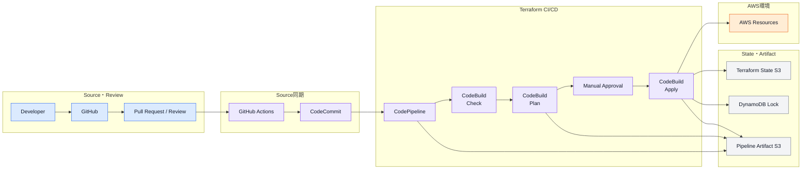

---

## 8.5 Repositoryの役割

### GitHub

GitHubでは、以下を管理する。

* Terraformコード
* Module
* Common
* Products
* GitHub Actions
* CI/CD設定
* Buildspec
* Pythonスクリプト
* Terraform Framework Standard
* ADR
* README
* 運用手順書

開発者による通常のコード変更は、GitHubで実施する。

### CodeCommit

CodeCommitは、AWS CodePipelineへSourceを提供するための同期先として使用する。

CodeCommitへ直接コードを変更してはならない。

緊急時にCodeCommitを直接変更した場合は、GitHubへ同じ変更を反映し、Sourceの整合性を回復する。

---

## 8.6 Sourceの正本

Terraformコードの正本はGitHubとする。

```text
GitHub
  ↓
GitHub Actions
  ↓
CodeCommit
```

CodeCommitはGitHubのミラーとして扱う。

以下は禁止する。

```text
CodeCommitで直接変更
  ↓
GitHubへ未反映
```

GitHubとCodeCommitの内容が異なる場合は、GitHubの内容を正として同期する。

ただし、無条件なForce Pushは使用しない。

履歴の不一致が発生した場合は、原因を確認した上で同期を修復する。

---

## 8.7 ブランチ戦略

標準ブランチを以下とする。

| ブランチ      | 対象環境 | 用途           |
| --------- | ---- | ------------ |
| `develop` | dev  | 開発環境へ反映するコード |
| `main`    | prd  | 本番環境へ反映するコード |

作業ブランチは、`develop`または`main`から作成する。

通常の開発では、以下の流れを使用する。

```text
feature branch
  ↓
Pull Request
  ↓
develop
  ↓
dev環境へ反映
  ↓
developからmainへのPull Request
  ↓
main
  ↓
prd環境へ反映
```

---

## 8.8 ブランチフロー構成図

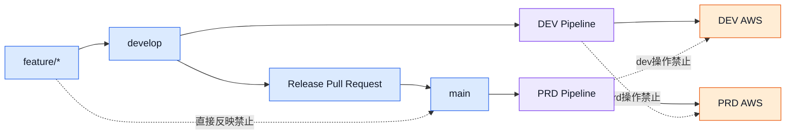

---

## 8.9 Branch Protection

`develop`および`main`にはBranch Protectionを設定する。

最低限、以下を設定する。

* 直接Pushを禁止する
* Pull Request経由の変更を必須とする
* Pull Request Reviewを必須とする
* Force Pushを禁止する
* Branch削除を禁止する
* Conversationの解決を必須とする
* Merge前に競合を解消する
* `main`への変更は`develop`での確認後に実施する

開発者が1名の場合でも、Pull Requestを作成して変更内容とPlan結果を記録する。

---

## 8.10 Pull Request

Terraform変更のPull Requestには、最低限以下を記載する。

* 変更概要
* 変更理由
* 対象環境
* 対象プロダクト
* 対象Root Module
* 影響するState
* 利用Module
* Plan結果
* 作成・更新・削除・置換の件数
* IAM権限変更の有無
* Security Group変更の有無
* データ保持Resourceへの影響
* State変更の有無
* ADRの有無
* Rollback方針
* 確認事項

Planをまだ実行できない場合は、その理由と実行予定のPipelineを記載する。

---

## 8.11 Pull Requestチェックリスト

```md
## Terraform Change

- [ ] 対象環境を確認した
- [ ] 対象Root Moduleを確認した
- [ ] terraform fmtを実行した
- [ ] terraform validateが成功した
- [ ] Trivyの結果を確認した
- [ ] Terraform Planを確認した
- [ ] 意図しない削除がない
- [ ] 意図しないReplacementがない
- [ ] IAM権限の拡大がない
- [ ] State変更の有無を確認した
- [ ] READMEを更新した
- [ ] ADRの要否を確認した
```

---

## 8.12 GitHub Actionsの責務

GitHub Actionsは、GitHubからCodeCommitへの同期のみを担当する。

GitHub Actionsでは、以下を実行しない。

* `terraform init`
* `terraform validate`
* `terraform plan`
* `terraform apply`
* `terraform destroy`
* AWSリソースの作成
* Terraform State操作
* Backend操作

Terraformに関する正式な検証と実行はCodeBuildで行う。

---

## 8.13 GitHub Actionsの実行条件

GitHub ActionsによるCodeCommit同期は、以下のブランチへのPushで実行する。

```text
develop
main
```

作業ブランチをすべてCodeCommitへ同期する必要はない。

標準では、環境へ反映するブランチだけを同期する。

```yaml
on:
  push:
    branches:
      - develop
      - main
```

---

## 8.14 GitHub Actions認証

GitHub ActionsからAWSへアクセスする場合は、原則としてOpenID Connectを使用してIAM Roleを引き受ける。

```text
GitHub Actions
  ↓ OIDC
AWS IAM Role
  ↓
CodeCommit
```

長期間有効なAWS Access KeyをGitHub Secretsへ保存する構成は、原則として採用しない。

GitHub Actions用IAM Roleには、対象CodeCommit Repositoryへの同期に必要な権限だけを付与する。

---

## 8.15 GitHub Actions認証構成図

```mermaid
flowchart LR

    GITHUB["GitHub Actions"]
    OIDC["GitHub OIDC Provider"]
    SYNC_ROLE["CodeCommit Sync IAM Role"]
    CODECOMMIT["CodeCommit"]

    ACCESS_KEY["Long-lived Access Key"]

    GITHUB --> OIDC
    OIDC --> SYNC_ROLE
    SYNC_ROLE --> CODECOMMIT

    ACCESS_KEY -.原則禁止.-> GITHUB

    classDef orchestration fill:#dbeafe,stroke:#2563eb,color:#111827
    classDef module fill:#dcfce7,stroke:#16a34a,color:#111827
    classDef aws fill:#ffedd5,stroke:#ea580c,color:#111827
    classDef cicd fill:#ede9fe,stroke:#7c3aed,color:#111827
    classDef prohibited fill:#fee2e2,stroke:#dc2626,color:#111827
    classDef config fill:#f3f4f6,stroke:#6b7280,color:#111827

    class GITHUB,OIDC,SYNC_ROLE cicd
    class CODECOMMIT aws
    class ACCESS_KEY prohibited
```

---

## 8.16 GitHub Actions用IAM Role

GitHub Actions用IAM Roleは、以下の形式で命名する。

```text
<project>--codecommit-sync--iam-role
```

例：

```text
kintai--codecommit-sync--iam-role
```

環境ごとにRoleを分離する場合は、環境名を含める。

```text
dev--kintai--codecommit-sync--iam-role
prd--kintai--codecommit-sync--iam-role
```

Roleには、以下を制限する。

* 対象GitHub Organization
* 対象Repository
* 対象Branch
* 対象CodeCommit Repository
* 必要なCodeCommit操作

---

## 8.17 CodeCommit同期

CodeCommit同期では、GitHubの対象ブランチを同名のCodeCommitブランチへPushする。

```text
GitHub develop
  ↓
CodeCommit develop

GitHub main
  ↓
CodeCommit main
```

通常同期ではForce Pushを使用しない。

Branch Historyを書き換えない運用を前提とする。

CodeCommitで直接Commitを作成しない。

---

## 8.18 Pipelineの分離

CodePipelineは、環境およびRoot Module単位で分離する。

例：

```text
dev--kintai--network--codepipeline
dev--kintai--security--codepipeline
dev--kintai--compute--codepipeline
dev--kintai--database--codepipeline

prd--kintai--network--codepipeline
prd--kintai--security--codepipeline
prd--kintai--compute--codepipeline
prd--kintai--database--codepipeline
```

Commonも機能単位でPipelineを作成する。

```text
dev--common--batch-start-stop--codepipeline
prd--common--budget-alert--codepipeline
```

---

## 8.19 PipelineとRoot Module

原則として、1つのPipelineが1つのRoot Moduleを担当する。

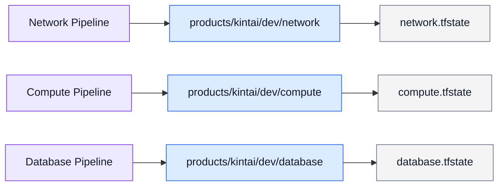

複数Root Moduleを1つのCodeBuildで順番にApplyする構成は、原則として採用しない。

---

## 8.20 Pipeline標準Stage

Terraform Pipelineは、以下のStageで構成する。

| 順序 | Stage            | 内容                            |
| -- | ---------------- | ----------------------------- |
| 1  | Source           | CodeCommitからSourceを取得         |
| 2  | Change Detection | 変更されたRoot Moduleを確認           |
| 3  | Check            | fmt、init、validate、Trivy、その他検査 |
| 4  | Plan             | Terraform Planを作成             |
| 5  | Plan Inspection  | 削除、置換、危険な変更を検査                |
| 6  | Approval         | Plan結果を確認して承認                 |
| 7  | Apply            | 保存済みPlanをApply                |
| 8  | Post Check       | Apply結果、Output、Stateを確認       |
| 9  | Notification     | 成功または失敗を通知                    |

対象Root Moduleに変更がない場合は、PlanおよびApplyを実行しない。

---

## 8.21 Pipeline Stage構成図

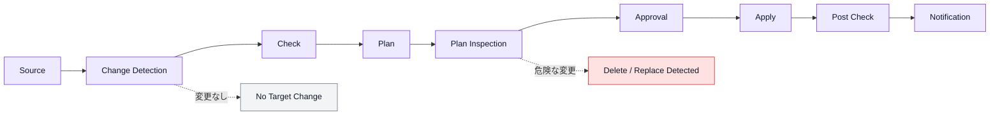

---

## 8.22 Source Stage

Source Stageでは、CodeCommitの対象ブランチからSourceを取得する。

dev Pipeline：

```text
Repository: kintai-infra
Branch: develop
```

prd Pipeline：

```text
Repository: kintai-infra
Branch: main
```

Source Artifactには、以下を含める。

* Source Revision
* Commit SHA
* Branch
* Repository
* 実行時刻
* Pipeline Execution ID

これらの情報をPlanおよびApplyの記録へ関連付ける。

---

## 8.23 変更検知

変更検知では、Source Revision間の差分から対象Root Moduleを判定する。

### Products変更

```text
products/kintai/dev/compute/main.tf
```

対象：

```text
products/kintai/dev/compute
```

### Common変更

```text
common/dev/batch_start_stop/main.tf
```

対象：

```text
common/dev/batch_start_stop
```

### Module変更

```text
modules/ecs/service/main.tf
```

対象：

```text
modules/ecs/serviceを利用するすべてのRoot Module
```

### ドキュメント変更

```text
docs/standard/08_CICD_Design.md
```

Terraform Planは不要とする。

---

## 8.24 変更検知ルール

| 変更対象                  | 実行対象                   |
| --------------------- | ---------------------- |
| Root Module           | 対象Root Module          |
| Module                | Module利用先すべて           |
| `terraform.tfvars`    | 対象環境内の影響Root Module    |
| `versions.tf`         | 対象Root Moduleまたは利用先すべて |
| `.terraform.lock.hcl` | 対象範囲のRoot Module       |
| Backend設定             | 対象Root Module          |
| CI/CD Script          | 影響するPipeline           |
| 共通テンプレート              | 生成対象すべて                |
| Documentationのみ       | Terraform実行なし          |

判定が困難な場合は、実行対象を広くする。

Plan漏れよりも、追加Planを優先する。

---

## 8.25 Module利用先の管理

Module変更時の影響範囲を正確に特定できるようにする。

利用先の検出方法は、以下のいずれかを使用する。

* `source` Pathの検索
* PythonによるHCL解析
* Module利用先Manifest
* CI/CD用の依存関係定義ファイル

例：

```yaml
modules/ecs/service:
  - products/kintai/dev/compute
  - products/kintai/prd/compute
  - products/portfolio/dev/compute
  - products/portfolio/prd/compute
```

利用先Manifestを使用する場合は、Module追加・変更時に更新する。

---

## 8.26 変更検知構成図

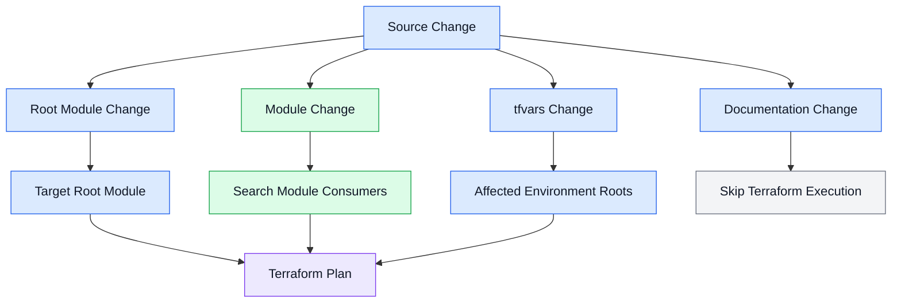

---

## 8.27 Check Stage

Check Stageでは、最低限以下を実行する。

```bash
terraform fmt -check -recursive

terraform init \
  -backend=false \
  -input=false

terraform validate

trivy config .
```

Root ModuleのBackend設定を含めて確認する場合は、正式なBackendへ接続する。

```bash
terraform init \
  -backend-config=backend.hcl \
  -input=false
```

必要に応じて以下を追加する。

* SonarQube
* TFLint
* 命名規則チェック
* 必須タグチェック
* Secret検出
* Backend設定チェック
* Provider Versionチェック
* 禁止コマンド検出
* IAM Wildcard検出

---

## 8.28 Check Stageの失敗条件

以下の場合はPipelineを停止する。

* `terraform fmt -check`失敗
* `terraform init`失敗
* `terraform validate`失敗
* Trivyで許可されていない重大な検出がある
* 命名規則違反
* 必須タグ不足
* Secret値の検出
* Backend設定不一致
* 対象環境とBranchの不一致
* 対象AWSアカウントの不一致
* Lock Fileの不整合
* 禁止されたTerraform設定の検出

失敗を無視してPlan Stageへ進めてはならない。

---

## 8.29 対象AWSアカウントの確認

Terraform PlanおよびApply前に、対象AWSアカウントを確認する。

```bash
aws sts get-caller-identity
```

以下を検証する。

* AWSアカウントID
* Assume Role ARN
* 対象環境
* AWSリージョン
* Root Module Path
* Backend Bucket
* State Key

dev Pipelineがprdアカウントを操作する場合は、即座に停止する。

prd Pipelineがdevアカウントを操作する場合も停止する。

---

## 8.30 実行前確認構成図

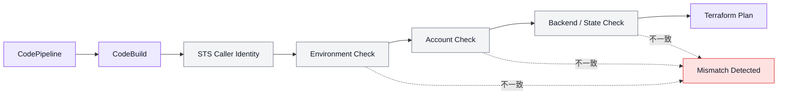

---

## 8.31 Plan Stage

Plan Stageでは、対象Root ModuleでTerraform Planを作成する。

例：

```bash
terraform init \
  -backend-config=backend.hcl \
  -input=false

terraform plan \
  -input=false \
  -lock-timeout=10m \
  -var-file=../terraform.tfvars \
  -out=tfplan
```

保存したPlanを人が確認できる形式とJSON形式へ変換する。

```bash
terraform show \
  -no-color \
  tfplan > tfplan.txt

terraform show \
  -json \
  tfplan > tfplan.json
```

---

## 8.32 Plan Artifact

Plan Stageでは、以下をArtifactとして保存する。

* `tfplan`
* `tfplan.txt`
* `tfplan.json`
* Commit SHA
* Branch
* Root Module Path
* Environment
* Project
* AWSアカウントID
* Backend Bucket
* State Key
* Terraform Version
* AWS Provider Version
* Plan実行日時
* Plan実行Role
* 作成・更新・削除・置換の件数

Artifactへのアクセスは、Pipelineおよび承認者に限定する。

Plan Artifactを公開Repositoryや外部ストレージへ保存してはならない。

---

## 8.33 保存済みPlanの利用

Apply Stageでは、Plan Stageで作成した`tfplan`を使用する。

```bash
terraform apply \
  -input=false \
  -auto-approve \
  tfplan
```

Apply Stageで再度`terraform plan`を実行し、そのままApplyしてはならない。

Planで確認した内容と実際にApplyする内容を一致させる。

---

## 8.34 PlanとApplyの整合性

Apply前に以下を確認する。

* Commit SHAがPlan時と一致する
* BranchがPlan時と一致する
* Root Module Pathが一致する
* Environmentが一致する
* AWSアカウントIDが一致する
* Backend Bucketが一致する
* State Keyが一致する
* Terraform Versionが一致する
* Provider Lock Fileが一致する
* Plan Artifactが変更されていない
* Planの有効期限を超えていない

いずれかが一致しない場合は、Applyせず再Planする。

---

## 8.35 Plan検査

`tfplan.json`を解析し、以下の変更を検出する。

* Create
* Update
* Delete
* Replace
* No-op
* Read
* IAM Policy変更
* Security Group変更
* Public Access変更
* Encryption変更
* RDS変更
* S3 Bucket変更
* KMS変更
* Route変更
* State関連変更

Planの概要を、承認者が確認できる形式で出力する。

---

## 8.36 削除・置換検出

以下のActionを危険な変更として扱う。

```text
delete
delete + create
create + delete
```

削除または置換を検出した場合は、通常のApplyフローを停止する。

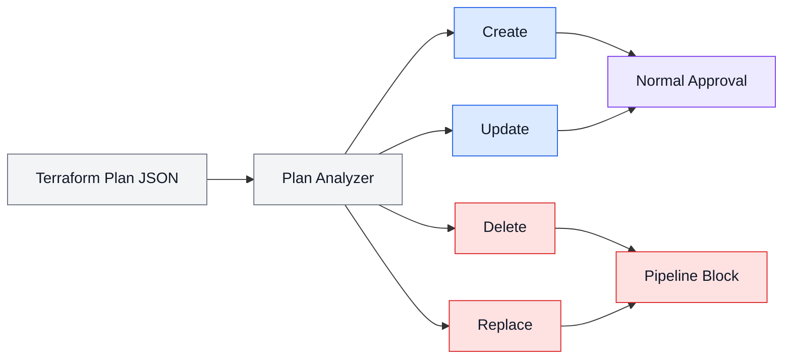

---

## 8.37 削除を伴う変更

Resource削除が必要な場合は、通常変更とは別に扱う。

最低限、以下を必須とする。

* 削除理由
* 削除対象
* 対象環境
* 対象State
* 依存Resource
* データ保管方法
* Backup確認
* 停止時間
* Rollback方法
* ADR
* 承認
* 実施日時
* 実施後確認

削除を含む変更を、通常の機能追加や設定変更と同じPull Requestへ混在させないことを推奨する。

---

## 8.38 Approval Stage

Terraform Apply前には、Plan結果を確認するApproval Stageを設ける。

承認者は、最低限以下を確認する。

* 対象環境
* 対象プロダクト
* 対象Root Module
* 対象AWSアカウント
* State Key
* Commit SHA
* Plan概要
* 作成数
* 更新数
* 削除数
* 置換数
* IAM変更
* Security Group変更
* データ保持Resource変更
* Rollback方針

承認者がPlan Artifactへアクセスできる状態とする。

---

## 8.39 dev環境の承認

dev環境でも、Apply前のPlan確認を必須とする。

1名で運用する場合は、変更者本人による承認を許容する。

ただし、以下を記録する。

* Plan結果
* 承認日時
* 承認者
* Source Revision
* 対象Root Module
* Apply結果

開発者が増加した場合は、変更者とは別の承認者による承認へ移行する。

---

## 8.40 prd環境の承認

prd環境では、Manual Approvalを必須とする。

複数人で運用する場合は、変更者とは別の承認者による承認を原則とする。

prd承認では、dev環境で同等の変更が正常に適用されていることを確認する。

以下の場合は承認しない。

* dev環境で未確認
* Plan内容が不明確
* 削除または置換の理由が不足
* Rollback方針がない
* State変更手順がない
* 対象AWSアカウントが不明
* Source RevisionがPlan時から変更された
* Trivyなどの検出が未解決

---

## 8.41 Apply Stage

Apply Stageでは、承認済みの保存済みPlanをApplyする。

```bash
terraform apply \
  -input=false \
  -auto-approve \
  tfplan
```

`-auto-approve`は、事前に保存済みPlanを承認するPipeline構成内でのみ使用する。

以下は禁止する。

```bash
terraform apply -auto-approve
```

Plan Fileを指定せず、Apply時に新しいPlanを生成して適用してはならない。

---

## 8.42 Apply前確認

Apply直前に以下を再確認する。

* Pipeline Execution ID
* Source Revision
* Approval状態
* Artifact整合性
* 対象AWSアカウント
* Terraform実行Role
* Root Module Path
* Backend Bucket
* State Key
* State Lock状態
* Planの有効性
* 削除・置換ブロック
* 緊急停止フラグ

確認に失敗した場合は、Applyを開始しない。

---

## 8.43 Apply後確認

Apply完了後は、最低限以下を確認する。

* Terraform Applyの終了コード
* Apply結果
* 作成・更新・削除数
* Terraform Output
* State Lockの解除
* Stateの保存
* CloudWatch Logs
* AWS APIエラー
* 対象Resourceの存在
* 必要なHealth Check
* 必要なAlarm状態
* Driftの有無
* Pipeline Artifact
* SNS通知

重要変更では、AWSコンソールまたはAWS CLIでも確認する。

---

## 8.44 Post Check構成図

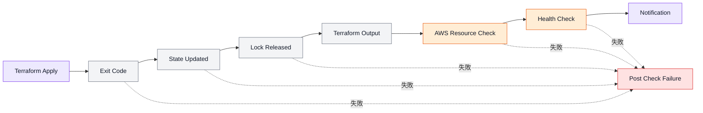

---

## 8.45 Terraform実行Role

Terraform実行Roleは、環境、プロジェクトおよび責務単位で作成する。

例：

```text
dev--kintai--terraform-network--iam-role
dev--kintai--terraform-security--iam-role
dev--kintai--terraform-compute--iam-role
dev--kintai--terraform-database--iam-role

prd--kintai--terraform-network--iam-role
prd--kintai--terraform-security--iam-role
prd--kintai--terraform-compute--iam-role
prd--kintai--terraform-database--iam-role
```

Commonも機能単位でRoleを分離する。

```text
dev--common--terraform-batch-start-stop--iam-role
```

---

## 8.46 CodeBuild Service Role

CodeBuild Service Roleは、以下の操作に限定する。

* CloudWatch Logs出力
* Pipeline Artifact取得
* Pipeline Artifact保存
* Terraform実行RoleのAssumeRole
* 必要なS3 Artifact操作
* 必要なKMS操作
* 必要な通知操作

AWSリソースを直接操作する権限は、Terraform実行Roleへ付与する。

```text
CodeBuild Service Role
  ↓ sts:AssumeRole
Terraform Execution Role
  ↓
AWS Resources
```

---

## 8.47 権限構成図

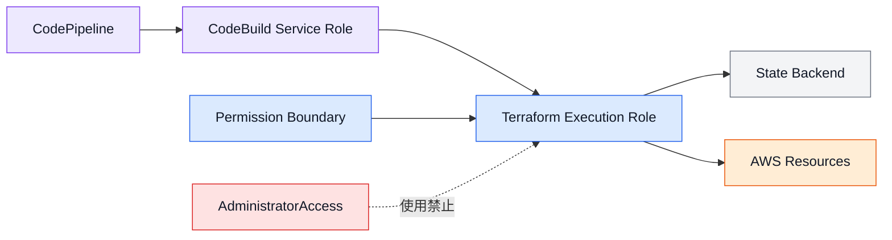

---

## 8.48 最小権限

Terraform実行Roleには、担当する責務に必要な権限だけを付与する。

例：

### Network Role

* VPC
* Subnet
* Route Table
* Internet Gateway
* NAT Gateway
* VPC Endpoint
* ALB
* Target Group
* Security Group

### Compute Role

* ECS
* ECR
* Lambda
* CloudWatch Logs
* 必要なIAM PassRole

### Database Role

* RDS
* DynamoDB
* ElastiCache
* DB Subnet Group
* Parameter Group

他責務のResourceを変更できる権限を付与しない。

---

## 8.49 IAM PassRole

Terraform実行Roleへ`iam:PassRole`を付与する場合は、対象Roleを限定する。

禁止例：

```text
Action   = iam:PassRole
Resource = *
```

許可対象は、ECS Task Role、Task Execution Role、Lambda Roleなど、担当責務で必要なRoleだけとする。

必要に応じて、Service Conditionも設定する。

---

## 8.50 Permission Boundary

Terraformが作成するIAM Roleには、Permission Boundaryを適用する。

Permission Boundaryは、Terraform実行Roleが想定以上の権限を持つIAM Roleを作成することを防止するために使用する。

Terraform実行Role自身にも、必要に応じてPermission Boundaryを適用する。

Permission Boundaryの変更は、security責務で管理する。

---

## 8.51 Artifact管理

Pipeline ArtifactおよびPlan Artifactは、専用のS3 Bucketで管理する。

最低限、以下を設定する。

* Public Access Block
* 暗号化
* HTTPS Only
* Versioningまたは適切な履歴管理
* 最小権限
* Lifecycle
* CloudTrailによる操作記録
* 環境分離
* prd Artifactへのアクセス制限

ArtifactへSecret値を含めない。

Terraform Planには機密情報が含まれる可能性があるため、アクセス権限を制限する。

---

## 8.52 Artifact保存期間

Artifactの保存期間は、運用および監査要件に応じて設定する。

最低限、以下を保存する。

* Source Revision
* Plan結果
* Plan JSON
* 承認記録
* Apply結果
* CodeBuildログ
* Pipeline実行結果

不要になった一時ArtifactはLifecycleで削除する。

StateファイルとPipeline Artifactを同じS3 Bucketで管理してはならない。

---

## 8.53 ログ管理

CodeBuildの実行ログはCloudWatch Logsへ保存する。

ログには以下を含める。

* Pipeline Execution ID
* Commit SHA
* Branch
* Environment
* Project
* Root Module Path
* AWSアカウントID
* Terraform Version
* Provider Version
* 実行コマンド
* Plan概要
* Apply結果
* Error
* 実行開始時刻
* 実行終了時刻

Secret値やSensitiveなOutputをログへ出力してはならない。

---

## 8.54 通知

Pipelineの状態をSNSなどで通知する。

通知対象を以下とする。

* Pipeline開始
* Check失敗
* Plan完了
* 削除・置換検出
* Approval待ち
* Approval拒否
* Apply開始
* Apply成功
* Apply失敗
* Post Check失敗
* State Lock異常
* 例外運用開始

通知にはSecret値やPlan全文を含めない。

承認者がPlan Artifactへアクセスするための情報を提供する。

---

## 8.55 同時実行制御

同一Stateに対する複数Pipelineの同時実行を禁止する。

制御方法は以下を組み合わせる。

* Pipeline側の同時実行制御
* DynamoDB State Lock
* Root Module単位のPipeline分離
* Apply承認中のSource Revision確認
* 実行中Pipelineの確認
* Lock Timeout

同一StateのPlan実行中に別のApplyを開始してはならない。

---

## 8.56 同時実行構成図

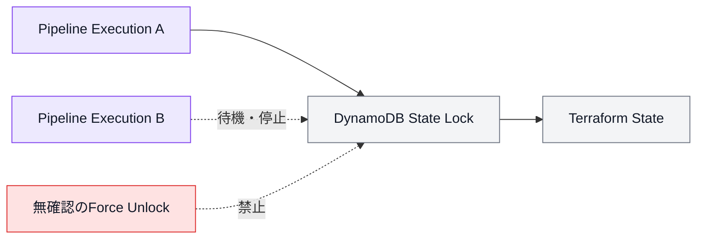

---

## 8.57 Pipeline実行中の新しい変更

Plan後またはApproval待ちの間に、新しいCommitが対象Branchへ追加された場合は、古いExecutionをそのままApplyしない。

以下を確認する。

* 古いPlanのCommit SHA
* 最新BranchのCommit SHA
* Source差分
* State変更の有無
* 他Pipelineの実行状況

Source Revisionが異なる場合は、古いExecutionを停止し、最新Revisionで再Planする。

---

## 8.58 devからprdへの昇格

prdへ反映する場合は、devで確認したTerraformコードを`main`へ昇格する。

環境間で以下は共有しない。

* Plan File
* State
* Backend
* Terraform実行Role
* Pipeline Artifact
* `terraform.tfvars`
* AWSアカウント

prd環境では、mainブランチ、prd用Backendおよびprd用変数を使用して、新しくPlanを作成する。

devのPlan Fileをprdへ適用してはならない。

---

## 8.59 環境昇格構成図

```mermaid
flowchart LR

    DEVELOP["develop"]
    DEV_PLAN["DEV Plan"]
    DEV_APPLY["DEV Apply"]
    DEV_VERIFY["DEV Verification"]

    RELEASE_PR["develop → main PR"]

    MAIN["main"]
    PRD_PLAN["PRD Plan"]
    PRD_APPROVAL["PRD Approval"]
    PRD_APPLY["PRD Apply"]

    DEVELOP --> DEV_PLAN
    DEV_PLAN --> DEV_APPLY
    DEV_APPLY --> DEV_VERIFY
    DEV_VERIFY --> RELEASE_PR
    RELEASE_PR --> MAIN
    MAIN --> PRD_PLAN
    PRD_PLAN --> PRD_APPROVAL
    PRD_APPROVAL --> PRD_APPLY

    DEV_PLAN_FILE["DEV tfplan"]
    DEV_PLAN_FILE -.prd利用禁止.-> PRD_APPLY

    classDef orchestration fill:#dbeafe,stroke:#2563eb,color:#111827
    classDef module fill:#dcfce7,stroke:#16a34a,color:#111827
    classDef aws fill:#ffedd5,stroke:#ea580c,color:#111827
    classDef cicd fill:#ede9fe,stroke:#7c3aed,color:#111827
    classDef prohibited fill:#fee2e2,stroke:#dc2626,color:#111827
    classDef config fill:#f3f4f6,stroke:#6b7280,color:#111827

    class DEVELOP,DEV_VERIFY,RELEASE_PR,MAIN orchestration
    class DEV_PLAN,DEV_APPLY,PRD_PLAN,PRD_APPROVAL,PRD_APPLY cicd
    class DEV_PLAN_FILE prohibited
```

---

## 8.60 Hotfix

緊急の本番修正では、`hotfix/*`ブランチを使用できる。

標準フロー：

```text
main
  ↓
hotfix/*
  ↓
Pull Request
  ↓
main
  ↓
PRD Pipeline
```

本番反映後は、同じ変更を`develop`へ反映する。

```text
main
  ↓
developへBack Merge
```

hotfixでも以下を省略しない。

* Pull Request
* Check
* Plan
* Approval
* Apply
* Post Check
* 実施記録

緊急性だけを理由にTerraform Planを省略してはならない。

---

## 8.61 Pipeline失敗

Pipelineが失敗した場合は、失敗したStageに応じて対応する。

| Stage            | 主な対応                                 |
| ---------------- | ------------------------------------ |
| Source           | GitHub・CodeCommit同期を確認               |
| Change Detection | Script、Path、差分を確認                    |
| Check            | Format、構文、Trivy結果を修正                 |
| Plan             | Backend、権限、State、コードを確認              |
| Approval         | Plan内容または承認期限を確認                     |
| Apply            | Partial Apply、State、AWS API Errorを確認 |
| Post Check       | Resource状態、Health Checkを確認           |
| Notification     | SNS、権限、通知先を確認                        |

原因を確認せずに再実行を繰り返してはならない。

---

## 8.62 Partial Apply

Terraform Applyが途中で失敗した場合、一部のResourceだけが変更されている可能性がある。

以下の手順で確認する。

1. CodeBuildログを確認する。
2. State Lockを確認する。
3. Stateが保存されていることを確認する。
4. AWSリソースの状態を確認する。
5. 同じSource Revisionで再度Planする。
6. 残差分を確認する。
7. 意図しない削除がないことを確認する。
8. 承認後に再Applyする。

失敗前のPlan Fileを無条件に再利用しない。

StateやAWSリソースの状況が変わっているため、再Planを実施する。

---

## 8.63 Rollback方針

Terraformでは、Apply失敗時に以前の状態へ自動的に戻す処理を標準としない。

基本方針はFix Forwardとする。

```text
障害確認
  ↓
原因特定
  ↓
Terraformコード修正
  ↓
再Plan
  ↓
承認
  ↓
再Apply
```

以前のCommitへ戻す場合も、新しいPlanを作成して影響を確認する。

Commitを戻しただけでAWSリソースが安全に元へ戻るとは限らない。

---

## 8.64 Rollback時の確認

RollbackまたはRevertでは、以下を確認する。

* Resourceの置換
* データ消失
* RDSの復元
* S3 Objectの保持
* KMS Keyの状態
* DNS切り替え
* ECS Task Definition
* IAM Policy
* State Address
* Remote State Output
* 下流Stateへの影響

データ保持Resourceは、コードのRevertだけで元に戻さない。

必要に応じて個別の復旧手順を使用する。

---

## 8.65 Drift検出

定期的または必要時に、Root Module単位でTerraform Planを実行し、Driftを確認する。

Drift検出PipelineではApplyしない。

```text
Scheduled Plan
  ↓
Drift Detection
  ↓
通知
```

Driftがない場合：

```text
No changes
```

Driftがある場合：

* 手動変更を戻す
* Terraformコードへ反映する
* 管理対象外へ変更する
* State変更を実施する

いずれかを判断する。

---

## 8.66 Drift検出構成図

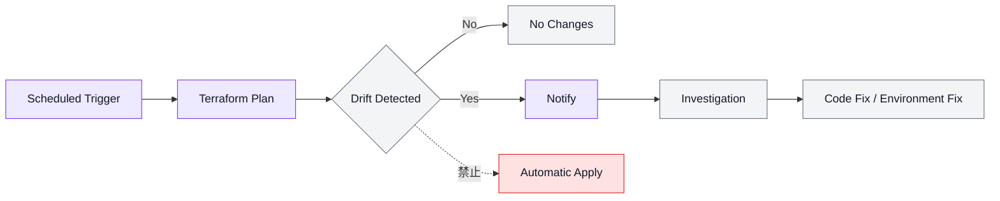

---

## 8.67 Pipeline変更

Pipeline、Buildspec、IAM RoleまたはArtifact Bucketを変更する場合も、Terraformで管理する。

CI/CD自身の変更では、以下を確認する。

* Pipelineが停止しないか
* Source Branchが正しいか
* 対象環境が正しいか
* Terraform実行Roleが正しいか
* Approval Stageが削除されていないか
* Destroy検出が無効になっていないか
* Artifactの受け渡しが正しいか
* PlanとApplyのRevisionが一致するか
* Logおよび通知が維持されるか

CI/CDの変更を通常Resource変更と同じPull Requestへ混在させないことを推奨する。

---

## 8.68 Buildspec

Buildspecは、処理ごとに分離できる。

例：

```text
buildspec/
├── check.yml
├── plan.yml
├── apply.yml
└── drift.yml
```

または、共通Scriptを呼び出す構成とする。

```text
scripts/
├── terraform_check.sh
├── terraform_plan.sh
├── terraform_apply.sh
├── detect_changes.py
└── inspect_plan.py
```

Buildspec内へ複雑な処理を直接記述しすぎない。

複雑な処理はScriptへ分離し、テスト可能な構成とする。

---

## 8.69 Buildspecの標準環境変数

CodeBuildでは、以下の情報を環境変数として渡す。

```text
ENVIRONMENT
PROJECT_NAME
ROOT_MODULE_PATH
TFVARS_PATH
BACKEND_CONFIG_PATH
AWS_ACCOUNT_ID
AWS_REGION
TERRAFORM_EXECUTION_ROLE_ARN
SOURCE_REVISION
PIPELINE_EXECUTION_ID
```

Secret値を通常の平文環境変数として設定しない。

Secretが必要な場合は、Secrets ManagerまたはParameter Storeを参照する。

---

## 8.70 Terraform Version

Terraform Versionは、ローカルとCodeBuildで統一する。

管理方法の例：

* CodeBuild Image内でVersionを固定
* Version管理Script
* `.terraform-version`
* `versions.tf`
* Container Image

Pipelineログへ、使用したTerraform Versionを出力する。

```bash
terraform version
```

開発者ごとに異なるTerraform VersionでPlanしてはならない。

---

## 8.71 Provider Version

Provider Versionは、`versions.tf`および`.terraform.lock.hcl`で管理する。

CI/CDではLock Fileを使用する。

Provider更新時は、以下を確認する。

* Lock Fileの差分
* Release Note
* Deprecated属性
* Breaking Change
* 全利用先のPlan
* dev環境での確認
* prd環境への影響

Provider更新を、機能変更と同じPull Requestへ混在させないことを推奨する。

---

## 8.72 Pipeline ArtifactとStateの分離

以下は別のS3 Bucketで管理する。

```text
Terraform State
Pipeline Artifact
Application Artifact
Log Archive
```

Terraform State BucketをCodePipeline Artifact Bucketとして使用してはならない。

Stateアクセス権限とArtifactアクセス権限を分離する。

---

## 8.73 CI/CDの監視

CI/CDに対して、以下を監視する。

* Pipeline失敗
* CodeBuild失敗
* 長時間実行
* Approval待ち
* State Lockの長期保持
* Artifact保存失敗
* CodeCommit同期失敗
* GitHub Actions失敗
* AssumeRole失敗
* Backendアクセス失敗
* 通知失敗

必要に応じてCloudWatch AlarmおよびSNS通知を設定する。

---

## 8.74 CI/CDメトリクス

必要に応じて以下を記録する。

* Pipeline実行回数
* 成功率
* 失敗率
* 平均実行時間
* Plan件数
* Apply件数
* Approval待ち時間
* Drift検出件数
* 削除ブロック件数
* Module変更時の影響Root Module数
* Rollback件数
* 例外運用件数

運用改善の判断材料として利用する。

---

## 8.75 例外運用

原則として、Terraform ApplyはCodePipeline経由で実施する。

ただし、以下の場合に限り例外運用を認める。

* CodePipeline障害
* CodeBuild障害
* CodeCommit障害
* AWSサービス障害
* 緊急障害対応
* Pipelineから実行できないState復旧
* 運用責任者が必要と判断した場合

例外運用を通常の作業時間短縮目的で使用してはならない。

---

## 8.76 例外運用の必須事項

例外運用では、以下を必須とする。

* 実施理由
* 緊急性
* 対象環境
* 対象AWSアカウント
* 対象Root Module
* 対象State
* 実施者
* 承認者
* 実施日時
* 実施コマンド
* Source Revision
* Plan結果
* 削除・置換の有無
* Rollback方法
* 実施結果
* 実施後Plan
* Stateとコードの整合性確認
* CI/CD復旧後の通常運用への復帰

---

## 8.77 例外運用フロー

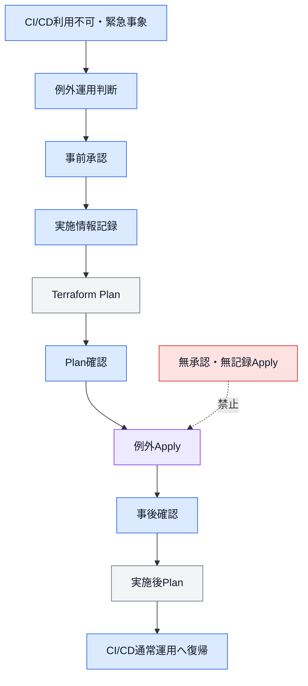

---

## 8.78 ローカル実行

ローカル環境では、以下を許可する。

```bash
terraform fmt
terraform init
terraform validate
terraform plan
```

以下は禁止する。

```bash
terraform apply
terraform destroy
```

State操作コマンドも、通常のローカル作業では使用しない。

```bash
terraform import
terraform state mv
terraform state rm
terraform force-unlock
```

State操作が必要な場合は、第3章および例外運用ルールに従う。

---

## 8.79 Destroy禁止

通常のCI/CDでは、`terraform destroy`を実行するStageやBuildspecを作成しない。

禁止例：

```bash
terraform destroy -auto-approve
```

プロダクトや環境の廃止では、専用の廃止手順と承認を使用する。

通常PipelineへDestroy機能を組み込まない。

---

## 8.80 Pipeline削除

Pipeline自体を削除する場合は、以下を確認する。

* 対象Root Moduleが廃止済み
* 対応Stateが適切に保管されている
* AWSリソースの管理方法が決定している
* CodeBuild Projectが不要
* IAM Roleが不要
* Artifactが保管または削除済み
* SNS通知が不要
* Drift検出対象から除外済み
* READMEおよび構成図を更新済み
* ADRまたは廃止記録が存在する

Pipelineを削除しても、AWSリソースとStateは自動的に削除しない。

---

## 8.81 禁止事項

CI/CD運用では、以下を禁止する。

### GitHub ActionsからTerraformを実行する

```text
GitHub Actions
  ↓
terraform apply
```

### CodeCommitへ直接変更する

GitHubを経由しない恒常的な変更を禁止する。

### ローカルApply

dev環境を含め、ローカルからApplyしてはならない。

### ローカルDestroy

ローカルからDestroyしてはならない。

### PlanなしApply

Plan結果を確認せずApplyしてはならない。

### Apply時の再Plan

承認後に異なるPlanを生成してApplyしてはならない。

### Source Revision不一致

Plan時とApply時のCommitが異なる状態でApplyしてはならない。

### 削除・置換の自動Apply

削除またはReplacementを含むPlanを通常承認だけでApplyしてはならない。

### AdministratorAccess

Terraform実行RoleへAdministratorAccessを付与してはならない。

### 環境横断権限

dev Pipelineからprd環境を操作できる権限を付与してはならない。

### StateとArtifactの同居

Terraform StateとPipeline Artifactを同じS3 Bucketで管理してはならない。

### Secretのログ出力

Plan、Apply、Buildspec、環境変数または通知へSecret値を出力してはならない。

### 無確認のForce Unlock

他のTerraform処理を確認せずState Lockを解除してはならない。

### 無承認の例外Apply

例外運用であっても、承認と記録を省略してはならない。

---

## 8.82 CI/CDチェックリスト

### GitHub

* [ ] `develop`と`main`が保護されている
* [ ] 直接Pushを禁止している
* [ ] Pull Requestを必須としている
* [ ] Force Pushを禁止している
* [ ] Reviewルールを設定している
* [ ] Sourceの正本がGitHubである

### GitHub Actions

* [ ] CodeCommit同期のみを実行している
* [ ] Terraformを実行していない
* [ ] OIDCを使用している
* [ ] 長期Access Keyを使用していない
* [ ] 対象Repositoryを限定している
* [ ] 対象Branchを限定している
* [ ] 対象CodeCommit Repositoryを限定している

### CodeCommit

* [ ] GitHubの同期先として使用している
* [ ] 直接変更を通常運用にしていない
* [ ] `develop`と`main`が同期されている
* [ ] PipelineのSource Branchが正しい

### Pipeline

* [ ] 環境ごとに分離している
* [ ] Root Module単位で分離している
* [ ] Source Stageがある
* [ ] Check Stageがある
* [ ] Plan Stageがある
* [ ] Plan Inspectionがある
* [ ] Approval Stageがある
* [ ] Apply Stageがある
* [ ] Post Checkがある
* [ ] Notificationがある

### Plan

* [ ] `tfplan`を保存している
* [ ] Text形式を保存している
* [ ] JSON形式を保存している
* [ ] Commit SHAを記録している
* [ ] AWSアカウントIDを記録している
* [ ] Root Module Pathを記録している
* [ ] State Keyを記録している
* [ ] 削除を検出している
* [ ] Replacementを検出している
* [ ] Plan Artifactへのアクセスを制限している

### Approval

* [ ] Plan結果を確認できる
* [ ] 対象環境を確認している
* [ ] 対象AWSアカウントを確認している
* [ ] IAM変更を確認している
* [ ] 削除と置換を確認している
* [ ] prdではManual Approvalが必須である
* [ ] 承認者と承認日時を記録している

### Apply

* [ ] 保存済みPlanを使用している
* [ ] Source Revisionが一致している
* [ ] BackendとState Keyが一致している
* [ ] Terraform Versionが一致している
* [ ] 対象AWSアカウントが一致している
* [ ] Apply後確認を実施している
* [ ] State Lockが解除されている

### IAM

* [ ] CodeBuild RoleとTerraform実行Roleを分離している
* [ ] Terraform実行Roleを責務単位で分離している
* [ ] AdministratorAccessを使用していない
* [ ] Permission Boundaryを適用している
* [ ] `iam:PassRole`を限定している
* [ ] devとprdの権限を分離している

### Logging・Artifact

* [ ] CloudWatch Logsを有効にしている
* [ ] PlanおよびApply結果を保存している
* [ ] Artifact Bucketを非公開にしている
* [ ] Artifactを暗号化している
* [ ] State BucketとArtifact Bucketを分離している
* [ ] Secretをログへ出力していない
* [ ] Lifecycleを設定している

---

## 8.83 全体設計図

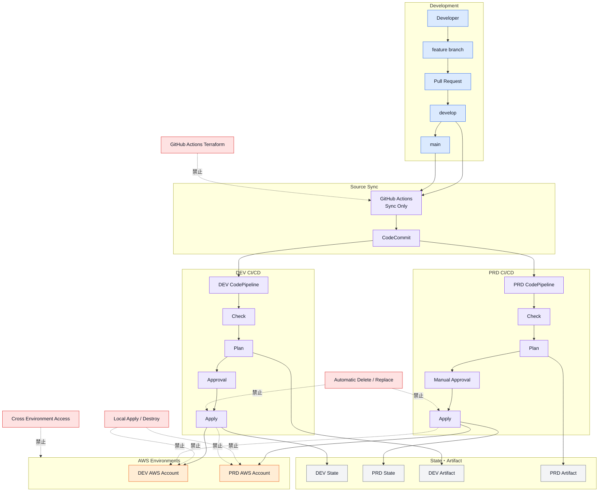

---

## 8.84 設計原則

本章の設計原則を以下にまとめる。

* GitHubをTerraformコードの正本とする。
* CodeCommitをAWS CI/CD用の同期先とする。
* GitHub ActionsはCodeCommit同期のみを担当する。
* GitHub ActionsからTerraformを実行しない。
* GitHub ActionsのAWS認証には原則としてOIDCを使用する。
* `develop`をdev環境へ対応させる。
* `main`をprd環境へ対応させる。
* `develop`および`main`への直接PushとForce Pushを禁止する。
* Terraform変更はPull Request経由で反映する。
* CodePipelineを環境およびRoot Module単位で分離する。
* 1つのPipelineを1つのRoot ModuleおよびStateへ対応させる。
* TerraformのCheck、PlanおよびApplyはCodeBuildで実行する。
* Root Module変更時は対象Root ModuleでPlanする。
* Module変更時はすべての利用先でPlanする。
* Plan結果をArtifactとして保存する。
* PlanのText形式とJSON形式を保存する。
* Plan時のCommit SHA、環境、AWSアカウントおよびStateを記録する。
* Plan JSONから削除およびReplacementを検出する。
* 削除またはReplacementを含むPlanを自動Applyしない。
* devおよびprdの両方でApply前のPlan確認を必須とする。
* prdではManual Approvalを必須とする。
* Applyでは承認済みの保存済みPlanを使用する。
* Plan後にSource Revisionが変わった場合は再Planする。
* Apply時に新しいPlanを生成しない。
* CodeBuild Service RoleとTerraform実行Roleを分離する。
* Terraform実行Roleを環境、プロジェクトおよび責務単位で分離する。
* Terraform実行RoleへAdministratorAccessを付与しない。
* Permission Boundaryを使用する。
* devとprdの実行権限を分離する。
* State BucketとPipeline Artifact Bucketを分離する。
* CodeBuildログ、Plan、承認およびApply結果を保存する。
* 同一Stateに対する複数Pipelineの同時実行を防止する。
* Apply失敗時はStateと実環境を確認して再Planする。
* 自動RollbackではなくFix Forwardを基本とする。
* Drift検出Pipelineから自動Applyしない。
* 通常PipelineへDestroy機能を組み込まない。
* ローカルApplyおよびDestroyを禁止する。
* 例外運用は承認、記録、Planおよび事後確認を必須とする。
