# 第9章 IAM・セキュリティ設計

## 9.1 本章の目的

本章では、Terraform Framework Standard v1.0で採用するIAM、Terraform実行権限、機密情報、暗号化、ネットワークアクセス、監査およびセキュリティ検査の設計ルールを定義する。

本標準では、TerraformによってAWSリソースを作成できる一方で、Terraform実行Roleへ過剰な権限を付与しないことを重視する。

IAMおよびセキュリティ設計が適切でない場合、以下の問題が発生する可能性がある。

* Terraform実行Roleによる権限昇格
* dev環境からprd環境へのアクセス
* 他プロダクトのAWSリソース変更
* IAM RoleやIAM Policyの過剰権限
* StateおよびPlan Artifactからの情報漏えい
* Secret値のGitHubやログへの流出
* Public Accessによる外部公開
* Security Groupの過剰な通信許可
* 暗号化されていないデータ保存
* 変更者および実行者を追跡できない状態
* 手動変更によるTerraformコードとの不整合
* CodeBuildやGitHub Actions認証情報の漏えい

本標準では、最小権限、職務分離、環境分離、Policy as Codeおよび監査可能性をセキュリティ設計の基本とする。

---

## 9.2 基本方針

本章では、以下の方針を採用する。

* 最小権限の原則を適用する。
* dev環境とprd環境のIAM権限を分離する。
* プロダクトおよび責務単位でTerraform実行Roleを分離する。
* CodeBuild Service RoleとTerraform実行Roleを分離する。
* GitHub ActionsのAWS認証には原則としてOIDCを使用する。
* 長期間有効なAccess Keyを使用しない。
* Terraform実行RoleへAdministratorAccessを付与しない。
* Terraformが作成するIAM RoleへPermission Boundaryを適用する。
* `iam:PassRole`の対象RoleとAWSサービスを限定する。
* IAM RoleのTrust Policyを必要なPrincipalだけに限定する。
* IAM PolicyはTerraformでコード管理する。
* IAM Policyは可能な限り`aws_iam_policy_document`で作成する。
* IAM Identity CenterおよびAWS OrganizationsはTerraform管理対象外とする。
* IAM UserおよびIAM Groupは必要な場合のみTerraformで管理する。
* Secret値をTerraformコード、tfvars、State、ログへ直接保存しない。
* Secrets ManagerまたはParameter Storeを利用する。
* 保存データと通信経路を暗号化する。
* Public Accessを原則として禁止する。
* Security Groupは必要な通信だけを許可する。
* セキュリティ設定をTrivyなどで自動検査する。
* IAMおよびセキュリティ変更はPlanとレビューを必須とする。
* 例外的な権限や公開設定はADRと承認を必須とする。

---

## 9.3 セキュリティ責務

セキュリティ関連リソースは、以下の責務で管理する。

| 管理対象                          | 配置先                    |
| ----------------------------- | ---------------------- |
| IAM Role                      | `security`             |
| IAM Policy                    | `security`             |
| Permission Boundary           | `security`             |
| KMS Key                       | `security`             |
| Resource Policy               | 対象リソースの責務または`security` |
| Security Group                | `network`              |
| VPC Endpoint Policy           | `network`または`security` |
| Secrets Manager Secretリソース    | `security`または利用責務      |
| Secret値                       | Terraform管理対象外         |
| Parameter Store Parameterリソース | `security`または利用責務      |
| SecureString値                 | Terraform管理対象外         |
| CloudWatch Alarm              | `monitoring`           |
| セキュリティ通知                      | `notification`         |
| Terraform実行Role               | 対象プロダクトの`security`     |
| GitHub OIDC Role              | CI/CD管理責務              |
| CodeBuild Service Role        | CI/CD管理責務              |

同じIAM RoleやPolicyを複数のStateから管理してはならない。

---

## 9.4 セキュリティ全体構成

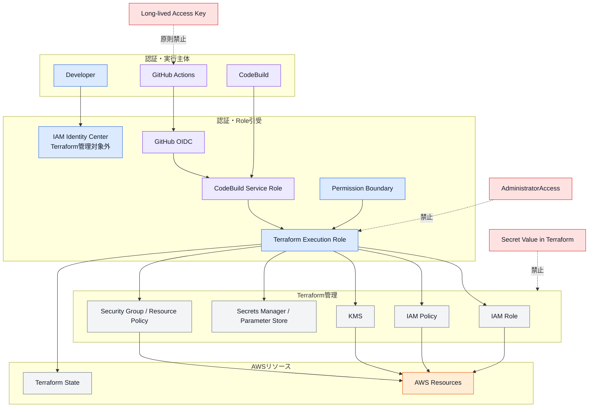

---

## 9.5 IAM管理対象

以下のIAMリソースをTerraform管理対象とする。

* IAM Role
* IAM Managed Policy
* IAM Inline Policy
* IAM Policy Attachment
* IAM Instance Profile
* Permission Boundary
* AssumeRole Policy
* Service-linked Roleのうち明示管理が必要なもの
* IAM User
* IAM Group
* IAM User Policy
* IAM Group Policy
* Access Keyを除くIAM User設定

IAM UserおよびIAM Groupは、必要性が明確な場合のみ作成する。

長期Access Keyは、原則として作成しない。

---

## 9.6 IAM管理対象外

以下は本標準のTerraform管理対象外とする。

* IAM Identity Center
* AWS Organizations
* Organizations Service Control Policy
* IAM Identity Center Permission Set
* IAM Identity Center User
* IAM Identity Center Group
* 人が使用するPassword
* 長期間有効なAccess Key
* Break-glass用認証情報の値
* MFA Device Secret
* 外部IdPの設定

管理対象外の認証基盤は、別の設計書および運用手順で管理する。

---

## 9.7 人によるAWSアクセス

人がAWSコンソールまたはAWS CLIへアクセスする場合は、IAM Identity Centerなどの一時認証を優先する。

```text
Developer
  ↓
IAM Identity Center
  ↓
対象AWSアカウント
  ↓
許可されたRole
```

IAM Userの恒常利用は原則として避ける。

IAM Userが必要な場合は、以下を明確にする。

* IAM Userが必要な理由
* 利用者または利用システム
* 対象AWSアカウント
* 必要な権限
* Access Keyの有無
* MFAの要否
* 有効期限
* Rotation方法
* 廃止条件

---

## 9.8 IAM User

IAM Userを作成する場合は、以下を原則とする。

* 利用目的を1つに限定する。
* Console Accessを必要な場合のみ有効にする。
* Programmatic Accessを必要な場合のみ使用する。
* Access KeyをTerraformで生成しない。
* Access Keyの値をStateへ保存しない。
* MFAを使用する。
* IAM GroupまたはRole経由で権限を付与する。
* Userへ直接Policyを大量に付与しない。
* 利用終了時に速やかに無効化・削除する。
* 定期的に利用状況を確認する。

個人ごとに広範囲な権限を持つIAM Userを作成しない。

---

## 9.9 IAM Group

IAM Groupは、人が使用するIAM Userの権限をまとめる必要がある場合に使用する。

例：

```text
dev-viewer
dev-operator
prd-viewer
```

ただし、本標準の主要なアクセス方式はRole引受とする。

IAM GroupへAdministratorAccessを付与してはならない。

環境および権限レベルをGroup名から判断できるようにする。

---

## 9.10 Roleによるアクセス

AWSサービス、CI/CDおよび人による一時アクセスには、IAM Roleを使用する。

Role利用例：

* CodeBuild Service Role
* Terraform実行Role
* ECS Task Role
* ECS Task Execution Role
* Lambda Execution Role
* EventBridge Target Role
* GitHub Actions OIDC Role
* Cross-account Role
* Read-only Role
* Emergency Role

Roleは用途ごとに分離し、複数の異なる責務へ流用しない。

---

## 9.11 Terraform実行Role

Terraform実行Roleは、以下の単位で作成する。

```text
<environment>--<project>--terraform-<responsibility>--iam-role
```

例：

```text
dev--kintai--terraform-network--iam-role
dev--kintai--terraform-security--iam-role
dev--kintai--terraform-compute--iam-role
dev--kintai--terraform-database--iam-role
prd--kintai--terraform-monitoring--iam-role
```

Commonでは機能名を使用する。

```text
dev--common--terraform-batch-start-stop--iam-role
```

1つのTerraform実行Roleですべての責務を管理する構成は採用しない。

`ManagerRole`などの広範囲な共通Roleは標準構成として作成しない。

---

## 9.12 Terraform実行Roleの責務

Terraform実行Roleは、対応するRoot Moduleが管理するAWSリソースだけを操作する。

| Terraform実行Role | 主な許可対象                              |
| --------------- | ----------------------------------- |
| Network         | VPC、Subnet、Route、ALB、Security Group |
| Security        | IAM、KMS、Resource Policy             |
| Compute         | ECS、ECR、Lambda、CloudWatch Logs      |
| Database        | RDS、DynamoDB、ElastiCache            |
| Monitoring      | CloudWatch Alarm、Dashboard          |
| Notification    | SNS、EventBridge                     |
| DNS             | Route 53、ACM                        |

実行Roleは、対応するStateへの読み書き権限も持つ。

他プロダクト、他環境および他責務のStateへアクセスできないようにする。

---

## 9.13 Terraform実行Role構成図

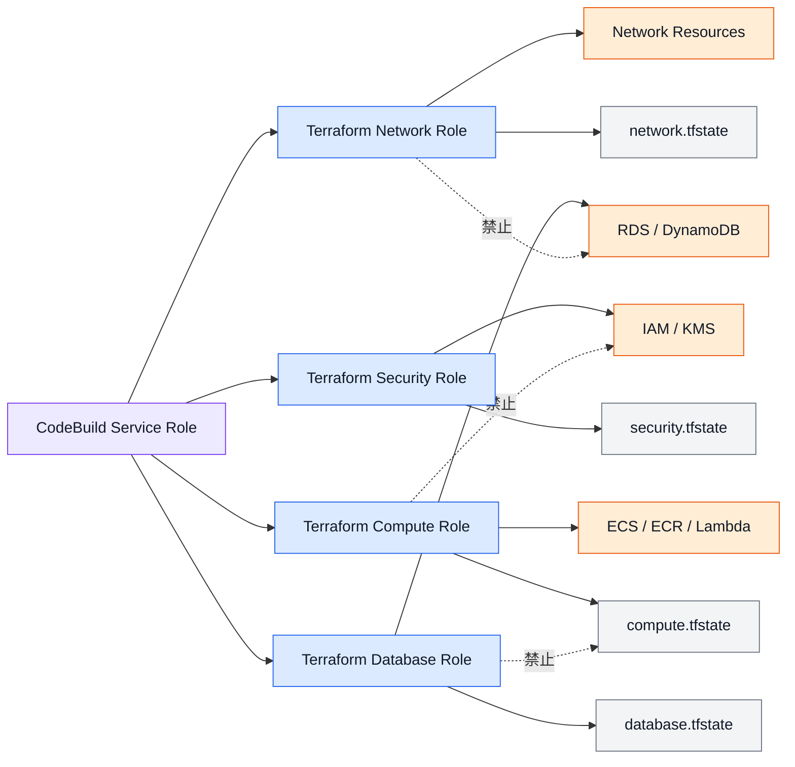

---

## 9.14 CodeBuild Service Role

CodeBuild Service Roleは、Terraform実行処理を開始するためのRoleとする。

CodeBuild Service Roleに許可する主な操作は以下とする。

* CloudWatch Logsへのログ出力
* Pipeline Artifactの取得・保存
* Terraform実行RoleのAssumeRole
* 必要なS3 Artifact操作
* 必要なKMS操作
* 必要なSNS通知
* STSによるCaller Identity確認

CodeBuild Service Roleへ、ECS、RDS、IAMなどのTerraform管理対象を直接変更する権限を付与しない。

AWSリソース変更権限はTerraform実行Roleへ付与する。

---

## 9.15 Role引受フロー

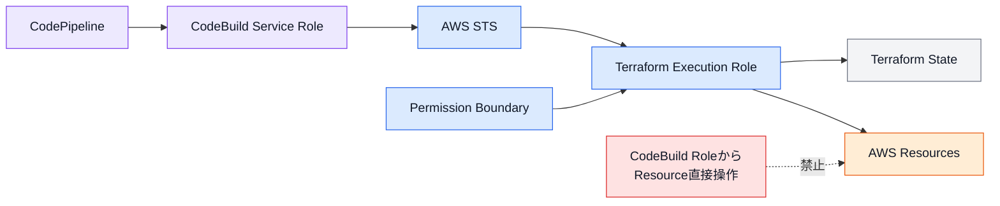

---

## 9.16 Trust Policy

IAM RoleのTrust Policyでは、Roleを引き受けられるPrincipalを限定する。

CodeBuild Service RoleからTerraform実行Roleを引き受ける例：

```hcl
data "aws_iam_policy_document" "terraform_execution_assume_role" {
  statement {
    sid    = "AllowCodeBuildAssumeRole"
    effect = "Allow"

    actions = [
      "sts:AssumeRole"
    ]

    principals {
      type = "AWS"

      identifiers = [
        var.codebuild_service_role_arn
      ]
    }
  }
}
```

PrincipalへAWSアカウントRootを無条件に指定しない。

---

## 9.17 Trust Policyの制限

Trust Policyでは、必要に応じて以下のConditionを使用する。

* `aws:SourceArn`
* `aws:SourceAccount`
* `sts:ExternalId`
* OIDC Subject
* OIDC Audience
* Principal ARN
* AWSサービス名

AWSサービスRoleでは、対象サービスを限定する。

```hcl
principals {
  type = "Service"

  identifiers = [
    "ecs-tasks.amazonaws.com"
  ]
}
```

複数の異なるAWSサービスを1つのRoleへ信頼させない。

---

## 9.18 GitHub Actions OIDC

GitHub ActionsからAWSへアクセスする場合は、OpenID Connectを使用する。

OIDC Trust Policyでは、以下を限定する。

* GitHub Organization
* GitHub Repository
* Branch
* Environment
* Audience
* WorkflowまたはSubject

例：

```hcl
data "aws_iam_policy_document" "github_oidc_assume_role" {
  statement {
    sid    = "AllowGitHubActions"
    effect = "Allow"

    actions = [
      "sts:AssumeRoleWithWebIdentity"
    ]

    principals {
      type = "Federated"

      identifiers = [
        var.github_oidc_provider_arn
      ]
    }

    condition {
      test     = "StringEquals"
      variable = "token.actions.githubusercontent.com:aud"

      values = [
        "sts.amazonaws.com"
      ]
    }

    condition {
      test     = "StringLike"
      variable = "token.actions.githubusercontent.com:sub"

      values = [
        "repo:<organization>/<repository>:ref:refs/heads/develop",
        "repo:<organization>/<repository>:ref:refs/heads/main"
      ]
    }
  }
}
```

すべてのGitHub RepositoryやBranchからRoleを引き受けられる設定は禁止する。

---

## 9.19 GitHub Actions権限

GitHub Actions用Roleには、CodeCommit同期に必要な権限だけを付与する。

許可対象例：

* 対象CodeCommit Repositoryの参照
* 対象BranchへのPush
* 必要なGit操作

以下は付与しない。

* Terraform Stateへのアクセス
* CodePipelineの承認
* Terraform Apply
* ECSやRDSの変更
* IAM RoleやPolicyの変更
* 他Repositoryの変更
* prd以外の不要なBranch操作

GitHub Actions用RoleとTerraform実行Roleを同じRoleにしてはならない。

---

## 9.20 Permission Boundary

Terraformが作成するIAM Roleには、Permission Boundaryを適用する。

Permission Boundaryは、IAM Roleへ付与できる権限の最大範囲を制限する。

```text
IAM Policyで許可
        ∩
Permission Boundaryで許可
        ↓
実際に利用可能な権限
```

IAM Policyで許可されていても、Permission Boundaryで許可されていない操作は実行できない。

---

## 9.21 Permission Boundary構成図

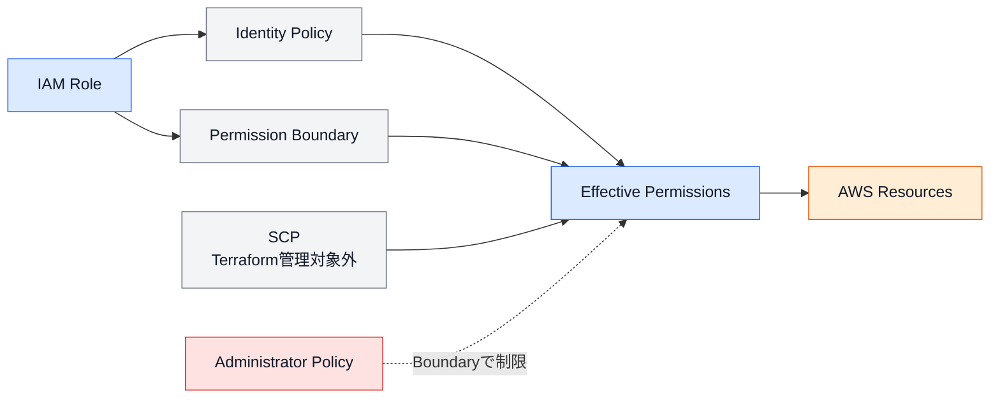

---

## 9.22 Permission Boundaryの管理

Permission Boundaryは`security`責務で管理する。

例：

```text
products/kintai/dev/security
products/kintai/prd/security
```

命名例：

```text
dev--kintai--terraform--permission-boundary
prd--kintai--terraform--permission-boundary
```

Terraform実行RoleがIAM Roleを作成する場合は、BoundaryなしのRoleを作成できない権限設計を検討する。

Permission Boundaryの変更は、通常のIAM変更よりも影響が大きいため、Planと承認を必須とする。

---

## 9.23 IAM Policyの基本方針

IAM Policyは、以下の原則で作成する。

* 必要なActionだけを許可する。
* 必要なResourceだけを許可する。
* 必要なConditionを設定する。
* Allowを基本とする。
* Explicit Denyは共通統制など明確な目的で使用する。
* AWS Managed Policyへの依存を必要最小限にする。
* Customer Managed PolicyをTerraformで管理する。
* Inline Policyを過剰に使用しない。
* Policyの責務を明確にする。
* 1つのPolicyへ無関係な権限をまとめない。

---

## 9.24 aws_iam_policy_document

IAM Policyは、可能な限り`aws_iam_policy_document`で作成する。

```hcl
data "aws_iam_policy_document" "s3_read" {
  statement {
    sid    = "AllowReadObjects"
    effect = "Allow"

    actions = [
      "s3:GetObject"
    ]

    resources = [
      "${var.bucket_arn}/*"
    ]
  }

  statement {
    sid    = "AllowListBucket"
    effect = "Allow"

    actions = [
      "s3:ListBucket"
    ]

    resources = [
      var.bucket_arn
    ]
  }
}
```

Policy JSONの文字列をHeredocで直接記述する方法は、原則として避ける。

---

## 9.25 IAM Policyの分割

IAM Policyは、利用目的またはAWSサービスの責務単位で分割する。

良い例：

```text
ecs-task-s3-read
ecs-task-secret-read
codebuild-state-access
terraform-compute-management
```

避ける例：

```text
application-all-access
common-full-access
terraform-manager
```

Policyが大きくなった場合は、以下を確認する。

* 無関係なAWSサービスが混在していないか
* Resourceを限定できないか
* Roleの責務が広すぎないか
* 複数のPolicyへ分割できないか
* Permission Boundaryで制限できているか

---

## 9.26 Wildcard

以下の設定は原則として禁止する。

```hcl
actions = [
  "*"
]

resources = [
  "*"
]
```

Wildcardが必要な場合は、以下を確認する。

* AWS APIがResource Level Permissionに対応していない
* Actionを限定している
* Conditionを設定できないか確認した
* 対象Roleの責務が限定されている
* Permission Boundaryで制限されている
* READMEまたはADRに理由を記録している

`service:*`も必要性を確認する。

---

## 9.27 IAM Condition

可能な場合は、IAM Conditionによってアクセスを追加制限する。

利用例：

* AWSアカウント
* AWSリージョン
* Resource Tag
* Request Tag
* Source VPC
* Source VPC Endpoint
* Source ARN
* Source Account
* Principal ARN
* AWSサービス
* 暗号化条件
* TLS条件

例：

```hcl
condition {
  test     = "StringEquals"
  variable = "aws:ResourceTag/Environment"

  values = [
    var.environment
  ]
}
```

Tag Conditionを使用する場合は、必須タグが確実に付与されることを確認する。

---

## 9.28 iam:PassRole

`iam:PassRole`は、AWSサービスへRoleを渡すために使用されるため、特に厳格に制限する。

許可対象例：

* ECS Task Role
* ECS Task Execution Role
* Lambda Execution Role
* EventBridge Target Role
* CodeBuild Service Role

禁止例：

```hcl
actions = [
  "iam:PassRole"
]

resources = [
  "*"
]
```

許可するRole ARNを明示的に限定する。

---

## 9.29 PassRole Condition

可能な場合は、`iam:PassedToService` Conditionを使用する。

```hcl
condition {
  test     = "StringEquals"
  variable = "iam:PassedToService"

  values = [
    "ecs-tasks.amazonaws.com"
  ]
}
```

Terraform実行Roleが、任意のRoleを任意のAWSサービスへ渡せる状態を作らない。

---

## 9.30 権限昇格の防止

Terraform実行Roleでは、以下の操作を特に注意して制御する。

* `iam:CreateRole`
* `iam:PutRolePolicy`
* `iam:AttachRolePolicy`
* `iam:PassRole`
* `iam:CreatePolicy`
* `iam:CreatePolicyVersion`
* `iam:SetDefaultPolicyVersion`
* `iam:UpdateAssumeRolePolicy`
* `iam:DeleteRolePermissionsBoundary`
* `iam:PutRolePermissionsBoundary`
* `sts:AssumeRole`

security責務以外のTerraform実行Roleへ、IAM RoleやPolicyを自由に作成できる権限を付与しない。

Compute責務などでIAM Roleが必要な場合は、security StateからRole ARNを参照する。

---

## 9.31 IAM依存構成

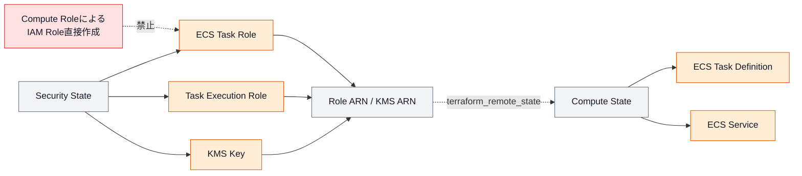

---

## 9.32 ECS Task Role

ECS Task Roleは、アプリケーションコンテナがAWS APIを利用するためのRoleとする。

許可例：

* 対象S3 Bucketの読み書き
* 対象DynamoDB Tableへのアクセス
* 対象Secretの取得
* 対象Parameterの取得
* 対象SNS TopicへのPublish

Task Roleへ以下を付与しない。

* ECS管理権限
* ECR Image Pull権限
* CloudWatch Logsへの実行基盤権限
* IAM管理権限
* 他プロダクトのResource権限

アプリケーションが必要とする権限だけを付与する。

---

## 9.33 ECS Task Execution Role

ECS Task Execution Roleは、ECS AgentがTaskを起動するためのRoleとする。

許可例：

* ECR Image Pull
* CloudWatch Logs出力
* Secrets ManagerまたはParameter Storeからの起動時Secret取得
* 必要なKMS Decrypt

アプリケーションがAWS APIを利用する権限は、Task Roleへ付与する。

Task RoleとTask Execution Roleを同じRoleにしてはならない。

---

## 9.34 Lambda Execution Role

Lambda Execution Roleには、対象Functionに必要な権限だけを付与する。

最低限のLogging権限と、処理に必要なAWS API権限を分離して検討する。

複数の異なるLambda Functionで同じRoleを流用する場合は、権限の共通性とライフサイクルを確認する。

権限が異なるFunctionではRoleを分離する。

---

## 9.35 Cross-account Role

異なるAWSアカウント間でRoleを引き受ける場合は、以下を限定する。

* Source AWSアカウント
* Source Role ARN
* External IDの要否
* Session Duration
* 対象Environment
* 対象Resource
* CloudTrailによる監査

AWSアカウントRootをPrincipalにする場合は、追加ConditionでSource Roleを限定する。

devからprdへのCross-accountアクセスは、明確な運用要件がない限り許可しない。

---

## 9.36 Session Duration

IAM RoleのSession Durationは、作業やPipelineの実行時間に必要な範囲で設定する。

長すぎるSession Durationを設定しない。

Terraform Applyが長時間になる場合でも、無条件に最大時間へ設定せず、以下を確認する。

* 平均Apply時間
* 最大Apply時間
* Approval待ちをSession内に含めない構成
* Credential更新方法
* CodeBuild Timeout
* State Lock Timeout

PlanとApprovalとApplyを同一の一時Credential Sessionへ依存させない。

---

## 9.37 IAM Policy Attachment

Policy Attachmentは、RoleとPolicyの対応関係が分かるように管理する。

以下を避ける。

* 1つのAttachment Moduleで多数の無関係Roleを扱う
* Role側とPolicy側の両方で同じAttachmentを管理する
* 同じPolicyを重複してAttachmentする
* AWS Managed Policyを無計画に付与する

Role、PolicyおよびAttachmentの管理Stateを統一する。

---

## 9.38 AWS Managed Policy

AWS Managed Policyは、更新内容を利用者側で制御できないため、必要性を確認して使用する。

利用を検討できる例：

* 一般的なService Role用Policy
* AWSサービスが公式に要求するPolicy
* 初期構築時の一時的な利用

長期的にはCustomer Managed Policyへの置き換えを検討する。

以下は使用しない。

```text
AdministratorAccess
PowerUserAccess
IAMFullAccess
```

---

## 9.39 Secret管理

Secret値は、TerraformコードおよびGit管理対象ファイルへ記述しない。

Secret値の保存先として、以下を使用する。

* AWS Secrets Manager
* AWS Systems Manager Parameter Store SecureString
* CI/CDのSecret管理機能
* 必要に応じた外部Secret管理基盤

Terraformでは、Secretを格納するリソース、Policy、KMS Keyおよび参照設定を管理する。

Secret値そのものは別の安全な手順で登録する。

---

## 9.40 Terraform管理対象とSecret値

Terraformで管理する例：

```text
Secrets Manager Secret
Secret名
Description
KMS Key
Resource Policy
Rotation設定
IAM参照権限
```

Terraformで管理しない例：

```text
Database Password
API Key
Access Token
Private Key
OAuth Client Secret
```

Secret VersionをTerraform Resourceで作成すると、値がStateへ保存される可能性があるため、標準構成では使用しない。

---

## 9.41 Secret登録フロー

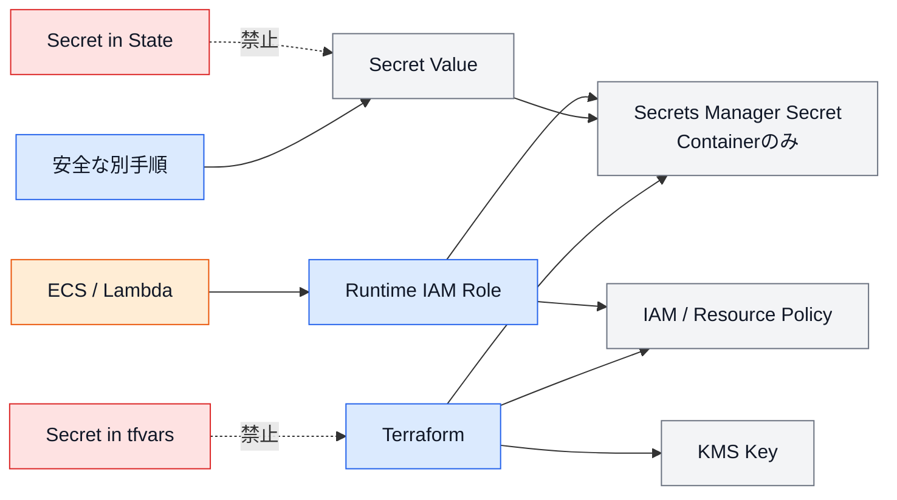

---

## 9.42 Secret参照

ECSやLambdaからSecretを参照する場合は、Secret ARNまたはParameter ARNをTerraformで設定する。

Task Definition例：

```hcl
secrets = [
  {
    name      = "DATABASE_PASSWORD"
    valueFrom = var.database_password_secret_arn
  }
]
```

Terraformへ渡す値はSecretのARNとし、Secret値そのものを渡さない。

IAM Roleでは対象Secret ARNだけを許可する。

---

## 9.43 Secret Rotation

Secret Rotationが必要な場合は、以下を設計する。

* Rotation対象
* Rotation間隔
* Rotation Lambda
* IAM Role
* KMS権限
* アプリケーション側の再取得方法
* 失敗時の通知
* Rollback
* 旧Secretの有効期間

Rotation設定を有効にするだけで、アプリケーションが自動的に新しいSecretを利用できるとは限らない。

アプリケーションのSecret再取得方式を含めて設計する。

---

## 9.44 Stateのセキュリティ

Terraform Stateには機密性の高い情報が含まれる可能性がある。

Stateでは、以下を実施する。

* S3 Public Access Blockを有効にする。
* HTTPS通信を必須とする。
* S3暗号化を有効にする。
* Versioningを有効にする。
* StateアクセスRoleを限定する。
* 対象BucketとObject Keyを限定する。
* Stateをローカルへ保存しない。
* StateをGitへコミットしない。
* Stateをメールやチャットで共有しない。
* State参照ログを監査できる状態にする。

Stateの詳細設計は第3章に従う。

---

## 9.45 Plan Artifactのセキュリティ

Terraform PlanおよびPlan JSONには、以下が含まれる可能性がある。

* ARN
* Resource ID
* ネットワーク情報
* IAM Policy
* Secret参照情報
* Sensitive属性
* Database設定

Plan Artifactは以下のルールで管理する。

* 専用S3 Bucketへ保存する。
* Public Accessを禁止する。
* 暗号化する。
* 承認者とPipelineだけがアクセスする。
* 保存期間をLifecycleで制御する。
* 外部共有しない。
* Pull RequestへPlan全文を貼り付けない。
* 通知へPlan全文を含めない。

---

## 9.46 暗号化方針

保存データおよび通信経路を暗号化する。

### 保存時暗号化

対象例：

* S3
* RDS
* DynamoDB
* EBS
* EFS
* ElastiCache
* CloudWatch Logs
* Secrets Manager
* Parameter Store SecureString
* CodePipeline Artifact
* Terraform State

### 通信時暗号化

対象例：

* HTTPS
* TLS
* RDS SSL/TLS
* VPC Endpoint
* AWS API通信
* ALB HTTPS Listener

暗号化を無効にする場合は、明確な理由とADRを必要とする。

---

## 9.47 KMS

KMS Keyは、以下の要件がある場合に使用する。

* Customer Managed Keyが必要
* Key Policyによるアクセス制御が必要
* 監査要件がある
* Key Rotationが必要
* 複数サービスで共通Keyを利用する
* セキュリティ規程で指定されている

AWS Managed Keyまたはサービス標準暗号化で要件を満たす場合は、Customer Managed Keyを無条件に作成しない。

---

## 9.48 KMS Key設計

KMS Keyを作成する場合は、以下を定義する。

* Key用途
* 対象Environment
* 対象Project
* Key Administrator
* Key User
* Key Policy
* Rotation
* Alias
* 削除待機期間
* Multi-Region要否
* 利用サービス
* 廃止手順

KMS Key Aliasは、以下の形式を使用する。

```text
alias/<environment>--<project>--<purpose>--kms
```

例：

```text
alias/prd--kintai--database--kms
```

---

## 9.49 KMS Key Policy

KMS Key Policyでは、Key AdministratorとKey Userを分離する。

Key Administratorは以下を管理する。

* Key Policy
* Rotation
* Alias
* Enable・Disable
* 削除予約

Key Userは以下を利用する。

* Encrypt
* Decrypt
* GenerateDataKey
* DescribeKey

アプリケーションRoleへKMS管理権限を付与しない。

---

## 9.50 KMS削除

KMS Key削除は、データ復号不能につながる可能性があるため、特に慎重に扱う。

削除前に以下を確認する。

* 利用中のAWSサービス
* 暗号化されたデータ
* Backup
* Snapshot
* Log
* Secret
* State
* Alias
* Cross-account利用
* Rollback方法

KMS Keyの削除や無効化を通常変更へ含めない。

`prevent_destroy`の利用を検討する。

---

## 9.51 Public Access

AWSリソースのPublic Accessは、原則として禁止する。

対象例：

* S3 Bucket
* RDS
* ElastiCache
* EFS
* OpenSearch
* ECS Task
* EC2
* Management Endpoint
* CodeBuild
* Terraform State
* Pipeline Artifact

Public Accessが必要な場合は、ALB、CloudFront、API Gatewayなどの公開用サービスを経由する。

公開経路と内部Resourceを分離する。

---

## 9.52 公開構成

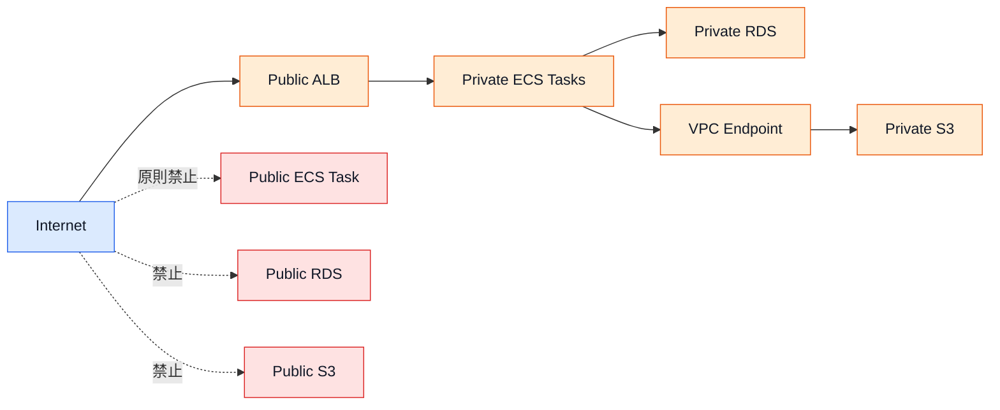

---

## 9.53 Security Group

Security Groupは`network`責務で管理する。

設計原則は以下とする。

* Inboundは必要なSourceとPortだけを許可する。
* Security Group参照をCIDRより優先する。
* `0.0.0.0/0`からのInboundを必要最小限にする。
* SSHおよびRDPをインターネットへ公開しない。
* Database Portをインターネットへ公開しない。
* 用途ごとにSecurity Groupを分離する。
* 複数用途を1つのSecurity Groupへまとめない。
* RuleにDescriptionを設定する。
* IPv4とIPv6を明示的に管理する。
* 未使用Ruleを削除する。

---

## 9.54 Security Group構成

例：

```text
ALB Security Group
  Inbound:
    443 from 0.0.0.0/0

ECS Security Group
  Inbound:
    Application Port from ALB Security Group

RDS Security Group
  Inbound:
    Database Port from ECS Security Group
```

Security Group間参照によって、通信元を明確に制限する。

---

## 9.55 Security Group構成図

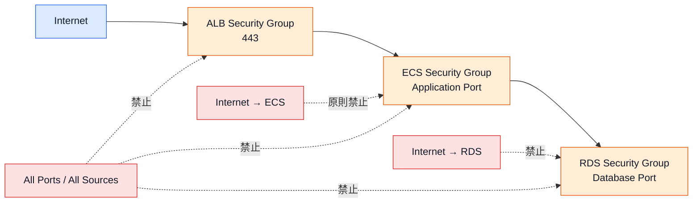

---

## 9.56 Security Group Rule

Security Group Ruleは、可能な限り個別のTerraform Resourceまたは明確なMapで管理する。

各Ruleには、以下を定義する。

* Description
* Protocol
* From Port
* To Port
* Source Security GroupまたはCIDR
* IPv4・IPv6
* 用途
* Environment

DescriptionなしのRuleを作成しない。

---

## 9.57 Outbound通信

Outboundを無条件にすべて許可するかどうかは、対象Resourceの要件に応じて判断する。

特にprd環境では、以下を確認する。

* 外部APIへの通信
* AWS APIへの通信
* ECR Image Pull
* CloudWatch Logs
* Secrets Manager
* Parameter Store
* DNS
* OSやPackage Repository
* VPC Endpointで代替可能か

Outbound制限を導入する場合は、アプリケーション動作と運用影響を確認する。

---

## 9.58 VPC Endpoint

Private SubnetからAWSサービスへアクセスする場合は、VPC Endpointを検討する。

対象例：

* S3
* ECR API
* ECR DKR
* CloudWatch Logs
* Secrets Manager
* Systems Manager
* STS
* KMS

VPC Endpoint Policyを使用し、必要なResourceへのアクセスだけに限定することを検討する。

Endpointはコストと必要性を確認した上で作成する。

---

## 9.59 Resource Policy

以下のResource PolicyはTerraformで管理する。

* S3 Bucket Policy
* KMS Key Policy
* SNS Topic Policy
* SQS Queue Policy
* ECR Repository Policy
* Secrets Manager Resource Policy
* VPC Endpoint Policy
* Lambda Permission
* EventBridge Resource Policy

Resource Policyでは、Principal、Action、ResourceおよびConditionを明示的に制限する。

---

## 9.60 SourceArn・SourceAccount

AWSサービスからResourceへアクセスを許可する場合は、Confused Deputy対策として`aws:SourceArn`および`aws:SourceAccount`の利用を検討する。

例：

```hcl
condition {
  test     = "StringEquals"
  variable = "aws:SourceAccount"

  values = [
    var.aws_account_id
  ]
}

condition {
  test     = "ArnLike"
  variable = "aws:SourceArn"

  values = [
    var.source_arn
  ]
}
```

サービスPrincipalだけを指定し、すべてのResourceからの利用を許可しない。

---

## 9.61 S3セキュリティ

S3 Bucketでは、原則として以下を適用する。

* Public Access Block
* ACL無効化またはPrivate
* 暗号化
* Versioning
* HTTPS Only
* 最小権限Bucket Policy
* LoggingまたはCloudTrail Data Eventsの要否確認
* Lifecycle
* Object Ownership
* Cross-account Accessの制限

Public Website Hostingが必要な場合は、CloudFront経由などを検討する。

Terraform State BucketとArtifact Bucketは、特に厳格に制限する。

---

## 9.62 HTTPS Only Policy

S3 Bucketでは、暗号化されていない通信を拒否するPolicyを設定する。

```hcl
data "aws_iam_policy_document" "https_only" {
  statement {
    sid    = "DenyInsecureTransport"
    effect = "Deny"

    actions = [
      "s3:*"
    ]

    resources = [
      var.bucket_arn,
      "${var.bucket_arn}/*"
    ]

    principals {
      type = "*"

      identifiers = [
        "*"
      ]
    }

    condition {
      test     = "Bool"
      variable = "aws:SecureTransport"

      values = [
        "false"
      ]
    }
  }
}
```

Explicit Denyは通信暗号化を強制する目的で使用する。

---

## 9.63 RDSセキュリティ

RDSでは、以下を原則とする。

* Publicly Accessibleを無効にする。
* Private Subnetへ配置する。
* Security Groupで接続元を限定する。
* 保存時暗号化を有効にする。
* Backupを設定する。
* prdではDeletion Protectionを検討する。
* prdではMulti-AZを要件に応じて検討する。
* Master PasswordをTerraformへ記述しない。
* Database PortをInternetへ公開しない。
* Snapshot削除やDatabase削除を慎重に扱う。
* CloudWatch Logs出力を要件に応じて有効にする。

---

## 9.64 DynamoDBセキュリティ

DynamoDBでは、以下を原則とする。

* 暗号化を有効にする。
* IAM PolicyでTable ARNを限定する。
* 必要に応じてPoint-in-Time Recoveryを有効にする。
* prdでは削除保護を検討する。
* Application Roleに必要な操作だけを許可する。
* Scan権限の必要性を確認する。
* Index ARNを含めて権限を定義する。
* Backup要件を確認する。

---

## 9.65 ECSセキュリティ

ECSでは、以下を原則とする。

* TaskをPrivate Subnetへ配置する。
* Public IPを必要な場合のみ付与する。
* Task RoleとTask Execution Roleを分離する。
* Secret値をEnvironment Variableへ平文で記述しない。
* Read-only Root Filesystemを検討する。
* Privileged Modeを原則禁止する。
* 不要なLinux Capabilityを付与しない。
* Container Imageの脆弱性を検査する。
* ECR Image Tagの運用を定義する。
* CloudWatch Logsへログを出力する。
* ECS Execを必要な場合のみ有効にする。

---

## 9.66 Container Image

Container Imageでは、以下を確認する。

* 信頼できるBase Image
* 不要なPackageの削除
* Root User実行の回避
* Trivyなどによる脆弱性検査
* 固定TagまたはDigest
* Secretの埋め込み禁止
* Build LogへのSecret出力禁止
* ECR Image Scan
* Imageの保持期間
* 古いImageの削除方針

`latest`だけに依存した本番デプロイは避ける。

---

## 9.67 ECS Exec

ECS Execを有効にする場合は、以下を制御する。

* 実行できるIAM Principal
* 対象ClusterおよびService
* Session Logging
* KMS暗号化
* 実施理由
* 実施者
* 実施時間
* prdでの承認
* 操作記録

ECS Execを恒常的なアプリケーション変更手段として使用しない。

修正内容はContainer ImageまたはTerraformコードへ反映する。

---

## 9.68 Lambdaセキュリティ

Lambdaでは、以下を原則とする。

* Execution RoleをFunction責務単位で分離する。
* Environment VariableへSecretを平文で保存しない。
* VPC接続の必要性を確認する。
* Function URLのPublic Accessを必要最小限にする。
* Resource PolicyのPrincipalを限定する。
* SourceArnおよびSourceAccountを設定する。
* Reserved Concurrencyを要件に応じて設定する。
* RuntimeとDependencyを更新する。
* CloudWatch Logsを有効にする。
* Code Signingの必要性を確認する。

---

## 9.69 Loggingと監査

以下のログおよび履歴を使用して、変更とアクセスを追跡できる状態とする。

* CloudTrail
* CodePipeline Execution History
* CodeBuild Logs
* GitHub Pull Request
* Git Commit
* Terraform Plan Artifact
* Terraform Apply Log
* S3 Access記録
* IAM Access Analyzer
* CloudWatch Logs
* AWS Configを利用する場合の変更履歴

少なくとも、Terraform変更について以下を追跡できるようにする。

* 変更者
* 承認者
* Commit SHA
* 対象環境
* 対象AWSアカウント
* 対象State
* Terraform実行Role
* Plan結果
* Apply結果
* 実施日時

---

## 9.70 CloudTrail

CloudTrailは、AWS API操作を監査するために使用する。

最低限、Management Eventsを記録できる状態とする。

必要に応じて、以下を検討する。

* S3 Data Events
* Lambda Data Events
* CloudTrail Insights
* Log File Validation
* CloudWatch Logs連携
* 長期保管
* 組織Trail

CloudTrail自体の管理方法は、AWSアカウント統制方針に従う。

---

## 9.71 IAM Access Analyzer

IAM Access Analyzerを利用できる場合は、以下の確認に使用する。

* 外部Principalからアクセス可能なResource
* Public Access
* Cross-account Access
* IAM Policyの検証
* 未使用アクセス権限の確認

検出結果は、誤検知、許容、修正のいずれかへ分類し、理由を記録する。

---

## 9.72 Security Hub・GuardDuty

Security HubおよびGuardDutyを利用する場合は、検出結果をセキュリティ運用へ連携する。

本標準では、これらのサービスを必須構成とはしない。

導入する場合は、以下を定義する。

* 有効化するAWSアカウント
* 集約方法
* 通知先
* 重大度
* 対応期限
* 抑制ルール
* 例外承認
* 費用
* 運用責任者

---

## 9.73 セキュリティ検査

CI/CDでは、Terraformコードに対してセキュリティ検査を実施する。

標準ツールとしてTrivyを使用する。

```bash
trivy config .
```

検査対象例：

* Public Access
* 暗号化
* Security Group
* IAM Policy
* Logging
* Backup
* S3
* RDS
* ECS
* KMS
* CloudWatch
* Secretハードコード

---

## 9.74 検査結果の扱い

検出結果は以下のいずれかとして扱う。

1. 修正する。
2. 誤検知として除外する。
3. 代替統制があるため例外とする。
4. リスクを受容する。

除外またはリスク受容では、以下を記録する。

* Rule ID
* 対象Resource
* 検出内容
* 除外理由
* 代替統制
* 対象環境
* 承認者
* 有効期限
* 再確認日

理由のない除外設定を追加してはならない。

---

## 9.75 セキュリティゲート

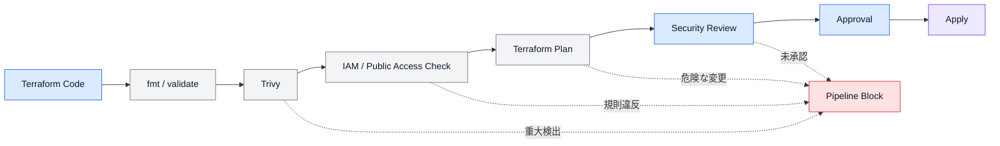

---

## 9.76 IAM変更レビュー

IAM変更では、最低限以下を確認する。

* 新しいAction
* 削除されたAction
* Resource範囲
* Wildcard
* Condition
* Trust Policy
* Principal
* `iam:PassRole`
* Permission Boundary
* Cross-account Access
* Session Duration
* AWS Managed Policy
* Role Attachment
* Policy Version
* 権限昇格の可能性
* 他環境へのアクセス

IAM Policyの差分は、Terraform PlanだけでなくPolicy内容も確認する。

---

## 9.77 高リスク変更

以下は高リスクなセキュリティ変更として扱う。

* AdministratorAccessの追加
* IAM Wildcardの追加
* Resource `*`の追加
* Trust Policyへの新しいPrincipal追加
* Cross-account Access追加
* Permission Boundary変更・削除
* `iam:PassRole`範囲拡大
* Public Access有効化
* Security Groupの`0.0.0.0/0`追加
* KMS Key Policy変更
* Secret Resource Policy変更
* S3 Bucket Policy変更
* Encryption無効化
* Logging無効化
* Deletion Protection無効化
* Stateアクセス権限拡大

高リスク変更は、自動Applyせず追加承認を必要とする。

---

## 9.78 セキュリティ変更フロー

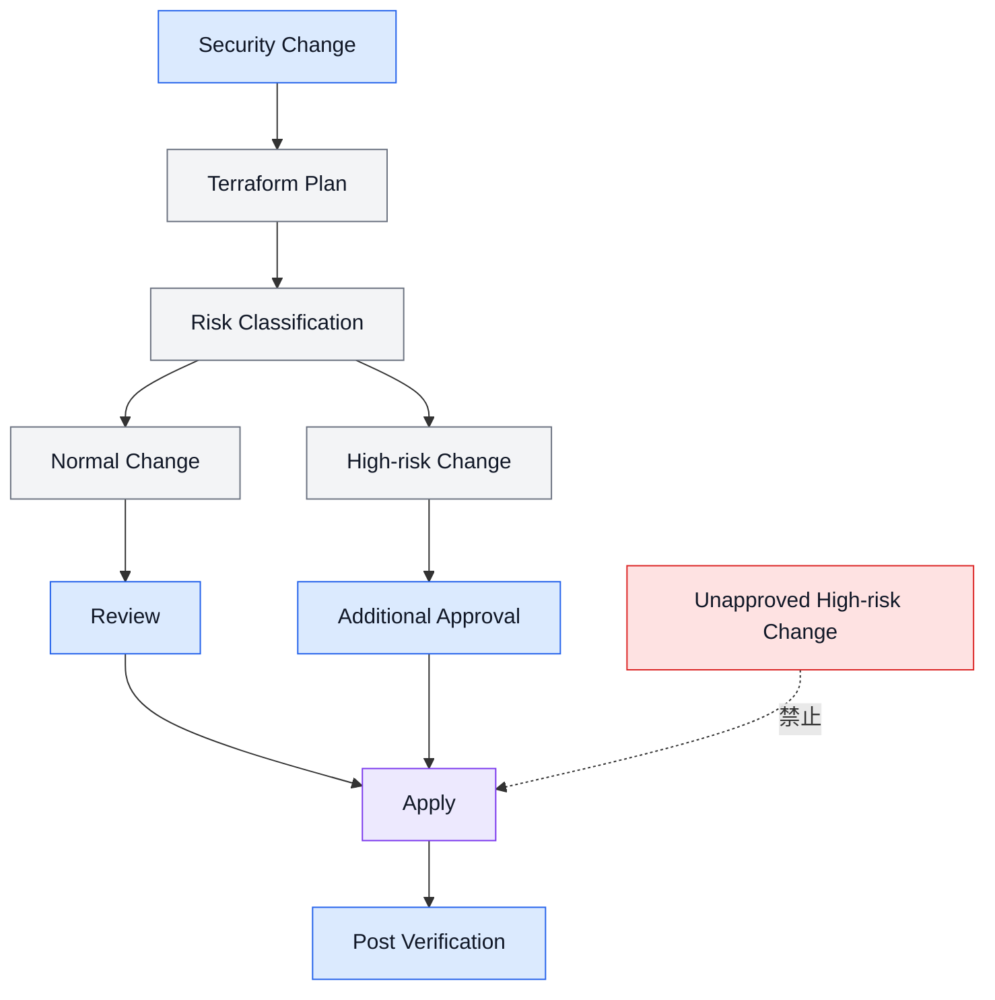

---

## 9.79 Security Group変更レビュー

Security Group変更では、以下を確認する。

* Inbound・Outbound
* Protocol
* Port
* Source・Destination
* CIDR
* Security Group参照
* IPv4・IPv6
* Description
* Public Access
* Database Port
* Management Port
* Environment
* 既存Ruleの削除
* 通信断の可能性

`0.0.0.0/0`および`::/0`を追加する場合は、公開理由を明確にする。

---

## 9.80 機密情報検出

CI/CDおよびGitHubでは、Secret検出の導入を検討する。

検出対象例：

* AWS Access Key
* Private Key
* Password
* API Token
* OAuth Secret
* Database Connection String
* GitHub Token
* Terraform Variable内のSecret

SecretがGitへCommitされた場合は、削除だけでなく認証情報を無効化・Rotationする。

Git履歴に残ったSecretを有効なままにしない。

---

## 9.81 Break-glass Access

CI/CDや通常認証が利用できない緊急時に備えて、Break-glass Accessを設計できる。

Break-glass Accessでは以下を必須とする。

* 通常時は使用しない
* 利用者を限定する
* MFAを必須とする
* 利用時に承認を必要とする
* 利用開始を通知する
* 操作をCloudTrailへ記録する
* Session Durationを限定する
* 利用後に認証情報をRotationする
* 実施内容を事後レビューする

Break-glass Roleへ無条件なAdministratorAccessを付与する場合は、組織の緊急アクセス方針で厳格に管理する。

---

## 9.82 例外管理

標準セキュリティ要件を満たせない場合は、例外として管理する。

例外例：

* 一時的なPublic Access
* Wildcard IAM Permission
* 暗号化未対応
* Trivy Rule除外
* Security Groupの広範な通信許可
* 長期Access Key
* Permission Boundary未適用
* Logging未設定
* Backup未設定

例外には、有効期限を設定する。

恒久的な例外とする場合は、本標準自体の見直しまたは明確なADRを必要とする。

---

## 9.83 例外記録

セキュリティ例外では、以下を記録する。

* 例外ID
* 対象Environment
* 対象Project
* 対象Resource
* 標準から外れる項目
* 必要な理由
* リスク
* 代替統制
* 承認者
* 開始日
* 有効期限
* 解消方法
* 再確認日
* 担当者

有効期限を過ぎた例外は、再承認または解消する。

---

## 9.84 Drift

IAM Policy、Security Group、KMS PolicyおよびResource Policyの手動変更は、重大なDriftとして扱う。

Driftを検出した場合は、以下のいずれかを実施する。

1. 手動変更をTerraformコードの状態へ戻す。
2. 手動変更が正しい場合はTerraformコードへ反映する。
3. 管理対象外へ変更する場合はADRとState変更を実施する。

セキュリティDriftを長期間放置してはならない。

---

## 9.85 手動変更

緊急時にAWSコンソールからセキュリティ設定を変更した場合は、以下を実施する。

* 変更理由を記録する。
* 実施者を記録する。
* 実施日時を記録する。
* 対象Environmentを記録する。
* 対象Resourceを記録する。
* 変更前後の設定を記録する。
* Terraformコードへ反映する。
* Terraform Planを確認する。
* CI/CDから正式な状態を再適用する。
* 事後レビューを実施する。

手動変更を恒久的な運用方法として使用しない。

---

## 9.86 セキュリティレビュー頻度

以下を定期的に確認する。

* IAM Roleの利用状況
* 未使用IAM User
* 未使用Access Key
* Access Keyの最終利用日
* IAM PolicyのWildcard
* Trust Policy
* Cross-account Access
* Permission Boundary
* Security Group
* Public Access
* KMS Key
* Secret Rotation
* Trivy除外
* セキュリティ例外
* Stateアクセス権限
* Artifactアクセス権限
* GitHub OIDC Trust Policy

頻度は環境とリスクに応じて決定する。

prd環境および高権限Roleは、devより高い頻度で確認する。

---

## 9.87 IAM Access Key

Access Keyを使用する場合は、以下を必須とする。

* 利用目的
* 対象User
* 対象Environment
* 必要なPolicy
* 作成日
* Rotation日
* 有効期限
* 最終利用日
* 保管場所
* 廃止手順

Access KeyをTerraform Outputへ出力してはならない。

Access Key SecretをTerraform Stateへ保存してはならない。

---

## 9.88 MFA

人が使用するIAM Userまたは緊急Roleでは、MFAを必須とすることを検討する。

MFAがない場合に高権限操作を拒否するPolicy Conditionを利用できる。

CI/CDやAWSサービスRoleにはMFAを適用しない。

人による操作と機械による操作を分離する。

---

## 9.89 Region制限

必要に応じて、Terraform実行RoleやPermission Boundaryで利用リージョンを制限する。

制限する場合は、以下を考慮する。

* IAMなどのGlobal Service
* Route 53
* CloudFront
* us-east-1が必要なACM
* STS
* Support関連API
* AWSサービスの内部動作

単純なリージョンDenyにより必要なGlobal APIを停止しないようにする。

---

## 9.90 タグによる権限制御

必須タグを利用して、Resourceアクセスを制限できる。

例：

```hcl
condition {
  test     = "StringEquals"
  variable = "aws:ResourceTag/Environment"

  values = [
    var.environment
  ]
}
```

Resource作成時には、Request Tagを要求することも検討する。

```hcl
condition {
  test     = "StringEquals"
  variable = "aws:RequestTag/ManagedBy"

  values = [
    "Terraform"
  ]
}
```

タグ制御を使用する場合は、Tag付与前の作成APIやTag非対応Resourceを考慮する。

---

## 9.91 Terraform実行RoleのState権限

Terraform実行RoleのState権限は、対象Object Keyへ限定する。

例：

```text
Bucket:
dev--kintai--terraform-state--s3

許可Key:
products/kintai/dev/compute/compute.tfstate
```

必要な操作例：

* `s3:GetObject`
* `s3:PutObject`
* `s3:ListBucket`
* 必要に応じたVersion操作
* DynamoDB Lock操作

他Stateの読み取りが必要な場合は、Remote State参照対象だけを追加する。

すべてのStateを読み書きできる権限を付与しない。

---

## 9.92 Remote Stateの権限

Remote State参照では、参照先Stateに対する読み取り権限のみを付与する。

例：

```text
Compute Role
  Read:
    network.tfstate
    security.tfstate

  Write:
    compute.tfstate
```

Compute RoleがNetwork StateやSecurity Stateを更新できないようにする。

---

## 9.93 State権限構成図

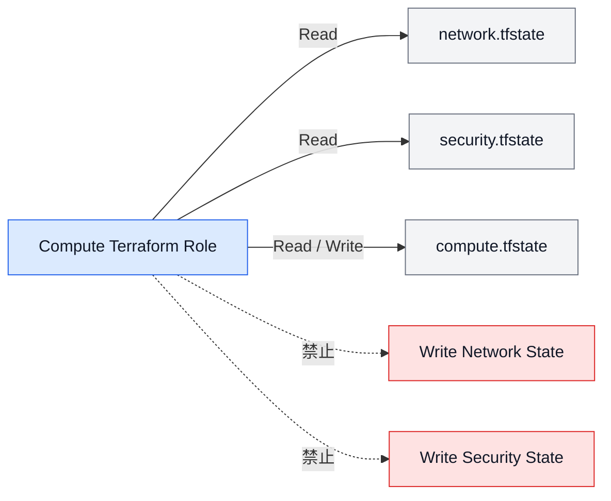

---

## 9.94 S3 State Bucket Policy

State Bucket Policyでは、以下を制御する。

* HTTPS Only
* Public Access拒否
* 許可されたTerraform実行Role
* 必要に応じたCodeBuild Role
* 対象AWSアカウント
* Object Key
* 暗号化条件
* 不要なDeleteの制限

State復旧に必要な管理権限は、通常実行Roleと分離することを検討する。

---

## 9.95 Deny Policy

Explicit Denyは、以下のような共通統制で使用できる。

* 非HTTPS通信拒否
* Public Access禁止
* Permission Boundary削除禁止
* 特定Region外の操作禁止
* 暗号化なしResource作成禁止
* 必須タグなしResource作成禁止
* State Object削除禁止

Deny Policyは影響範囲が大きいため、適用前に対象APIと例外を確認する。

---

## 9.96 セキュリティテスト

Terraformコード変更時は、以下を確認する。

```bash
terraform fmt -check -recursive
terraform validate
trivy config .
terraform plan
```

必要に応じて、以下を追加する。

* IAM Policy Validator
* Secret Scan
* TFLint
* Checkov
* 独自Policy Check
* Tag Check
* Public Access Check
* Wildcard Check
* Plan JSON解析

同じ検査を過剰に重複させず、検査目的を明確にする。

---

## 9.97 セキュリティチェックリスト

### IAM Role

* [ ] Roleの用途が1つに限定されている
* [ ] EnvironmentとProjectが明確である
* [ ] Trust PolicyのPrincipalが限定されている
* [ ] 必要なConditionが設定されている
* [ ] Session Durationが適切である
* [ ] Permission Boundaryが設定されている
* [ ] AdministratorAccessがない
* [ ] 不要なAWS Managed Policyがない

### IAM Policy

* [ ] 必要なActionだけを許可している
* [ ] Resourceを限定している
* [ ] Wildcardの理由が明確である
* [ ] 必要なConditionがある
* [ ] `iam:PassRole`が限定されている
* [ ] Cross-account Accessを確認した
* [ ] 権限昇格が発生しない
* [ ] `aws_iam_policy_document`を使用している

### Terraform実行Role

* [ ] 環境ごとに分離されている
* [ ] プロジェクトごとに分離されている
* [ ] 責務ごとに分離されている
* [ ] 対象Stateだけを書き込める
* [ ] Remote Stateは読み取りのみである
* [ ] 他環境へアクセスできない
* [ ] 他プロダクトへアクセスできない
* [ ] CodeBuild Roleと分離されている

### GitHub Actions

* [ ] OIDCを使用している
* [ ] 長期Access Keyを使用していない
* [ ] Organizationを限定している
* [ ] Repositoryを限定している
* [ ] Branchを限定している
* [ ] CodeCommit同期以外の権限がない
* [ ] Terraform実行Roleと分離されている

---

## 9.98 Secretチェックリスト

* [ ] Secret値がTerraformコードにない
* [ ] Secret値がtfvarsにない
* [ ] Secret値がbackend.hclにない
* [ ] Secret値がREADMEにない
* [ ] Secret値がGitHub Actionsに平文でない
* [ ] Secret値がBuildspecにない
* [ ] Secret値がTerraform Outputにない
* [ ] Secret値がCI/CDログに出ていない
* [ ] Secret ARNだけをTerraformで扱っている
* [ ] SecretへのIAM権限が対象ARNに限定されている
* [ ] Rotation要件を確認した
* [ ] Secret登録手順が定義されている

---

## 9.99 ネットワークチェックリスト

* [ ] RDSがPrivate Subnetにある
* [ ] ECS Taskが必要に応じてPrivate Subnetにある
* [ ] Public IPの必要性を確認した
* [ ] Security GroupのInboundが限定されている
* [ ] Database PortがInternetへ公開されていない
* [ ] SSHとRDPがInternetへ公開されていない
* [ ] Security Group参照を利用している
* [ ] Rule Descriptionがある
* [ ] IPv6の許可範囲を確認した
* [ ] Outbound通信を確認した
* [ ] VPC Endpointの必要性を確認した
* [ ] Public Accessを確認した

---

## 9.100 暗号化チェックリスト

* [ ] S3の暗号化が有効
* [ ] RDSの暗号化が有効
* [ ] DynamoDBの暗号化が有効
* [ ] EFSの暗号化が有効
* [ ] CloudWatch Logsの暗号化要件を確認した
* [ ] Stateの暗号化が有効
* [ ] Artifactの暗号化が有効
* [ ] HTTPS Onlyを設定した
* [ ] TLS通信を使用している
* [ ] KMS Key Policyを確認した
* [ ] KMS Key削除リスクを確認した
* [ ] Secret暗号化を確認した

---

## 9.101 高リスク変更チェックリスト

* [ ] IAM Wildcardの追加がない
* [ ] Resource `*`の追加がない
* [ ] Trust PolicyのPrincipal追加を確認した
* [ ] Cross-account Accessを確認した
* [ ] Permission Boundaryの変更を確認した
* [ ] `iam:PassRole`の拡大を確認した
* [ ] Public Accessの有効化がない
* [ ] `0.0.0.0/0`の追加を確認した
* [ ] KMS Policy変更を確認した
* [ ] Encryption無効化がない
* [ ] Logging無効化がない
* [ ] Deletion Protection無効化を確認した
* [ ] Stateアクセス権限の拡大を確認した
* [ ] 追加承認を取得した

---

## 9.102 禁止事項

IAMおよびセキュリティ設計では、以下を禁止する。

### AdministratorAccess

Terraform実行Role、CodeBuild Role、GitHub Actions RoleへAdministratorAccessを付与してはならない。

### PowerUserAccessの無計画な利用

PowerUserAccessを恒久的なTerraform実行権限として使用してはならない。

### 共通ManagerRole

すべてのプロダクトおよび責務を管理できる共通ManagerRoleを作成してはならない。

### 長期Access Key

GitHub ActionsやCodeBuild認証へ長期Access Keyを使用してはならない。

### SecretのTerraform管理

Secret値をTerraform Resource、Variable、tfvarsまたはOutputへ記述してはならない。

### IAM PassRoleのWildcard

```text
iam:PassRole
Resource: *
```

### Trust Policyの過剰なPrincipal

すべてのAWSアカウント、RepositoryまたはBranchからRoleを引き受けられる設定を禁止する。

### Permission Boundaryの省略

TerraformがIAM Roleを作成する場合に、理由なくPermission Boundaryを省略してはならない。

### Module内の固定ARN

IAM Role ARN、KMS ARN、Secret ARNをModule内へハードコードしてはならない。

### Public S3

Terraform State、Artifact、Log、Backup用S3 Bucketを公開してはならない。

### Public RDS

RDSをPublicly Accessibleにしてはならない。

### Database Port公開

Database Portを`0.0.0.0/0`または`::/0`へ公開してはならない。

### SSH・RDP公開

SSHおよびRDPをInternet全体へ公開してはならない。

### ignore_changesによるセキュリティ差分隠蔽

IAM Policy、Security Group、KMS Policyなどの変更を`ignore_changes`で隠してはならない。

### 手動変更の放置

AWSコンソールで変更したセキュリティ設定をTerraformへ反映せず放置してはならない。

### 無期限の例外

セキュリティ例外を有効期限なしで運用してはならない。

---

## 9.103 全体設計図

```mermaid
flowchart TB

    subgraph HUMAN["Human Access"]
        DEVELOPER["Developer"]
        IDENTITY_CENTER["IAM Identity Center"]
        HUMAN_ROLE["Authorized Role"]
    end

    subgraph SOURCE["Source・CI/CD"]
        GITHUB["GitHub"]
        OIDC["GitHub OIDC"]
        SYNC_ROLE["CodeCommit Sync Role"]
        CODEBUILD["CodeBuild"]
        BUILD_ROLE["CodeBuild Service Role"]
    end

    subgraph TERRAFORM_AUTH["Terraform Authorization"]
        TF_NETWORK["Terraform Network Role"]
        TF_SECURITY["Terraform Security Role"]
        TF_COMPUTE["Terraform Compute Role"]
        TF_DATABASE["Terraform Database Role"]
        BOUNDARY["Permission Boundary"]
    end

    subgraph SECURITY["Security Resources"]
        IAM["IAM Role / Policy"]
        KMS["KMS"]
        SECRETS["Secrets Manager / Parameter Store"]
        SG["Security Group"]
        RESOURCE_POLICY["Resource Policy"]
    end

    subgraph DATA["Protected Resources"]
        STATE["Terraform State"]
        ARTIFACT["Plan Artifact"]
        ECS["ECS"]
        RDS["RDS"]
        S3["S3"]
    end

    DEVELOPER --> IDENTITY_CENTER
    IDENTITY_CENTER --> HUMAN_ROLE

    GITHUB --> OIDC
    OIDC --> SYNC_ROLE

    CODEBUILD --> BUILD_ROLE
    BUILD_ROLE --> TF_NETWORK
    BUILD_ROLE --> TF_SECURITY
    BUILD_ROLE --> TF_COMPUTE
    BUILD_ROLE --> TF_DATABASE

    BOUNDARY --> TF_NETWORK
    BOUNDARY --> TF_SECURITY
    BOUNDARY --> TF_COMPUTE
    BOUNDARY --> TF_DATABASE

    TF_SECURITY --> IAM
    TF_SECURITY --> KMS
    TF_SECURITY --> SECRETS
    TF_NETWORK --> SG
    TF_SECURITY --> RESOURCE_POLICY

    TF_NETWORK --> STATE
    TF_SECURITY --> STATE
    TF_COMPUTE --> STATE
    TF_DATABASE --> STATE

    TF_COMPUTE --> ECS
    TF_DATABASE --> RDS
    TF_NETWORK --> S3

    KMS --> STATE
    KMS --> ARTIFACT
    KMS --> RDS
    KMS --> S3

    SG --> ECS
    SG --> RDS
    IAM --> ECS
    SECRETS --> ECS
    RESOURCE_POLICY --> S3

    ADMIN["AdministratorAccess"]
    LONG_KEY["Long-lived Access Key"]
    PLAIN_SECRET["Plaintext Secret"]
    PUBLIC_ACCESS["Unapproved Public Access"]
    CROSS_ENV["Cross Environment Access"]

    ADMIN -.禁止.-> TERRAFORM_AUTH
    LONG_KEY -.禁止.-> SOURCE
    PLAIN_SECRET -.禁止.-> SECRETS
    PUBLIC_ACCESS -.禁止.-> DATA
    CROSS_ENV -.禁止.-> TERRAFORM_AUTH

    classDef orchestration fill:#dbeafe,stroke:#2563eb,color:#111827
    classDef module fill:#dcfce7,stroke:#16a34a,color:#111827
    classDef aws fill:#ffedd5,stroke:#ea580c,color:#111827
    classDef cicd fill:#ede9fe,stroke:#7c3aed,color:#111827
    classDef prohibited fill:#fee2e2,stroke:#dc2626,color:#111827
    classDef config fill:#f3f4f6,stroke:#6b7280,color:#111827

    class DEVELOPER,IDENTITY_CENTER,HUMAN_ROLE,TF_NETWORK,TF_SECURITY,TF_COMPUTE,TF_DATABASE,BOUNDARY orchestration
    class GITHUB,OIDC,SYNC_ROLE,CODEBUILD,BUILD_ROLE cicd
    class IAM,KMS,SECRETS,SG,RESOURCE_POLICY,STATE,ARTIFACT config
    class ECS,RDS,S3 aws
    class ADMIN,LONG_KEY,PLAIN_SECRET,PUBLIC_ACCESS,CROSS_ENV prohibited
```

---

## 9.104 設計原則

本章の設計原則を以下にまとめる。

* 最小権限の原則を適用する。
* 人によるアクセスと機械によるアクセスを分離する。
* IAM Identity CenterおよびAWS OrganizationsはTerraform管理対象外とする。
* IAM Role、IAM PolicyおよびPermission BoundaryはTerraformで管理する。
* IAM UserおよびIAM Groupは必要な場合のみ作成する。
* IAM Userの長期Access Keyを原則として使用しない。
* AWSサービスおよびCI/CDではIAM Roleを使用する。
* Terraform実行Roleを環境、プロジェクトおよび責務単位で分離する。
* 共通ManagerRoleを作成しない。
* CodeBuild Service RoleとTerraform実行Roleを分離する。
* CodeBuild Service RoleはTerraform実行RoleをAssumeRoleする。
* Terraform実行RoleへAdministratorAccessを付与しない。
* Terraformが作成するIAM RoleへPermission Boundaryを適用する。
* Trust PolicyのPrincipal、Repository、BranchおよびAWSサービスを限定する。
* GitHub ActionsのAWS認証には原則としてOIDCを使用する。
* GitHub Actions用RoleはCodeCommit同期権限だけを持つ。
* IAM Policyは可能な限り`aws_iam_policy_document`で作成する。
* IAM PolicyのAction、ResourceおよびConditionを必要最小限にする。
* IAM Wildcardには明確な理由と代替統制を必要とする。
* `iam:PassRole`の対象RoleとPassedToServiceを限定する。
* security責務以外のTerraform実行RoleへIAM管理権限を付与しない。
* ECS Task RoleとTask Execution Roleを分離する。
* Secret値をTerraformコード、tfvars、State、Planおよびログへ保存しない。
* TerraformではSecretコンテナ、Policy、KMSおよび参照設定を管理する。
* Secret値は安全な別手順で登録する。
* 保存データおよび通信経路を暗号化する。
* Customer Managed KMS Keyは要件がある場合に作成する。
* Public Accessを原則として禁止する。
* RDSおよび内部ResourceをPrivate Subnetへ配置する。
* Security Groupは必要な通信だけを許可する。
* Security Group参照をCIDR指定より優先する。
* Database Port、SSHおよびRDPをInternet全体へ公開しない。
* VPC EndpointとEndpoint Policyの利用を要件に応じて検討する。
* Resource PolicyではPrincipal、SourceArnおよびSourceAccountを限定する。
* StateおよびPlan Artifactへのアクセスを厳格に制限する。
* Terraform実行Roleは自Stateへ読み書きし、Remote Stateは読み取りだけとする。
* CloudTrail、CI/CDログ、GitおよびPlan Artifactによって変更を追跡する。
* Trivyなどによるセキュリティ検査をCI/CDで実行する。
* 高リスクなIAM、Public Access、KMSおよびSecurity Group変更には追加承認を必要とする。
* セキュリティ例外には理由、代替統制、承認者および有効期限を設定する。
* 手動セキュリティ変更はTerraformコードへ反映し、Driftを解消する。
