# 第10章 運用・例外・変更管理

## 10.1 本章の目的

本章では、Terraform Framework Standard v1.0で管理するAWSインフラの通常運用、変更管理、例外管理、障害対応、State操作、Drift対応、廃止および監査記録のルールを定義する。

Terraformコード、State、CI/CDおよびAWSリソースの設計が適切であっても、運用ルールが不明確な場合は、以下の問題が発生する可能性がある。

* 承認されていないAWSリソース変更
* Terraformコードと実環境の不一致
* ローカルApplyによる変更履歴の欠落
* 緊急対応後の手動変更の放置
* State操作によるAWSリソースの再作成
* Terraform Lockの不適切な強制解除
* 本番環境での意図しない削除
* 例外設定の恒久化
* 担当者しか分からない属人的な運用
* 障害対応時の判断遅延
* プロダクト廃止時のリソース残存
* 変更理由、承認者および実施結果を追跡できない状態

本標準では、通常変更、緊急変更、例外変更およびState変更を明確に分類し、それぞれに必要なレビュー、承認、実施および記録方法を定義する。

---

## 10.2 基本方針

運用・例外・変更管理では、以下の方針を採用する。

* AWSリソースの通常変更はTerraformコードから実施する。
* Terraform ApplyはCodePipelineおよびCodeBuildから実行する。
* dev環境を含め、ローカルApplyを禁止する。
* 通常運用で`terraform destroy`を使用しない。
* すべての変更をPull Requestへ記録する。
* Apply前にTerraform Planを確認する。
* 削除または置換を含む変更は通常変更と分離する。
* 緊急変更でも、可能な限りTerraformコードとPlanを使用する。
* AWSコンソールからの直接変更は緊急時に限定する。
* 手動変更後はTerraformコードへ反映し、Driftを解消する。
* State操作は通常変更より厳格に管理する。
* State変更ではADR、手順書、承認および実施記録を必須とする。
* 例外には理由、影響範囲、代替統制、有効期限および解消条件を設定する。
* 障害時はStateと実環境の両方を確認する。
* Apply失敗時は無条件に同じPlanを再利用しない。
* RollbackよりFix Forwardを基本とする。
* 変更、承認、実行および結果を追跡可能にする。
* 運用手順は`docs/operation/`で管理する。
* 重要な設計判断はADRで管理する。
* 廃止時はAWSリソース、State、CI/CD、IAMおよびドキュメントを一貫して整理する。

---

## 10.3 運用対象

本章の運用ルールは、以下を対象とする。

| 対象              | 主な運用内容                            |
| --------------- | --------------------------------- |
| Terraformコード    | 変更、レビュー、Version管理                 |
| Root Module     | Plan、Apply、依存関係管理                 |
| Module          | 利用先確認、後方互換性管理                     |
| Terraform State | Lock、移行、復旧、廃止                     |
| Backend         | S3、DynamoDB、権限、設定変更               |
| CI/CD           | Pipeline、CodeBuild、承認、Artifact    |
| IAM             | 実行Role、Policy、Permission Boundary |
| AWSリソース         | 作成、更新、障害対応、廃止                     |
| Secret          | 登録、Rotation、参照権限                  |
| ドキュメント          | README、ADR、運用手順、変更記録              |
| 例外              | 申請、承認、有効期限、解消                     |
| Drift           | 検出、評価、修正、記録                       |

---

## 10.4 運用全体構成

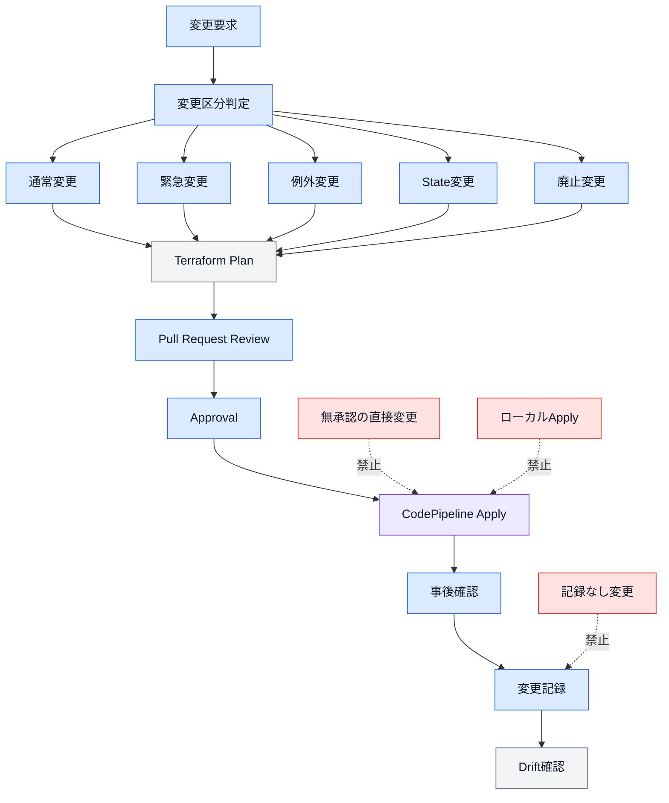

---

## 10.5 変更区分

TerraformおよびAWSリソースの変更は、以下に分類する。

| 変更区分    | 内容                                 |
| ------- | ---------------------------------- |
| 通常変更    | 計画的に実施する一般的な追加・更新                  |
| 軽微変更    | 動作や構成へ影響しない文書・表現・コメント修正            |
| 高リスク変更  | 削除、置換、IAM、KMS、Public Accessなどを含む変更 |
| 緊急変更    | 障害復旧や重大影響の回避を目的とする変更               |
| 例外変更    | 標準ルールを一時的または恒久的に外れる変更              |
| State変更 | Import、State移動、Address変更、Backend変更 |
| 廃止変更    | プロダクト、機能、責務、State、Pipelineの廃止      |

変更区分は、作業開始前に決定する。

変更途中でリスクや影響範囲が拡大した場合は、変更区分を見直す。

---

## 10.6 通常変更

通常変更の例を以下に示す。

* 新しいAWSリソースの追加
* Resource属性の変更
* Module Inputの変更
* CloudWatch Alarmの追加
* Security Group Ruleの限定的な変更
* ECS Task Definitionの変更
* Tagの追加
* Parameterの変更
* CI/CD設定の変更
* READMEや構成図の更新

通常変更では、以下を必須とする。

1. 作業ブランチの作成
2. Terraformコードの変更
3. `terraform fmt`
4. `terraform validate`
5. Trivyなどの静的検査
6. Terraform Plan
7. Pull Request
8. レビュー
9. Apply承認
10. CodePipelineからのApply
11. Apply後確認
12. ドキュメント更新

---

## 10.7 通常変更フロー

```mermaid
flowchart LR

    BRANCH["作業ブランチ"]
    CHANGE["Terraformコード変更"]
    CHECK["fmt / validate / Trivy"]
    PLAN["Terraform Plan"]
    PR["Pull Request"]
    REVIEW["Review"]
    APPROVAL["Approval"]
    APPLY["CodePipeline Apply"]
    POST["Post Check"]
    CLOSE["変更完了"]

    BRANCH --> CHANGE
    CHANGE --> CHECK
    CHECK --> PLAN
    PLAN --> PR
    PR --> REVIEW
    REVIEW --> APPROVAL
    APPROVAL --> APPLY
    APPLY --> POST
    POST --> CLOSE

    FAILURE["検査・Plan失敗"]
    CHECK -.失敗.-> FAILURE
    PLAN -.想定外差分.-> FAILURE
    FAILURE -.修正.-> CHANGE

    classDef orchestration fill:#dbeafe,stroke:#2563eb,color:#111827
    classDef module fill:#dcfce7,stroke:#16a34a,color:#111827
    classDef aws fill:#ffedd5,stroke:#ea580c,color:#111827
    classDef cicd fill:#ede9fe,stroke:#7c3aed,color:#111827
    classDef prohibited fill:#fee2e2,stroke:#dc2626,color:#111827
    classDef config fill:#f3f4f6,stroke:#6b7280,color:#111827

    class BRANCH,CHANGE,PR,REVIEW,APPROVAL,POST,CLOSE orchestration
    class CHECK,PLAN config
    class APPLY cicd
    class FAILURE prohibited
```

---

## 10.8 軽微変更

以下は軽微変更として扱うことができる。

* 誤字脱字の修正
* Markdownの表現改善
* コメントの改善
* Mermaid図のレイアウト変更
* READMEへの説明追加
* AWSリソースへ影響しないテンプレート修正
* コード動作へ影響しない空白・整形修正

軽微変更であっても、Pull Requestを使用する。

Terraformコードを含む場合は、`terraform fmt`および`terraform validate`を実施する。

AWSリソースへ影響しないことが明確な場合は、Terraform Planを省略できる。

Planを省略した場合は、Pull Requestへ理由を記載する。

---

## 10.9 高リスク変更

以下は高リスク変更として扱う。

* AWSリソース削除
* Resource Replacement
* RDS、S3、KMSなどデータ保持Resourceの変更
* IAM Policyの権限拡大
* Trust PolicyへのPrincipal追加
* Permission Boundaryの変更
* Public Accessの有効化
* Security Groupへの広範な通信許可
* Backend変更
* State Key変更
* Terraform実行Role変更
* KMS Key Policy変更
* Deletion Protectionの無効化
* Backup設定の無効化
* Logging設定の無効化
* Route TableやDNSの大幅な変更
* prd環境の停止につながる変更

高リスク変更では、通常変更に加えて追加レビューおよび追加承認を必要とする。

---

## 10.10 高リスク変更の必須事項

高リスク変更では、以下を記載する。

* 変更理由
* 対象Environment
* 対象Project
* 対象Root Module
* 対象State
* 対象AWSリソース
* 変更前の状態
* 変更後の状態
* 影響範囲
* 停止時間
* データ消失リスク
* 依存Resource
* Backup状況
* RollbackまたはFix Forward方法
* 作業予定日時
* 実施者
* 承認者
* 事後確認項目

理由が不明確な高リスク変更は実施しない。

---

## 10.11 削除を伴う変更

Terraform Planに`delete`が含まれる場合は、通常の更新と分離することを推奨する。

削除変更では、以下を確認する。

* 削除対象が正しい
* 削除対象がTerraform管理Resourceである
* 他Resourceから参照されていない
* Remote State Outputが利用されていない
* データBackupが完了している
* 削除後の運用影響を確認している
* DNS、Monitoring、Notificationを確認している
* Stateからのみ削除するのか、実Resourceも削除するのか明確である
* 削除後のコストおよび残存Resourceを確認する
* 復元方法が定義されている

---

## 10.12 Replacement

Terraform Planで以下が表示される場合は、Resource Replacementとして扱う。

```text
-/+
```

またはPlan JSONに以下の組み合わせが含まれる場合。

```text
delete
create
```

Replacementでは、以下を確認する。

* Resourceが停止するか
* Resource IDやARNが変わるか
* IP Addressが変わるか
* DNS切り替えが必要か
* データ移行が必要か
* IAM Policyの参照先が変わるか
* Remote State Outputが変わるか
* Monitoring対象が変わるか
* 下流Stateへ影響するか

意図しないReplacementが含まれる場合はApplyしない。

---

## 10.13 緊急変更

緊急変更は、以下のような状況で使用する。

* 本番障害の復旧
* セキュリティインシデントへの対応
* データ損失の防止
* サービス停止の回避
* 重大なコスト増加の停止
* 認証・権限障害の復旧
* CI/CD基盤障害時の復旧
* State LockやState破損への対応

緊急性だけを理由に、確認や記録をすべて省略してはならない。

---

## 10.14 緊急変更の優先順位

緊急変更では、以下の優先順位で実施方法を選択する。

1. 通常のCodePipelineからTerraform変更を実施する。
2. CodePipelineの一部を手動起動して実施する。
3. 承認済みの例外手順からTerraformを実行する。
4. AWSコンソールまたはAWS CLIから最小限の手動変更を実施する。

AWSコンソールからの直接変更は、他の方法では復旧が間に合わない場合に限定する。

---

## 10.15 緊急変更フロー

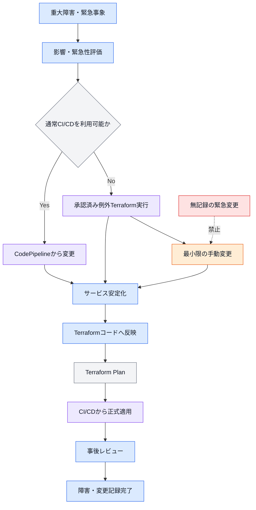

---

## 10.16 緊急変更の記録

緊急変更では、最低限以下を記録する。

* 発生日時
* 検知者
* 障害内容
* 影響範囲
* 対象Environment
* 対象Project
* 対象AWSアカウント
* 対象Resource
* 対象State
* 実施理由
* 実施者
* 承認者
* 実施コマンドまたは操作内容
* 変更前の状態
* 変更後の状態
* 復旧確認
* Terraformコード反映状況
* Drift解消状況
* 再発防止策
* 事後レビュー結果

緊急変更の実施後は、通常変更フローへ戻す。

---

## 10.17 AWSコンソールからの変更

AWSコンソールからの直接変更は、緊急時のみ許可する。

手動変更時は、以下を遵守する。

* 変更範囲を最小限にする。
* 変更前の設定を記録する。
* 変更後の設定を記録する。
* 対象Resourceを明確にする。
* 他Environmentを操作しない。
* 不要なResourceを作成しない。
* 一時的な権限を必要以上に拡大しない。
* 作業完了後にTerraform Planを実行する。
* Terraformコードへ同じ変更を反映する。
* CI/CDから正式な状態を適用する。

---

## 10.18 手動変更後の整合性回復

```mermaid
flowchart LR

    MANUAL["AWSコンソール・CLI変更"]
    STABLE["障害安定化"]
    CODE["Terraformコード修正"]
    PLAN["Terraform Plan"]
    COMPARE["実環境との差分確認"]
    APPLY["CodePipeline Apply"]
    NO_DIFF["No Changes確認"]
    RECORD["記録更新"]

    MANUAL --> STABLE
    STABLE --> CODE
    CODE --> PLAN
    PLAN --> COMPARE
    COMPARE --> APPLY
    APPLY --> NO_DIFF
    NO_DIFF --> RECORD

    ABANDON["手動変更の放置"]
    ABANDON -.禁止.-> NO_DIFF

    classDef orchestration fill:#dbeafe,stroke:#2563eb,color:#111827
    classDef module fill:#dcfce7,stroke:#16a34a,color:#111827
    classDef aws fill:#ffedd5,stroke:#ea580c,color:#111827
    classDef cicd fill:#ede9fe,stroke:#7c3aed,color:#111827
    classDef prohibited fill:#fee2e2,stroke:#dc2626,color:#111827
    classDef config fill:#f3f4f6,stroke:#6b7280,color:#111827

    class MANUAL,STABLE,RECORD orchestration
    class CODE,PLAN,COMPARE,NO_DIFF config
    class APPLY cicd
    class ABANDON prohibited
```

---

## 10.19 例外管理

標準ルールを満たせない場合は、例外として管理する。

例外の例を以下に示す。

* 一時的なPublic Access
* IAM Wildcard
* Permission Boundary未適用
* Trivy Rule除外
* ローカルTerraform実行
* 一時的な手動AWSリソース管理
* 暗号化未対応
* Backup未設定
* Logging未設定
* 通常とは異なる命名
* Moduleへの特殊実装
* 通常とは異なるState分割
* AWS Managed Policyの一時利用

例外は、ルールを無視するための仕組みではなく、リスクを明示して管理するための仕組みとする。

---

## 10.20 例外申請の必須項目

例外申請には、以下を記載する。

* 例外ID
* 申請日
* 申請者
* 対象Environment
* 対象Project
* 対象Root Module
* 対象Resource
* 対象ルール
* 標準を満たせない理由
* 実施する設定
* 想定リスク
* 影響範囲
* 代替統制
* 承認者
* 開始日
* 有効期限
* 解消条件
* 解消予定日
* 再確認日
* 担当者

---

## 10.21 例外の分類

例外は以下に分類する。

| 例外区分     | 内容                          |
| -------- | --------------------------- |
| 一時例外     | 期限を設けて標準外の構成を許可する           |
| 恒久例外     | 標準適用が困難で、長期的に異なる構成を採用する     |
| 緊急例外     | 障害やセキュリティ対応のため一時的に許可する      |
| ツール例外    | Trivyなどの検出を除外する             |
| 権限例外     | 通常より広いIAM権限を許可する            |
| ネットワーク例外 | 通常より広い通信やPublic Accessを許可する |

恒久例外が複数プロダクトに広がる場合は、例外ではなく標準改訂を検討する。

---

## 10.22 例外承認

例外承認では、以下を確認する。

* 標準を適用できない理由が妥当である
* 影響範囲が明確である
* リスクが評価されている
* 代替統制が存在する
* 有効期限が設定されている
* 解消方法が定義されている
* prdへの影響を確認している
* 他プロダクトへ影響しない
* 例外設定が自動的に拡大しない
* 監視方法が定義されている

承認者が不明な例外は適用しない。

---

## 10.23 例外ライフサイクル

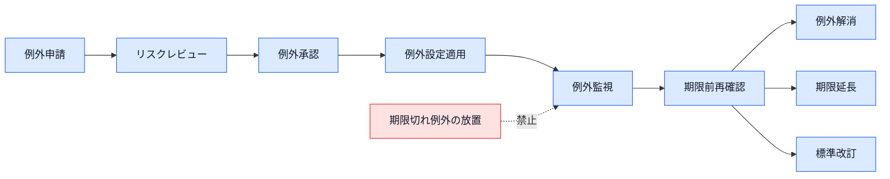

---

## 10.24 例外の有効期限

一時例外および緊急例外には、有効期限を必須とする。

有効期限到達前に、以下のいずれかを実施する。

1. 例外を解消する。
2. 再評価して期限を延長する。
3. 恒久例外へ変更する。
4. 標準自体を改訂する。
5. 対象Resourceを廃止する。

自動的に例外期限を延長してはならない。

---

## 10.25 ADR

Architecture Decision Recordは、重要な設計判断を記録するために使用する。

ADRは、以下へ配置する。

```text
docs/
└── adr/
    ├── ADR-0001-state-splitting.md
    ├── ADR-0002-backend-encryption.md
    └── ADR-0003-emergency-operation.md
```

ADR番号は、ゼロ埋めした連番とする。

```text
ADR-0001
ADR-0002
ADR-0003
```

---

## 10.26 ADRが必要な変更

以下ではADRを必須とする。

* State分割
* State統合
* Backend変更
* ディレクトリ構成変更
* Module階層変更
* CI/CD方式変更
* 環境追加
* 新しい標準責務の追加
* IAM設計の大幅変更
* Permission Boundary変更
* 暗号化方式変更
* 外部Module採用
* 標準から恒久的に外れる構成
* 複数プロダクトへ影響する例外
* Resourceの管理責務変更
* Public Accessの恒久採用

---

## 10.27 ADR構成

ADRには、最低限以下を記載する。

```md
# ADR-XXXX タイトル

## Status

Proposed / Accepted / Deprecated / Superseded

## Context

判断が必要になった背景。

## Decision

採用する設計。

## Alternatives

検討した代替案。

## Consequences

採用によるメリット、デメリット、運用影響。

## Migration

既存構成からの移行方法。

## Rollback

問題発生時の対応。

## References

関連するPull Request、Issue、設計書。
```

---

## 10.28 ADRのStatus

ADRのStatusは以下を使用する。

| Status       | 内容             |
| ------------ | -------------- |
| `Proposed`   | 提案中            |
| `Accepted`   | 採用済み           |
| `Deprecated` | 非推奨            |
| `Superseded` | 別ADRによって置き換え済み |
| `Rejected`   | 不採用            |

採用済みADRを内容だけ書き換えず、新しい判断が必要な場合は新しいADRを作成する。

---

## 10.29 変更記録

Terraform変更では、以下の情報を追跡可能にする。

* Git Commit
* Pull Request
* Review
* Plan Artifact
* Approval
* CodePipeline Execution
* CodeBuild Log
* Terraform実行Role
* Apply結果
* 事後確認
* ADR
* 例外申請
* 障害記録

同じ変更に関連する情報は、Pull Request番号やCommit SHAで関連付ける。

---

## 10.30 変更記録構成図

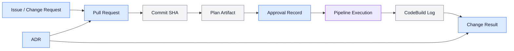

---

## 10.31 変更要求

変更要求では、最低限以下を明確にする。

* 何を変更するか
* なぜ変更するか
* 対象Environment
* 対象Project
* 対象機能
* 期待する結果
* 影響範囲
* 希望実施時期
* 緊急性
* 関係者
* Rollback要否
* ADR要否

目的が不明確な変更は、Terraformコードへ着手しない。

---

## 10.32 変更の分割

Pull Requestは、1つの明確な目的に限定する。

以下を可能な限り分離する。

* 機能追加
* Resource削除
* Provider更新
* Module Refactoring
* State変更
* CI/CD変更
* IAM権限変更
* 命名変更
* ドキュメント変更

複数の高リスク変更を1つのPull Requestへ混在させない。

---

## 10.33 メンテナンス時間

prd環境で停止や性能影響が発生する可能性がある変更は、メンテナンス時間を設定する。

対象例：

* RDS変更
* ElastiCache変更
* ECS Serviceの大幅変更
* ALB Listener変更
* Route Table変更
* DNS変更
* Security Groupの削除
* KMS変更
* IAM Trust Policy変更
* State移行

メンテナンス時間では、以下を明確にする。

* 開始予定時刻
* 終了予定時刻
* 影響するサービス
* 利用者への通知
* 作業者
* 承認者
* 中止判断時刻
* RollbackまたはFix Forward判断

---

## 10.34 変更前確認

変更前に、以下を確認する。

* 対象Branch
* 対象Commit
* 対象Environment
* 対象AWSアカウント
* 対象Root Module
* 対象State
* Backend Bucket
* State Key
* Terraform実行Role
* Plan結果
* 削除・Replacement
* Remote State依存
* Pipeline実行状況
* State Lock
* AWSサービス障害
* Backup
* メンテナンス通知
* 承認状態

---

## 10.35 Go・No-Go判断

prdの高リスク変更では、Apply前にGo・No-Go判断を実施する。

Go条件の例：

* Planが承認内容と一致する
* 削除対象が承認済み
* Backupが完了している
* 依存サービスが正常
* 作業者と承認者が対応可能
* Monitoringが正常
* AWSサービス障害がない
* RollbackまたはFix Forward手順が準備済み

No-Go条件の例：

* Plan内容が変わった
* Source Revisionが変わった
* Backupが未完了
* State Lockが残っている
* 依存Pipelineが実行中
* AWSサービス障害が発生している
* 影響範囲が不明
* 承認者が不在
* 予定した確認担当者が不在

---

## 10.36 Apply後確認

Apply後は、以下を確認する。

* Terraform Applyが成功した
* Stateが保存された
* State Lockが解除された
* 対象Resourceが期待状態である
* 意図しないResourceが作成されていない
* 意図しないResourceが削除されていない
* ECS Serviceが安定している
* ALB TargetがHealthyである
* RDSがAvailableである
* CloudWatch Alarmが異常状態でない
* Application Health Checkが成功する
* Logに重大Errorがない
* Secret参照が正常である
* IAM権限が想定どおりである
* Cost増加要因がない
* `terraform plan`で想定外差分がない

---

## 10.37 事後Plan

重要変更または手動変更後は、Apply後にTerraform Planを実行する。

期待する結果は以下とする。

```text
No changes.
```

差分が残る場合は、以下を確認する。

* AWSサービスによる自動変更
* Providerの正規化
* 手動変更の残存
* `ignore_changes`の要否
* Terraformコード不足
* Resource間依存
* State更新失敗
* Partial Apply

差分を無視して変更完了としてはならない。

---

## 10.38 Drift管理

Driftとは、TerraformコードおよびStateが示す状態と、実際のAWSリソースが異なる状態を指す。

主な原因は以下のとおりである。

* AWSコンソールからの手動変更
* AWS CLIからの手動変更
* 外部システムによる変更
* AWSサービスによる自動変更
* Auto Scaling
* Secret Rotation
* CI/CD以外のTerraform実行
* Partial Apply
* State操作の失敗
* Import漏れ

---

## 10.39 Drift検出

Driftは、以下の方法で検出する。

* Pull Request時のTerraform Plan
* 定期Plan
* 障害発生時のPlan
* 手動変更後のPlan
* AWS Configを利用する場合の変更履歴
* CloudTrail
* セキュリティ検査
* 定期運用レビュー

Drift検出Pipelineから自動Applyしてはならない。

---

## 10.40 Drift対応フロー

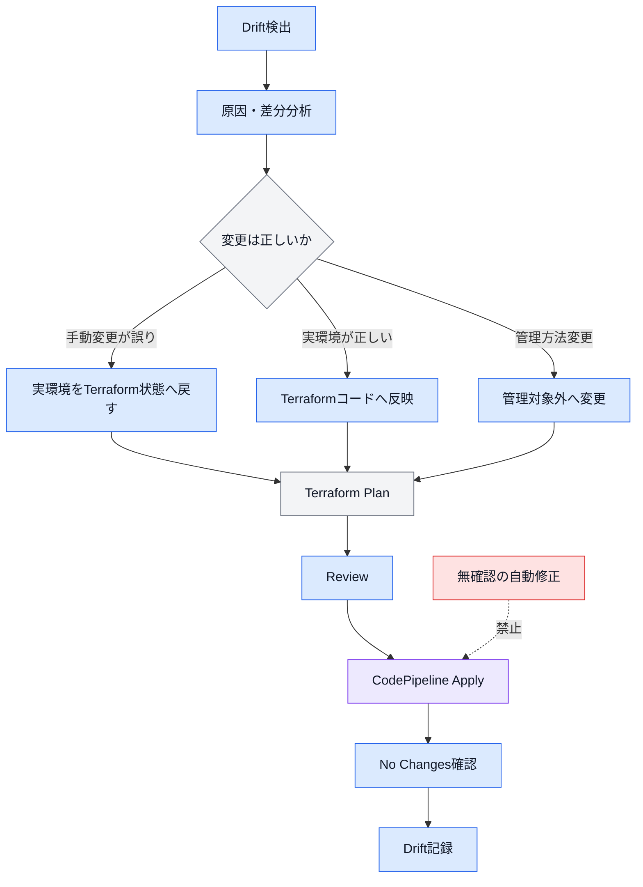

---

## 10.41 許容する外部変更

以下のように、Terraform以外の管理主体が正当に変更する属性は、明確に定義した上で許容できる。

例：

* Application Auto Scalingが変更するECS Desired Count
* Secret Rotationが変更するSecret Version
* AWSサービスが付与する属性
* Deployment Systemが更新するTask Definition Revision
* AWS Backupが作成するRecovery Point

外部変更を許容する場合は、以下を記録する。

* 対象Resource
* 対象属性
* 変更主体
* Terraform管理範囲
* `ignore_changes`の有無
* Drift検出時の扱い
* 責任者

---

## 10.42 ignore_changesの運用

`ignore_changes`は、外部管理主体が存在する属性だけに使用する。

使用時は、READMEまたはADRへ以下を記載する。

* 対象属性
* 外部管理主体
* 利用理由
* 想定される変更
* 監視方法
* 削除条件
* 最終確認日

差分を隠すためだけに`ignore_changes`を追加してはならない。

---

## 10.43 Apply失敗

Terraform Applyが失敗した場合は、以下を確認する。

1. CodeBuildログ
2. Terraform Error
3. AWS API Error
4. State Lock
5. State更新状況
6. AWSリソース作成状況
7. Partial Applyの有無
8. Backendへの接続
9. IAM権限
10. AWS Service Quota
11. Network接続
12. Provider Error
13. Source Revision
14. Plan Artifact

原因を確認せず、同じPipelineを繰り返し実行しない。

---

## 10.44 Partial Apply

Apply途中で失敗した場合は、一部Resourceだけが変更されている可能性がある。

Partial Apply時は、以下を実施する。

* Stateが保存されているか確認する。
* AWSリソースの実状態を確認する。
* State Lockが解除されているか確認する。
* 元のPlan Fileを再利用しない。
* 同じSource Revisionで再Planする。
* 作成済みResourceを確認する。
* 意図しない削除がないことを確認する。
* 修正後に再承認する。
* CodePipelineから再Applyする。

---

## 10.45 Apply失敗対応図

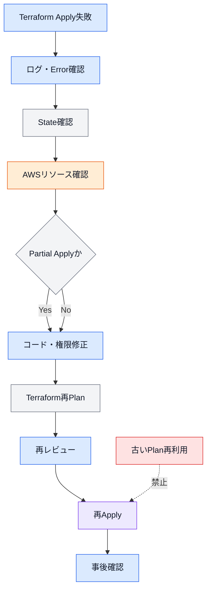

---

## 10.46 Fix Forward

障害や変更失敗時は、原則としてFix Forwardを採用する。

Fix Forwardとは、問題の原因を修正した新しいTerraformコードを作成し、再Planおよび再Applyする方法である。

Fix Forwardを優先する理由は以下のとおりである。

* AWSリソースの状態が既に変わっている可能性がある
* 単純なGit Revertで元に戻らないResourceがある
* データ保持Resourceは以前の状態へ戻せない場合がある
* Stateが既に更新されている可能性がある
* 新しいSource Revisionとして変更履歴を記録できる

---

## 10.47 Revert

Git Revertを使用する場合も、Terraform Planを必須とする。

以下を確認する。

* RevertによるResource削除
* Resource Replacement
* DatabaseやStorageへの影響
* IAM権限の削除
* DNSの切り戻し
* Security Groupの切り戻し
* Remote State Outputの変更
* 下流Stateへの影響
* State Address
* Provider Version

Git Commitを戻しただけで、安全なRollbackが完了したと判断してはならない。

---

## 10.48 Rollback

Rollbackを実施する場合は、Resourceごとに方法を判断する。

例：

| Resource            | 主なRollback方法          |
| ------------------- | --------------------- |
| ECS Task Definition | 以前のRevisionへ戻す        |
| ECS Service         | 以前のTask Definitionを指定 |
| Lambda              | 以前のVersionまたはAliasへ戻す |
| RDS                 | SnapshotまたはBackupから復元 |
| S3                  | VersioningからObjectを復元 |
| IAM Policy          | 以前のPolicy内容へ戻す        |
| Security Group      | 以前のRuleをTerraformで再適用 |
| Route 53            | 以前のRecordへ戻す          |
| Terraform State     | S3 Versionを確認して慎重に復旧  |

Stateだけを過去Versionへ戻すと、実環境との不整合が発生するため、無条件に実施してはならない。

---

## 10.49 障害管理

Terraform、CI/CDまたはAWSリソースに関する障害は、以下に分類する。

| 障害区分           | 例                                |
| -------------- | -------------------------------- |
| Terraformコード障害 | 構文、設定値、依存関係の誤り                   |
| State障害        | Lock、破損、Address不整合               |
| Backend障害      | S3、DynamoDB、権限、通信                |
| CI/CD障害        | CodePipeline、CodeBuild、Artifact  |
| IAM障害          | AssumeRole、AccessDenied、PassRole |
| AWSリソース障害      | ECS、RDS、ALBなどの異常                 |
| Drift障害        | 手動変更による不整合                       |
| Provider障害     | Provider不具合、Version差異            |
| 外部依存障害         | GitHub、CodeCommit、AWSサービス障害      |

---

## 10.50 障害対応の基本手順

障害発生時は、以下の順序で対応する。

1. 影響範囲を確認する。
2. 対象Environmentを確認する。
3. 対象AWSアカウントを確認する。
4. 対象Root ModuleおよびStateを確認する。
5. サービス安定化を優先する。
6. 変更履歴を確認する。
7. CodePipelineおよびCodeBuildログを確認する。
8. Terraform Stateを確認する。
9. AWSリソースの実状態を確認する。
10. 原因を特定する。
11. 復旧方法を決定する。
12. Terraformコードへ反映する。
13. Terraform Planを確認する。
14. 承認後にApplyする。
15. 事後確認を実施する。
16. 障害記録と再発防止策を作成する。

---

## 10.51 インシデント重大度

必要に応じて、障害の重大度を以下のように分類する。

| 重大度      | 内容                     |
| -------- | ---------------------- |
| Critical | 本番停止、重大な情報漏えい、データ消失    |
| High     | 本番機能の大幅な制限、重要なセキュリティ異常 |
| Medium   | 一部機能障害、dev環境の停止、運用影響   |
| Low      | 軽微な異常、通知不備、文書不整合       |

重大度に応じて、承認者、対応期限および事後レビューの要否を決定する。

---

## 10.52 State操作

以下はState操作として扱う。

* `terraform import`
* Import Block
* `terraform state mv`
* `moved` Block
* `terraform state rm`
* `removed` Block
* `terraform force-unlock`
* Backend移行
* State分割
* State統合
* State Version復旧
* S3 Object Key変更

State操作は、通常のResource変更よりも慎重に実施する。

---

## 10.53 State操作の共通ルール

State操作では、以下を必須とする。

* ADR
* 対象Environment
* 対象Project
* 対象Root Module
* 対象State
* 対象Resource Address
* 変更前State
* 変更後State
* 実施手順
* Rollback手順
* 実施者
* 承認者
* 実施日時
* 実施前Plan
* 実施後Plan
* S3 State Version ID
* 他Pipeline停止確認
* State Lock確認
* 事後ドキュメント更新

---

## 10.54 State操作フロー

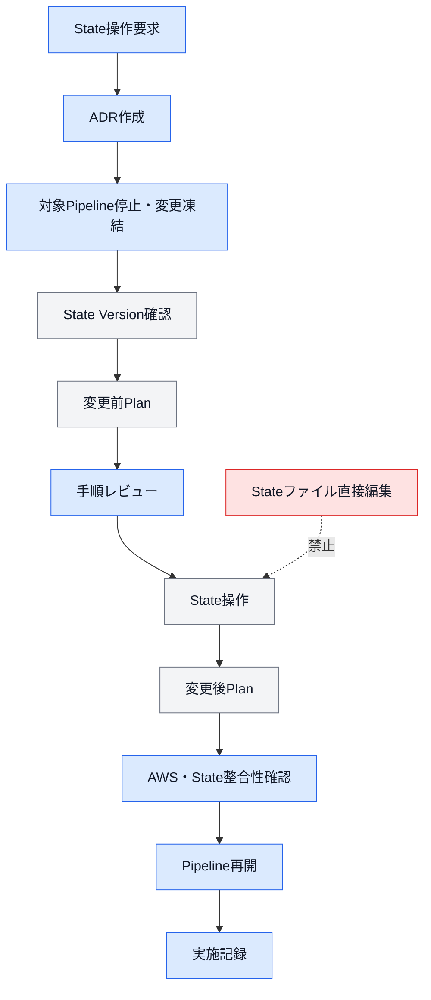

---

## 10.55 terraform import

既存AWSリソースをTerraform管理へ追加する場合は、Importを使用する。

Import前に以下を確認する。

* 対象ResourceがTerraform管理されていない
* 同じResourceを別Stateで管理していない
* Terraformコードが実環境を表現している
* Import先Stateが正しい
* Resource Addressが正しい
* AWS Resource IDが正しい
* Import後のPlanで削除や再作成が発生しない

Import後に想定外差分がある場合は、Applyせずコードを修正する。

---

## 10.56 moved Block

同一State内でResource Addressを変更する場合は、`moved` Blockを優先する。

```hcl
moved {
  from = aws_ecs_cluster.main
  to   = aws_ecs_cluster.this
}
```

`moved` Blockは、すべてのEnvironmentで移行が完了するまで残す。

削除時は、対象Environmentの移行状況を確認する。

---

## 10.57 terraform state mv

State間移行や複雑なAddress変更では、`terraform state mv`を使用できる。

使用例：

* State分割
* State統合
* Root Module間のResource移動
* Module構成変更
* `for_each` Keyへの移行

実行前後に、移動元と移動先の両方でPlanを確認する。

---

## 10.58 terraform state rm

Terraform管理からResourceを外す場合は、`terraform state rm`または`removed` Blockを使用できる。

Stateから外しても、AWSリソース自体は残る。

利用時は以下を明確にする。

* Terraform管理から外す理由
* AWSリソースを残す理由
* 今後の管理主体
* 監視方法
* 削除方法
* 責任者
* セキュリティ影響
* コスト影響

一時的にPlan差分を消す目的で使用してはならない。

---

## 10.59 force-unlock

State Lockが異常に残った場合は、`terraform force-unlock`を使用できる。

実行前に以下を確認する。

* CodePipelineが実行中でない
* CodeBuildが実行中でない
* 他の開発者がTerraformを実行していない
* 対象Stateが変更中でない
* Lock IDが対象Stateのものである
* 直前のApplyが完了または失敗している
* State更新状況を確認している

無条件なForce Unlockは禁止する。

---

## 10.60 State復旧

Stateの復旧が必要な場合は、S3 Versioningを使用して過去Versionを確認する。

State復旧では以下を確認する。

* 現在のState Version
* 復旧対象Version
* Version作成日時
* 対応するTerraform Commit
* 対応するAWSリソース状態
* 復旧によるAddress差分
* Remote State利用先
* 復旧後Plan
* Resource削除・再作成の可能性

Stateだけを過去へ戻して実環境を変更しない方法は、重大な不整合を生む可能性がある。

復旧後は必ずPlanで整合性を確認する。

---

## 10.61 State復旧構成図

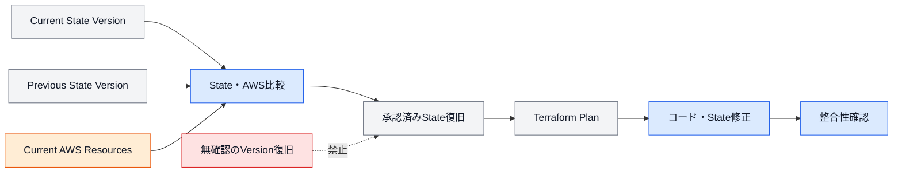

---

## 10.62 Backend変更

Backend変更の例を以下に示す。

* S3 Bucket変更
* DynamoDB Table変更
* S3 Object Key変更
* AWSアカウント変更
* AWSリージョン変更
* SSE-S3からSSE-KMSへの変更
* BackendアクセスRole変更

Backend変更では、State移行が発生する可能性があるため、ADRを必須とする。

変更中は対象Root ModuleのPipelineを停止する。

---

## 10.63 Provider更新

Terraform Providerを更新する場合は、通常の機能変更と分離することを推奨する。

更新時は以下を確認する。

* Provider Release Note
* Breaking Change
* Deprecated属性
* Resource Schema変更
* Default値変更
* Import ID変更
* State Upgrade
* Lock File差分
* 全Module利用先
* dev Plan
* prd Plan
* Resource Replacement

Major Version更新では、ADRまたは専用移行計画を作成する。

---

## 10.64 Terraform Version更新

Terraform本体を更新する場合は、以下を確認する。

* `required_version`
* CodeBuild Image
* ローカルVersion
* State Format
* Provider互換性
* CI/CD Script
* Import・Moved・Removed Block
* Lock File
* 全Root ModuleのValidate
* 全Root ModuleのPlan

Terraform Versionを開発者ごとに個別更新しない。

---

## 10.65 Module変更管理

Module変更時は、利用しているすべてのRoot Moduleを確認する。

変更による影響例：

* 必須Variable追加
* Variable型変更
* Default値変更
* Output変更
* Resource Address変更
* Resource Replacement
* Provider要件変更
* Lifecycle変更
* IAM権限変更

Module変更後は、影響するdevおよびprdのRoot ModuleすべてでPlanする。

---

## 10.66 Module廃止

Moduleを廃止する場合は、以下を確認する。

* 利用中のRoot Moduleがない
* devで利用されていない
* prdで利用されていない
* State内に対象Addressが残っていない
* 代替Moduleへの移行が完了している
* READMEを更新した
* 廃止理由を記録した
* Module利用先Manifestを更新した

利用中Moduleを先に削除してはならない。

---

## 10.67 Root Module廃止

Root Moduleを廃止する場合は、以下を確認する。

* 管理Resourceの扱い
* AWSリソース削除の要否
* State保管
* Remote State利用先
* Output利用先
* Pipeline停止
* CodeBuild削除
* Terraform実行Role削除
* Alarm・Notification停止
* README更新
* ADRまたは廃止記録
* コスト残存

Root Moduleディレクトリを削除する前に、管理対象ResourceとStateの扱いを決定する。

---

## 10.68 プロダクト廃止

プロダクト廃止では、以下の順序を標準とする。

1. 新規変更を停止する。
2. 利用者へ廃止を通知する。
3. データ保管要件を確認する。
4. DNSおよび外部アクセスを停止する。
5. MonitoringとNotificationを整理する。
6. Compute Resourceを停止・削除する。
7. DatabaseおよびStorageをBackupする。
8. Database Resourceを削除する。
9. Security Resourceを削除する。
10. Network Resourceを削除する。
11. Stateを廃止する。
12. PipelineとCodeBuildを停止する。
13. Terraform実行Roleを削除する。
14. CodeCommitやRepositoryの扱いを決定する。
15. Backendの扱いを決定する。
16. ドキュメントを更新する。
17. 残存Resourceとコストを確認する。

---

## 10.69 廃止フロー

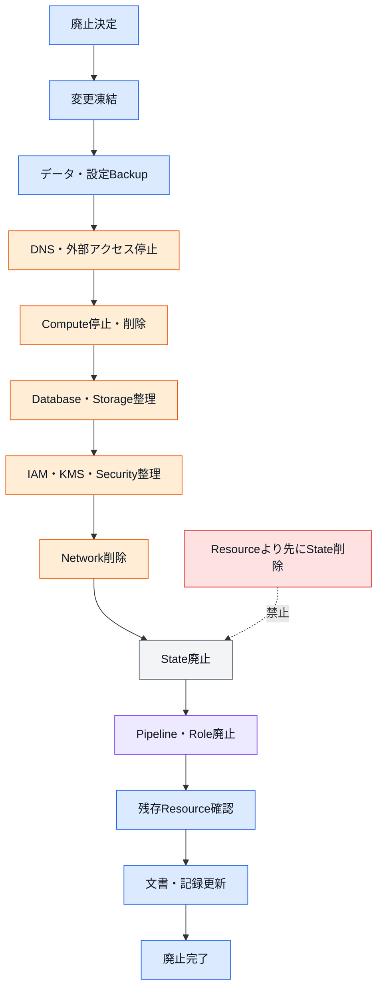

---

## 10.70 State廃止

State廃止前に以下を確認する。

* State内に管理Resourceが存在しない
* 他Stateから参照されていない
* Remote State設定が削除されている
* Terraform Outputが利用されていない
* Pipelineが停止している
* State Lockが存在しない
* State Versionを記録している
* 廃止理由を記録している
* 復旧要否を確認している

State Objectを即座に完全削除せず、定めた保管期間に従って保存する。

---

## 10.71 CI/CD廃止

CodePipelineおよびCodeBuildを廃止する場合は、以下を確認する。

* 対象Root Moduleが廃止済み
* AWSリソースの管理方法が決定済み
* Stateの扱いが決定済み
* Artifactの保管要否を確認済み
* CodeBuild Service Roleが不要
* Terraform実行Roleが不要
* CloudWatch Logsの保管要否を確認済み
* SNS通知が不要
* Drift検出対象から除外済み
* 運用手順を更新済み

Pipelineを削除しても、StateやAWSリソースは自動で削除されない。

---

## 10.72 定期運用

必要に応じて、以下を定期的に確認する。

* Terraform Drift
* Provider Version
* Terraform Version
* Module利用状況
* 未使用Resource
* 未使用IAM Role
* 未使用IAM Policy
* State Lock
* Stateアクセス権限
* Backend Versioning
* Artifact Lifecycle
* Pipeline成功率
* Trivy例外
* セキュリティ例外
* Backup
* CloudWatch Alarm
* コスト
* Tag不足
* READMEおよびADRの更新状況

---

## 10.73 定期運用の例

| 頻度          | 確認内容                                      |
| ----------- | ----------------------------------------- |
| Pipeline実行時 | Plan、Apply、State Lock、Post Check          |
| 週次          | 失敗Pipeline、未解決Alarm、例外期限                  |
| 月次          | Drift、コスト、未使用Resource、IAM                 |
| 四半期         | Provider・Terraform Version、標準見直し          |
| 半期          | Permission Boundary、Trust Policy、Backup復旧 |
| 年次          | Framework全体、廃止Resource、Major更新要否          |

実際の頻度は、Environment、Resourceの重要度および運用負荷に応じて調整する。

---

## 10.74 Drift定期確認

定期Drift確認では、Root Module単位でPlanを実行する。

Driftがない場合：

```text
No changes.
```

Driftがある場合は、自動Applyせず通知する。

通知には以下を含める。

* Environment
* Project
* Root Module
* State
* 検出日時
* 差分概要
* Source Revision
* 調査担当者

---

## 10.75 コスト運用

Terraform変更時は、必要に応じてコスト影響を確認する。

特に以下を追加・変更する場合は注意する。

* NAT Gateway
* RDS
* ElastiCache
* ALB
* VPC Endpoint
* CloudWatch Logs
* Data Transfer
* KMS
* CodeBuild
* CodePipeline
* Backup
* Multi-AZ
* Provisioned Capacity

変更要求またはPull Requestへ、重大なコスト増加の有無を記載する。

---

## 10.76 Quota管理

AWS Service Quotaへ近づく可能性がある変更では、事前にQuotaを確認する。

対象例：

* VPC
* Elastic IP
* NAT Gateway
* ALB
* Target Group
* Security Group Rule
* IAM Role
* IAM Policy
* ECS Service
* Lambda Concurrency
* RDS Instance
* VPC Endpoint

Quota不足によるApply失敗を防止する。

Quota引き上げが必要な場合は、Terraform変更より先に申請する。

---

## 10.77 Backup運用

データ保持Resourceでは、変更前にBackup状況を確認する。

対象例：

* RDS
* DynamoDB
* EFS
* S3
* ElastiCache
* Secrets Manager
* Terraform State
* Pipeline Artifact

Backupが存在することだけでなく、復元可能性も確認する。

重要Resourceでは、復元手順を運用手順書へ記載する。

---

## 10.78 ドキュメント管理

運用関連ドキュメントは以下へ配置する。

```text
docs/
└── operation/
    ├── normal_change.md
    ├── emergency_change.md
    ├── state_operation.md
    ├── drift_response.md
    ├── incident_response.md
    ├── rollback.md
    ├── product_retirement.md
    └── exception_management.md
```

運用手順書には、実行コマンドだけでなく、確認条件、中止条件、承認および事後確認を記載する。

---

## 10.79 Runbook

Runbookは、特定の障害や運用作業を実行するための手順書とする。

Runbookには以下を記載する。

* 目的
* 対象Environment
* 対象Resource
* 前提条件
* 必要権限
* 実施手順
* 確認コマンド
* 正常結果
* 異常結果
* 中止条件
* RollbackまたはFix Forward
* エスカレーション先
* 実施記録

---

## 10.80 Runbookの標準構成

```md
# Runbookタイトル

## 目的

作業または障害対応の目的。

## 対象

- Environment:
- Project:
- Root Module:
- State:
- Resource:

## 前提条件

- 承認
- Backup
- Pipeline停止
- State Lock確認

## 実施手順

1. 手順
2. 手順
3. 手順

## 正常確認

期待する結果。

## 中止条件

作業を停止する条件。

## 復旧方法

Fix ForwardまたはRollback方法。

## 実施記録

- 実施者
- 実施日時
- 結果
```

---

## 10.81 運用権限

運用作業では、作業内容に応じた最小権限を使用する。

| 作業         | 推奨権限                           |
| ---------- | ------------------------------ |
| Plan確認     | Read-onlyおよびState Read         |
| Apply      | 対象Terraform実行Role              |
| Pipeline承認 | Approval権限                     |
| State操作    | 承認済みState管理権限                  |
| Drift確認    | Read-onlyおよびState Read         |
| 障害調査       | Log、Monitoring、対象Resource Read |
| 緊急変更       | 期限付きの承認済みRole                  |

日常的な運用で高権限Roleを使用しない。

---

## 10.82 作業分離

可能な場合は、以下の役割を分離する。

* 変更作成者
* レビュー担当者
* Apply承認者
* 作業実施者
* 事後確認者
* State管理者
* セキュリティ承認者

開発者が1名の場合は、Pull Request、Plan Artifact、Approval記録および事後確認によって自己レビューの履歴を残す。

---

## 10.83 承認記録

承認記録には以下を含める。

* 承認者
* 承認日時
* 対象Environment
* 対象Project
* 対象Root Module
* 対象State
* Commit SHA
* Plan Artifact
* 削除数
* Replacement数
* 高リスク変更の有無
* 例外ID
* コメント

口頭承認だけで本番変更を実施しない。

---

## 10.84 監査証跡

以下を監査証跡として保存する。

* Git履歴
* Pull Request
* Review
* ADR
* 例外申請
* Plan Artifact
* Pipeline Execution
* CodeBuild Log
* Approval
* CloudTrail
* State Version
* 障害記録
* 変更完了記録

監査証跡から、誰が、いつ、何を、なぜ、どのEnvironmentへ変更したかを確認できる状態とする。

---

## 10.85 変更完了条件

変更は、以下を満たした時点で完了とする。

* Applyが成功している
* Post Checkが完了している
* State Lockが解除されている
* 想定外のDriftがない
* ApplicationまたはResourceが正常である
* Monitoringが正常である
* Planと実施結果が一致している
* READMEが更新されている
* ADRが更新されている
* 例外記録が更新されている
* 変更結果が記録されている
* 必要な通知が完了している

Apply成功だけで変更完了と判断しない。

---

## 10.86 禁止事項

運用・例外・変更管理では、以下を禁止する。

### ローカルApply

```bash
terraform apply
```

dev環境を含め、正式なAWSリソース変更をローカルから実施してはならない。

### ローカルDestroy

```bash
terraform destroy
```

### PlanなしApply

Terraform Planを確認せずApplyしてはならない。

### 古いPlanの再利用

Source Revision、Stateまたは実環境が変わった後に、古いPlan Fileを再利用してはならない。

### 無承認変更

承認が必要な変更を、承認なしで実施してはならない。

### 手動変更の放置

AWSコンソールまたはAWS CLIで変更した内容を、Terraformへ反映せず放置してはならない。

### Stateの直接編集

StateファイルをテキストエディタやJSON編集ツールで直接変更してはならない。

### 無確認のForce Unlock

実行中のTerraform処理を確認せず、State Lockを解除してはならない。

### 無期限の例外

例外を有効期限なしで運用してはならない。

### 期限切れ例外の放置

有効期限を過ぎた例外を、再承認なしで継続してはならない。

### Resourceより先にStateを削除

管理対象Resourceが残っている状態で、Stateだけを削除してはならない。

### 失敗原因未確認の再実行

Pipeline失敗の原因を確認せず、再実行を繰り返してはならない。

### Apply成功だけで完了扱い

事後確認を実施せず、変更完了としてはならない。

### 通常PipelineへのDestroy組み込み

通常のCodePipelineへDestroy Stageを追加してはならない。

### 複数目的の変更混在

State変更、Provider更新、IAM変更およびResource削除を、理由なく同じPull Requestへ混在させてはならない。

---

## 10.87 通常変更チェックリスト

### 変更前

* [ ] 変更目的が明確である
* [ ] 対象Environmentを確認した
* [ ] 対象Projectを確認した
* [ ] 対象Root Moduleを確認した
* [ ] 対象Stateを確認した
* [ ] 影響範囲を確認した
* [ ] ADRの要否を確認した
* [ ] 例外の要否を確認した
* [ ] Backupの要否を確認した

### 検証

* [ ] `terraform fmt`を実行した
* [ ] `terraform validate`が成功した
* [ ] Trivyを確認した
* [ ] Terraform Planを確認した
* [ ] 意図しない削除がない
* [ ] 意図しないReplacementがない
* [ ] IAM変更を確認した
* [ ] Security Group変更を確認した
* [ ] コスト影響を確認した

### 実施

* [ ] Pull Requestを作成した
* [ ] Reviewが完了した
* [ ] Apply承認が完了した
* [ ] Source Revisionが一致している
* [ ] CodePipelineからApplyした
* [ ] State Lockが解除された

### 事後

* [ ] AWSリソースを確認した
* [ ] Application Healthを確認した
* [ ] Monitoringを確認した
* [ ] 事後Planを確認した
* [ ] READMEを更新した
* [ ] 変更記録を更新した

---

## 10.88 緊急変更チェックリスト

* [ ] 緊急性を確認した
* [ ] 影響範囲を確認した
* [ ] 通常CI/CDが利用可能か確認した
* [ ] 対象Environmentを確認した
* [ ] 対象AWSアカウントを確認した
* [ ] 対象Resourceを確認した
* [ ] 対象Stateを確認した
* [ ] 実施者を記録した
* [ ] 承認者を記録した
* [ ] 変更前設定を記録した
* [ ] 変更後設定を記録した
* [ ] サービス安定化を確認した
* [ ] Terraformコードへ反映した
* [ ] Terraform Planを確認した
* [ ] CI/CDから正式適用した
* [ ] Driftが解消された
* [ ] 事後レビューを実施した
* [ ] 再発防止策を記録した

---

## 10.89 State操作チェックリスト

* [ ] ADRを作成した
* [ ] 対象Environmentを確認した
* [ ] 対象Root Moduleを確認した
* [ ] 対象Stateを確認した
* [ ] 対象Resource Addressを確認した
* [ ] State Version IDを記録した
* [ ] 実施手順を作成した
* [ ] Rollback手順を作成した
* [ ] Pipelineを停止した
* [ ] 他のTerraform実行がない
* [ ] State Lockを確認した
* [ ] 変更前Planを保存した
* [ ] 承認を取得した
* [ ] State操作を実施した
* [ ] 変更後Planを確認した
* [ ] AWSリソースとの整合性を確認した
* [ ] Pipelineを再開した
* [ ] READMEと構成図を更新した

---

## 10.90 例外管理チェックリスト

* [ ] 例外IDを発行した
* [ ] 対象ルールを明確にした
* [ ] 例外理由を記載した
* [ ] 影響範囲を記載した
* [ ] リスクを評価した
* [ ] 代替統制を定義した
* [ ] 承認者を記録した
* [ ] 開始日を記録した
* [ ] 有効期限を設定した
* [ ] 解消条件を定義した
* [ ] 再確認日を設定した
* [ ] Monitoring方法を定義した
* [ ] 期限前に再評価した
* [ ] 期限切れ例外を放置していない

---

## 10.91 廃止チェックリスト

* [ ] 廃止対象を明確にした
* [ ] 利用者へ通知した
* [ ] 変更を凍結した
* [ ] データ保管要件を確認した
* [ ] Backupを取得した
* [ ] DNSを停止した
* [ ] Monitoringを整理した
* [ ] Notificationを整理した
* [ ] Computeを停止した
* [ ] Database・Storageを整理した
* [ ] IAM・KMSを整理した
* [ ] Networkを整理した
* [ ] Remote State参照を削除した
* [ ] Stateを廃止した
* [ ] Pipelineを停止した
* [ ] Terraform実行Roleを削除した
* [ ] ArtifactとLogの保管を確認した
* [ ] 残存Resourceを確認した
* [ ] 残存コストを確認した
* [ ] ドキュメントを更新した

---

## 10.92 全体設計図

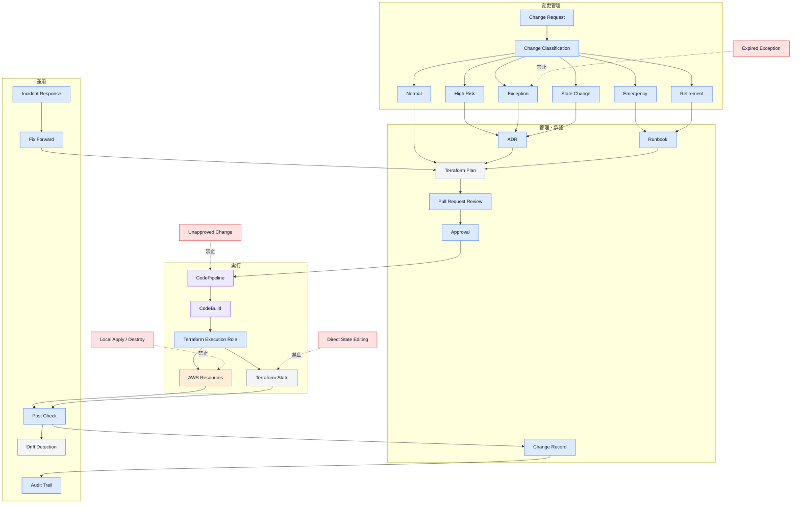

---

## 10.93 設計原則

本章の設計原則を以下にまとめる。

* AWSリソースの通常変更はTerraformコードから実施する。
* Terraform ApplyはCodePipelineおよびCodeBuildから実行する。
* dev環境を含め、ローカルApplyを禁止する。
* 通常運用でTerraform Destroyを使用しない。
* すべての変更をPull Requestへ記録する。
* Apply前にTerraform Planを必須とする。
* 変更を通常、高リスク、緊急、例外、Stateおよび廃止へ分類する。
* 削除およびReplacementを含む変更は追加確認を必要とする。
* 高リスク変更では影響範囲、Backupおよび復旧方法を明確にする。
* 緊急変更でも可能な限りCI/CDとTerraformコードを利用する。
* AWSコンソールからの直接変更は緊急時に限定する。
* 手動変更後はTerraformコードへ反映し、Driftを解消する。
* 例外には理由、リスク、代替統制、承認者および有効期限を設定する。
* 期限切れ例外を自動延長しない。
* 複数プロダクトへ影響する恒久例外は標準改訂を検討する。
* 重要な設計判断にはADRを作成する。
* Apply後はResource、State、MonitoringおよびApplicationを確認する。
* 重要変更後は事後Planで整合性を確認する。
* Drift検出から自動Applyしない。
* Driftの原因を分析し、実環境、コードまたは管理範囲を修正する。
* Apply失敗時はStateとAWSリソースの両方を確認する。
* Partial Apply後は古いPlanを再利用せず、再Planする。
* 障害復旧ではFix Forwardを基本とする。
* Git Revert時もTerraform Planを確認する。
* State操作ではADR、承認、手順書および変更前後Planを必須とする。
* Stateファイルを直接編集しない。
* Force Unlock前に実行中処理を確認する。
* State復旧ではState VersionとAWSリソースの整合性を確認する。
* ProviderおよびTerraform Version更新を機能変更と分離する。
* Module変更時はすべての利用先でPlanする。
* Resourceより先にStateを削除しない。
* プロダクト廃止ではデータ、AWSリソース、State、CI/CD、IAMおよび文書を一貫して整理する。
* 変更者、承認者、Commit、Plan、Applyおよび結果を追跡可能にする。
* 運用手順はRunbookとしてコード管理する。
* Apply成功だけで変更完了とせず、事後確認と記録完了を完了条件とする。
