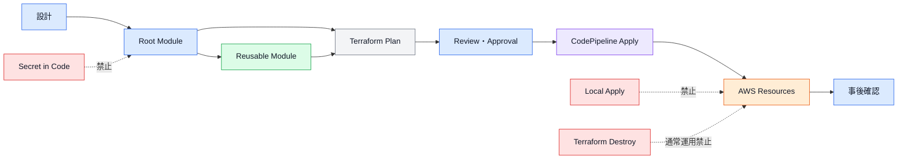

# Terraform Framework Standard クイックリファレンス

## 0. この資料の目的

本資料は、Terraform Framework Standard第1章から第10章の重要事項だけをまとめた実務用リファレンスである。

詳細な背景、例外、移行方法、設計理由を確認する場合は、各章の正式な設計書を参照する。

本資料は、主に以下の場面で使用する。

* 新しいAWSリソースを作成するとき
* 新しいTerraform Moduleを作成するとき
* 新しいRoot Moduleを作成するとき
* Terraformコードをレビューするとき
* Terraform Planを確認するとき
* IAM権限を設計するとき
* Stateを追加・変更するとき
* CI/CDを追加するとき
* 障害やDriftへ対応するとき
* プロダクトやリソースを廃止するとき

---

# 1. 最初に確認する最重要ルール

## 1.1 絶対に守るルール

* Terraform Planを確認せずApplyしない。
* 正式なApplyはCodePipelineおよびCodeBuildから実行する。
* dev環境を含め、ローカルApplyを禁止する。
* 通常運用で`terraform destroy`を使用しない。
* Terraform StateをGitへコミットしない。
* Terraform Stateを直接編集しない。
* Secret値をTerraformコードへ記述しない。
* Secret値を`terraform.tfvars`へ記述しない。
* Secret値をTerraform Outputへ出力しない。
* Secret値をPlanやCI/CDログへ表示しない。
* Root ModuleへAWS Resourceを直接記述しない。
* Moduleから別のModuleを呼び出さない。
* Module内でProviderを設定しない。
* Module内でBackendを設定しない。
* Module内でRemote Stateを参照しない。
* Module内で環境ごとの条件分岐をしない。
* Module内へAWSアカウントIDやResource IDをハードコードしない。
* Resource全体をOutputしない。
* devとprdでStateを共有しない。
* devとprdでTerraform実行Roleを共有しない。
* Terraform実行RoleへAdministratorAccessを付与しない。
* 共通のManagerRoleを作成しない。
* 削除やReplacementを含むPlanを自動Applyしない。
* State Lockを無確認で強制解除しない。
* AWSコンソールからの手動変更を放置しない。
* 例外を有効期限なしで運用しない。

---

## 1.2 リソース作成時の基本フロー

1. 作成するAWSリソースの用途を確認する。
2. CommonかProductsかを判断する。
3. Productsの場合は対象プロダクトを確認する。
4. 対象Environmentを確認する。
5. 配置する責務を決定する。
6. 既存Moduleで作成できるか確認する。
7. 必要なState依存を確認する。
8. 必要なIAM権限を確認する。
9. Resource名と必須タグを決定する。
10. Terraformコードを作成する。
11. `terraform fmt`を実行する。
12. `terraform validate`を実行する。
13. Trivyでセキュリティ設定を確認する。
14. Terraform Planを実行する。
15. 削除・置換・IAM変更を確認する。
16. Pull Requestを作成する。
17. ReviewとApprovalを実施する。
18. CodePipelineからApplyする。
19. AWSリソースの状態を確認する。
20. Apply後のPlanで想定外差分がないことを確認する。

---

## 1.3 全体の流れ



---

# 2. 第1章 要約：基本設計方針

## 2.1 目的

Terraformを使用して、AWSインフラを安全かつ一貫した方法で管理する。

最大20プロダクト程度まで拡張できる構成を目標とする。

初期は開発者1名でも運用でき、開発者増加時にも変更しにくい構成とする。

---

## 2.2 Terraform管理対象

* AWSリソース
* IAM Role
* IAM Policy
* Permission Boundary
* GitHub Actions
* CodeCommit
* CodePipeline
* CodeBuild
* CloudWatch Alarm
* SNS
* EventBridge
* Terraform用CI/CD
* プロダクト固有インフラ
* 共通運用機能

---

## 2.3 Terraform管理対象外

* AWS Organizations
* IAM Identity Center
* IAM Identity Center User
* IAM Identity Center Group
* IAM Identity Center Permission Set
* 人が使用するPassword
* 長期Access Keyの値
* Secret値
* MFA Secret
* 外部IdP設定

---

## 2.4 設計の基本原則

* コードを正本とする。
* AWSコンソールを正本にしない。
* Root ModuleとModuleの責務を分離する。
* Environmentを分離する。
* Projectを分離する。
* Stateを適切な責務単位で分割する。
* State依存を必要最小限にする。
* Moduleを単一責務にする。
* 環境差分を呼び出し側で管理する。
* IAM権限を最小限にする。
* Plan、Review、Approvalを必須とする。
* 実行履歴を追跡できる状態にする。
* 例外や重要な判断を文書化する。

---

# 3. 第2章 要約：リポジトリ・ディレクトリ構成

## 3.1 標準構成

```text
kintai-infra/
├── infra/
│   ├── common/
│   │   ├── dev/
│   │   └── prd/
│   │
│   ├── products/
│   │   └── kintai/
│   │       ├── dev/
│   │       └── prd/
│   │
│   ├── modules/
│   │   ├── ecs/
│   │   ├── iam/
│   │   ├── rds/
│   │   ├── vpc/
│   │   └── cloudwatch/
│   │
│   ├── scripts/
│   └── docs/
│
├── .github/
│   └── workflows/
│
└── README.md
```

---

## 3.2 Common

Commonは、複数プロダクトまたはAWSアカウント全体で利用する共通機能を管理する。

CommonはAWSサービス単位ではなく、機能単位で分割する。

例：

```text
common/
└── dev/
    ├── terraform.tfvars
    ├── batch_start_stop/
    ├── budget_alert/
    ├── backup/
    └── log_export/
```

Commonへ配置する例：

* ECSやRDSの起動停止バッチ
* 共通予算通知
* 共通バックアップ
* 共通ログ転送
* アカウント単位の運用自動化

Commonへ配置しない例：

* 勤怠アプリ専用のECS Service
* 勤怠アプリ専用のRDS
* 勤怠アプリ専用のALB
* 勤怠アプリ専用のSecurity Group

---

## 3.3 Products

Productsは、プロダクト固有のAWSリソースを管理する。

```text
products/
└── kintai/
    ├── dev/
    │   ├── terraform.tfvars
    │   ├── network/
    │   ├── security/
    │   ├── compute/
    │   ├── database/
    │   ├── monitoring/
    │   ├── notification/
    │   └── dns/
    │
    └── prd/
        ├── terraform.tfvars
        ├── network/
        ├── security/
        ├── compute/
        ├── database/
        ├── monitoring/
        ├── notification/
        └── dns/
```

使用しない責務ディレクトリは作成しない。

---

## 3.4 Modules

ModulesはAWSサービスとResource責務単位で作成する。

```text
modules/
├── ecs/
│   ├── cluster/
│   ├── service/
│   └── task_definition/
│
├── iam/
│   ├── role/
│   └── policy/
│
├── vpc/
│   ├── vpc/
│   ├── subnet/
│   ├── route_table/
│   └── security_group/
│
└── rds/
    ├── instance/
    ├── subnet_group/
    └── parameter_group/
```

Module階層は最大2階層とする。

標準形式：

```text
modules/<aws_service>/<responsibility>/
```

---

## 3.5 main.tfの役割

Root Moduleの`main.tf`にはModule呼び出しだけを記述する。

許可：

```hcl
module "ecs_cluster_application" {
  source = "../../../../../modules/ecs/cluster"

  cluster_name = var.ecs_cluster_name
  tags         = local.common_tags
}
```

禁止：

```hcl
resource "aws_ecs_cluster" "application" {
  name = var.ecs_cluster_name
}
```

AWS ResourceはModule内へ定義する。

---

# 4. 第3章 要約：State・Backend

## 4.1 Backend構成

Terraform StateはAmazon S3へ保存する。

State LockにはDynamoDBを使用する。

標準設定：

* S3 Versioning：有効
* S3暗号化：SSE-S3
* Public Access Block：すべて有効
* HTTPアクセス：拒否
* HTTPSアクセス：必須
* DynamoDB Lock：有効
* Stateアクセス権限：最小権限

---

## 4.2 Backend用Resource

Backend用のS3 BucketとDynamoDB Tableは、AWSコンソールで手動作成する。

Backend自身をTerraform管理する構成は採用しない。

作成後は設計書へ以下を記録する。

* AWSアカウントID
* AWSリージョン
* Environment
* Project
* S3 Bucket名
* DynamoDB Table名
* Versioning設定
* 暗号化設定
* Bucket Policy
* 作成者
* 作成日

---

## 4.3 Backend命名

S3 Bucket：

```text
<environment>--<project>--terraform-state--s3
```

例：

```text
dev--kintai--terraform-state--s3
prd--kintai--terraform-state--s3
dev--common--terraform-state--s3
```

DynamoDB Table：

```text
<environment>--<project>--terraform-lock--dynamodb
```

例：

```text
dev--kintai--terraform-lock--dynamodb
prd--common--terraform-lock--dynamodb
```

---

## 4.4 State分割

Productsは責務単位でStateを分割する。

例：

```text
network.tfstate
security.tfstate
compute.tfstate
database.tfstate
monitoring.tfstate
notification.tfstate
dns.tfstate
```

Commonは機能単位でStateを分割する。

例：

```text
batch_start_stop.tfstate
budget_alert.tfstate
backup.tfstate
log_export.tfstate
```

---

## 4.5 StateとRoot Module

原則として、1つのRoot Moduleが1つのStateに対応する。

```text
products/kintai/dev/network
  → network.tfstate

products/kintai/dev/compute
  → compute.tfstate

common/dev/batch_start_stop
  → batch_start_stop.tfstate
```

1つのStateを複数のRoot Moduleから更新しない。

1つのRoot Moduleから複数のStateを更新しない。

---

## 4.6 S3 Object Key

Products：

```text
products/<project>/<environment>/<responsibility>/<responsibility>.tfstate
```

例：

```text
products/kintai/dev/network/network.tfstate
products/kintai/dev/compute/compute.tfstate
products/kintai/prd/database/database.tfstate
```

Common：

```text
common/<environment>/<function>/<function>.tfstate
```

例：

```text
common/dev/batch_start_stop/batch_start_stop.tfstate
```

---

## 4.7 backend.hcl

例：

```hcl
bucket         = "dev--kintai--terraform-state--s3"
key            = "products/kintai/dev/compute/compute.tfstate"
region         = "ap-northeast-1"
dynamodb_table = "dev--kintai--terraform-lock--dynamodb"
encrypt        = true
```

初期化：

```bash
terraform init -backend-config=backend.hcl
```

---

## 4.8 State分割判断

新しいStateを作成する判断基準：

* 責務が異なる
* 変更頻度が異なる
* Terraform実行Roleを分離したい
* ライフサイクルが異なる
* 障害影響を分離したい
* 独立してPlan・Applyしたい
* 既存Stateへ追加すると依存が複雑になる
* Resource数が過剰に増える

新しいStateを作成しない判断：

* 同じ責務に属する
* 常に同時変更される
* 実行Roleが同じ
* ライフサイクルが同じ
* 分割するとRemote State依存が過剰になる

Stateを細かく分けること自体を目的にしない。

---

## 4.9 Remote State

State間の値の受け渡しには`terraform_remote_state`を使用する。

Remote StateはRoot Moduleで参照する。

Module内では参照しない。

例：

```hcl
data "terraform_remote_state" "network" {
  backend = "s3"

  config = {
    bucket         = "dev--kintai--terraform-state--s3"
    key            = "products/kintai/dev/network/network.tfstate"
    region         = "ap-northeast-1"
    dynamodb_table = "dev--kintai--terraform-lock--dynamodb"
    encrypt        = true
  }
}
```

---

## 4.10 Output

Remote Stateへ公開するOutputは必要最小限とする。

良い例：

```hcl
output "vpc_id" {
  description = "ID of the VPC."
  value       = module.vpc_main.vpc_id
}

output "private_subnet_ids" {
  description = "IDs of private subnets."
  value       = module.subnet_private.subnet_ids
}
```

避ける例：

```hcl
output "all_resources" {
  value = module.vpc_main
}
```

---

## 4.11 State依存

依存関係は必要最小限にする。

循環参照は禁止する。

例：

```text
network
  ├── compute
  └── database

security
  ├── compute
  └── database

compute
  └── monitoring

database
  └── monitoring
```

実際に依存しないStateを、形式上の順序だけで接続しない。

---

## 4.12 State操作

以下はState変更として扱う。

* Import
* State分割
* State統合
* State移動
* State削除
* Resource Address変更
* Module Address変更
* Backend変更
* S3 Object Key変更
* `terraform state mv`
* `terraform state rm`
* `terraform force-unlock`

State変更時は以下を必須とする。

* ADR
* 実施手順
* Rollback手順
* 実施者
* 承認者
* State Version ID
* 変更前Plan
* 変更後Plan
* Pipeline停止確認
* State Lock確認
* ドキュメント更新

---

# 5. 第4章 要約：Module設計

## 5.1 Moduleの責務

ModuleはAWS Resourceを再利用可能な単位で定義する。

Moduleは「どのようにResourceを作るか」を管理する。

Root Moduleは「どのModuleをどの値で組み合わせるか」を管理する。

---

## 5.2 Moduleの基本ルール

* 1つのModuleは1つの責務を持つ。
* AWSサービス・Resource単位で作成する。
* 階層は最大2階層とする。
* Moduleから別Moduleを呼び出さない。
* Module内でProviderを設定しない。
* Module内でBackendを設定しない。
* Module内でRemote Stateを参照しない。
* Module内へEnvironment固有値を持たせない。
* Module内へProject固有値を持たせない。
* Module内へResource IDをハードコードしない。
* Inputを必要最小限にする。
* Outputを必要最小限にする。
* すべてのModuleにREADMEを作成する。

---

## 5.3 良いModule分割

```text
modules/ecs/cluster
modules/ecs/service
modules/ecs/task_definition
modules/iam/role
modules/iam/policy
modules/alb/load_balancer
modules/alb/listener
modules/alb/target_group
```

---

## 5.4 避けるModule

```text
modules/ecs/application
```

上記のModule内で以下を一括作成しない。

* ECS Cluster
* ECS Service
* Task Definition
* IAM Role
* Log Group
* ALB
* Target Group
* Security Group

これらは個別Moduleへ分割し、Root Moduleで組み合わせる。

---

## 5.5 Module標準ファイル

```text
modules/
└── ecs/
    └── service/
        ├── main.tf
        ├── variables.tf
        ├── outputs.tf
        ├── locals.tf
        ├── versions.tf
        ├── data.tf
        └── README.md
```

`data.tf`と`locals.tf`は必要な場合のみ作成する。

Module内へ以下を配置しない。

```text
backend.hcl
provider.tf
terraform.tfvars
remote_state.tf
```

---

## 5.6 Resource名

Module内で単一Resourceを作成する場合は`this`を使用する。

```hcl
resource "aws_ecs_cluster" "this" {
  name = var.cluster_name
}
```

同一種類のResourceを複数定義する場合は用途名を使用する。

```hcl
resource "aws_lb_listener" "http" {
}

resource "aws_lb_listener" "https" {
}
```

---

## 5.7 Variables

Variableには原則として以下を設定する。

* `description`
* `type`
* 必要な`default`
* 必要な`validation`
* 必要な`sensitive`
* 必要な`nullable`

例：

```hcl
variable "cluster_name" {
  description = "Name of the ECS cluster."
  type        = string
  nullable    = false

  validation {
    condition     = length(trimspace(var.cluster_name)) > 0
    error_message = "cluster_name must not be empty."
  }
}
```

---

## 5.8 型

具体的な型を使用する。

良い例：

```hcl
variable "subnet_ids" {
  description = "Subnet IDs."
  type        = list(string)
}
```

```hcl
variable "tags" {
  description = "Tags."
  type        = map(string)
  default     = {}
}
```

```hcl
variable "services" {
  description = "ECS services."

  type = map(object({
    name          = string
    desired_count = number
    subnet_ids    = list(string)
  }))
}
```

原則禁止：

```hcl
variable "config" {
  type = any
}
```

---

## 5.9 Default値

Defaultを設定してよい値：

* 安全なBoolean
* 空のMap
* 空のList
* AWSサービスとして一般的な設定

例：

```hcl
variable "enable_execute_command" {
  description = "Whether to enable ECS Exec."
  type        = bool
  default     = false
}
```

Defaultを設定しない値：

* Resource名
* VPC ID
* Subnet ID
* IAM Role ARN
* Environment固有値
* Project固有値
* CPUやMemoryなどEnvironmentで変わる値

---

## 5.10 for_eachとcount

複数Resourceには`for_each`を優先する。

```hcl
resource "aws_security_group" "this" {
  for_each = var.security_groups

  name   = each.value.name
  vpc_id = each.value.vpc_id
  tags   = each.value.tags
}
```

`for_each`のKeyには安定した識別子を使用する。

```hcl
security_groups = {
  alb = {
  }

  ecs = {
  }
}
```

作成有無の切り替えには`count`を使用できる。

```hcl
resource "aws_cloudwatch_log_group" "this" {
  count = var.create_log_group ? 1 : 0
}
```

Listと`count.index`による複数Resource作成は避ける。

---

## 5.11 Output

必要な属性だけをOutputする。

良い例：

```hcl
output "cluster_arn" {
  description = "ARN of the ECS cluster."
  value       = aws_ecs_cluster.this.arn
}
```

避ける例：

```hcl
output "resource" {
  value = aws_ecs_cluster.this
}
```

機密値のOutputは可能な限り避ける。

---

## 5.12 Module README

READMEへ最低限以下を記載する。

* Module名
* 概要
* 管理対象
* 作成Resource
* Inputs
* Outputs
* 利用例
* 制約
* Lifecycle設定
* 必要なIAM権限
* 変更時の注意事項

---

# 6. 第5章 要約：環境・責務設計

## 6.1 Environment

標準Environmentは以下とする。

```text
dev
prd
```

devとprdで以下を分離する。

* AWSアカウント
* Directory
* State
* Backend
* Terraform実行Role
* CodePipeline
* CodeBuild
* `terraform.tfvars`
* Plan Artifact

---

## 6.2 責務

Productsの標準責務：

| 責務             | 主な対象                     |
| -------------- | ------------------------ |
| `network`      | VPC、Subnet、Route、ALB、SG  |
| `security`     | IAM、KMS、Resource Policy  |
| `compute`      | ECS、ECR、Lambda、Log Group |
| `database`     | RDS、DynamoDB、ElastiCache |
| `monitoring`   | Alarm、Dashboard          |
| `notification` | SNS、EventBridge          |
| `dns`          | Route 53、ACM、Record      |

WAFは標準構成には含めない。

DNSは必要なプロダクトだけ作成する。

---

## 6.3 Resource配置判断

### network

* VPC
* Subnet
* Route Table
* Internet Gateway
* NAT Gateway
* VPC Endpoint
* Security Group
* ALB
* Listener
* Target Group

### security

* IAM Role
* IAM Policy
* Permission Boundary
* KMS
* Resource Policy
* Secrets Manager Secretコンテナ

### compute

* ECS Cluster
* ECS Service
* Task Definition
* ECR
* Lambda
* CloudWatch Log Group

### database

* RDS
* DynamoDB
* ElastiCache
* DB Subnet Group
* Parameter Group

### monitoring

* CloudWatch Alarm
* Dashboard
* Metric Filter

### notification

* SNS
* EventBridge
* 通知連携

### dns

* Route 53
* ACM
* DNS Record

---

## 6.4 Root Module標準構成

```text
compute/
├── backend.hcl
├── main.tf
├── variables.tf
├── outputs.tf
├── locals.tf
├── provider.tf
├── versions.tf
├── data.tf
├── remote_state.tf
└── README.md
```

必要のないファイルは作成しない。

---

## 6.5 terraform.tfvars

Environmentディレクトリ直下に1つ配置する。

```text
products/kintai/dev/terraform.tfvars
products/kintai/prd/terraform.tfvars
common/dev/terraform.tfvars
common/prd/terraform.tfvars
```

Terraformは親Directoryの`terraform.tfvars`を自動で読み込まない。

明示的に指定する。

```bash
terraform plan -var-file=../terraform.tfvars
```

実際の`terraform.tfvars`はGit管理しない。

```gitignore
**/terraform.tfvars
**/*.auto.tfvars
```

サンプルとして以下をGit管理できる。

```text
terraform.tfvars.example
```

---

## 6.6 Environment差分

Environment差分は`terraform.tfvars`またはRoot Moduleで管理する。

dev：

```hcl
task_cpu      = 256
task_memory   = 512
desired_count = 1
```

prd：

```hcl
task_cpu      = 1024
task_memory   = 2048
desired_count = 2
```

Module内で以下のような判定をしない。

```hcl
cpu = var.environment == "prd" ? 1024 : 256
```

---

## 6.7 Apply順序

実際の依存関係に従う。

代表例：

```text
network
security
  ↓
compute
database
  ↓
monitoring
  ↓
notification
dns
```

依存しないStateは並列実行できる。

形式上の順序だけで直列化しない。

---

# 7. 第6章 要約：コーディング標準

## 7.1 ファイル形式

* 文字コード：UTF-8
* 改行コード：LF
* インデント：スペース2文字
* タブ：禁止
* 最終行の改行：必須
* ファイル名：`snake_case`
* Terraform識別子：`snake_case`

---

## 7.2 コード整形

変更後は以下を実行する。

```bash
terraform fmt -recursive
```

CI/CDでは以下を実行する。

```bash
terraform fmt -check -recursive
```

`terraform fmt`と異なる独自整形を使用しない。

---

## 7.3 Terraform Blockの記述順

Resource Block：

1. `for_each`または`count`
2. Resource名
3. 必須属性
4. Optional属性
5. Nested Block
6. Tags
7. Lifecycle
8. Depends On

Variable Block：

1. `description`
2. `type`
3. `default`
4. `nullable`
5. `sensitive`
6. `validation`

Output Block：

1. `description`
2. `value`
3. `sensitive`
4. `depends_on`

---

## 7.4 命名

Resource名：

```hcl
resource "aws_ecs_cluster" "this" {
}
```

Module名：

```hcl
module "ecs_service_application" {
}
```

Variable名：

```text
private_subnet_ids
retention_in_days
enable_execute_command
```

Output名：

```text
vpc_id
cluster_arn
security_group_ids
```

曖昧な名称を避ける。

```text
value
data
config
result
main
default
temp
```

---

## 7.5 Boolean名

以下のPrefixを使用する。

```text
enable_
create_
allow_
use_
is_
```

例：

```text
enable_container_insights
create_log_group
allow_public_access
use_fargate_spot
```

---

## 7.6 Locals

Localsへ記述してよい内容：

* Resource名
* 共通タグ
* 文字列結合
* Map結合
* 単純な値の整形

例：

```hcl
locals {
  resource_prefix = "${var.environment}--${var.project_name}"

  common_tags = {
    Environment   = var.environment
    Project       = var.project_name
    ManagedBy     = "Terraform"
    TerraformPath = "products/kintai/dev/compute"
  }
}
```

Localsへ複雑な業務ロジックを記述しない。

多段階の条件分岐やネストしたFor式を避ける。

---

## 7.7 コメント

コメントでは、コードから分からない理由を説明する。

良い例：

```hcl
# desired_count is managed by Application Auto Scaling.
lifecycle {
  ignore_changes = [
    desired_count
  ]
}
```

不要な例：

```hcl
# Create ECS service.
resource "aws_ecs_service" "this" {
}
```

コメントアウトした古いコードを残さない。

履歴はGitで確認する。

---

## 7.8 ハードコード

禁止：

* AWSアカウントID
* AWSリージョン
* VPC ID
* Subnet ID
* Security Group ID
* IAM Role ARN
* KMS ARN
* Secret ARNの固定
* Password
* API Key
* Access Token

許可できる固定値：

```hcl
protocol = "tcp"
effect   = "Allow"
```

AWS仕様として変えさせるべきでない値までVariable化しない。

---

## 7.9 Lifecycle

明確な理由がある場合のみ使用する。

```hcl
lifecycle {
  create_before_destroy = true
}
```

```hcl
lifecycle {
  prevent_destroy = true
}
```

```hcl
lifecycle {
  ignore_changes = [
    desired_count
  ]
}
```

禁止：

```hcl
lifecycle {
  ignore_changes = all
}
```

IAM PolicyやSecurity Groupの差分を`ignore_changes`で隠さない。

---

## 7.10 depends_on

参照関係からTerraformが依存を判断できる場合は使用しない。

```hcl
cluster_arn = module.ecs_cluster_application.cluster_arn
```

明示的参照が存在しない場合のみ使用する。

過剰な`depends_on`は並列処理を妨げる。

---

## 7.11 原則禁止

* `null_resource`
* `local-exec`
* `remote-exec`
* `file` Provisioner
* `time_sleep`による無条件待機
* 複雑なDynamic Block
* ネストした条件演算子
* `any`型の常用
* Resource全体のOutput
* Listと`count.index`による複数Resource作成
* コメントアウトされた不要コード

---

## 7.12 Lock File

以下はGit管理する。

```text
.terraform.lock.hcl
```

以下はGit管理しない。

```text
.terraform/
```

Provider更新時はLock Fileの差分を確認する。

---

# 8. 第7章 要約：命名・タグ

## 8.1 AWSリソース名

基本形式：

```text
<environment>--<project>--<purpose>--<resource_type>
```

例：

```text
dev--kintai--application--ecs-cluster
dev--kintai--application--ecs-service
prd--kintai--database--rds
dev--common--batch-start-stop--lambda
```

主要要素は`--`で区切る。

要素内の複合語は`-`で区切る。

AWSサービスが連続ハイフンを許可しない場合は、単一ハイフンへ変換する。

---

## 8.2 Environment

使用する値：

```text
dev
prd
```

使用しない値：

```text
development
develop
production
prod
DEV
PRD
```

---

## 8.3 Purpose

良い例：

```text
application
frontend
backend
database
batch
task-execution
batch-start-stop
budget-alert
```

避ける例：

```text
main
default
test
temp
new
resource
service
```

---

## 8.4 Resource Type

代表例：

| Resource         | Type              |
| ---------------- | ----------------- |
| VPC              | `vpc`             |
| Subnet           | `subnet`          |
| Security Group   | `sg`              |
| ALB              | `alb`             |
| Target Group     | `target-group`    |
| ECS Cluster      | `ecs-cluster`     |
| ECS Service      | `ecs-service`     |
| Task Definition  | `task-definition` |
| ECR              | `ecr`             |
| Lambda           | `lambda`          |
| RDS              | `rds`             |
| DynamoDB         | `dynamodb`        |
| S3               | `s3`              |
| IAM Role         | `iam-role`        |
| IAM Policy       | `iam-policy`      |
| CloudWatch Alarm | `alarm`           |
| SNS Topic        | `sns-topic`       |
| CodeBuild        | `codebuild`       |
| CodePipeline     | `codepipeline`    |

---

## 8.5 IAM Role名

```text
<environment>--<project>--<purpose>--iam-role
```

例：

```text
dev--kintai--ecs-task--iam-role
dev--kintai--ecs-task-execution--iam-role
dev--kintai--terraform-compute--iam-role
```

---

## 8.6 CodeBuild・CodePipeline名

CodeBuild：

```text
<environment>--<project>--<responsibility>--codebuild
```

CodePipeline：

```text
<environment>--<project>--<responsibility>--codepipeline
```

例：

```text
dev--kintai--compute--codebuild
prd--kintai--database--codepipeline
```

---

## 8.7 必須タグ

| Tag Key         | 値の例                           |
| --------------- | ----------------------------- |
| `Environment`   | `dev`                         |
| `Project`       | `kintai`                      |
| `Component`     | `compute`                     |
| `ManagedBy`     | `Terraform`                   |
| `TerraformPath` | `products/kintai/dev/compute` |
| `Name`          | Resource名                     |

---

## 8.8 タグの生成場所

必須タグはRoot Moduleで作成する。

```hcl
locals {
  common_tags = merge(
    var.additional_tags,
    {
      Environment   = var.environment
      Project       = var.project_name
      Component     = "compute"
      ManagedBy     = "Terraform"
      TerraformPath = "products/kintai/dev/compute"
    }
  )
}
```

必須タグを後ろに指定し、追加タグから上書きできないようにする。

---

## 8.9 TerraformPath

Module Pathではなく、Root Module Pathを設定する。

良い例：

```text
products/kintai/dev/compute
common/dev/batch_start_stop
```

避ける例：

```text
modules/ecs/service
```

---

## 8.10 タグへ記述しない情報

* Password
* Access Key
* API Key
* Secret Token
* 個人情報
* メールアドレス
* 電話番号
* 顧客情報
* Database接続情報

---

# 9. 第8章 要約：CI/CD

## 9.1 Source構成

GitHubを正本とする。

CodeCommitはAWS CI/CD用のミラーとする。

```text
GitHub
  ↓ GitHub Actions
CodeCommit
  ↓ CodePipeline
CodeBuild
  ↓
AWS
```

CodeCommitへ通常運用で直接変更しない。

---

## 9.2 GitHub Actions

GitHub Actionsの役割はCodeCommitへの同期だけとする。

GitHub Actionsで実行しないもの：

* Terraform Init
* Terraform Validate
* Terraform Plan
* Terraform Apply
* Terraform Destroy
* State操作

AWS認証には原則としてOIDCを使用する。

長期Access KeyをGitHub Secretsへ保存しない。

---

## 9.3 Branch

| Branch    | Environment |
| --------- | ----------- |
| `develop` | dev         |
| `main`    | prd         |

通常フロー：

```text
feature/*
  ↓ Pull Request
develop
  ↓ DEV Pipeline
DEV環境
  ↓ develop → main Pull Request
main
  ↓ PRD Pipeline
PRD環境
```

---

## 9.4 Branch Protection

`develop`と`main`で以下を設定する。

* 直接Push禁止
* Pull Request必須
* Review必須
* Force Push禁止
* Branch削除禁止
* Conversation解決必須

開発者1名でもPull Requestを作成する。

---

## 9.5 Pipeline単位

原則として、1つのPipelineが1つのRoot Moduleを担当する。

例：

```text
dev--kintai--network--codepipeline
  → products/kintai/dev/network
  → network.tfstate

dev--kintai--compute--codepipeline
  → products/kintai/dev/compute
  → compute.tfstate
```

複数Root Moduleを1つのBuildでまとめてApplyしない。

---

## 9.6 Pipeline Stage

1. Source
2. Change Detection
3. Check
4. Plan
5. Plan Inspection
6. Approval
7. Apply
8. Post Check
9. Notification

---

## 9.7 Check

最低限以下を実行する。

```bash
terraform fmt -check -recursive
terraform init -backend-config=backend.hcl -input=false
terraform validate
trivy config .
```

必要に応じて追加する。

* TFLint
* SonarQube
* Secret Scan
* 命名チェック
* 必須タグチェック
* Destroy検出
* IAM Wildcard検出

---

## 9.8 Plan

```bash
terraform plan \
  -input=false \
  -lock-timeout=10m \
  -var-file=../terraform.tfvars \
  -out=tfplan
```

表示用：

```bash
terraform show -no-color tfplan > tfplan.txt
terraform show -json tfplan > tfplan.json
```

---

## 9.9 Plan Artifact

保存する情報：

* `tfplan`
* `tfplan.txt`
* `tfplan.json`
* Commit SHA
* Branch
* Environment
* Project
* Root Module Path
* AWSアカウントID
* Backend Bucket
* State Key
* Terraform Version
* Provider Version
* 作成・更新・削除・置換件数

---

## 9.10 Apply

Applyでは保存済みPlanを使用する。

```bash
terraform apply \
  -input=false \
  -auto-approve \
  tfplan
```

禁止：

```bash
terraform apply -auto-approve
```

Plan Fileを指定せずApplyしない。

---

## 9.11 PlanとApplyの一致

Apply前に以下の一致を確認する。

* Commit SHA
* Branch
* Environment
* AWSアカウントID
* Root Module Path
* Backend Bucket
* State Key
* Terraform Version
* Provider Lock File
* Plan Artifact

一致しない場合は再Planする。

---

## 9.12 削除・置換

Plan JSONで以下を検出する。

```text
delete
delete + create
create + delete
```

削除やReplacementを検出した場合は通常Applyを停止する。

削除専用の変更として、影響、Backup、承認を確認する。

---

## 9.13 Approval

devでもPlan確認を必須とする。

prdではManual Approvalを必須とする。

確認項目：

* Environment
* Project
* Root Module
* AWSアカウントID
* State Key
* Commit SHA
* 作成数
* 更新数
* 削除数
* Replacement数
* IAM変更
* Security Group変更
* RollbackまたはFix Forward方法

---

## 9.14 Apply後確認

* Apply終了コード
* State更新
* Lock解除
* Resourceの存在
* ECSの安定状態
* ALB Target Health
* RDS状態
* Alarm状態
* Application Health
* Error Log
* 事後Plan

---

## 9.15 Drift Pipeline

定期PlanでDriftを検出できる。

Drift Pipelineから自動Applyしない。

```text
Scheduled Plan
  ↓
Drift検出
  ↓
通知
  ↓
人が判断
```

---

# 10. 第9章 要約：IAM・セキュリティ

## 10.1 IAM基本原則

* 最小権限
* Environment分離
* Project分離
* 責務分離
* 人と機械の認証分離
* CodeBuild RoleとTerraform実行Roleの分離
* Permission Boundary
* Trust Policy制限
* PassRole制限
* 長期Access Key禁止
* Secretのコード管理禁止

---

## 10.2 Terraform実行Role

命名：

```text
<environment>--<project>--terraform-<responsibility>--iam-role
```

例：

```text
dev--kintai--terraform-network--iam-role
dev--kintai--terraform-security--iam-role
dev--kintai--terraform-compute--iam-role
prd--kintai--terraform-database--iam-role
```

---

## 10.3 Roleの責務

Network Role：

* VPC
* Subnet
* Route
* ALB
* Security Group
* VPC Endpoint

Security Role：

* IAM Role
* IAM Policy
* Permission Boundary
* KMS
* Resource Policy

Compute Role：

* ECS
* ECR
* Lambda
* CloudWatch Logs
* 限定されたPassRole

Database Role：

* RDS
* DynamoDB
* ElastiCache

他責務のResource操作権限を付与しない。

---

## 10.4 CodeBuild Role

CodeBuild Service Roleが実施する内容：

* CloudWatch Logs出力
* Pipeline Artifactの取得
* Pipeline Artifactの保存
* Terraform実行RoleのAssumeRole
* SNS通知
* STS確認

CodeBuild RoleへECSやRDSの直接変更権限を付与しない。

---

## 10.5 Permission Boundary

Terraformが作成するIAM RoleへPermission Boundaryを適用する。

実効権限は以下の積集合となる。

```text
IAM Policyで許可
    ∩
Permission Boundaryで許可
    ∩
SCPで許可
```

Permission BoundaryなしのRoleを作成できない権限設計を検討する。

---

## 10.6 Trust Policy

Principalを必要なRoleまたはAWSサービスへ限定する。

避ける例：

```text
Principal: AWS Account Root
Conditionなし
```

確認するCondition：

* Source ARN
* Source Account
* External ID
* OIDC Subject
* OIDC Audience
* Principal ARN

---

## 10.7 GitHub OIDC

制限する項目：

* GitHub Organization
* Repository
* Branch
* Workflow
* Audience

すべてのRepositoryやBranchからAssumeRoleできる設定にしない。

GitHub Actions RoleへCodeCommit同期以外の権限を付与しない。

---

## 10.8 IAM Policy

可能な限り`aws_iam_policy_document`を使用する。

```hcl
data "aws_iam_policy_document" "s3_read" {
  statement {
    sid    = "AllowReadObjects"
    effect = "Allow"

    actions = [
      "s3:GetObject"
    ]

    resources = [
      "${var.bucket_arn}/*"
    ]
  }
}
```

避ける設定：

```text
Action: *
Resource: *
```

---

## 10.9 iam:PassRole

対象Roleを明示的に限定する。

可能な場合は`iam:PassedToService`を設定する。

例：

```hcl
condition {
  test     = "StringEquals"
  variable = "iam:PassedToService"

  values = [
    "ecs-tasks.amazonaws.com"
  ]
}
```

---

## 10.10 Secret

Terraformで管理するもの：

* Secrets Manager Secretコンテナ
* Secret名
* Description
* KMS
* Resource Policy
* Rotation設定
* IAM参照権限

Terraformで管理しないもの：

* Database Password
* API Key
* Access Token
* Private Key
* OAuth Secret

Terraformへ渡す値はSecret ARNとする。

Secret値そのものを渡さない。

---

## 10.11 StateとPlanの機密性

StateやPlanには以下が含まれる可能性がある。

* ARN
* Resource ID
* IAM Policy
* Network情報
* Database設定
* Secret参照情報
* Sensitive属性

そのため以下を実施する。

* S3非公開
* 暗号化
* HTTPS Only
* 最小権限
* Lifecycle
* 外部共有禁止
* Pull Requestへの全文貼付禁止

---

## 10.12 Security Group

基本ルール：

* 必要なPortだけ許可する。
* 必要なSourceだけ許可する。
* SG参照をCIDRより優先する。
* RuleへDescriptionを設定する。
* SSHを`0.0.0.0/0`へ公開しない。
* RDPを`0.0.0.0/0`へ公開しない。
* Database PortをInternetへ公開しない。
* IPv6の`::/0`も確認する。
* 用途ごとにSGを分離する。

標準通信：

```text
Internet
  ↓ 443
ALB Security Group
  ↓ Application Port
ECS Security Group
  ↓ Database Port
RDS Security Group
```

---

## 10.13 Public Access

原則禁止：

* Public RDS
* Public State Bucket
* Public Artifact Bucket
* Public Log Bucket
* Public Backup Bucket
* Public ECS Task
* Public Management Endpoint

公開が必要な場合は以下を使用する。

* ALB
* CloudFront
* API Gateway

内部Resourceを直接公開しない。

---

## 10.14 暗号化

確認対象：

* S3
* RDS
* DynamoDB
* EFS
* EBS
* ElastiCache
* Secrets Manager
* Parameter Store
* State
* Artifact
* CloudWatch Logs
* 通信経路

Customer Managed KMS Keyは、明確な要件がある場合に作成する。

---

## 10.15 ECS

* TaskをPrivate Subnetへ配置する。
* Public IPを必要な場合だけ付与する。
* Task RoleとTask Execution Roleを分離する。
* Secretを平文Environment Variableへ入れない。
* Privileged Modeを原則禁止する。
* Root User実行を避ける。
* ImageをTrivyで検査する。
* `latest`だけに依存しない。
* CloudWatch Logsを有効にする。
* ECS Execを必要な場合だけ有効にする。

---

## 10.16 RDS

* Private Subnetへ配置する。
* Publicly Accessibleを無効にする。
* SGで接続元を限定する。
* 保存時暗号化を有効にする。
* Backupを設定する。
* prdではDeletion Protectionを検討する。
* Master PasswordをTerraformへ記述しない。
* Database PortをInternetへ公開しない。

---

## 10.17 高リスクなセキュリティ変更

追加承認を検討する変更：

* IAM Wildcard追加
* Resource `*`追加
* Trust PolicyのPrincipal追加
* Cross-account Access追加
* Permission Boundary変更
* PassRole範囲拡大
* Public Access有効化
* `0.0.0.0/0`追加
* KMS Key Policy変更
* Encryption無効化
* Logging無効化
* Stateアクセス権限拡大

---

# 11. 第10章 要約：運用・例外・変更管理

## 11.1 変更区分

* 通常変更
* 軽微変更
* 高リスク変更
* 緊急変更
* 例外変更
* State変更
* 廃止変更

変更前に区分を決定する。

途中で影響が拡大した場合は区分を見直す。

---

## 11.2 通常変更

標準フロー：

1. 作業Branch
2. コード変更
3. fmt
4. validate
5. Trivy
6. Plan
7. Pull Request
8. Review
9. Approval
10. Apply
11. Post Check
12. 事後Plan
13. 文書更新

---

## 11.3 高リスク変更

確認する内容：

* Environment
* Project
* Root Module
* State
* 対象Resource
* 変更前後
* 影響範囲
* 停止時間
* データ消失
* Backup
* Rollback
* Fix Forward
* 実施者
* 承認者
* 実施日時

---

## 11.4 緊急変更

実施方法の優先順位：

1. 通常のCodePipeline
2. CodePipelineの手動起動
3. 承認済み例外Terraform実行
4. AWSコンソールまたはAWS CLIで最小限の変更

手動変更後は必ず以下を行う。

* Terraformコードへ反映
* Plan
* CI/CDから正式適用
* 事後Plan
* Drift解消
* 事後レビュー

---

## 11.5 例外

例外に必要な情報：

* 例外ID
* 対象Environment
* 対象Project
* 対象Resource
* 対象ルール
* 例外理由
* リスク
* 影響範囲
* 代替統制
* 承認者
* 開始日
* 有効期限
* 解消条件
* 再確認日

期限切れ例外を放置しない。

---

## 11.6 ADR

ADRが必要な例：

* State分割
* State統合
* Backend変更
* Environment追加
* Module構成変更
* CI/CD方式変更
* Permission Boundary変更
* 暗号化方式変更
* 外部Module採用
* 恒久例外
* Public Accessの恒久採用
* 管理責務の変更

---

## 11.7 Apply失敗

確認順序：

1. CodeBuild Log
2. Terraform Error
3. AWS API Error
4. State Lock
5. State更新状況
6. AWS Resource状態
7. Partial Apply
8. IAM権限
9. Service Quota
10. Network
11. Provider
12. Source Revision

原因確認なしで再実行しない。

---

## 11.8 Partial Apply

Partial Apply後は以下を行う。

* Stateを確認する。
* AWS Resourceを確認する。
* Lockを確認する。
* 古いPlanを再利用しない。
* 同じSource Revisionで再Planする。
* 差分を確認する。
* 再Reviewする。
* 再Approvalする。
* CI/CDから再Applyする。

---

## 11.9 Fix Forward

障害時はFix Forwardを基本とする。

```text
原因確認
  ↓
コード修正
  ↓
再Plan
  ↓
Review
  ↓
Apply
```

単純なGit Revertで安全に戻るとは限らない。

Revert時もPlanを確認する。

---

## 11.10 Drift

Drift検出後の選択肢：

1. 手動変更を取り消す。
2. 正しい手動変更をコードへ反映する。
3. Terraform管理対象外へ変更する。

Driftを自動Applyで解消しない。

IAM、SG、KMS、Resource PolicyのDriftは高リスクとして扱う。

---

## 11.11 State操作

State操作前：

* Pipelineを停止する。
* 他のTerraform実行がないことを確認する。
* Lockを確認する。
* State Version IDを記録する。
* 変更前Planを保存する。
* ADRを作成する。
* 手順をReviewする。
* 承認を取得する。

State操作後：

* 移動元Plan
* 移動先Plan
* AWS Resource確認
* Remote State確認
* Pipeline再開
* README更新
* 構成図更新
* 実施記録

---

## 11.12 force-unlock

実行前に確認する。

* Pipelineが実行中ではない
* CodeBuildが実行中ではない
* 他の開発者が実行していない
* 対象Stateが変更中ではない
* Lock IDが正しい
* 直前のApply状況を確認した

---

## 11.13 廃止

廃止順序の例：

1. 変更凍結
2. 利用者通知
3. データBackup
4. DNS停止
5. Monitoring整理
6. Notification整理
7. Compute停止
8. Database整理
9. Security整理
10. Network整理
11. Remote State参照削除
12. State廃止
13. Pipeline停止
14. Role削除
15. Artifact・Log整理
16. 残存Resource確認
17. 残存コスト確認
18. 文書更新

Resourceより先にStateを削除しない。

---

# 12. Resource配置クイック判断

## 12.1 CommonかProductsか

Commonへ配置する：

* 複数プロダクトが同じAWS Resourceを利用する
* AWSアカウント全体へ適用する
* 個別プロダクトと独立したライフサイクルを持つ
* 共通運用機能である
* プロダクト削除後も残す必要がある

Productsへ配置する：

* 特定プロダクトだけが使用する
* プロダクトと同時に作成・削除する
* プロダクト固有の設定を持つ
* プロダクト固有の通信や監視を持つ

---

## 12.2 新しいModuleが必要か

既存Moduleを使用する：

* 同じAWS Resourceを作成する
* Input追加が少ない
* 責務が同じ
* 条件分岐を増やさず対応できる

新しいModuleを作成する：

* AWS Resourceが異なる
* 責務が異なる
* 既存Moduleへ追加するとInputが過剰になる
* 既存Moduleへ追加すると条件分岐が複雑になる
* ライフサイクルが大きく異なる

Moduleを作らない：

* 1つのプロダクトだけの特殊な組み合わせ
* 既存Moduleの組み合わせで実現できる
* Root Module側の値変更だけで対応できる

---

## 12.3 新しいStateが必要か

新しいStateを作る：

* 独立してApplyしたい
* 実行Roleを分離したい
* ライフサイクルが異なる
* 障害範囲を分離したい
* 責務が明確に異なる
* 既存Stateが過剰に大きい

既存Stateへ追加する：

* 同じ責務
* 常に同時変更
* 同じRole
* 同じライフサイクル
* Remote State依存を増やしたくない

---

# 13. Root Module作成テンプレート

## 13.1 Directory

```text
products/
└── kintai/
    └── dev/
        ├── terraform.tfvars
        └── compute/
            ├── backend.hcl
            ├── main.tf
            ├── variables.tf
            ├── outputs.tf
            ├── locals.tf
            ├── provider.tf
            ├── versions.tf
            ├── remote_state.tf
            └── README.md
```

---

## 13.2 versions.tf

```hcl
terraform {
  required_version = ">= 1.8.0, < 2.0.0"

  required_providers {
    aws = {
      source  = "hashicorp/aws"
      version = ">= 5.0, < 7.0"
    }
  }

  backend "s3" {}
}
```

---

## 13.3 provider.tf

```hcl
provider "aws" {
  region = var.aws_region

  default_tags {
    tags = local.common_tags
  }
}
```

---

## 13.4 variables.tf

```hcl
variable "environment" {
  description = "Deployment environment."
  type        = string
  nullable    = false

  validation {
    condition     = contains(["dev", "prd"], var.environment)
    error_message = "environment must be dev or prd."
  }
}

variable "project_name" {
  description = "Name of the project."
  type        = string
  nullable    = false
}

variable "aws_region" {
  description = "AWS Region."
  type        = string
  nullable    = false
}

variable "additional_tags" {
  description = "Additional tags."
  type        = map(string)
  default     = {}
}
```

---

## 13.5 locals.tf

```hcl
locals {
  resource_prefix = "${var.environment}--${var.project_name}"

  common_tags = merge(
    var.additional_tags,
    {
      Environment   = var.environment
      Project       = var.project_name
      Component     = "compute"
      ManagedBy     = "Terraform"
      TerraformPath = "products/kintai/dev/compute"
    }
  )
}
```

---

## 13.6 main.tf

```hcl
module "ecs_cluster_application" {
  source = "../../../../../modules/ecs/cluster"

  cluster_name = var.ecs_cluster_name
  tags         = local.common_tags
}
```

---

## 13.7 outputs.tf

他Stateから必要な値だけ公開する。

```hcl
output "ecs_cluster_arn" {
  description = "ARN of the ECS cluster."
  value       = module.ecs_cluster_application.cluster_arn
}
```

他Stateから不要な場合はOutputを作成しない。

---

# 14. Module作成テンプレート

## 14.1 Directory

```text
modules/
└── ecs/
    └── cluster/
        ├── main.tf
        ├── variables.tf
        ├── outputs.tf
        ├── versions.tf
        └── README.md
```

---

## 14.2 main.tf

```hcl
resource "aws_ecs_cluster" "this" {
  name = var.cluster_name

  setting {
    name  = "containerInsights"
    value = var.enable_container_insights ? "enabled" : "disabled"
  }

  tags = var.tags
}
```

---

## 14.3 variables.tf

```hcl
variable "cluster_name" {
  description = "Name of the ECS cluster."
  type        = string
  nullable    = false

  validation {
    condition     = length(trimspace(var.cluster_name)) > 0
    error_message = "cluster_name must not be empty."
  }
}

variable "enable_container_insights" {
  description = "Whether to enable Container Insights."
  type        = bool
  default     = true
}

variable "tags" {
  description = "Tags applied to the ECS cluster."
  type        = map(string)
  default     = {}
}
```

---

## 14.4 outputs.tf

```hcl
output "cluster_id" {
  description = "ID of the ECS cluster."
  value       = aws_ecs_cluster.this.id
}

output "cluster_arn" {
  description = "ARN of the ECS cluster."
  value       = aws_ecs_cluster.this.arn
}
```

---

# 15. AWSリソース別クイックチェック

## 15.1 VPC・Subnet

* CIDRが既存範囲と重複していない。
* EnvironmentごとのCIDR設計に従っている。
* PublicとPrivateを明確に分離している。
* AZを2つ以上利用するか確認している。
* Route Tableの関連付けが正しい。
* Internet Gatewayが必要か確認している。
* NAT Gatewayのコストを確認している。
* VPC Endpointの必要性を確認している。
* Flow Logsの要否を確認している。
* Nameと必須タグが設定されている。

---

## 15.2 Security Group

* InboundのSourceが限定されている。
* `0.0.0.0/0`の必要性を確認している。
* `::/0`の必要性を確認している。
* SSHとRDPをInternetへ公開していない。
* Database PortをInternetへ公開していない。
* Security Group参照を利用している。
* RuleへDescriptionがある。
* Outboundの必要通信を確認している。
* ALB、ECS、RDSでSGを分離している。

---

## 15.3 ALB

* PublicかInternalか確認している。
* Public SubnetまたはPrivate Subnetの配置が正しい。
* HTTPS Listenerを使用している。
* ACM Certificateが正しい。
* HTTPからHTTPSへのRedirectを確認している。
* Target Group Health Checkが正しい。
* Security Groupが適切である。
* Access Logの要否を確認している。
* Deletion Protectionの要否を確認している。

---

## 15.4 ECS

* Cluster、Task Definition、Serviceを別Moduleで管理している。
* Task RoleとTask Execution Roleを分離している。
* TaskをPrivate Subnetへ配置している。
* Public IPの必要性を確認している。
* Secret ARNを使用している。
* Secret値をEnvironmentへ記述していない。
* CloudWatch Logsを設定している。
* CPUとMemoryがEnvironment側で設定されている。
* Desired Countの管理主体を確認している。
* Auto Scaling利用時の`ignore_changes`を確認している。
* Health Checkを確認している。
* ECS Execの必要性を確認している。
* Container ImageのTagまたはDigestを確認している。

---

## 15.5 ECR

* Repository名が命名規則に従っている。
* Image Scanを設定している。
* 暗号化を確認している。
* Lifecycle Policyを設定している。
* `latest`だけに依存していない。
* Repository Policyを限定している。
* 他EnvironmentからPushできない。
* 古いImageの保持方針を定義している。

---

## 15.6 RDS

* Private Subnetへ配置している。
* Publicly Accessibleが無効である。
* RDS用Security Groupを使用している。
* Database PortをECS SGなどへ限定している。
* 保存時暗号化が有効である。
* PasswordをTerraformへ記述していない。
* Backup Retentionを設定している。
* prdでDeletion Protectionを検討している。
* prdでMulti-AZを検討している。
* Parameter Groupを明示管理している。
* Final Snapshotの扱いを確認している。
* Replacementの有無をPlanで確認している。

---

## 15.7 DynamoDB

* Table名が命名規則に従っている。
* Billing Modeを確認している。
* Encryptionを確認している。
* Point-in-Time Recoveryの要否を確認している。
* prdでDeletion Protectionを検討している。
* IAM PolicyをTable ARNとIndex ARNへ限定している。
* Applicationが必要なActionだけを許可している。
* Scan権限の必要性を確認している。
* TTLの要否を確認している。

---

## 15.8 S3

* Public Access Blockが有効である。
* Object Ownershipを確認している。
* ACLを無効化またはPrivateにしている。
* Encryptionを有効にしている。
* HTTPS Only Policyを設定している。
* Versioningの要否を確認している。
* Lifecycleを設定している。
* Bucket PolicyのPrincipalを限定している。
* Loggingの要否を確認している。
* Cross-account Accessを確認している。
* Bucket名の一意性を確認している。

---

## 15.9 IAM Role・Policy

* Roleの用途が1つである。
* Trust PolicyのPrincipalを限定している。
* Permission Boundaryを設定している。
* AdministratorAccessを使用していない。
* Actionを必要最小限にしている。
* Resourceを限定している。
* Wildcard理由を確認している。
* PassRoleを限定している。
* PassedToServiceを設定している。
* Cross-account Accessを確認している。
* EnvironmentとProjectを限定している。
* RoleとPolicyをTerraformで管理している。

---

## 15.10 Lambda

* Function名が命名規則に従っている。
* Execution RoleをFunction責務に限定している。
* SecretをEnvironment Variableへ平文で入れていない。
* CloudWatch Logsを設定している。
* VPC接続の必要性を確認している。
* TimeoutとMemoryを設定している。
* Reserved Concurrencyの要否を確認している。
* SourceArnとSourceAccountを設定している。
* Runtimeを確認している。
* Dependencyの脆弱性を確認している。

---

## 15.11 CloudWatch Alarm

* `monitoring`責務へ配置している。
* Alarm名が対象と条件を表している。
* Thresholdの根拠がある。
* Evaluation Periodsを確認している。
* Missing Dataの扱いを確認している。
* 通知先が`notification`責務で管理されている。
* devとprdでThreshold差分を管理している。
* 削除されたResourceを監視していない。
* Alarm Descriptionを設定している。

---

## 15.12 SNS・EventBridge

* `notification`またはCommon機能へ配置している。
* Topic名が通知目的を表している。
* 通知先をTopic名に含めすぎていない。
* Topic Policyを限定している。
* EventBridge RuleのSourceを限定している。
* Target Roleの権限を限定している。
* RetryとDLQの要否を確認している。
* prdで誤実行防止を確認している。
* ScheduleのTimezoneを確認している。

---

## 15.13 Route 53・ACM

* `dns`責務へ配置している。
* Hosted Zoneの所有者を確認している。
* Record変更の影響を確認している。
* TTLを確認している。
* ACM CertificateのRegionを確認している。
* CloudFront用ACMは`us-east-1`を確認している。
* DNS Validation Recordを確認している。
* Certificate更新方式を確認している。
* Record削除による停止リスクを確認している。

---

# 16. Pull Request用簡易チェックリスト

## 16.1 設計

* [ ] CommonかProductsか判断した
* [ ] 対象Environmentを確認した
* [ ] 対象責務を確認した
* [ ] 既存Moduleを確認した
* [ ] State追加の必要性を確認した
* [ ] State依存を確認した
* [ ] ADRの要否を確認した
* [ ] 例外の要否を確認した

## 16.2 コード

* [ ] Root ModuleへResourceを直書きしていない
* [ ] ModuleからModuleを呼び出していない
* [ ] Module内にProviderがない
* [ ] Module内にBackendがない
* [ ] Module内にRemote Stateがない
* [ ] Environment分岐がModule内にない
* [ ] Variableに型とDescriptionがある
* [ ] Outputが必要最小限である
* [ ] Resource全体をOutputしていない
* [ ] ハードコードがない
* [ ] Secretがない

## 16.3 命名・タグ

* [ ] Resource名が命名規則に従っている
* [ ] Terraform識別子が`snake_case`である
* [ ] Environmentタグがある
* [ ] Projectタグがある
* [ ] Componentタグがある
* [ ] ManagedByタグがある
* [ ] TerraformPathタグがある
* [ ] 必須タグを上書きできない
* [ ] タグに機密情報がない

## 16.4 セキュリティ

* [ ] IAM権限が最小限である
* [ ] AdministratorAccessがない
* [ ] IAM Wildcardを確認した
* [ ] PassRoleを限定している
* [ ] Trust Policyを限定している
* [ ] Permission Boundaryを設定している
* [ ] Public Accessがない
* [ ] Security Groupを確認した
* [ ] 暗号化を確認した
* [ ] Secret値がない

## 16.5 検証

* [ ] `terraform fmt`を実行した
* [ ] `terraform validate`が成功した
* [ ] Trivyを確認した
* [ ] Planを確認した
* [ ] 対象AWSアカウントを確認した
* [ ] 対象Stateを確認した
* [ ] 削除を確認した
* [ ] Replacementを確認した
* [ ] IAM変更を確認した
* [ ] コスト影響を確認した

## 16.6 ドキュメント

* [ ] Module READMEを更新した
* [ ] Root Module READMEを更新した
* [ ] 構成図を更新した
* [ ] ADRを更新した
* [ ] 例外記録を更新した
* [ ] 運用手順を更新した

---

# 17. Apply前Go・No-Goチェック

## 17.1 Go条件

* Planが最新Commitから作成されている。
* PlanとApplyのCommit SHAが一致している。
* Environmentが正しい。
* AWSアカウントが正しい。
* Root Module Pathが正しい。
* Backend Bucketが正しい。
* State Keyが正しい。
* Terraform実行Roleが正しい。
* 削除対象が承認されている。
* Replacement対象が承認されている。
* Backupが完了している。
* State Lockが残っていない。
* 他Pipelineが実行中ではない。
* Reviewが完了している。
* Approvalが完了している。
* RollbackまたはFix Forward方法がある。

---

## 17.2 No-Go条件

* Source Revisionが変更された。
* Plan内容が承認時から変わった。
* Environmentが不明である。
* AWSアカウントが不明である。
* State Keyが不明である。
* 意図しないDeleteがある。
* 意図しないReplacementがある。
* Backupが未完了である。
* State Lockが残っている。
* 他Pipelineが実行中である。
* AWS障害が発生している。
* 影響範囲が不明である。
* 承認がない。
* 復旧方法がない。
* SecretがPlanやLogへ表示されている。

---

# 18. Apply後チェック

* [ ] Applyが成功した
* [ ] Stateが更新された
* [ ] Lockが解除された
* [ ] 対象Resourceが存在する
* [ ] 意図しないResourceがない
* [ ] 意図しない削除がない
* [ ] ECSがStableである
* [ ] ALB TargetがHealthyである
* [ ] RDSがAvailableである
* [ ] Alarmが異常状態ではない
* [ ] Application Health Checkが成功した
* [ ] Error Logがない
* [ ] Secret参照が正常である
* [ ] IAM権限が期待どおりである
* [ ] 事後Planで想定外差分がない
* [ ] READMEを更新した
* [ ] 実施結果を記録した

---

# 19. 困ったときの判断

## 19.1 Planに削除が出た

* すぐにApplyしない。
* Resource名変更の影響を確認する。
* `for_each` Key変更を確認する。
* Module Block名変更を確認する。
* Resource Address変更を確認する。
* Provider更新を確認する。
* State移動漏れを確認する。
* `moved` Blockの利用を検討する。
* 本当に削除する場合は削除専用変更として扱う。

---

## 19.2 PlanにReplacementが出た

* Force New属性を確認する。
* Resource停止時間を確認する。
* IDやARNの変更を確認する。
* Remote State利用先を確認する。
* DNSやIAM参照先を確認する。
* データ移行を確認する。
* Backupを確認する。
* 意図しない場合はApplyしない。

---

## 19.3 State Lockが残った

* Pipelineが実行中か確認する。
* CodeBuildが実行中か確認する。
* 他の開発者が実行していないか確認する。
* 対象Stateを確認する。
* Lock IDを確認する。
* 直前のApply結果を確認する。
* 無確認でForce Unlockしない。

---

## 19.4 AWSコンソールで変更してしまった

* 変更前後を記録する。
* Terraform Planを実行する。
* Terraformコードへ変更を反映する。
* ReviewとApprovalを実施する。
* CI/CDからApplyする。
* 事後PlanでNo Changesを確認する。
* 手動変更を放置しない。

---

## 19.5 Module変更の影響が分からない

* `source` PathをRepository全体から検索する。
* devとprdの利用先を確認する。
* CommonとProductsの利用先を確認する。
* 利用先すべてでPlanする。
* OutputやVariableの互換性を確認する。
* Resource Address変更を確認する。

---

## 19.6 Resourceの配置先が分からない

* 複数プロダクト共有ならCommonを検討する。
* 特定プロダクト専用ならProductsへ配置する。
* Network通信に関するResourceは`network`。
* IAM・KMSは`security`。
* ECS・Lambda・ECRは`compute`。
* RDS・DynamoDBは`database`。
* Alarmは`monitoring`。
* SNS・EventBridgeは`notification`。
* Route 53・ACMは`dns`。
* 判断が変わる可能性が高い場合はADRを作成する。

---

# 20. 最終確認

TerraformでAWSリソースを作成する際は、最低限以下を確認する。

1. 配置先が正しい。
2. Stateが正しい。
3. Moduleの責務が正しい。
4. Environment差分が呼び出し側にある。
5. Resource名が正しい。
6. 必須タグがある。
7. IAM権限が最小限である。
8. Public Accessがない。
9. 暗号化されている。
10. Secret値がコードにない。
11. PlanでDeleteとReplacementを確認した。
12. ReviewとApprovalが完了している。
13. ApplyがCI/CD経由である。
14. Apply後確認を実施した。
15. 想定外のDriftがない。

迷った場合は、作成を急ぐのではなく、以下の順序で確認する。

```text
配置先
  ↓
責務
  ↓
Module
  ↓
State
  ↓
IAM
  ↓
Naming・Tags
  ↓
Plan
  ↓
Review
  ↓
Apply
  ↓
Post Check
```
